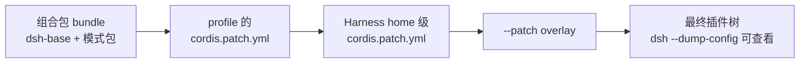
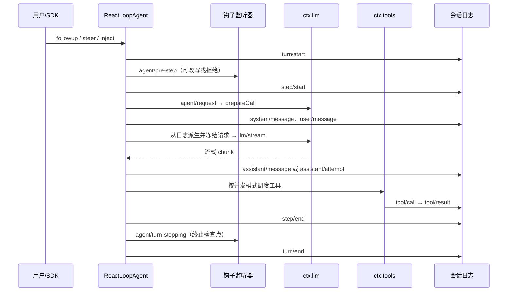
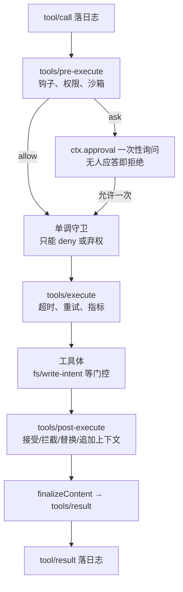
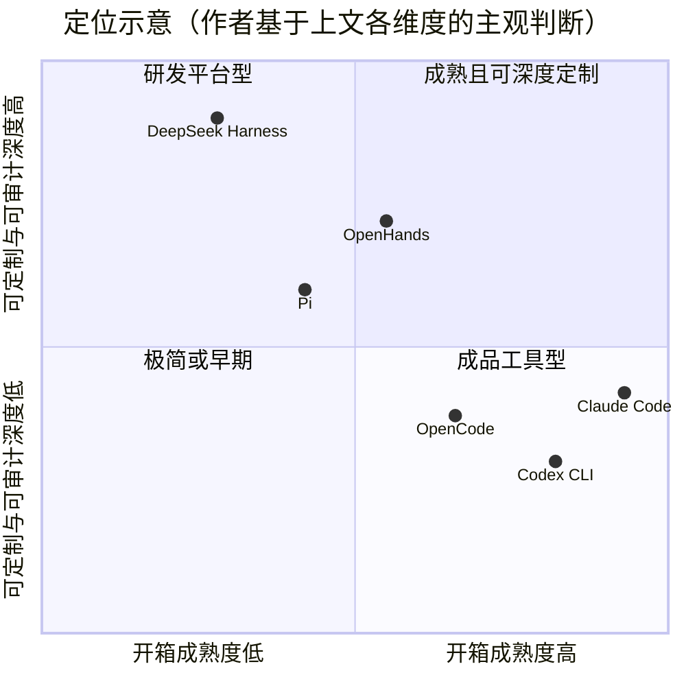

# DeepSeek Harness 开源项目技术分析报告

| 项目 | 内容 |
|---|---|
| 日期 | 2026-09-25 |
| 对象 | deepseek-ai/deepseek-harness `477b4f4`（dsh-v0.1.7-rc.2），本地 `reference/deepseek-harness` |
| 对比对象 | Claude Code 2.1.282、Codex CLI `75e0e0a`、OpenCode `6df0d5d`、OpenHands SDK `b874a47`、Pi `5fd446c` |
| 方法 | 开源项目静态阅读源码，Claude Code 只采信官方文档；dsh 只用 `--dump-config` 核对默认插件树；未用真实模型跑任务 |
| 与 Movo 的关系 | 通用调研，不针对 Movo。与 Movo 相关的借鉴边界见[设计评审的补充对比](Movo%20Agent%20设计评审：对比%20pi%20与%20Codex.md)；源码级明细见 `.docs/agent-design-review/dsh-analysis.md` |

## 0. 摘要

- **定位**：DeepSeek Harness（`dsh`）不是又一个编码 agent，而是一个「用插件组装 agent 的运行时」。在本文对比的六个产品中，只有它把 agent loop 本身做成了可热替换的插件。
- **最强的三项优势**：会话日志采用事件溯源，发给模型的请求可以从日志逐字节重建；KV 缓存工程最系统，Composio 实测同类任务 token 用量约为 Claude Code 的 1/7；工具流水线最严谨，策略可组合，执行可并发，结果按模型顺序提交。
- **并非独有的优势**：保前缀缓存的增量更新，Pi 和 Codex 也在做；代码编排模式（PTC），Codex 做得更激进，内置 10 个模型里有 9 个默认只开 code mode；workflow 脚本 API 与 Claude Code dynamic workflows 几乎一致；调用外部 agent 的能力，OpenHands 也有。
- **明显短板**：
  - 沙箱只限制文件写，读取和网络都不管；Claude Code 与 Codex 都做了网络隔离。
  - 审批只有一次性授权，没有持久规则。
  - 不能回滚文件改动，Claude Code 与 OpenCode 都有这项能力。
  - 默认会把会话日志上传给 DeepSeek。
  - 首轮未缓存的请求前缀约 4.8 万 token，是 Pi 的 10 倍。
- **选型结论**：
  - 需要深度定制 agent 运行时、全量审计，并且主力用 DeepSeek 模型：选 dsh。
  - 日常编码并需要企业管控：选 Claude Code 或 Codex。
  - 需要服务化 API 和多前端：选 OpenCode。
  - 要把 agent 嵌进自有平台并做容器隔离：选 OpenHands。
  - 追求极简、可 hack：选 Pi。

## 1. 项目概述

DeepSeek Harness（命令名 `dsh`）是 DeepSeek 官方开源的 agent harness，核心主张是「一切皆插件」：模型、工具、会话、沙箱，甚至 agent loop 本身都是可替换的 Cordis 插件。它不提供固定的工作流，而是提供组装 agent 的运行时。

官方把两者的关系概括为「Agent = Model + Harness」：模型负责推理，harness 负责连接文件系统、shell、工具调用、会话、审批和长任务。第二条设计原则是「每次运行都可追溯」：模型看到的一切都落在仅追加的会话日志里。

| 维度 | 事实（截至 2026-09-25） |
| --- | --- |
| 发布方 | [deepseek-ai](https://github.com/deepseek-ai/deepseek-harness)，GitHub 仓库创建于 2026-08-13 |
| 协议 | MIT；[SAFETY](https://github.com/deepseek-ai/deepseek-harness/blob/master/SAFETY.md) 声明未经安全审计、不可用于生产 |
| 阶段 | Developer Preview，明确会有破坏兼容的变更 |
| 版本 | GitHub 最新 `dsh-v0.1.7-rc.2`（2026-09-24）；npm `latest` 仍为 `0.1.5-rc.3`，`next` 为 `0.1.7-rc.2` |
| 迭代节奏 | 约 6 周发了 22 个预发布 tag，几乎每 2 天一个 |
| 社区热度 | 235,165 star、28,290 fork、1,013 watch、41 位贡献者 |
| 语言 | TypeScript 占代码字节的 96.2%；另有 Python SDK、C/C++ 原生沙箱启动器、NSIS 安装器 |
| 规模 | 312 个 workspace 包；非测试代码 43.5 万行，测试代码 59.5 万行（口径见 5.3.10） |
| 运行环境 | Node `^22.19.0` 或 `>=24`；pnpm 11.7 monorepo |
| 理论基础 | Cordis 论文 [A Programming Paradigm for Spatiotemporal Composability](https://arxiv.org/abs/2608.25512) |

交付形态有四种：`npx @deepseek-ai/dsh web` 启动的 Web UI（默认 `127.0.0.1:3080`）、Electron 桌面应用、TypeScript/Python SDK，以及 ACP 服务器。

## 2. 整体架构

dsh 没有特权内核：运行中的 `dsh` 就是一棵 Cordis 插件树，agent loop 也只是其中一个可替换的节点。扩展的方式是在旁边挂插件，而不是给内核打补丁；所有注册都是副作用，插件卸载时自动撤销。

### 2.1 底座：Cordis

Cordis 以 vendor 方式引入（`vendor/cordis`，4.0.0-rc.7），提供五个原语：

- **插件**：带 `inject` 与 `apply(ctx)` 的函数，或 `Service` 子类。
- **上下文即服务容器**：服务占据固定的键，如 `ctx.tools`、`ctx.llm`、`ctx.sessions`。消费方按键查找服务，而不是 import 具体实现。
- **`inject` 声明依赖**：启动顺序由服务是否可用来驱动，不需要手工编排。
- **类型化事件**：有 `emit` / `waterfall` / `parallel` / `serial` / `bail` 五种分发模式。`waterfall` 是带 `next()` 的环绕中间件，监听器不调用 `next()` 就会短路。
- **可逆注册**：提示词片段、工具 schema、适配器都通过 `ctx.effect()` / `ctx.on()` 安装，reload 或 teardown 时撤销。这是热重载和运行时自修改的前提。

### 2.2 组装：Profile 与组合包

启动时，dsh 在空列表上按顺序叠加四层 YAML patch。每条 patch 按 `id` 替换整行，或插入新条目。



`dsh-base` 是共享的第一层，其 `cordis.patch.yml` 共 528 行、93 个条目。条目支持 `!!js` 表达式。实测默认 `web` profile 的最终插件树有 287 个条目，其中顶层 182 个。随发行版交付 5 个 profile：

| Profile | 叠加的组合包 | 用途 |
| --- | --- | --- |
| `web` | dsh-base + `dsh-web-app` | 浏览器 Web UI，默认端口 3080 |
| `headless` | dsh-base + `dsh-headless` | 无服务器的一次性运行 |
| `sdk` | dsh-base + `dsh-sdk-app` | JSON-RPC 服务器，供 TS/Python SDK 驱动 |
| `sdk-minimal` | 仅 `dsh-sdk-minimal`（不用 base） | 基准测试用的最小树 |
| `acp` | dsh-base + `dsh-acp-app` | Agent Client Protocol 服务器，供编辑器集成 |

### 2.3 核心包与服务键

312 个包按能力分成 54 个组（`packages/<组>/<包>`），主干在 `core/`：

| 包 | 职责 | `ctx` 键 |
| --- | --- | --- |
| `core/session` | 仅追加的 `SessionEvent` 日志 | `ctx.sessions` |
| `core/system-prompt` | 提示词片段与工具 schema 组装 | `ctx.systemPrompt` |
| `core/tools` | 作用域化工具注册表 + 带把关的执行流水线 | `ctx.tools` |
| `core/agent` | `Agent` 接口、活跃 agent 注册表、`agent/*` 事件 | `ctx.agents` |
| `core/agent-loop` | 默认驱动器 `ReactLoopAgent` | `ctx.agentLoop` |
| `llm/llm` | 消息与流式词汇表、适配器 seam | `ctx.llm` |

### 2.4 能力 seam 与事件域

每项可替换的能力都拆成三个角色：声明接口的 **Service Definition**、实现接口的 **Service Provider**、使用接口的 **Consumer**（通常是面向模型的工具）。硬性规则是：扩展插件只依赖 Service Definition，绝不依赖具体的提供方。

事件分三个域：
- **会话事件**（`turn/*`、`tool/*` 等）：持久事实。
- **Agent 事件**（`agent/*`）：用于观察或拦截进行中的工作。
- **能力事件**（`fs/*`、`tools/*`、`telemetry/*`）：给某个 seam 挂策略。

生产方与消费方的映射表由生成器维护，CI 会校验其新鲜度。

## 3. 核心机制

整个运行时围绕一条设计不变量构建：**模型可见即已记录**。发给模型的请求一律由会话日志派生；resume、fork、replay 和审计因此都是日志的派生品。

需要说明的是，负责校验这条不变量的 `dsh-invariants` 插件，只在全部测试套件和 `sdk-minimal` 中挂载。默认的 `web` / `base` profile 不挂载（`--dump-config` 实测为 0 条）。也就是说，生产环境靠构造方式保证这条不变量，而不是靠运行时断言。

### 3.1 Agent 循环：轮次与步骤

默认驱动器是 `ReactLoopAgent`（`packages/core/agent-loop/src/agent.ts:98`），整个包约 2,500 行。一个**步骤**是一次模型请求加上它触发的工具调用；一个**轮次**包含零到多个步骤，在不再有待完成的工作时关闭。



- **三种输入语义**：
  - `followup`：进入下一轮次，并唤醒 agent。
  - `steer`：插入下一步骤，并唤醒 agent，用于任务中途纠偏。
  - `inject`：插入下一步骤但不唤醒，等下一条唤醒消息到来时一起处理。
  - Web UI 的「插话发送」按钮和 Cmd/Ctrl+Enter 对应 `steer`。
- **请求从日志派生**：先把系统提示和用户消息写入日志，再用 `deriveMessages()` 投影出历史并 `deepFreeze`，最后才发请求。如果在异步准备阶段取消，这些消息都不会被提交。
- **失败也落盘**：成功的调用记为 `assistant/message`，并内嵌带时间戳的完整流；失败、重试、取消记为 `assistant/attempt`，只进日志，不进模型历史。
- **步内重试**：`agent/request-error` waterfall 可以返回重试动作。重试时不重复组装提示词，也不重复准入用户消息。上下文溢出后的压缩恢复也走这条路。
- **可插拔的终止判定**：自然停止时触发 `agent/turn-stopping`，goal、钩子等插件在这里决定是否继续执行。

### 3.2 工具执行流水线与并行调度

工具调用执行前先记一条 `tool/call`，然后依次经过三层 waterfall 和一组单调守卫：



并行调度的实现在 `packages/core/agent-loop/src/tool-calls.ts`：
- 工具必须显式声明 `isConcurrencySafe`，并且对本次参数返回严格的 `true`，才按并行执行；否则一律按独占处理。
- 独占调用会形成屏障。可并行的调用进入滚动池，每步默认最多 10 个。
- 多个调用的执行时间可以重叠，但策略判断和结果写入严格按模型发出调用的顺序进行。

### 3.3 上下文、缓存与会话持久化

上下文管理的主线是让请求前缀逐字节保持不变，以尽量命中 DeepSeek 服务端的自动前缀缓存。具体手段见 4.4。

| 机制 | 触发条件 | 行为 |
| --- | --- | --- |
| `compaction-basic` | `agent/pre-step` 发现超过阈值 `floor(min(W×0.8, W−O−65536))`（W 为上下文窗口，O 为输出上限），或收到上下文溢出错误 | 生成固定 8 节的摘要，替换原区间；保留最近 16% 的内容；不拆开工具调用与其结果 |
| `compaction-tool-result-pruner` | 压缩触发后先运行 | 超过 8,192 字符的工具结果只保留头 4,096 和尾 1,024 字符 |
| `compaction-image-offload` | 收到 `IMAGE_OFFLOAD_REQUIRED` | 用占位文本替换最旧的图片，然后重试 |
| `spill` | `tools/post-execute`，单条结果超过 12,500 token | 内联头尾预览，全文写入私有文件并给出路径 |

**上下文注入**：
- `agent-instructions` 兼容 `AGENTS.md` 与 `CLAUDE.md`，读取顺序为 `$DSH_HOME/AGENTS.md`，然后从项目根到 cwd 逐层读取，最后用 `*.local.md` 覆盖。
- 预算为 64 KiB。
- 不识别 `.claude/rules/` 和 `@import`。

**会话持久化**：
- 默认后端是 zstd 压缩的 JSONL，每批写入都 fsync，用 flock 保证单写者。
- 格式当前为 v4；每个迁移包只负责相邻一个版本，且永不覆盖已提交的旧文件。
- 支持按切点 fork 和中断后 resume，另有基于 SQLite FTS5 的跨会话全文检索。

> **隐私注意**：官方组合包默认挂载 `dsh-session-log-deepseek`。它会在发往 DeepSeek 端点的每个请求体里附带 `dsh_session_log` 字段，增量上传完整的会话事件（包括工具输出），单次上限 8 MiB。另有 `dsh_plugin_packages` 字段上报插件清单，请求头还带有匿名用户 id。可以用 overlay 关闭，见 9.3。

### 3.4 安全模型

dsh 的安全边界由「文件写沙箱 + 一次性审批」构成：沙箱只管文件写，不限制读取和网络；普通 bash 命令默认不逐条审批。

| 平台 | 后端 | 实现要点 | 强制程度 |
| --- | --- | --- | --- |
| Linux（首选） | bubblewrap | `--ro-bind / /`、`--unshare-pid`，工作区再 `--bind`；未隔离网络 | full |
| Linux（备选） | Landlock | 静态 musl C11 启动器，ABI 从 5 向下协商 | 旧 ABI 为 partial |
| macOS | Seatbelt | `(allow default)(deny file-write*)`，再放行可写目录 | full |
| Windows | 受限令牌 + ACL | WRITE_RESTRICTED 令牌 + Low 完整性级别 | 恒为 partial |

**权限预设**：
- 默认是 `workspace-write + ask`，另有 `read-only + ask` 和 `danger-full-access + never`。实验性的 `auto` 档由当前模型给每次调用做风险分级。
- 审批结果只有 `allowed-once` / `rejected` / `cancelled` / `unavailable` 四种，无人应答即拒绝。
- 子 agent 的审批策略固定为 `never`。

**凭据**：
- 配置里只存环境变量名。
- 子进程的环境变量中，名字匹配 `KEY|PASSWORD|SECRET|TOKEN` 的会被剔除。

## 4. 核心优势深度剖析

本节逐项拆解 dsh 的八项优势，每项按固定结构展开：
- 机制：它是怎么做的；
- 代码证据：对应的源码位置；
- 解决的问题：带来什么可观察的收益；
- 横向对照：其他五个产品怎么做；
- 代价与边界：这项设计的成本和限制。

先给出总览，其中「独特程度」是作者基于第 5 节对比做出的判断。

| 优势 | dsh 的做法 | 最接近的竞品做法 | 独特程度 |
| --- | --- | --- | --- |
| 4.1 全插件化运行时 | loop 本身是插件；可逆副作用；带回滚的 HMR | Pi：40 个扩展事件 + `/reload`；OpenHands：Agent 可按配置替换 | 独有：六者中唯一能热替换 loop |
| 4.2 会话级能力装配 | preset 修订树 + isolate realm + 激活审计 | OpenHands：每个会话一份 Agent 配置 | 领先 |
| 4.3 事件溯源会话日志 | 59 种事件；请求默认可从日志重建 | OpenHands 事件树；Pi 的 JSONL 树 | 领先，但缺文件回滚 |
| 4.4 KV 缓存工程 | 7 种保前缀手段；命中率可视化；e2e 断言 | Pi 中途追加 system；Codex WebSocket 增量；Claude Code 扇出错峰 | 各家都在做，dsh 最系统，但首轮前缀最重 |
| 4.5 工具执行流水线 | 3 层 waterfall + 单调守卫 + 有序并发 | Codex：RwLock + 有序写回；Claude Code：allow/deny/ask/defer + 改参 | 开源同类中领先，但不能改写参数 |
| 4.6 PTC 代码编排 | `run_code` + 输入输出双向类型化 SDK + 子调用全流程审计 | Codex code mode（默认启用） | 与 Codex 并列前沿 |
| 4.7 多 agent 谱系 | 6 种 provider 统一接口，可委派给 Claude Code/Codex | Claude Code 的子 agent + teams + workflows；OpenHands 的 ACPAgent | 异构委派有特色；编排成熟度落后于 Claude Code |
| 4.8 seam 驱动的执行迁移 | 替换 4 个提供方，执行环境整体迁到 SSH 远端 | OpenHands Workspace（Docker/K8s/Remote） | 设计优雅，但未产品化 |

### 4.1 全插件化运行时：可逆副作用 + 热替换

**机制**
- Cordis 里插件的运行时实例叫 `Fiber`，有 PENDING → LOADING → ACTIVE → UNLOADING → DISPOSED 等状态。
- `ctx.effect()` 执行时收集 disposer，卸载时逆序执行；`ctx.on`、`ctx.provide` 本身也是 effect。
- 依赖激活靠「纪元」（epoch）驱动：把所有依赖服务所在 fiber 的 uid 拼成一个 epoch。任一依赖消失，epoch 变为 INACTIVE，插件随之卸载；依赖全部回来后，插件自动重载。

**代码证据**：`vendor/cordis/src/fiber.ts:611-622`

```ts
for (const name of Object.keys(this.inject)) {
  const impl = this._store[name]
  if (!impl) { epoch = INACTIVE; break }
  epoch += ':' + impl.fiber.uid
}
this._setEpoch(epoch)
```

插件作者因此不需要写清理代码。下面是一个真实的工具插件全文（`packages/interaction/tool-ask-user/src/index.ts:13-19`）：

```ts
export const inject = ['tools', 'userQuestions']
export function apply(ctx: Context): void {
  ctx.tools.register(defineTool({ name: 'ask_user_question', ... }))
}
```

**HMR 流程**（`packages/boot/hmr/src/index.ts:406-580`）：
1. 清掉 ESM/CJS 缓存，重新 import 模块。
2. 删除旧插件，旧插件的所有 effect 自动撤销。
3. 在原父 ctx 下用原 config 挂载新插件。
4. 失败时回滚到旧模块。

**解决的问题**：修改一个工具插件的源码后，旧工具自动注销、新工具重新注册，Host 不用重启，进行中的会话不中断。某个 provider 被替换时，依赖它的插件自动卸载再重载。Creator 模式正是建立在这一点上：模型自己写 bundle，经 `plugin_manager` 热安装进当前 profile。

**横向对照**：

| 产品 | 扩展机制 | loop 可替换 | 热重载 |
| --- | --- | --- | --- |
| dsh | Cordis 插件，包括 loop 在内的一切 | 是 | 是（HMR，失败回滚） |
| Claude Code | 插件打包 skills/agents/hooks/MCP/workflows；33 个 hook 事件、5 类 handler | 否 | 部分（`/reload-skills`） |
| Codex CLI | 编译期 Rust trait；声明式插件；12 个 hook 事件 | 否 | 部分（skills 文件监听） |
| OpenCode | JS/TS 插件钩子；自定义 tool/agent/command | 否（v2 仅有代码级依赖注入） | 否（仅 SIGUSR2 重载） |
| OpenHands | 自定义 Tool、MCP、6 类 hook；兼容 Claude Code 插件结构 | 是（Agent 是可配置的 Pydantic 模型） | 未核实 |
| Pi | 进程内 TS 扩展，40 个事件，可替换系统提示与 provider | 否 | 是（`/reload`） |

Pi 在精神上最接近 dsh（扩展优先、可热重载），但它的 loop 是固定的。OpenHands 的 Agent 可以按配置替换，但不能在运行中热插拔。

**代价与边界**：
- HMR 依赖 Node loader 的内部实现，替换已安装包的版本仍需重启。
- 为修补重入卸载漏洞，vendor 的 fiber 做了本地加固。
- 仓库规定每个注册表贡献都要有 HMR 安全测试。
- 插件树一大，理解成本就高：默认有 287 个条目。

### 4.2 会话级能力装配：preset 修订树与 isolate realm

**机制**：
- 每个 preset 定义都建一棵只存在内存里的 Loader 树（`PresetTree`），同一修订的树被多个 Agent 以引用计数共享。
- 每个 Agent 有自己的 scope，挂在该修订下面；工具是否可见沿 scope 链计算。
- Loader 条目可以声明 `isolate`，让服务注册到 realm 私有的 symbol 下，不泄漏到全局。
- 激活时逐条审计。以下情况会导致 preset 被拒：条目没有启动、import 失败、服务泄漏到根 realm、id 为空或重复。

**代码证据**：`packages/preset/agent-preset-registry/src/mount.ts:261-267`

```ts
const tree = new PresetTree(ctx)
await tree.root.update(prepareProfileEntries(ctx, plugins, ctx.baseUrl))
const audit = await auditRows(tree)
const leaked = leakedServices(ctx, ctx.fiber)
if (audit.failed.length > 0) throw new Error(audit.failed.join('\n'))
if (leaked.length > 0) throw new Error(`Preset services require isolate realms: ...`)
```

**解决的问题**：
- 同一个 Host 进程里，A 会话可以用 `ptc` preset（只暴露 `run_code`），B 会话用 `standard` preset（原生工具）。两者的工具、提示词片段和 planMode 服务互不可见。
- 修改 preset 定义只影响新建的 Agent；已有 Agent 继续用旧修订，请求前缀不变，缓存不会失效。

**横向对照**：
- **Claude Code**：子 agent 定义可以限定 `tools` / `disallowedTools`，`--agent` 可以按某个定义运行主会话。
- **Codex**：有 agent 角色（default/explorer/worker）。
- **OpenCode**：agent 定义可指定工具与提示词。

以上三者都只能在「工具白名单 + 提示词」这个层次区分会话。dsh 能按会话装配整组插件，包括服务，并在运行时审计泄漏；OpenHands 的每会话 Agent 配置与之最接近。

**代价与边界**：
- preset 不是安全沙箱，它的 YAML 可以执行 Host 代码。
- 首轮开始后不能再切换 preset（报 `agent-preset/locked`）。
- 旧修订不跨重启保留。

### 4.3 事件溯源会话日志：请求可重建

**机制**：
- 会话日志共有 59 种事件类型（`packages/core/session/src/known-event-types.ts`）。
- 其中只有 5 种 surface 事件会进入模型历史：`system`、`developer`、`user`、`assistant`、`tool/result`。
- surface 事件带 `surfaceOp` 字段：取 `append` 表示追加；取 `{op:'replace',startSeq,endSeq}` 表示替换一段，此时必须用 `sourceEventSeqs` 指回被遮蔽的原事件。压缩、提示词替换都以替换事件的形式落盘，原文永不丢失。
- `deriveMessages()` 按 surface 节点顺序投影出模型历史。
- 读取时遇到未知类型会拒绝整个日志，除非该事件标记了 `ignorable`。

**代码证据**：不变量检查（`packages/core/agent-loop/src/invariant.ts:21-56`）逐字段比对请求和日志：

```ts
const expected = session.deriveMessages()
if (JSON.stringify(options.messages) !== JSON.stringify(expected)) fail('...log-reconstruction desync')
const headerMatches = options.model === header.config.model && options.system === undefined
  && JSON.stringify(options.tools ?? []) === JSON.stringify(header.tools ?? [])
```

一个真实录制会话（`snapshots/session/tool-call-turn/session.v4.jsonl`）的事件序列如下，带 `*` 的是 surface 事件：

```text
permission/preset → sandbox/mode → approval/policy → turn/start → step/start
→ system/message* → user/message* → user/message*(运行时上下文)
→ request/header(initial) → request/context → assistant/message*(内嵌 8 条流)
→ tool/call → tool/result*(sourceEventSeqs:[14]) → step/end → …
```

**解决的问题**：
- 任何一次模型请求都能从日志精确重建。fork、resume、UI 回放、审计和计费复盘共用同一条事件流。
- `session-checkpoint-policy` 在发起流式请求、执行工具之前先刷盘，刷盘失败就不继续，从而保证崩溃后可以修复。

**横向对照**：

| 产品 | 存储 | 分支 | 文件回滚 | 能否重建发给模型的请求 |
| --- | --- | --- | --- | --- |
| dsh | 事件溯源 JSONL（zstd），59 种事件 | 按切点 fork | 否 | 设计上由日志派生；测试中逐请求断言 |
| Claude Code | 明文 JSONL（`~/.claude/projects`） | `--fork-session`、`/branch` | 是（编辑前快照，Esc×2 回退） | 文档未说明 |
| Codex CLI | rollout JSONL + SQLite 索引 | resume / fork / `thread/revert`（只改历史） | 否（`/undo` 已移除） | 需设 `CODEX_ROLLOUT_TRACE_ROOT` |
| OpenCode | SQLite | `--fork` | 是（独立 git-dir 快照 + revert） | 否，system 不落库 |
| OpenHands | 每个事件一个 JSON 文件，事件带 parent_id 成树 | `fork` / `navigate_to` | 部分（file_editor `undo_edit`） | 需开 `log_completions`（默认关） |
| Pi | JSONL 树（id/parentId） | `/tree`、`/fork`、`/clone` | 否 | 逻辑请求可重建；原始请求体不落盘 |

dsh 的独特之处在于：「可重建」是架构默认成立的性质，不需要打开调试开关。代价是它只支持按切点 fork，没有 Pi 或 OpenHands 那样的会话树导航；也不能回滚文件，而 Claude Code 和 OpenCode 都能做到。

**代价与边界**：
- 不变量断言只在测试和 `sdk-minimal` 中启用，默认 web profile 不挂载。
- 格式变更需要逐代迁移。
- 默认的日志上传插件会把这份完整日志发给 DeepSeek，见 3.3 的隐私注意。

### 4.4 KV 缓存工程：让前缀逐字节稳定

**机制**：一共 7 种保前缀手段。
1. **系统提示**：作为 0 号节点。路由支持时，提示词变更以追加的方式写在已缓存历史之后，不改写头部（`runtime-context.ts:89-104`）。
2. **运行时上下文**（时间、tmux 位置等）：以 user 消息的形式追加，内容注明「本快照取代之前的快照」；内容没变就不追加。
3. **工具增删**：写一条 `developer/message` 记录增删，DeepSeek 适配器把它序列化为 `tool_addition` / `tool_removal` 块，并携带 `mid-conversation-tool-changes-2026-07-01` beta 头。
4. **plan mode**：进入 plan mode 不改工具目录。preset 文本里写明了原因：「for request-cache stability」。
5. **压缩请求**：按字节原样重放 0 号节点、工具和被遮蔽区域，只在末尾追加压缩指令。
6. **fork 子 agent**：发布配置不开放换模型，`send_message` 全局注册，保证父子两边的工具 schema 字节一致。
7. **图片卸载**：按阶梯高水位裁剪，避免每来一张新图就改写旧前缀。

**代码证据**：
- `request/header` 的 reason 分为 `initial | resume | change | series`，用来显式标记缓存序列的边界。
- token-meter 按 uncached / cacheRead / cacheWrite 三个桶累计用量。
- UI 显示缓存命中率 `cacheRead / (uncached + cacheRead + cacheWrite)`（`StatsPills.tsx:108-120`）。
- 真实 API 测试 `request-cache.e2e.ts` 断言：首个请求之后的每个请求 `cacheReadTokens > 0`。

**解决的问题**：同一轮次的多步工具调用中，第二个及之后的请求都命中前缀缓存。

外部实测：
- [MindStudio](https://www.mindstudio.ai/blog/deepseek-harness-agentic-coding) 报告缓存命中率在 95–100% 之间。
- [Composio](https://composio.dev/content/deepseek-harness-vs-claude-code) 用 30 道题实测：dsh 平均每题 88,562 token，Claude Code 为 649,900。

**横向对照**：
- **Pi**：底层的 pi-ai 库同样以「对话中途追加 system 消息」增量写入提示词和工具变更，另有缓存预热。dsh 对第三方模型走的正是 pi-ai。
- **Codex**：用 `prompt_cache_key` 固定为根线程 id，WebSocket 下用 `previous_response_id` 只发增量，环境变化以差异消息追加。
- **Claude Code**：workflow 扇出时让同前缀的 agent 错峰启动，最长等 5 秒，从而共享第一个 agent 写入的缓存。
- **OpenCode 与 OpenHands**：主要依靠 Anthropic 的 `cache_control` 断点，以及 OpenAI 的 `prompt_cache_key`。

可见保前缀是业界共识，dsh 的特点是做得最系统，并且有测试断言兜底。

**代价与边界**：
- 首轮前缀很重。Composio 实测首轮未缓存输入：dsh 约 47,600 token，Pi 约 4,500 token（[dsh vs Pi](https://composio.dev/content/deepseek-harness-vd-pi-agent)）。
- 压缩会从第一个被替换的 token 起让缓存失效。
- 整套机制依赖 DeepSeek 的自动前缀缓存和一个 beta 接口。
- 换 provider 就进入新的缓存域。

### 4.5 工具执行流水线：策略可组合 + 有序并发

**机制**：
- `ToolDefinition` 除 `execute` 外，还有以下可选字段：
  - `isConcurrencySafe(args)`、`timeoutMs`（不发给模型）；
  - `presentCall` / `presentResult`；
  - `projectContent`、`finalizeContent`（后者对每个结果恰好执行一次）。
- 执行上下文额外提供 `deferContext()` 和 `concludeTurn()`。
- 单调守卫的类型是 `(exec) => string | undefined`：没有「允许」这个返回值，所以无论注册顺序如何，已经拒绝的调用都不会被改回允许。

**代码证据**：调度核心（`tool-calls.ts:147-160`）只推进已经连续就绪的槽位：

```ts
while (committed < group.length) {
  const slot = slots[committed]; if (slot === undefined) break
  const result = slot.needsPost ? await finalize(slot.exec, slot.result) : finish(...)
  appendToolResult(session, turn, step, call.block, result, callSeqs[committed])
  committed++
}
```

**解决的问题**：
- 多个读文件或 web 调用可以并发执行，但日志和模型历史仍按调用顺序排列，可以确定性重放。
- 钩子和审批挂在通用的 waterfall 上，对所有工具家族一次生效。
- 任何一层抛出异常，都会被规范化为 `isError` 结果，不会打断循环。

**横向对照**：

| 产品 | 并发判定 | 上限 | 结果顺序 | 钩子能否改参 |
| --- | --- | --- | --- | --- |
| dsh | 显式声明，严格为 `true` 才并行；分类器抛错则独占 | 10 | 按模型顺序提交 | 否 |
| Claude Code | 文档未给出判定细节 | 文档未给出 | 文档未说明 | 是（`updatedInput`） |
| Codex CLI | RwLock：并行工具拿读锁，其余拿写锁 | 无 | 按调用顺序写回 | 是（`updated_input`） |
| OpenCode | 交给 AI SDK 分发 | 无 | — | 是（`tool.execute.before`） |
| OpenHands | 线程池 + 资源锁 | 默认 1（串行） | — | — |
| Pi | 默认并行，工具可声明 sequential；同文件写入排队 | 无 | 按原顺序写回 | 是（`tool_call` 事件） |

dsh 的并发策略最保守：未声明的工具就不并行；同时它是唯一在上限、顺序、失败语义三方面都有明确约定的。短板是 pre-execute 不能改写参数，其兼容的 Claude Code 钩子里的 `updatedInput` 也不生效。

**代价与边界**：
- 并发分类器是一元的，表达不了「写不同路径的调用可以并行」这类需要看调用之间关系的判断。
- bash 一律独占。
- 快的结果要等前面慢的结果提交之后才能提交。

### 4.6 PTC：用代码编排工具调用

**机制**：
- 在 ptc 模式下，模型只看到一个工具：`run_code{code, description, timeoutMs?, sandbox_permissions?, justification?}`。
- 系统提示里附一份由工具 schema 生成的 TypeScript SDK 声明。`ToolArgsMap` 来自工具的 `parameters`，`ToolOutputMap` 来自工具的 `output.schema`，因此输入和输出两个方向都有类型。
- 每次运行都启动一个全新的 Node 进程，经 `ctx.sandbox` 套上与 Bash 相同的文件沙箱。
- 控制信道是长度分帧的 JSON，与 stdout 分离。子调用以 `<callId>:ptc:<n>` 为 id 回到宿主，走完整的工具流水线（策略、审批、守卫都生效）。子调用并发上限为 10。

**代码证据**：生成的 SDK 片段（`snapshots/session/ptc-turn/system-prompt.expected.md`）：

```ts
interface ToolArgsMap {
  bash: { command: string; description: string; timeoutMs?: number; workdir?: string; ... };
}
interface ToolOutputMap {
  bash: { kind: "background"; jobId: string } | { kind: "foreground"; exitCode: number | null; ... }
}
declare const tools: { [K in ToolName]: (args: ToolArgsMap[K]) => Promise<ToolOutputMap[K]> };
```

对应的录制会话里，一次 `run_code` 产生两对 `tool/ptc-dispatch` 事件，这些事件只记日志，最终只有一条 `tool/result` 进入模型历史。

**解决的问题**：原生模式下，每个工具都要一次模型往返，完整的中间结果还会被拖进上下文。PTC 把多步调用合并成一次模型请求，中间输出不进入上下文，同时每个子调用都可以审计。

**横向对照**：
- **Codex**：code mode 更激进。模型只看到 `exec` / `wait`，写的 JS 在 V8 isolate 里通过 `tools.*` 调用其他工具。内置 10 个模型中有 9 个是 `code_mode_only`（已核对 `models.json`）。
- **OpenCode**：`execute` 工具用自研 AST 解释器执行，只能调用 MCP 工具，默认关闭。
- **Claude Code**：文档中未见这类面向工具的代码模式。它的 dynamic workflows 用脚本编排的是子 agent，不是工具。
- **OpenHands 与 Pi**：都没有这类模式。

dsh 与 Codex 同属前沿。dsh 的差异在于输出也有类型声明，子调用有独立的审计事件；Codex 的差异在于默认启用，覆盖面更广。

**代价与边界**：
- 中间值不能从日志回放，也没有字节上限。
- 每次运行都是全新状态，不像 REPL 那样保留变量。
- 堆上限不等于进程树的内存上限。

### 4.7 多 agent 谱系：统一接口下的异构委派

**机制**：`ctx.subagents` 是一个具名的 provider 注册表，下面挂了 6 种实现：
- spawn、fork：在进程内新建 agent；
- claude-code：调用 `@anthropic-ai/claude-agent-sdk` 的 `query()`；
- codex：通过 `codex app-server --stdio` 走 JSON-RPC；
- acp：以子进程方式启动任意 ACP 兼容的 agent；
- dsh-sdk：以子进程方式启动完整的 dsh。

provider 声明自己的能力；请求超出能力范围时报 `UNSUPPORTED_CAPABILITY`，不会悄悄降级。

**代码证据**：
- fork 截取父会话中已完成轮次的前缀（`subagent-fork-in-process/src/index.ts:48-55`）：

  ```ts
  const events = parent.session.snapshotEvents()
  const lastEnd = events.findLast(e => e.type === 'turn/end')
  return lastEnd === undefined ? [] : events.slice(0, lastEnd.seq + 1)
  ```

- 可续跑的子 agent 结束时，一定会向父 agent 发出 `subagent-settled` 通知：父 agent 空闲则排队，忙碌则以 steer 插入。
- Agent Teams 的任务板是一个 DAG，用 DFS 检测环；更新任务采用 compare-and-set，版本不符时报 `TEAM_TASK_STALE_REVISION`。
- workflow 脚本 API 的上限（`workflow-ptc/src/index.ts:105-146`）：并发为 `min(16, 核数−2)`，总 agent 数 1,000，单次调用最多 4,096 项。

**解决的问题**：可以在一个 DeepSeek 驱动的会话里，把子任务委派给 Claude Code 或 Codex。fork 出的子 agent 继承父上下文，同时保住前缀缓存。

**横向对照**：

| 产品 | 子 agent | 团队 / 编排 | 调用外部 agent |
| --- | --- | --- | --- |
| dsh | 6 种 provider；fork 继承上下文；可续跑 | Agent Teams（实验）；workflow 脚本（≤1,000 agent） | 是（Claude Code / Codex / ACP） |
| Claude Code | 默认最多 20 个并发、嵌套 3 层；支持 fork、`isolation: worktree`、持久 memory | Agent teams（实验）；dynamic workflows（默认 16 并发、≤1,000 agent，同会话可 resume） | 否 |
| Codex CLI | V1 默认开启，最多 6 个、深度 1；V2 走 mailbox | 无独立编排 | 否 |
| OpenCode | `task` 工具新建子会话，深度 1 | 无 | 否 |
| OpenHands | `task` 工具，默认未开启 | 无 | 是（ACPAgent 驱动 Claude Code / Gemini CLI 等） |
| Pi | 无内置（作者称其为「黑盒中的黑盒」） | 无 | 否 |

dsh 的 workflow API 在脚本结构、函数名和上限上与 Claude Code dynamic workflows 几乎一致，官方文档也写明 `meta` 字段与之对齐。所以这部分应视为兼容 Claude Code，而不是 dsh 的原创。

Claude Code 在产品化程度上领先：
- workflow 在同一会话内可以 resume，已完成的 agent 直接返回缓存结果；
- 扇出时错峰启动以共享缓存；
- 子 agent 可以放进 worktree 隔离运行。

**代价与边界**：
- Claude Code / Codex 子 agent 每次都是新进程，父 agent 只拿到最终文本，看不到过程，平台载荷约 300 MB。
- Teams 成员共享同一个 checkout，没有 worktree 隔离。
- 随附的 ptc preset 默认关闭 workflow。

### 4.8 seam 驱动的执行环境迁移

**机制**：`packages/ssh` 下有 4 个包，分别以同名服务替换默认提供方：
- `ssh`：连接本身；
- `fs-ssh`：注册为 `'fs'`；
- `subprocess-ssh`：注册为 `'subprocess'`，包含 `spawnTerminal`；
- `sandbox-ssh`：`confine()` 通过 RPC 转发给远端 helper。

远端 helper 需要预装，并用 SHA-256 校验；每条程序流单独一个 SSH channel，用 TLS-PSK 加密。

**解决的问题**：
- 由于 bash、PTY、LSP 都只依赖 `ctx.fs` / `ctx.subprocess`，它们会自动跟着迁到远端；PTC 需要显式传入远端的 Node 路径。
- `live.e2e.ts` 验证了终端、PTC、LSP 三类场景。
- 最终效果是：harness、模型凭据和会话日志都留在本地，文件和进程在远端执行，工具代码一行不改。

**横向对照**：
- **OpenHands**：Workspace 抽象（Local / Docker / Apptainer / K8s / Remote / Cloud）是同一思路的产品化版本，也更成熟。
- **Codex 与 Claude Code**：用云端任务或托管 VM 提供远端执行，但不是「本地 harness + 远端执行世界」这种可替换 seam 的形态。

**代价与边界**：
- 不支持 Windows，也不自动部署 helper。
- 断线后不重连、不重放。
- 所有发布的 profile 都没有组合 SSH，目前只在 e2e 测试中使用。

## 5. 横向对比

### 5.1 对比对象与口径

| 产品 | 版本 / commit（截至 2026-09-25） | 协议 | 主语言 | GitHub star | 调研方式 |
| --- | --- | --- | --- | --- | --- |
| DeepSeek Harness | dsh-v0.1.7-rc.2 / `477b4f420` | MIT | TypeScript | 235,165 | 源码 |
| [Claude Code](https://code.claude.com/docs/en/overview) | 2.1.282（CHANGELOG 2026-09-24） | 闭源商业 | — | 147,981（仓库只含插件与 issue，不含源码） | 官方文档 |
| [Codex CLI](https://github.com/openai/codex) | rust-v0.157.0 / `75e0e0a` | Apache-2.0 | Rust | 126,360 | 源码 + 文档 |
| [OpenCode](https://github.com/anomalyco/opencode) | v1.18.32 / `6df0d5d` | MIT | TypeScript（Bun） | 209,908 | 源码 + 文档 |
| [OpenHands](https://github.com/OpenHands/software-agent-sdk) | SDK v1.49.5 / `b874a47`；Canvas v1.23.0 | MIT | Python + TS 前端 | 89,103（Canvas 仓库） | 源码 + 文档 |
| [Pi](https://github.com/earendil-works/pi) | v0.87.1 / `5fd446c` | MIT | TypeScript | 109,195 | 源码 + 作者博客 |

原则：每条结论都以源码位置或实际打开过的官方文档为证据。Claude Code 闭源，只采信文档，文档未写明的一律标「文档未说明」。

### 5.2 总览矩阵

| 维度 | dsh | Claude Code | Codex CLI | OpenCode | OpenHands | Pi |
| --- | --- | --- | --- | --- | --- | --- |
| 主入口 | Web、桌面、SDK、ACP | TUI、IDE、桌面、Web、Slack、SDK | TUI、exec、app-server、桌面 | TUI、Web、桌面、HTTP API、ACP | Canvas Web/桌面、SDK、REST/WS | TUI、RPC、SDK |
| 核心 loop 可替换 | 是 | 否 | 否 | 否 | 是 | 否 |
| 运行时热插拔 | 是 | 部分 | 部分 | 否 | 未核实 | 是 |
| 会话级能力装配 | 整组插件 | 子 agent 工具集 | agent 角色 | agent 定义 | Agent 配置 | 否 |
| 请求可重建 | 默认 | 文档未说明 | 需开 trace | 否 | 需开日志 | 逻辑层可重建 |
| 文件回滚 | 否 | 是 | 否 | 是 | 部分 | 否 |
| Code mode | 是（PTC） | 未见 | 是（默认） | 实验（仅 MCP） | 否 | 否 |
| 调用外部 agent | 是 | 否 | 否 | 否 | 是 | 否 |
| OS 沙箱 | 仅限文件写 | 文件 + 网络白名单 | 文件 + 默认断网 | 无 | 容器（可选） | 无 |
| 持久权限规则 | 否 | 是 | 是 | 仅内存 | 否 | 否 |
| MCP | 是 | 是 | 是 | 是 | 是 | 否 |
| 模型中立 | 是 | 否（仅 Claude） | 部分（仅 Responses API） | 是 | 是 | 是 |
| 接受外部 PR | 否 | 闭源 | 否 | 是 | 是 | 受限 |

### 5.3 分维度分析

#### 5.3.1 可扩展性

dsh 与 OpenHands 是「平台型」：loop 或 Agent 本身可替换。Claude Code、Codex、OpenCode 是「产品型」：通过钩子、插件、skill 在固定的 loop 上做扩展。Pi 走「扩展优先」路线：loop 固定，但 40 个事件几乎覆盖所有环节。

| 产品 | hook 事件数 | handler 类型 | 配置分层 |
| --- | --- | --- | --- |
| dsh | 桥接 Claude Code 7 个、Codex 5 个事件；原生 waterfall 事件远多于此 | command（桥接）；原生为 TS 插件 | bundle → profile → home → `--patch` |
| Claude Code | 33 | command、http、mcp_tool、prompt、agent | managed → CLI → 项目 local → 项目 → 用户 |
| Codex CLI | 12 | command、mcp_tool | MDM → `/etc` → 企业云端 → 用户 → profile → 项目 → CLI，另有 requirements 约束 |
| OpenCode | 约 20 个插件钩子 | JS/TS 函数 | 8 层合并（远程 .well-known 到 MDM） |
| OpenHands | 6 | command 等 | Pydantic 配置 + Server settings API |
| Pi | 40 | TS 扩展 | 用户 → 项目（需信任）→ CLI |

结论：dsh 的扩展能力最深，但门槛也最高；Claude Code 的钩子覆盖面最广、handler 种类最多，更适合「不写代码、只做配置」的团队。

#### 5.3.2 Agent loop

| 产品 | 运行中插话 | 取消 | 模型请求重试 |
| --- | --- | --- | --- |
| dsh | followup / steer / inject 三种语义 | 中止后为未启动的调用补写合成结果 | 5 次，500 ms→10 s，遵守 Retry-After |
| Claude Code | Enter 排队，工具结束后在同一 turn 内读取；Esc 中断 | Esc 取消在途工具 | 文档未说明 |
| Codex CLI | `turn/steer`（Enter）+ 排队（Tab） | 取消后 100 ms 强制 abort；后台进程可能残留 | stream 5 次 / request 4 次，200 ms×2^n |
| OpenCode | 下一步边界生效（v2 有 steer/queue） | 级联取消子会话 | 5 次，2 s×2，最长 30 s |
| OpenHands | `send_message` 下一轮读取 | `pause` 在步间生效，`interrupt` 仅限异步 | 5 次，8–64 s；额度耗尽时换模型 |
| Pi | steer（Enter）+ followUp（Alt+Enter） | Esc abort | 3 次，2 s 指数退避 |

结论：各家在插话和重试上已经趋同。dsh 的特点是把 `inject`（静默注入上下文）也纳入同一个收件箱模型，所有输入都持久化。

#### 5.3.3 上下文管理

| 产品 | 自动压缩触发 | 工具输出截断 | 指令文件 |
| --- | --- | --- | --- |
| dsh | `floor(min(W×0.8, W−O−64K))`；先剪枝再摘要 | 超过 12,500 token 时 spill 到文件 | AGENTS.md / CLAUDE.md / `*.local.md`，64 KiB |
| Claude Code | 接近上限（文档未给阈值），先清理旧工具输出再摘要；可写 Compact Instructions | 文档未说明 | CLAUDE.md 分层 + `@import`（最多 4 跳）+ `.claude/rules` + AGENTS.md |
| Codex CLI | `min(配置, W×90%)`，272k 窗口约为 244,800；OpenAI 系走服务端 compact | 10,000 token，头尾各半，不落盘 | AGENTS.md（override 优先），32 KiB |
| OpenCode | 输入上限 − min(20k, 输出上限)；prune 默认关闭 | 2,000 行 / 50 KB，全文保存 7 天 | AGENTS.md > CLAUDE.md，支持 glob/URL |
| OpenHands | token 数或事件数超阈值（默认 80 个事件） | terminal 30,000 字符，全文落盘 | AGENTS.md / CLAUDE.md / GEMINI.md / .cursorrules |
| Pi | W − 16,384，保留最近 20k | 2,000 行 / 50 KB，bash 全文落临时文件 | AGENTS.override.md > AGENTS.md > CLAUDE.md |

结论：
- dsh 的压缩阈值偏保守，最晚在 80% 触发，可以减少被迫压缩导致的缓存失效。
- dsh 的指令文件能力弱于 Claude Code：没有 `@import`，没有按路径加载的规则。
- 在工具输出处理上，dsh 与 OpenCode、OpenHands、Pi 都采用「截断 + 全文落盘」，比 Codex 的「只截断」更利于事后追查。

#### 5.3.4 会话持久化与可追溯

见 4.3 的对比表。

结论：
- 可追溯的深度从高到低：dsh（请求默认可重建）> OpenHands（事件树，重建需开日志）≈ Pi（逻辑层可重建）> Codex（需开 trace）> OpenCode（不能重建）。Claude Code 文档未说明。
- 可恢复性要看「文件回滚」：Claude Code 与 OpenCode 有，dsh、Codex、Pi 都没有。

#### 5.3.5 工具体系

| 产品 | 默认工具面 | MCP | Web 搜索 | LSP |
| --- | --- | --- | --- | --- |
| dsh | Standard 模式含执行、文件、检索、委派、状态五类工具 | stdio / streamable-http | 默认 provider 每次搜索消耗一次完整的 DeepSeek 调用；可选 Exa、Perplexity | `lsp` 工具，4 种操作，需自行配置 |
| Claude Code | 文件、搜索、执行、Web、代码智能、编排等多类工具 | stdio / HTTP / SSE，工具默认延迟加载 | 内置 WebSearch | 需安装代码智能插件 |
| Codex CLI | `exec_command` / `apply_patch` 等；默认 code mode | 仅客户端，无 server 模式 | 服务端执行 | 未见 |
| OpenCode | 13 个 | stdio / HTTP，带 OAuth | Exa / Parallel 远程 MCP | 38 个 server，编辑后附诊断 |
| OpenHands | terminal、file_editor、task_tracker、browser | 多种传输，带 OAuth | 靠浏览器工具 | 未见 |
| Pi | 默认 4 个（read/bash/edit/write） | 不支持（作者立场） | 无 | 无 |

#### 5.3.6 多 agent

见 4.7 的对比表。

结论：Claude Code 在编排成熟度上领先（workflow 可 resume、扇出错峰、worktree 隔离、20 个并发）。dsh 胜在「异构委派」：能把子任务交给 Claude Code 或 Codex。Codex 是唯一默认开启多 agent 的产品。

#### 5.3.7 安全

| 产品 | 文件隔离 | 网络隔离 | 读取限制 | 审批模型 | 持久规则 |
| --- | --- | --- | --- | --- | --- |
| dsh | bwrap / Landlock / Seatbelt / Windows ACL | 无 | 无 | 一次性授权；`auto` 档由模型做风险分级 | 无 |
| Claude Code | Seatbelt / bubblewrap（Linux 另可选 seccomp） | socat 代理 + 域名白名单；支持凭据 mask | 可配置 deny | Auto 分类器 / Manual / Accept edits / Plan 等模式 | allow/ask/deny 规则 + managed 策略 |
| Codex CLI | Seatbelt / bubblewrap + seccomp / Windows 受限令牌 | 默认断网（`--unshare-net`） | 可配置禁读目录 | untrusted / on-request / granular / never；auto_review 子 agent | Starlark `prefix_rule`，「始终允许」写入规则文件 |
| OpenCode | 无（SECURITY.md 明言不做沙箱） | 无 | 无 | allow/ask/deny 模式匹配，默认 `*: allow` | 仅内存 |
| OpenHands | Docker / Apptainer / K8s（本地启动默认无隔离） | Docker 默认网络 | 容器边界 | 确认策略默认关；风险由主模型自评 | 无 |
| Pi | 无（建议用 VM/容器） | 无 | 无 | 无（默认 YOLO） | 无 |

结论：安全是 dsh 相对 Claude Code 和 Codex 的最大差距。dsh 做了四个平台的文件写沙箱，工程量不小，但既不限读也不断网，同 UID 的凭据可以被读取并外发，社区已报告 4 起沙箱逃逸。不过相比完全不设防的 OpenCode 和 Pi，dsh 仍然更严格。

#### 5.3.8 模型支持

| 产品 | 原生 / 默认 | 第三方 | 本地模型 |
| --- | --- | --- | --- |
| dsh | DeepSeek（`deepseek-flash`，走 Anthropic 兼容端点） | pi-ai：OpenAI、Anthropic、OpenRouter、Bedrock 等 | vLLM 等自托管 |
| Claude Code | 仅 Claude（Anthropic API / Bedrock / Vertex / Foundry / 网关） | 否 | 否 |
| Codex CLI | OpenAI（默认 gpt-6-astra），仅 Responses API | Bedrock、自定义 provider | ollama、lmstudio（`--oss`） |
| OpenCode | 按优先级列表选择；models.dev 目录 | 24 个打包 provider + 运行时安装 | Ollama、LM Studio、llama.cpp |
| OpenHands | 用户配置；LiteLLM | LiteLLM 全覆盖 | ollama、vLLM |
| Pi | 取第一个配置了凭据的 | 42 个 provider、10 种协议，支持跨 provider 切换 | 通过 models.json |

结论：dsh 对 DeepSeek 的适配最深，包括 wire 扩展、`tool_addition` beta 和推理强度映射；第三方模型借助 pi-ai 获得较广的覆盖。

#### 5.3.9 集成面

| 产品 | SDK | 服务化接口 | CI / 代码托管 | ACP |
| --- | --- | --- | --- | --- |
| dsh | TS / Python（子进程 JSON-RPC） | Web 服务、`sdk` profile | GitHub webhook 评审示例；无 Action | 服务端 |
| Claude Code | Agent SDK（TS / Python） | headless `-p` + stream-json | 官方 GitHub Actions | 文档未见 |
| Codex CLI | TS（子进程）/ Python（app-server） | app-server JSON-RPC（stdio/unix/ws） | `openai/codex-action` | 无 |
| OpenCode | JS / TS | HTTP API + OpenAPI + SSE | `/opencode` 评论触发的 Action | 服务端 |
| OpenHands | Python + TS client | REST / WS + OpenAI 兼容接口 | Actions 示例 + 自动化模板 | 客户端与服务端双向 |
| Pi | TS | RPC（JSONL over stdio） | 无 | 无 |

#### 5.3.10 工程投入与社区

统一统计口径：
- 只统计 git 跟踪的源码文件，按非空行计。
- 排除 node_modules、dist、vendor、fixtures、snapshots 和生成代码。
- 按路径和文件名区分测试代码。

| 产品 | 非测试代码行 | 测试代码行 | 测试/产品比 | 近 60 天发版 | 外部贡献 |
| --- | --- | --- | --- | --- | --- |
| dsh | 435,127 | 595,430 | 1.37 | 约 22 个预发布（6 周） | 不接受 PR |
| Codex CLI | 1,029,096 | 815,307 | 0.79（内联测试计入产品；修正后约 1.27） | 23 个正式版 + 173 个预发布 | 不接受外部代码 |
| OpenCode | 451,022 | 172,744 | 0.38 | 27 个正式版 | 接受 |
| OpenHands SDK | 143,046 | 199,758 | 1.40 | 22 个 | 接受 |
| OpenHands Canvas | 141,222 | 167,957 | 1.19 | 20 个 | 接受 |
| Pi | 192,526 | 159,193 | 0.83 | 约 23 个（3 个月） | 新贡献者的 PR 默认自动关闭 |

结论：
- dsh 与 OpenHands SDK 的测试投入比例最高。dsh 还要求逐文件 100% 覆盖率和录制会话快照。
- OpenCode 迭代最快，但测试比例最低，且正处于两套运行时并存的迁移期。
- dsh 与 Codex 都是「厂商主导、不收外部 PR」的治理模式。

### 5.4 公开评测

| 来源 | 设定 | 结果 |
| --- | --- | --- |
| [Composio（2026-09-01）](https://composio.dev/content/deepseek-harness-vs-claude-code) | V4-Pro-0813，30 道 MCP 工具调用难题；dsh 直连原生端点，其余经 OpenRouter | 通过题数：Pi 21，dsh 20，Codex 20，Claude Code 19，OpenCode 19，Hermes 18 |
| 同上，成本 | 14 道共同通过题 | 每题 token：dsh 88,562，Claude Code 649,900。每次成功成本：dsh $0.028，Claude Code $0.074 |
| [Composio dsh vs Pi（2026-09-08）](https://composio.dev/content/deepseek-harness-vd-pi-agent) | V4 Pro，30 题，27 题结论一致 | 通过：Pi 21/30，dsh 20/30。中位耗时：Pi 362.9 s，dsh 252.1 s。每题 token：Pi 924,990，dsh 88,562。每次成功成本：Pi $0.031，dsh $0.028 |
| [DeepSeek V4-Pro-0813 模型卡](https://huggingface.co/deepseek-ai/DeepSeek-V4-Pro-0813) | dsh minimal 模式，`max` 推理强度 | Terminal Bench 2.1 87.9；DeepSWE 62.7 |
| [Vals AI](https://www.vals.ai/benchmarks/terminal-bench-2-1) | 同一模型，Terminus 2 harness | Terminal Bench 2.1 54.68 |
| [arXiv 2608.01347](https://arxiv.org/abs/2608.01347) | 固定 Claude Sonnet 5，换用 dsh 0.1.0rc7 | dsh 默认开启激进推理；加上推理强度控制后成本降约 75%（Claude Code 上约 19%） |

解读要点：
1. 各 harness 的成功率差距只有 1–3 题，统计上不显著。真正的差异在成本结构：dsh 用「重前缀 + 高缓存命中」，Pi 用「轻前缀」，两者每次成功的成本相近。
2. 官方 87.9 与 Vals AI 54.68 相差约 33 分。这说明换 harness 对分数影响极大，也说明 dsh minimal 是 DeepSeek 调校模型时使用的 harness。
3. 目前没有 dsh 与 OpenHands 的直接对比数据。

### 5.5 定位与选型



| 如果你最需要…… | 首选 | 原因 |
| --- | --- | --- |
| 开箱即用的日常编码 + 企业管控 | Claude Code | 权限规则、managed 策略、网络沙箱、文件回滚、多入口都最完整；但只支持 Claude 模型 |
| 开源 + 最强的默认隔离 | Codex CLI | 三平台沙箱默认断网，Starlark 持久规则，多 agent 默认开启 |
| 任意模型 + 服务化 API + 多前端 | OpenCode | HTTP/OpenAPI/SSE、ACP、GitHub 集成齐全；但没有沙箱 |
| 把 agent 嵌进自有平台，并做容器隔离 | OpenHands | Python SDK + REST/WS + Workspace 抽象，可驱动外部 ACP agent |
| 极简、可 hack、上下文开销最低 | Pi | 默认 4 个工具，40 个扩展事件，42 个 provider |
| 深度定制 agent 运行时、全量审计、主力用 DeepSeek 模型 | DeepSeek Harness | loop 可替换、请求可重建、缓存工程最系统；但要自行补齐安全 |

## 6. 代码结构与工程实践

dsh 是一个 pnpm monorepo，分「产品包层」与「应用装配层」两级。它最突出的特点不是代码量，而是为 AI 协作开发设计的大量机器可校验规则。

| 目录 | 内容 |
| --- | --- |
| `packages/<组>/<包>` | 54 个能力组，共 312 个 `@deepseek-ai/dsh-*` 包 |
| `apps/` | `cli`（拥有 `dsh` bin）、`web`（React 18 + Vite 6）、`desktop`（Electron 44）、`desktop-host` |
| `vendor/` | 重新加了 scope 的 Cordis 及配套：loader、hmr、schemastery 等 |
| `native/system` | Linux Landlock 启动器等 C/C++ 原生代码 |
| `python/` | Python SDK 与按平台打包的 runtime wheel |
| `scripts/` | 283 个文件，其中 69 个 `verify-*` 门禁脚本 |
| `.agents/` | 决策记录：已实施 511 篇、提议 40 篇、否决 14 篇、归档 641 篇；另有 14 个仓库专用 skill |

**技术栈**：
- 全 ESM TypeScript，`tsc -b` + `tsdown` 构建。
- 校验用 `zod` 4 和 `schemastery`。
- 系统层用 `node-pty`（持久终端）和 `koffi`（Windows 上原子发布 JSONL）。
- 协议层用 MCP、ACP、`claude-agent-sdk`、`pi-ai` 的 SDK。
- 质量工具有 vitest、oxlint、jscpd、lefthook。

**工程纪律**：
- 根目录 `AGENTS.md`（`CLAUDE.md` 是它的软链接）把规范写成 agent 可执行的条款：
  - 逐文件 100% 覆盖率；
  - 对模型或用户可见的改动必须更新录制会话快照；
  - 禁止新增 `as unknown`；
  - 跨边界的 id 必须用 `Branded<B>`；
  - 每个包的 README 必须写「Known Limitations」。
- 这些迹象显示项目高度依赖编码 agent 参与开发，并用门禁脚本约束产出。
- 代价是仓库极重：一次克隆就有 13,850 个文件。

## 7. 使用方式与生态集成

```sh
npx @deepseek-ai/dsh web                       # Web UI，默认 127.0.0.1:3080
dsh --profile headless "run the tests"         # 一次性无界面运行
dsh --profile web --dump-config                # 打印最终插件树
dsh web --patch my-overlay.yml                 # 叠加自定义 patch
```

| 模式 | 代码 id | 启用内容 |
| --- | --- | --- |
| Standard | `standard` | bash/pwsh、文件工具、glob/grep、jobs、skill、goal、plan、压缩、spawn/fork 子 agent、workflow、ask_user、todo、web |
| Code（PTC） | `ptc` | 模型只看到 `run_code`，用 TS 程序编排多步调用，见 4.6 |
| Minimal | `minimal` | 仅持久 PTY 的 bash/pwsh 与 `str_replace_editor`，用于基准测试 |
| Creator | `cordis` | Standard + 运行时检查 + `plugin_manager`，模型可以写 bundle 并热安装 |

**模型接入**：
- 默认走 `deepseek-official` 路由 + `deepseek-flash`（目录显示名 `DeepSeek-V41-Flash`），推理强度默认 high。
- 第三方模型经 `@earendil-works/pi-ai` 接入。

**生态兼容**：
- 指令文件兼容 `AGENTS.md` / `CLAUDE.md`。
- skill 兼容 `SKILL.md` 格式，但默认不扫描 `.claude/skills`。
- 钩子直接读取 `hooks.json`，只支持 command handler。
- MCP 工具命名为 `mcp__<server>__<tool>`。
- workflow 的 `meta` 与 Claude Code 对齐。

**集成方式**：
- TS / Python SDK。
- ACP profile。
- GitHub webhook 评审示例（PR 转为 ready 时触发只读评审）。
- `schedule_*` 定时任务。`0.1.7-rc.2` 已在 Web 中默认关闭 schedule 与 time-context 插件（PR #5175）。

## 8. 局限与风险

| 类别 | 具体问题 | 证据 |
| --- | --- | --- |
| 安全 | 沙箱只限制文件写，不限读取和网络；官方声明未经安全审计 | [SAFETY.md](https://github.com/deepseek-ai/deepseek-harness/blob/master/SAFETY.md)；`sandbox-local` 各后端配置 |
| 安全 | 社区报告多起沙箱逃逸：workflow VM 逃逸、经 IPC 写工作区外文件、bwrap `mount -o remount,rw`、经 X11/dbus 绕过 | Discussions [#243](https://github.com/deepseek-ai/deepseek-harness/discussions/243)、[#1330](https://github.com/deepseek-ai/deepseek-harness/discussions/1330)、[#1769](https://github.com/deepseek-ai/deepseek-harness/discussions/1769)、[#7207](https://github.com/deepseek-ai/deepseek-harness/discussions/7207) |
| 安全 | 只有一次性授权，没有持久规则；headless 下 `ask` 一律拒绝；子 agent 审批固定为 `never`；pre-execute 不能改写参数 | `user-approval`、`subagent`、`core/tools` 源码 |
| 可恢复性 | 不能回滚文件改动（Claude Code、OpenCode 可以）；只能按切点 fork，没有会话树导航 | `workspace-changes` 只用于 diff 展示；`fork.ts` |
| 可追溯 | 「模型可见即已记录」的运行时断言只在测试和 `sdk-minimal` 中启用 | `sdk-minimal/cordis.patch.yml:106-119`；web profile 实测为 0 条 |
| 隐私 | 默认向 DeepSeek 端点增量上传完整会话日志与插件清单，并附匿名用户 id | `dsh-session-log-deepseek` README |
| 成本 | 首轮未缓存前缀约 47,600 token（Pi 约 4,500）；默认高推理强度；默认 web_search 每次消耗一次完整模型调用 | Composio dsh vs Pi；arXiv 2608.01347 §6.1；`base/cordis.patch.yml:470-480` |
| 稳定性 | Developer Preview，约 2 天一个预发布，会有破坏性变更；npm `latest` 落后于 GitHub | Releases、npm dist-tags |
| 复杂度 | 312 个包、默认插件树 287 个条目，需要先理解 Cordis；HN 上有「插件疲劳」「像 Eclipse」的批评 | 仓库统计；`--dump-config`；HN 主帖 |
| 产品成熟度 | 没有官方 TUI；Windows 上每次 shell 调用都弹控制台窗口；ACL 沙箱缺权限就失败；SSH 远端执行没有进入任何发布 profile；没有 GitHub Action | [#6517](https://github.com/deepseek-ai/deepseek-harness/discussions/6517)、[#7622](https://github.com/deepseek-ai/deepseek-harness/discussions/7622) |
| 上下文 | token 估算按「4 字符 = 1 token」，对中文明显低估；不支持 `@import` 和按路径加载的规则 | `token-meter`、`agent-instructions` README |
| 治理 | 关闭 Issues，只开 Discussions；暂不接受外部 PR | [CONTRIBUTING](https://github.com/deepseek-ai/deepseek-harness/blob/master/CONTRIBUTING.md) |

## 9. 结论与建议

**结论**：dsh 应当被看作「可组装的 agent 运行时 + DeepSeek 官方参考实现」。
- 它在可扩展深度、可追溯性和缓存工程上处于六者前列，其中 loop 可热替换和请求默认可重建是独有的。
- 它在安全、文件可恢复性和产品成熟度上明显落后于 Claude Code 与 Codex。
- workflow、code mode 等能力与业界领先者属于同一代设计，不是 dsh 的原创。

### 9.1 适用场景

| 场景 | 建议 | 理由 |
| --- | --- | --- |
| 自建 agent 平台，需要审计与模型可移植 | 推荐深入评估 | 事件溯源日志 + seam + preset 正好对应这类需求；可与 OpenHands 对比选型 |
| 模型评测、harness 对比实验 | 推荐 | minimal 模式 + Python SDK 是 DeepSeek 官方跑分路径 |
| 使用 DeepSeek 模型并关心成本 | 可试用 | 缓存设计与原生端点配合最好 |
| 个人日常编码助手 | 暂不推荐替换现有工具 | 没有 TUI，没有文件回滚，频繁破坏性变更 |
| 企业内网、敏感代码库 | 不推荐直接使用 | 沙箱不隔离网络与读取，默认上传会话日志 |

### 9.2 值得借鉴的设计

1. **请求从事件日志派生**，并在测试中逐请求断言，让排障和回放有唯一的事实来源。
2. **缓存友好的增量更新**：系统提示、工具、运行时上下文都以追加代替改写，并显式记录请求序列的边界。
3. **工具并发的失败安全默认**：未声明即独占；执行可以重叠，但策略判断与结果按模型顺序提交。
4. **能力 seam 三角色**：Definition / Provider / Consumer 分离，让沙箱、远程执行、子 agent 可以整体替换。
5. **会话级插件装配**，并对服务泄漏做运行时审计。
6. **面向 agent 的工程规范**：规范写进 `AGENTS.md` 并用门禁脚本强制，每个包都公开自己的已知局限。

### 9.3 试用清单

- [ ] 在一次性虚拟机或容器中运行，不暴露真实凭据。
- [ ] 锁定版本，如 `npx @deepseek-ai/dsh@0.1.7-rc.2 web`。
- [ ] 首次使用设置 `DSH_PERMISSION_MODE=read-only`。
- [ ] 用下面的 overlay 关闭会话日志与插件清单上报（已用 `--dump-config` 实测生效）。

```yaml
# privacy.overlay.yml — 用法：dsh web --patch privacy.overlay.yml
- id: session-log-deepseek
  config:
    enabled: false
- id: plugin-package-inventory-deepseek
  disabled: true
```

### 9.4 后续观察点

- 沙箱逃逸的修复情况，以及是否引入网络隔离与持久权限规则。
- API 与会话格式 v4 何时进入稳定版。
- 是否补上文件回滚、独立客户端、TUI（社区呼声最高的 Discussion #172）。
- `dsh-plugin` 生态的成长速度。

## 10. 参考资料

源码分析基于 2026-09-25 克隆的各仓库，commit 见 5.1。dsh 源码快照在 `reference/deepseek-harness`，源码级明细见 `.docs/agent-design-review/dsh-analysis.md`。

**DeepSeek Harness**

- [仓库](https://github.com/deepseek-ai/deepseek-harness)、[Releases](https://github.com/deepseek-ai/deepseek-harness/releases)、[官网](https://deepseek.com/harness/en/)、[npm](https://www.npmjs.com/package/@deepseek-ai/dsh)
- [架构文档](https://github.com/deepseek-ai/deepseek-harness/blob/master/docs/architecture.md)、[Cordis 入门](https://github.com/deepseek-ai/deepseek-harness/blob/master/docs/cordis-primer.md)、[工具执行流水线](https://github.com/deepseek-ai/deepseek-harness/blob/master/docs/tool-execution-pipeline.md)、[wire 扩展](https://github.com/deepseek-ai/deepseek-harness/blob/master/docs/deepseek-llm-api-wire-extensions.md)、[SAFETY](https://github.com/deepseek-ai/deepseek-harness/blob/master/SAFETY.md)、[CONTRIBUTING](https://github.com/deepseek-ai/deepseek-harness/blob/master/CONTRIBUTING.md)
- [Cordis 论文（arXiv 2608.25512）](https://arxiv.org/abs/2608.25512)、[cordiverse/cordis](https://github.com/cordiverse/cordis)

**竞品**

- Claude Code 文档：[How it works](https://code.claude.com/docs/en/how-claude-code-works)、[Sandboxing](https://code.claude.com/docs/en/sandboxing)、[Memory](https://code.claude.com/docs/en/memory)、[Hooks](https://code.claude.com/docs/en/hooks)、[Subagents](https://code.claude.com/docs/en/sub-agents)、[Agent teams](https://code.claude.com/docs/en/agent-teams)、[Workflows](https://code.claude.com/docs/en/workflows)
- Codex CLI：[openai/codex](https://github.com/openai/codex)、[Sandboxing](https://learn.chatgpt.com/docs/sandboxing)、[AGENTS.md](https://learn.chatgpt.com/docs/agent-configuration/agents-md)
- OpenCode：[anomalyco/opencode](https://github.com/anomalyco/opencode)、[Plugins](https://opencode.ai/docs/plugins/)、[Config](https://opencode.ai/docs/config/)
- OpenHands：[software-agent-sdk](https://github.com/OpenHands/software-agent-sdk)、[OpenHands](https://github.com/OpenHands/OpenHands)、[论文](https://arxiv.org/html/2511.03690v1)
- Pi：[earendil-works/pi](https://github.com/earendil-works/pi)、[作者博客](https://mariozechner.at/posts/2025-11-30-pi-coding-agent/)

**评测与研究**

- [Composio：dsh vs Claude Code](https://composio.dev/content/deepseek-harness-vs-claude-code)、[Composio：dsh vs Pi](https://composio.dev/content/deepseek-harness-vd-pi-agent)、[Composio：V4 Flash harness 对比](https://composio.dev/content/best-agent-harness-deepseek-v4-flash)
- [DeepSeek-V4-Pro-0813 模型卡](https://huggingface.co/deepseek-ai/DeepSeek-V4-Pro-0813)、[Vals AI Terminal-Bench 2.1](https://www.vals.ai/benchmarks/terminal-bench-2-1)、[arXiv 2608.01347](https://arxiv.org/abs/2608.01347)
- [MindStudio](https://www.mindstudio.ai/blog/deepseek-harness-agentic-coding)、[Hacker News 主帖](https://news.ycombinator.com/item?id=49285244)

未能核实：Reddit 讨论（接口返回 403）；Terminal-Bench 官方榜单（页面未渲染）；Claude Code 的并行工具上限与请求重建能力（文档未说明）；OpenHands 的热重载能力。
