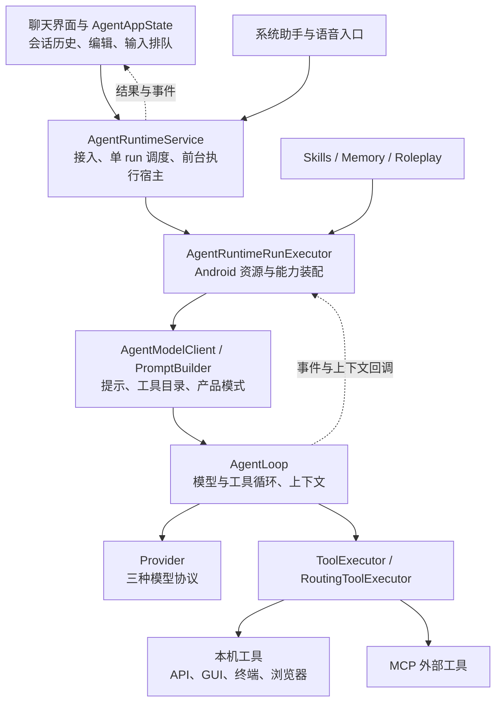
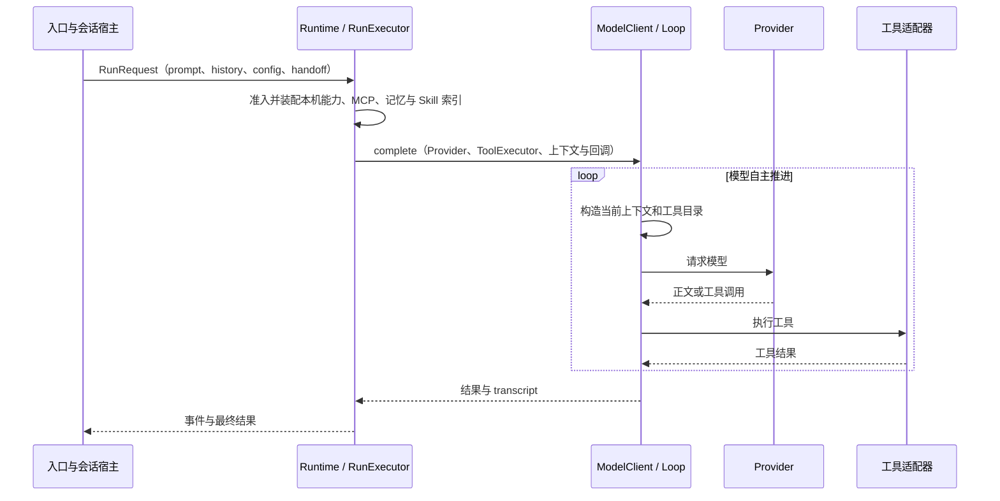

# Movo Agent 整体架构评估

| 项目 | 内容 |
|---|---|
| 对象与目的 | Movo / Eta 的 Agent 整体设计；评价分层、扩展和执行模型与手机助手定位是否匹配 |
| 类型 | 架构调研与评价 |
| In scope | 产品假设、内核与宿主职责、能力组织、扩展路径、任务与资源调度、Pi/Codex 对照 |
| Out of scope | 协议字段、异常恢复、小功能缺陷、具体重构方案、真实模型成功率评测 |
| 本地快照 | `59535edd99c144ba7d89af00b9f4f849cccaae24`，2026-09-24 复核 |
| 上游快照 | Pi `898ab804050730e9dcefb4443875d5a932aa6a32`；Codex `0a2eb4696c26ac33204bcd255721ab30220a4774`；DeepSeek Harness `477b4f420553e8a52c2fbccc464d7561b239c443`（2026-09-25 补充）；均为固定源码快照 |

## 1. 结论先行

**Eta 采用“单 Agent + 多种手机能力 + 模型自主组合”的架构，适合一个用户在一部手机上连续完成跨应用任务。执行循环的分层已经成立，主要架构债在产品模式进入内核、能力扩展分散，以及调度单位过于粗。**

1. **基本方向合理。** GUI、系统 API、Shell、浏览器、MCP 共用执行循环，便于在同一任务中组合；Provider 和工具执行可注入，模型请求、运行控制、Android 适配已有分工。
2. **内核与产品策略的分界正在变弱。** 角色投影直接进入 Loop，角色摘要策略进入压缩器，语音、角色改写、设备开关集中进入模型调用门面；新增产品模式的变化会沿多层传播。
3. **能力接入齐全，能力扩展的封装不足。** 本地工具的声明、运行条件、分发、资源构造分布在多个中心模块；Skill 和 MCP 各自解决知识与外部接口扩展，不能覆盖宿主行为扩展。
4. **全局单 run 是明确的产品限制。** 它适配共享手机前台，却也让纯计算、网页读取与 GUI 操作共同竞争唯一 Agent 执行位置；已有终端后台进程不能等同于多个 Agent 任务各自持续推进。
5. **工具面扩大后的模型表现是最大未知。** 当前按环境过滤工具，任务选路主要交给模型。宽工具面、较多操作策略与 BYOK 组合的实际成本和成功率尚无本次测量依据。

其中前两项结构性耦合已由源码确认；维护成本、任务路径稳定性的影响是设计推断。全局单 run 是已实现的调度语义，其合理性取决于是否要求多个任务同时推进。

## 2. 术语表

| 术语 | 本文含义 |
|---|---|
| 内核 | 模型与工具反馈循环、运行控制、上下文处理 |
| 宿主 | 装配能力、持有会话、接收入口请求、管理执行与界面的应用层 |
| run / 会话 | 一次 Agent 执行 / 可跨多次执行存在的对话 |
| 能力扩展 | 增加工具、知识资源或宿主行为；三者有不同接入路径 |

## 3. 现状全景

### 3.1 产品假设

README 当前定位是：用手机本机数据和系统适配，结合 GUI 与 Shell，完成需要个人上下文的跨应用任务。跨设备个人 Agent 是明确标注的长期愿景，本次不把尚未完成这一愿景作为缺陷。

对应的执行方式是同一个模型持续观察结果、选择工具和决定下一步。跨工具任务的规划主要由模型完成，Runtime 负责把它执行起来。这个选择减少了固定工作流对开放任务的限制，也使模型能力直接影响产品能力。

### 3.2 实际分层

`AgentLoop` 不持有 Android Service、Compose 或 WindowManager。`AgentRuntimeRunExecutor` 作为 Android 组合根构造实际资源，这种分工有价值。单仓、单 Android 模块本身不能证明分层失败。

## 4. 技术链路

决策分工如下：

- 模型决定任务分解、选哪个数据来源、何时从 API 转向 GUI，以及是否需要进一步操作。
- Loop 负责模型与工具的重复交互，注入追加输入并维护上下文。
- 工具层完成实际 Android、文件、进程、网页或远端服务操作。
- Service 管理当前运行，AppState 仍负责普通聊天的会话历史选择、编辑与下一次提交。

因此，“多个入口共用 Loop”已经实现；完整会话宿主职责仍分布在 AppState、Service 和会话存储之间。完整语音和厂商 Hook 的内部链路不在本次展开范围。

## 5. 架构问题及影响

### 5.1 产品模式穿透内核，演进时的改动面较大

**源码事实：**`AgentModelClient.complete` 同时接收角色上下文、改写模式、语音模式、Skill、记忆和设备能力；`AgentLoop` 直接调用 `RoleplayRunContext.projectMessages`；角色标记进一步传入 `AgentContextSession` 和 `AgentContextCompactor`，后者包含角色剧情的摘要规则。普通会话的历史选择和编辑语义则位于 `AgentAppState`。

**架构判断：**产品差异已经进入循环和上下文管理内部。角色模式为这一耦合提供了当前实例：它的行为横跨装配、提示、循环、压缩和 UI 会话投影。按现有组织方式继续增加对话模式，会增加核心模块需要理解的产品概念，以及不同模式之间的回归范围。

手机专用提示放在应用装配层完全合理；这里的结构性问题是产品类型被更底层的循环直接识别。已有 Provider、ToolExecutor 和回调注入减少了一部分耦合，但还不能使完整会话行为与宿主独立。

### 5.2 扩展主要依靠中心模块接线，缺少完整的能力封装

**源码事实：**新增本机工具通常涉及分类 ToolCatalog 的 schema、`AgentToolRequirements` 的运行条件、`AgentLocalTools` 或结构化设备工具的分发，以及 Android 适配器；新类别或资源还涉及 Runtime 的构造和开关。新增外部服务可以走 MCP 的发现与路由。Skill 提供索引、正文、脚本及资源，模型按需读取。

**架构判断：**系统已经统一了“调用一个工具”的接口，但一个本机能力的描述、约束、执行和资源生命周期尚未封装为同一个可注册单元。能力增长会扩大中心目录、分发器和装配根的共同改动面。新增一个简单工具不一定修改所有层，但新的设备能力类别会触及多层。

Skill 可以表达复杂工作方法、引用脚本；MCP 可以带来新工具。它们的现有接入机制不提供 Pi 那种完整的上下文变换、工具拦截和 session 生命周期扩展。因此，“支持 Skills/MCP”能证明知识和接口开放，不能据此推导宿主行为也具有同等扩展性。

当前上下文有渐进加载：记忆核心与标题索引、Skill 元信息先注入，正文按需取。工具目录则主要按用户开关、设备条件和会话类型过滤，并整体提供给模型。**设计风险：**当更多数据源和执行路径加入时，路径选择的复杂度主要落到工具描述、系统提示与模型上；BYOK 模型变化也会影响这项选择。其实际影响需要同任务、不同工具集合与模型的评测，本次没有声称成功率已经下降。

### 5.3 调度以全局 run 为单位，设备资源与任务没有分开管理

**源码事实：**Service 有一个 `activeSession`。准入时语音冲突返回忙碌；普通请求进入 `startRun` 后会取消原运行。UI 自己也按全局忙碌状态组织输入。执行循环按顺序调用模型返回的工具。

**合理之处：**同一手机前台、无障碍界面和输入焦点确实需要协调，一个交互任务独占设备能显著简化这一问题。

**结构性限制：**独占范围覆盖整个 Agent run。比如一个任务正在整理文件或分析网页，用户从系统入口提出另一项独立请求，现有调度不会按两者是否真正争用前台设备来分配执行位置，而是应用全局 run 准入规则。

终端已经支持异步命令和独立守护进程，不能说 Eta 没有后台执行能力。但后台进程继续运行与两个 Agent 任务分别保持模型循环、等待结果并接续，是不同的能力。当前架构对“一次专注完成一件事”合适，对“后台持续做事，同时随时响应另一件事”存在直接限制。

## 6. 与 Pi、Codex、DeepSeek Harness 的架构对照

| 维度 | Eta | Pi 固定快照 | Codex 固定快照 | DeepSeek Harness 固定快照 |
|---|---|---|---|---|
| 主要组织方式 | Android 应用宿主内的单 Agent | 模型层、通用 Agent 核、coding session 分层 | Thread/Session 宿主，进一步区分 Task、Turn、Step | Cordis 插件树；loop、工具、会话、沙箱都是可替换服务，按 profile 分层组装 |
| 内核与产品关系 | 已分出 Loop；仍直接理解角色等产品模式 | Agent 可注入模型调用、消息转换与上下文处理；coding 策略由上层 session 组织 | 产品导向较强，但会话服务、每轮上下文、执行环境有显式对象 | 产品模式以每会话一组插件（preset）装配，loop 不识别具体模式；行为经 `agent/*`、`tools/*` 事件扩展 |
| 工具扩展 | 本地目录与分发分开；MCP 动态接入 | 工具对象携带 schema、execute 等；上层有扩展生命周期 | ToolRegistry、Router 与执行 Runtime 分工，模型可见工具与环境绑定 | 工具定义自带 schema、执行、并发安全、超时与展示；注册即可撤销的副作用 |
| 会话宿主 | AppState 与 Service 共同持有完整会话行为 | AgentSession + SessionManager，可供不同前端调用 | ThreadManager 管理线程，Session 持有执行及服务状态 | `ctx.agents` 管理多个活跃 Agent；会话是只追加事件日志，Web、SDK、ACP 都从同一事件流渲染 |
| 执行资源 | 单全局 run；手机前台与独立工作共用准入 | 工具可声明执行模式；实际资源由工具实现管理 | StepContext 绑定环境、MCP 与工具视图；工具 Runtime 支持并发门控 | 工具按调用声明并行或独占；文件、进程、沙箱提供方可整体替换（如 SSH 远端） |
| 主要收益与代价 | Android 适配直接，交互路径短；核心扩展改动面扩大 | 定制与复用能力强；扩展宿主要承担配置和行为组合 | 多会话及执行环境表达完整；工程复杂度明显更高 | 可扩展与可审计性最强；默认插件树 287 个条目，依赖 Node，处于频繁破坏性变更的预览期 |

Pi 的参考价值集中在**小内核与可扩展宿主的分界**。其 coding-agent/session 层本身已有大量行为，不能把整个 Pi 描述为几行循环。来源：[Agent 配置与接口](https://github.com/earendil-works/pi/blob/898ab804050730e9dcefb4443875d5a932aa6a32/packages/agent/src/types.ts)、[创建 session 的 SDK](https://github.com/earendil-works/pi/blob/898ab804050730e9dcefb4443875d5a932aa6a32/packages/coding-agent/src/core/sdk.ts)、[AgentSession](https://github.com/earendil-works/pi/blob/898ab804050730e9dcefb4443875d5a932aa6a32/packages/coding-agent/src/core/agent-session.ts)。

Codex 的参考价值集中在**会话、执行轮次和环境的显式建模**。`StepContext` 把一次采样使用的环境、MCP 绑定和工具路由放在同一视图中，`ThreadManager` 管理多线程实例。它并不因此自动解决 Android 手机前台争用。来源：[ThreadManager](https://github.com/openai/codex/blob/0a2eb4696c26ac33204bcd255721ab30220a4774/codex-rs/core/src/thread_manager.rs)、[StepContext](https://github.com/openai/codex/blob/0a2eb4696c26ac33204bcd255721ab30220a4774/codex-rs/core/src/session/step_context.rs)、[工具执行 Runtime](https://github.com/openai/codex/blob/0a2eb4696c26ac33204bcd255721ab30220a4774/codex-rs/core/src/tools/parallel.rs)。

DeepSeek Harness 的参考价值集中在**把产品差异放在 loop 之外，并以单一事件日志承载会话**。它的 loop 只从日志派生请求，工具、提示片段和模式都以插件注册；这正对应本文 5.1、5.2 的两处耦合。它的 Cordis 全插件框架和 Node 运行时不适合直接搬到 Android 助手上，借鉴范围与边界见[设计评审的补充对比](Movo%20Agent%20设计评审：对比%20pi%20与%20Codex.md)，完整调研见[DeepSeek Harness 技术分析报告](DeepSeek%20Harness%20技术分析报告.md)。来源：[ToolDefinition](https://github.com/deepseek-ai/deepseek-harness/blob/477b4f420553e8a52c2fbccc464d7561b239c443/packages/core/tools/src/index.ts)、[ReactLoopAgent](https://github.com/deepseek-ai/deepseek-harness/blob/477b4f420553e8a52c2fbccc464d7561b239c443/packages/core/agent-loop/src/agent.ts)、[preset 装配](https://github.com/deepseek-ai/deepseek-harness/blob/477b4f420553e8a52c2fbccc464d7561b239c443/packages/preset/agent-preset-registry/src/mount.ts)。

四者都允许模型在反馈循环中决定下一步。现有任务与源码没有证明 Eta 必须采用多 Agent、独立 planner 或通用 judge；这些结构的有无不能直接决定架构质量。

## 7. 冲突与未知项

- README 中“API/CLI/MCP 优先、GUI 补齐”位于长期愿景。当前部分工具描述明确表达直达优先，但未看到任务级统一路由器；两者不构成当前功能承诺冲突。
- 本次没有跨 BYOK 模型的任务评测，无法量化宽工具目录和系统提示对成本、延迟、选路的影响。
- 未统计长期开发历史中的共同修改频率；扩展成本判断来自当前依赖和接入点，未把它写成测得的人力成本。
- 多任务同时推进是否属于当前产品必要需求，README 没有明确承诺。因此单 run 在本文标为场景限制，不标为普遍缺陷。

## 8. 自校验与验证状态

已回读当前产品定位、主执行链、产品模式传递、工具装配、能力过滤和运行准入；独立复核了宿主分层、能力组织与固定上游架构。此前实现审计中的异常探针不用于证明本篇架构结论。

本次未修改产品源码、未新增运行测试。已确认的事实来自源代码；维护成本与任务路径影响分别标为设计推断和待评测项。文档另做结构及路径校验。

## 9. 关键文件索引

| 章节 | 文件 | 关键符号 / 职责 |
|---|---|---|
| 1、3、7 | `README.md` | 当前手机产品定位与长期愿景 |
| 3—5 | `app/src/main/kotlin/io/github/mangi/eta/agent/model/AgentLoop.kt` | `run`、`RoleplayRunContext`、工具执行 |
| 3—5 | `app/src/main/kotlin/io/github/mangi/eta/agent/model/AgentModelClient.kt` | `complete`、`ModelConfig`、可注入执行接口 |
| 3、5 | `app/src/main/kotlin/io/github/mangi/eta/agent/model/AgentPromptBuilder.kt` | 产品操作策略、角色、语音、Skill 与记忆 |
| 5.1 | `app/src/main/kotlin/io/github/mangi/eta/agent/model/AgentContextSession.kt` | 角色模式传入压缩器 |
| 5.1 | `app/src/main/kotlin/io/github/mangi/eta/agent/model/AgentContextCompactor.kt` | 角色剧情摘要规则 |
| 3—5 | `app/src/main/kotlin/io/github/mangi/eta/agent/runtime/AgentRuntimeRunExecutor.kt` | Android 能力组合根 |
| 3—5 | `app/src/main/kotlin/io/github/mangi/eta/agent/runtime/AgentRuntimeService.kt` | `activeSession`、`ingestRunRequest`、`startRun` |
| 5.3 | `app/src/main/kotlin/io/github/mangi/eta/agent/runtime/AgentRuntimeAdmission.kt` | 全局 run 准入 |
| 3—5 | `app/src/main/kotlin/io/github/mangi/eta/ui/app/AgentAppState.kt` | 会话历史、编辑、输入与运行提交 |
| 5.2 | `app/src/main/kotlin/io/github/mangi/eta/agent/model/AgentToolCatalog.kt` | 分类目录与工具集合 |
| 5.2 | `app/src/main/kotlin/io/github/mangi/eta/agent/tool/AgentToolRequirements.kt` | 本地工具运行条件 |
| 5.2 | `app/src/main/kotlin/io/github/mangi/eta/agent/tool/AgentToolCapabilities.kt` | 环境可用性投影 |
| 5.2、5.3 | `app/src/main/kotlin/io/github/mangi/eta/agent/tool/AgentLocalTools.kt` | 工具名字分发、Android/终端资源构造 |
| 5.2 | `app/src/main/kotlin/io/github/mangi/eta/agent/mcp/McpRunContext.kt` | MCP 快照、目录、路由 |
| 5.3 | `app/src/main/kotlin/io/github/mangi/eta/agent/model/AgentTerminalToolCatalog.kt` | 异步命令及守护进程能力 |

## 10. 关联文档与过程件

- [Agent Runtime 设计说明](../../AGENT_RUNTIME.md)。
- [原实现机制与缺陷审计](Movo%20Agent%20设计审计与%20Pi、Codex%20对比.md)：与本文整体架构评价分开阅读。
- [DeepSeek Harness 技术分析报告](DeepSeek%20Harness%20技术分析报告.md)：2026-09-25 补充的上游调研，含 dsh 优势剖析与六方横向对比。
- 当前过程件：`tmp/tasks/2026-09-24-agent-architecture-focus/`；包含 `host-core.md`、`capability-architecture.md`、`upstream-architecture.md` 及补充固定源码。
- 前次固定上游源码：`tmp/tasks/2026-09-23-agent-design-review/upstream/`；本文上游结论同时给出固定提交链接。
