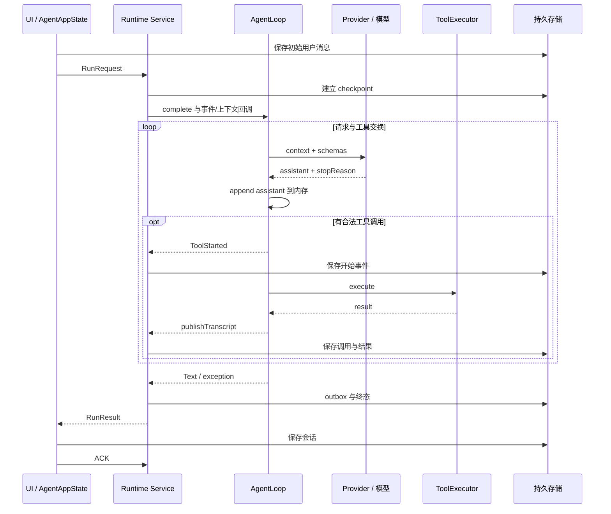
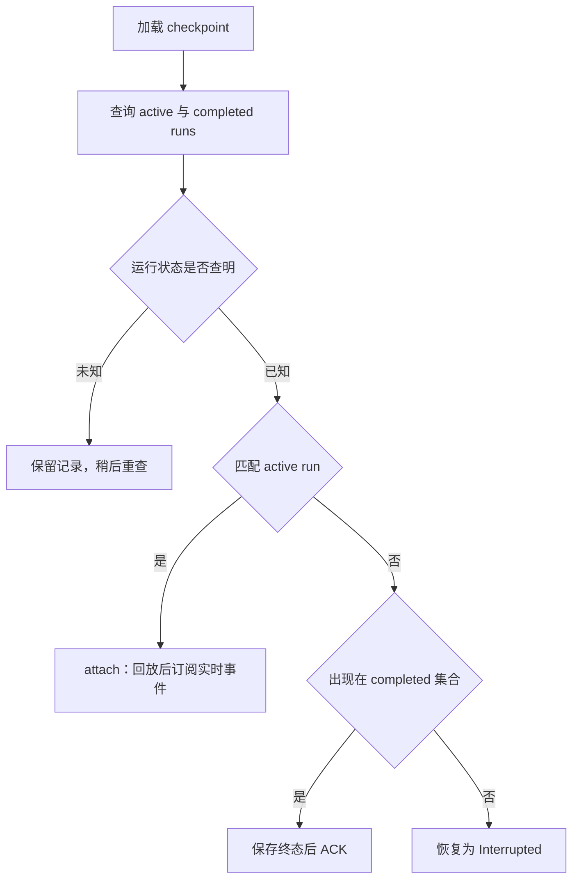

# Movo Agent 设计审计与 Pi、Codex 对比

| 项目 | 内容 |
|---|---|
| 调研对象 | Movo / Eta 的 Android Agent 执行核心与会话机制 |
| 目的与类型 | 机制审计：判断现有设计的问题，并与开源 Pi、OpenAI Codex 对照 |
| In scope | 模型协议、执行循环、工具调度、运行中输入、压缩、持久化、恢复、相关测试 |
| Out of scope | 实施改造、真实模型成功率评测、真机故障注入、厂商 Hook 内部、完整语音链路、上游所有分支 |
| Movo 快照 | `59535edd99c144ba7d89af00b9f4f849cccaae24`；2026-09-23；已有设计文档和图片改动保留 |
| 复核 | 2026-09-24；HEAD 未变；增加设计边界分析、批次失败探针及独立反证复核；上游仍引用下列固定快照 |
| Pi 快照 | `898ab804050730e9dcefb4443875d5a932aa6a32`；用户所指 `badlogic/pi-mono` 当前重定向至 `earendil-works/pi` |
| Codex 快照 | `0a2eb4696c26ac33204bcd255721ab30220a4774`；本次读取上游固定提交 |

## 1. 结论先行

Movo 已有正式的模型循环、工具执行和运行时。设计上的主要薄弱处是：**消息格式不能完整承载模型协议状态；手机动作的结果没有参与后续调度；长期任务事实与脱敏后的历史共用投影；部分输入和恢复语义仍由 UI 持有。** §3.3 解释这些选择为何会影响实际任务，§5 再列对应缺陷。

- 基础循环成立：三类 Provider、流式输出、工具参数校验、取消、有限模型重试、上下文压缩、checkpoint、outbox/ACK 都已实现。
- 存在可直接定位的正确性缺陷：非空截断回答被标记成功，Anthropic 工具续轮不保留必要的 thinking 协议块，已接受的排队输入没有持久拥有者。
- 2026-09-24 补证：同批首个 GUI 动作返回结果未知时，剩余动作仍会执行。提示词要求先观察，但模型此时尚未重新取得控制，规则无法约束已规划的剩余调用。
- 长任务连续性存在两处独立缺口：摘要输入先丢弃大量工具结果；首工具执行前没有把调用写入持久 transcript。
- 恢复和重试的组合场景也有问题：outbox 单页被当完整集合；网络重试再遇上下文溢出会复用 round 标识。
- 本次 77 个现有定向测试通过，另两个调用生产循环的临时探针复现了截断误成功和 round 重复。没有真实模型或真机故障注入，不能据此量化实际发生率。

上述 77+2 项于 2026-09-23 执行；2026-09-24 只增加并运行了一项批次结果探针。这些证据证明具体控制流，不构成整个 Agent 架构或实际任务成功率的验收。

| 问题 | 优先级 | 证据强度 | 详见 |
|---|---|---|---|
| 截断正文以成功结束 | P1 | 生产循环探针复现 | §5.1 |
| Anthropic thinking 工具续轮丢协议状态 | P1 | 源码与官方协议明确冲突 | §5.2 |
| 待发送文字及附件只保存在内存 | P1 | 完整提交/保存链路确认 | §5.3 |
| 首工具副作用窗口缺少持久调用记录 | P1 | 执行与保存顺序确认；重复操作后果为风险推断 | §5.4 |
| 压缩先脱敏导致任务结果无法进摘要 | P2；依赖不可重取标识的写任务风险更高 | 源码与现有测试确认；属设计取舍 | §5.5 |
| 8 条终态分页导致错误中断判定 | P2 | 明确条件下的源码缺陷 | §5.6 |
| 重试与 overflow 组合复用 round | P2 | 生产循环探针复现 | §5.7 |
| 未知 GUI 动作结果不能阻断同批后续动作 | P1：后续动作依赖当前前台状态时 | 生产循环调度探针复现；未做真实误点实验 | §5.8 |

P1 表示可能直接影响已接受输入、任务正确性或协议有效性；P2 表示条件触发的连续性、恢复或展示问题，不代表测得的发生频率。

## 2. 术语表

| 术语 | 本文含义 |
|---|---|
| Harness | 模型外部的执行、工具、状态和上下文管理代码 |
| run / round | 一次用户任务 / 一次模型请求及工具批次；当前重试也消耗展示 round |
| transcript / context | 追加的对话与工具记录 / 实际送给模型、可被压缩替换的上下文 |
| checkpoint / outbox | 执行中恢复记录 / 已完成但客户端尚未确认保存的结果 |
| steering / follow-up | 对当前任务追加指令 / 当前任务结束后执行的新输入；二者不等同于取消 |

## 3. 现状全景

### 3.1 Movo 的实际边界

普通聊天、悬浮窗和系统入口接入 Runtime。普通聊天执行期间的新文字进入单个待发送槽；悬浮窗补充指令走 steering。虽然 UI 属性名是 `voiceRuntimeBusy`，其判断包括任意当前 run 或 streaming 会话，排队行为不只影响语音。

Runtime 通过 Service 和工作线程与界面生命周期解耦，但 `AgentRuntimeService`、`AgentExecutionService` 未声明独立 `android:process`，与 UI 同默认进程。Activity 解绑定不会自动停止任务；默认进程死亡后的恢复是恢复记录并标中断，不是恢复线程执行栈。

| 模块 | 当前职责 | 已有能力 |
|---|---|---|
| UI / 会话存储 | 输入、附件、展示、历史 | 初始用户消息先保存再启动 run；完成结果保存后 ACK |
| Runtime | 接入、控制、资源、终态 | 单 active run、attach/replay、前台执行租约、取消资源、终态竞争提交 |
| Model | 请求与循环 | Chat Completions、Responses、Anthropic；重试、压缩、停止原因归一化 |
| Tools | 手机、终端、浏览器、MCP | 能力投影、执行时检查、JSON Schema 校验、观察 ID 与节点校验 |
| Skills / Memory | 按需背景 | Skill 元信息常驻、正文按需读取；独立持久记忆 |

### 3.2 与 Pi、Codex 的机制对照

| 维度 | Movo | Pi 当前已核实主链 | Codex 当前已核实主链 |
|---|---|---|---|
| 核心分层 | Loop / Provider / Runtime 已分离；核心入口还承载手机、角色、语音参数 | agent loop、coding-agent session、AI provider 为不同层 | Rust core session/turn、工具 runtime、rollout 模块分离 |
| 模型协议状态 | Responses 在同 run 保留 opaque output；Anthropic 只保留可见 thinking 文本 | 保存 thinking 签名及 redacted 块并回放；AssistantMessage 保留 stopReason | Responses 数据、推理状态与模型 history 有专用结构 |
| 工具调度 | 所有工具按模型声明顺序串行；无逐工具并行属性 | 默认并行；任一工具声明 sequential 时整批串行 | 工具声明并行能力，通过读写锁控制调度 |
| 运行中输入 | 有 steering；普通界面另有内存待发送槽 | steering 与 follow-up 分队列；当前版本在完整工具批次后消费 steering | 注入与 active-turn 状态原子检查；app-server 可指定 expected turn |
| 会话与压缩 | 有 transcript、context snapshot、事件和 UI history；脱敏投影同时用于摘要输入 | JSONL 树形会话；追加 compaction entry，再重建模型上下文投影 | rollout 持久记录；compaction replacement history；恢复后重建模型上下文 |
| 工具扩展 | schema、执行分发、能力需求、敏感策略、摘要标签分布在多个位置；MCP 为单独路由 | 同一工具定义包含 schema、execute、executionMode，扩展 wrapper 接入 registry | runtime 提供 spec、执行和 metadata；registry 有重名/保留名规则 |

上表 Pi 依据 [agent loop](https://github.com/earendil-works/pi/blob/898ab804050730e9dcefb4443875d5a932aa6a32/packages/agent/src/agent-loop.ts)、[AgentTool 定义](https://github.com/earendil-works/pi/blob/898ab804050730e9dcefb4443875d5a932aa6a32/packages/agent/src/types.ts)、[会话管理](https://github.com/earendil-works/pi/blob/898ab804050730e9dcefb4443875d5a932aa6a32/packages/coding-agent/src/core/session-manager.ts)；Codex 依据 [turn](https://github.com/openai/codex/blob/0a2eb4696c26ac33204bcd255721ab30220a4774/codex-rs/core/src/session/turn.rs)、[工具调度](https://github.com/openai/codex/blob/0a2eb4696c26ac33204bcd255721ab30220a4774/codex-rs/core/src/tools/parallel.rs)、[工具注册](https://github.com/openai/codex/blob/0a2eb4696c26ac33204bcd255721ab30220a4774/codex-rs/core/src/tools/registry.rs)、[rollout](https://github.com/openai/codex/blob/0a2eb4696c26ac33204bcd255721ab30220a4774/codex-rs/rollout/src/recorder.rs)。

工具串行与批次后 steering 符合手机共享前台界面的约束，本身不构成错误。Pi 当前同样在整批工具之后消费 steering。独立只读任务无法选择并行是性能能力边界，实际延迟影响未测量。

### 3.3 设计层判断：局部缺陷背后的四个边界

**第一，统一消息格式更接近 Chat Completions 历史，未完整建模 Provider 的状态。** `ConversationMessage` 的主体是 role、content、reasoningContent、toolCallsJson；结束原因、模型归属、签名与原生内容块没有对应的稳定字段。Responses 靠 `_eta_responses_output_items` 在单 run 内补回原生输出，Anthropic 则没有相应回放通道。因此“支持三种请求协议”还不足以证明多轮语义完整。thinking 丢失和 length 原因丢失是这项设计限制的两个表现，不只是两个无关解析 bug。（M2、M3、M4、M23）

Pi 的 [消息类型](https://github.com/earendil-works/pi/blob/898ab804050730e9dcefb4443875d5a932aa6a32/packages/ai/src/types.ts#L364)把 text、thinking、toolCall 分成内容块，并保留 thinkingSignature、provider/api/model、stopReason。可比较的是中间格式承载的语义，不是 TypeScript 与 Kotlin 的差别。

**第二，循环管理了工具调用顺序，但没有管理共享手机界面的动作依赖。** 本地工具返回 `ToolResult(content, images, sensitive)`；`ok`、未知效果、方向错误等位于 content 字符串中。Loop 读取它来展示结果，然后继续同批工具，没有将“当前设备状态不确定”转成必须重新观察的执行条件。节点身份和权限检查是有效的局部保护，但不能覆盖所有坐标操作，也不能替代批次依赖判断。§5.8 已复现这一调度行为。（M1、M2、M21、M24、M25）

这也解释了为何单看“串行还是并行”不够：依次执行 A、B，并不意味着 B 会等模型审阅 A 的结果后重新决定。Pi/Codex 的工具元数据是组织能力的参照；它们的桌面通用循环也不能自动推导出手机业务动作的依赖关系或事务保证。

**第三，持久历史的脱敏规则影响了执行中任务的记忆。** 压缩前套用持久化用的 transcript 投影，会使摘要模型看不到一些仍在使用的结果。以 MCP 创建对象为例，若唯一 ID 只出现在被压缩的原始结果中，后续操作缺少的就是继续执行所需的事实。多份 history/journal/context 本身有合理分工；问题在于当前投影共用规则没有表达“哪些执行事实仍必须可取回”。（M4、M5、M6、M7）

**第四，会话执行语义跨 UI 和 Runtime 分布，输入接纳边界不完整。** UI 决定传入哪个 history、维护待发送槽、执行恢复对账和最终会话提交；Runtime 负责准入、run 状态、资源取消、事件及 outbox。这样的分层并非天然错误，Pi 的宿主层同样管理会话；但当前 UI 已接受的待发送请求没有进入 Runtime 或持久会话，两边都没有持久负责它。排队丢输入、恢复页完整性误判是可定位的边界缺口，不能笼统归因为“状态太多”。（M9、M10、M14、M15、M16、M27）

目前没有依据因缺少独立 planner、多 agent 或通用 judge 就判定设计落后。复杂任务是否需要这些能力，仍取决于任务样本。这里已经能确认的问题，是已有协议和任务事实在边界上失真，以及已有“结果未知先观察”规则无法约束同批动作。

## 4. 技术链路

### 4.1 输入、执行与回流

关键不对称出现在 `append assistant → execute → publishTranscript`：UI 开始事件已落盘时，模型 transcript 尚无对应工具调用。问题 §5.4 来自此顺序，而非缺少所有持久化。

### 4.2 恢复闭环

`CompletedRunsQuery.Known` 目前不能表达“仅取得一页”，导致图中最后一条边在积压时做出错误判定。普通文字跨入口抢占、角色改写和厂商 Hook 内部不在本次完整追踪范围；角色改写已有更严格的停止原因检查，不能将普通 CHAT 的结论扩展到所有模式。

## 5. 关键规则与语义

### 5.1 P1：截断正文被当作成功完成

普通 CHAT 只有工具调用分支处理 `OUTPUT_LIMIT`，专用改写也检查 `END_TURN`；无工具正文分支只检查非空，随后发出 `RunFinished`，返回不含停止原因的 `ModelResponse.Text`，Runtime 将其包装成 `ok=true`。当模型因长度上限只输出半份报告时，上层拿到的成功类型与完整回答相同。这里的“成功”特指运行时技术终态，代码没有因此独立判定用户目标已达成。（M1、M2、M11）

临时探针输入非空正文与 `finish_reason=length`，真实调用生产循环，确认一次请求后触发成功事件并返回半截文本。Pi 的 [AssistantMessage](https://github.com/earendil-works/pi/blob/898ab804050730e9dcefb4443875d5a932aa6a32/packages/ai/src/types.ts#L515) 保留 `stopReason/rawStopReason` 并通过完整消息事件传递；这只证明它保留终止原因，不表示 Pi 对所有截断都会自动续写。

### 5.2 P1：Anthropic thinking 工具续轮协议不完整

流解析聚合可见 thinking，但不保存 `signature_delta` 与 `redacted_thinking.data`；`convertAssistantContent` 在下一轮只产生 text 和 tool_use。只要第一轮返回 thinking + tool_use，工具结果续轮就缺少该 assistant 的原始思考块。（M3、M4）

[Anthropic 官方协议](https://platform.claude.com/docs/en/build-with-claude/thinking-tool-workflows)要求工具续轮原样回传 thinking 块，并指出过滤 redacted 块或重建消息会触发协议错误。Pi [保存并回放这些字段](https://github.com/earendil-works/pi/blob/898ab804050730e9dcefb4443875d5a932aa6a32/packages/ai/src/api/anthropic-messages.ts#L1321)。Movo 现有测试验证它们不进入可见文字，但没有验证下一次请求仍包含协议状态。当前账号、模型和兼容网关的实际响应未测试。

### 5.3 P1：界面已接受的待发送输入会在进程重建后丢失

执行期间按发送，文字/附件移入 `queuedTextSubmission`，草稿被消费，输入框与附件字段被清空。该槽只是 `mutableStateOf(null)`；紧接着调用的 `persistConversations` 不保存它，用户消息要到 drain 时才加入会话。因此在 drain 前进程死亡，新状态无法恢复这条已接受输入。（M9、M10）

这与是否支持恢复执行栈无关：消失的是用户下一条请求。已有排队/撤回测试覆盖内存内操作，未覆盖保存后重新构造状态。此项由持久化路径确认，没有进行 Android 杀进程实验。

### 5.4 P1：首工具执行中的未知副作用无法进入恢复后的模型历史

每轮 assistant 的 tool_calls 只 append 内存，然后立即执行首个工具，等返回结果才 publish transcript。`ToolStarted` 会先落事件 checkpoint，并能恢复到 UI 轨迹；但恢复事件过滤了工具参数增量，事件也不用于重建完整模型调用。已有 `completeInterrupted` 只能修复已保存的 tool_calls，无法补出这个调用。准确说法是“UI 有开始记录，后续模型缺少完整调用及其未知结果”，不能说所有记录都丢失。（M1、M11、M12、M13、M28）

触发窗口是外部动作已产生效果、工具尚未返回时进程死亡。用户重开后要求继续，模型上下文缺少“该操作已尝试，结果未知”的事实，存在再次操作风险。代码不会自动重放设备工具，不能断言必然重复发送或写入。这里的缺陷是未知状态遗漏，不是要求数据库与任意外部工具构成原子事务；本次也没有证据表明 Pi/Codex 能普遍保证外部副作用只发生一次。

### 5.5 P2：持久化脱敏策略被复用于压缩，摘要看不到任务结果

`AgentContextCompactor` 在请求摘要前调用 `AgentConversationCodec.transcript`；该投影把敏感工具参数替换成 `{redacted:true}`，原始结果换成占位符。策略覆盖全部 `mcp_*` 及多种记忆、文件搜索、个人数据工具。MCP 的成功和错误结果都标为 sensitive。（M4、M5、M6、M7）

例如 MCP 创建对象返回唯一 ID，后续步骤尚需用该 ID；如果创建批次进入被压缩区域、近期消息也未复述它，摘要模型不可能保留一个根本没收到的 ID。压缩前当前 run 可看到原始结果；压缩后和持久历史中则无法从该记录取回。现有测试明确要求摘要不含原始敏感结果，说明这是有意策略，其任务连续性代价也是真实的。

Pi 的 [compaction](https://github.com/earendil-works/pi/blob/898ab804050730e9dcefb4443875d5a932aa6a32/packages/coding-agent/src/core/compaction/compaction.ts) 显式追踪文件操作与保留边界；Codex 的 [压缩恢复测试](https://github.com/openai/codex/blob/0a2eb4696c26ac33204bcd255721ab30220a4774/codex-rs/core/tests/suite/compact_resume_fork.rs)检查恢复后真正发给模型的 history。可比较的是任务事实能否接续，不能由这些实现推导所有原始数据都必须永久保存。

### 5.6 P2：8 条 outbox 分页被误当作所有已完成结果

`pendingPage` 固定只读最早 8 条，客户端只查一页就返回 `Known`。恢复阶段两次查询间未 ACK，会读到同一页。若存在第 9 个已完成 UI run 及其非空 transcript checkpoint，协调器会因其不在 completed 集合、也不 active 而判为 Interrupted。（M14、M15、M16）

当误判时 checkpoint 有可应用的 transcript 或 context snapshot、且没有另一条 live delivery 直接交付结果，中断历史会记入 `appliedRuntimeRunIds`。下一次真正读到其完成结果时，`alreadyApplied` 路径可能直接保留旧状态并 ACK，终态无法纠正。若 checkpoint 两者皆空，则不一定阻止后来的纠正。单 active run 不排除积压：接入没有以未 ACK 数量为限，outbox 也不会按数量自动淘汰。发生频率未知，未做 9 次离线积压的真机复现。（M9、M17）

### 5.7 P2：网络重试再遇上下文溢出会复用 round

`AgentModelRetry` 内部递增 round，仅成功时回传最终 round；若重试中抛 overflow，外层仅给原 round 加一。探针序列为网络错误 → overflow → 摘要 → 成功，实际 `RoundStarted` 是 `[1,2,2]`。（M1、M8）

UI 消息 ID 使用 runId、round、block index，故若失败尝试已输出可见增量，后续尝试存在拼接到同一消息的风险。轮号重复已复现；可见文本混合未做 UI 实验。现有独立重试、独立 overflow 测试都通过，未覆盖两者组合。（M18）

### 5.8 P1：结果未知后，同批已规划的 GUI 动作仍继续执行

`AgentPromptBuilder` 要求收到 `ACTION_OUTCOME_UNKNOWN` 或 `DIRECTION_MISMATCH` 后先观察，禁止直接重放。设备控制器在命令超时、滚动位移无法确认时确实会返回这些状态。然而 `AgentLoop` 对全部 tool_calls 做顺序执行，并没有根据前一结果停止同批后续调用；`AgentLocalTools` 也没有为未知结果建立统一的“下一步必须观察”状态。（M1、M21、M24、M26）

本次探针让一个模型响应包含两个合法 tap，执行器给首个返回 `ACTION_OUTCOME_UNKNOWN`。生产循环仍执行第二个 tap，然后才发起下一次模型请求。探针只替换 Provider 和具体工具 I/O，使用真实的 complete、loop 和校验逻辑；它证明调度行为，不证明实际设备已发生误点。

对互不依赖的读操作，单个失败后继续其他工具可以合理；此处风险限定于共享手机前台且后续动作依赖其状态的批次。一旦首动作改变界面但结果未知，剩余坐标动作仍可能在未经确认的界面执行。即使模型最终会遵守“先观察”，它此时还没有收到这一结果，无法回头取消同批剩余动作。已有节点身份检查减少了一部分风险，却不构成统一的批次保护。

## 6. 面向后续方案的现状接口

这些问题有共同的边界特征，改动涉及的范围可以从现有结构确定：

| 现有边界 | 已暴露的问题 | 涉及接口 |
|---|---|---|
| Provider 原生状态 → 通用消息 → UI 文本 | thinking 签名遗漏、完成原因丢失 | ProviderResponse、ConversationMessage、ModelResponse.Text、事件 |
| 实时事实 → 持久 transcript → 压缩输入 | 工具开始记录空窗、任务结果在摘要前丢失 | onTranscript、ConversationCodec、ContextCompactor、checkpoint |
| UI 输入 → 排队 → Runtime | 草稿移出后缺持久记录 | QueuedTextSubmission、ConversationStore、launch/drain |
| 查询结果 → 恢复判定 → 幂等应用 | 分页集合被赋予完整性，错误状态被标已应用 | CompletedRunsQuery、RecoveryCoordinator、appliedRuntimeRunIds |
| 请求尝试 → round → 展示消息身份 | 重试和压缩分别维护计数 | AgentModelRetry.Result、RoundStarted、MessageProjector |

Movo 已有的 `ToolExecutor`、Provider 注入和事件回调使生产循环可以脱离真机做定向验证，两个探针就是通过这些接口执行。Pi/Codex 的可比价值在于协议状态、生命周期和历史投影各自拥有明确契约；项目大小、多 agent 数量和工具数量不能替代这些契约。

工具声明已按类别拆分，`AgentToolRequirements` 也集中管理能力要求，不能说完全没有注册规则。不过执行、schema、敏感策略、展示标签仍在多个位置绑定工具名；调度接口是同步 `execute`，没有读写资源或并行能力字段。MCP 另外有固定 64 个 run 工具上限，超过后直接不投影，也没有基于任务的按需检索。此处是扩展与性能边界，本次没有测得其质量或 token 代价。

## 7. 冲突与未知项

### 7.1 已确认冲突

| 合同或已有处理 | 不一致处 |
|---|---|
| 改写与工具分支识别不完整输出 | 普通非空正文仍成功结束 |
| Anthropic 协议要求回放原始思考块 | 只保存可见思考文字 |
| 发送后输入进入待发送状态 | 会话持久化不包含该状态 |
| Interrupted 恢复能补未知工具结果 | 首工具执行前尚无可修复的持久调用 |
| 恢复 Known 表示可判定终态 | 数据实际只有最早一页 |

### 7.2 未知项

- Anthropic 问题在用户实际模型/网关上的返回码与频率：需要带 thinking 的两轮真实工具请求。
- 进程死亡时副作用与 checkpoint 的实际窗口：需要受控工具和真机故障注入。
- 排队输入丢失、outbox 9 条积压的产品表现：源码条件明确，但未做真机重建实验。
- 串行工具、全部 schema 暴露的延迟和 token 影响：需要同一模型、同一任务集测量，本文无数值结论。
- Codex 对所有纯文本 length 场景的最终 UI 策略未追通；未把它写成自动续写保证。
- Pi 新增 durable/harness 分支不属于本次追通的 coding-agent 默认主链，未把其能力混入比较。

自然结束时 steering 消费点与下一轮顶部可能一次取出两条，偏离“逐条模型轮”的注释，但两条仍按 FIFO 保留；本次列为低优先合同偏差，没有升级为数据丢失问题。

## 8. 自校验与验证状态

| 验证 | 本次结果 | 证明范围 |
|---|---|---|
| 当前源码与关键调用链复核 | 完成 | 本文路径、分支、持久化顺序 |
| 上游固定 SHA 与官方协议 | 完成 | Pi/Codex 表中机制；不代表运行过上游测试 |
| 现有定向 JVM 测试 | 77/77 通过，9 个类 | Loop、Anthropic、压缩、重试、Controller、RuntimeSession、恢复协调、工具目录、MCP |
| 临时生产循环探针 | 2/2 通过 | 复现错误现状：截断误成功、轮号 `[1,2,2]`；不代表缺陷修复 |
| 2026-09-24 批次调度探针 | 1/1 通过 | 首 tap 结果未知后仍执行第二个；工具 I/O 是 Fake，没有实际点击设备 |
| 2026-09-24 独立反证复核 | 原七条保留，三处收窄措辞 | 明确技术终态、UI 事件旁路、outbox 条件；不以测试数量评价总体架构 |
| 编译 | 两次 Gradle 执行成功 | debug 生产和单测代码；并非 release 全部检查 |
| 真机、真实模型、全量回归 | 未执行 | 不宣称完整产品验收 |

测试最初因未设置 SDK 路径失败；随后使用本机现有缓存 JDK 25 和 Android SDK，显式设置命令环境后成功。未安装全局依赖。首次临时 sourceSet 配置只覆盖 Java，没有纳入 Kotlin 探针；核对 XML 发现后修正为 Kotlin sourceSet，单独执行并确认两条探针实际存在。最终证据为 77 个现有测试和 2 个探针的两次结果，避免把配置成功误报为探针执行成功。

本次只新增调研文档及任务目录中的取证/探针文件，未修改生产源码，也未提交代码。所有新测试文件通过临时 Gradle init 脚本接入，未加入项目常规 sourceSet。

## 9. 关键文件索引

路径以项目根目录为基准；行号以本次快照为准。上游固定链接见 §3.2、§5 及最后的上游过程件。

| 编号 / 章节 | 文件 | 关键符号与位置 |
|---|---|---|
| M1：4、5.1、5.4、5.7 | `app/src/main/kotlin/io/github/mangi/eta/agent/model/AgentLoop.kt` | run 84；overflow 129；append/execute/publish 170–199；RunFinished 224 |
| M2：3、5.1 | `app/src/main/kotlin/io/github/mangi/eta/agent/model/AgentModelClient.kt` | complete 84；toolsFor 136；ModelResponse.Text 329 |
| M3：5.2 | `app/src/main/kotlin/io/github/mangi/eta/agent/model/AnthropicMessagesProvider.kt` | convertAssistantContent 156；流解析 218 起 |
| M4：5.2、5.5 | `app/src/main/kotlin/io/github/mangi/eta/agent/model/AgentConversationCodec.kt` | assistantHistoryMessage 117；transcript 190；redact 212 |
| M5：5.5 | `app/src/main/kotlin/io/github/mangi/eta/agent/model/AgentContextCompactor.kt` | 压缩输入 40–54；summaryInput 136 |
| M6：5.5 | `app/src/main/kotlin/io/github/mangi/eta/agent/model/AgentSensitiveToolPolicy.kt` | MCP 前缀及敏感工具列表 |
| M7：5.5、6 | `app/src/main/kotlin/io/github/mangi/eta/agent/mcp/McpRunContext.kt` | 工具上限 71–98；sensitive 248–262 |
| M8：5.7 | `app/src/main/kotlin/io/github/mangi/eta/agent/model/AgentModelRetry.kt` | 内部 round 递增与成功回传 |
| M9：3、5.3、5.6 | `app/src/main/kotlin/io/github/mangi/eta/ui/app/AgentAppState.kt` | queued 槽 133；busy 158；恢复 469；queue 1117；drain 1218；persist 2738 |
| M10：5.3 | `app/src/main/kotlin/io/github/mangi/eta/ui/app/AgentConversationStore.kt` | Snapshot 与 save 41–106 |
| M11：4、5.4 | `app/src/main/kotlin/io/github/mangi/eta/agent/runtime/AgentRuntimeRunExecutor.kt` | onTranscript 259；先写事件再交付 395–405 |
| M12：5.4 | `app/src/main/kotlin/io/github/mangi/eta/agent/runtime/AgentRunCheckpointStore.kt` | 恢复 transcript 与中断补齐 |
| M13：5.4 | `app/src/main/kotlin/io/github/mangi/eta/agent/model/AgentToolBatchRecovery.kt` | completeInterrupted；只处理已有调用 |
| M14：5.6 | `app/src/main/kotlin/io/github/mangi/eta/agent/runtime/AgentRuntimeResultStore.kt` | pendingPage 47；未 ACK 不淘汰 |
| M15：5.6 | `app/src/main/kotlin/io/github/mangi/eta/agent/runtime/AgentRuntimeClient.kt` | queryCompletedRuns 143 |
| M16：5.6 | `app/src/main/kotlin/io/github/mangi/eta/ui/app/AgentRunRecoveryCoordinator.kt` | Known 下对未命中 checkpoint 判中断 37–49 |
| M17：5.6 | `app/src/main/kotlin/io/github/mangi/eta/ui/app/AgentPendingResultRecovery.kt` | alreadyApplied 早返回 37 |
| M18：5.7 | `app/src/main/kotlin/io/github/mangi/eta/ui/app/AgentRunMessageProjector.kt` | 消息 ID 与增量归属 |
| M19：3、6 | `app/src/main/kotlin/io/github/mangi/eta/agent/model/AgentToolCatalog.kt` | 分类 schema 组合 |
| M20：3、6 | `app/src/main/kotlin/io/github/mangi/eta/agent/tool/AgentToolRequirements.kt` | 统一工具能力要求 |
| M21：3、6 | `app/src/main/kotlin/io/github/mangi/eta/agent/tool/AgentLocalTools.kt` | execute 150；本地工具路由与边界检查 |
| M22：3 | `app/src/main/AndroidManifest.xml` | Runtime/Execution Service 142–153 |
| M23：3.3 | `app/src/main/kotlin/io/github/mangi/eta/agent/model/ResponsesEphemeralState.kt` | 单 run 原始输出旁路，稳定 codec 不保存 |
| M24：3.3、5.8 | `app/src/main/kotlin/io/github/mangi/eta/agent/model/AgentPromptBuilder.kt` | 结果未知先观察规则 91；观察策略 84–99 |
| M25：3.3 | `app/src/main/kotlin/io/github/mangi/eta/agent/model/AgentTraceFormatter.kt` | isSuccessResult 从 content JSON 读取 ok 227 |
| M26：5.8 | `app/src/main/kotlin/io/github/mangi/eta/agent/device/RootShellDeviceController.kt` | 滚动未知结果 969–986；动作超时 1077 |
| M27：3.3 | `app/src/main/kotlin/io/github/mangi/eta/agent/runtime/AgentRuntimeSession.kt` | run 状态、steering、订阅与唯一终态 |
| M28：5.4 | `app/src/main/kotlin/io/github/mangi/eta/agent/runtime/AgentEventRecoveryProjection.kt` | 恢复事件过滤工具参数增量 |
| T1：5、8 | `app/src/test/kotlin/io/github/mangi/eta/agent/model/AgentContextCompactionTest.kt` | 摘要前脱敏 123–147；独立 overflow |
| T2：5、8 | `app/src/test/kotlin/io/github/mangi/eta/agent/model/AnthropicMessagesProviderTest.kt` | signature/redacted 的可见文本测试 |
| T3：5、8 | `tmp/tasks/2026-09-23-agent-design-review/AgentDesignReviewProbeTest.kt` | 两条生产循环探针 |
| T4：5.8、8 | `tmp/tasks/2026-09-24-agent-design-recheck/AgentBatchOutcomeProbeTest.kt` | 一条生产循环批次结果探针 |

## 10. 关联文档与过程件

- [现有 Agent 实现原理](../agent-implementation/Movo%20Agent%20实现原理.md)
- [Runtime 设计说明](../../AGENT_RUNTIME.md)
- [仓库画像](../../../tmp/tasks/2026-09-23-agent-design-review/repo-profile.md)、[主链记录](../../../tmp/tasks/2026-09-23-agent-design-review/trace-log.md)、[未知项](../../../tmp/tasks/2026-09-23-agent-design-review/open-questions.md)
- [模型循环审计](../../../tmp/tasks/2026-09-23-agent-design-review/loop-context.md)、[Runtime 审计](../../../tmp/tasks/2026-09-23-agent-design-review/runtime.md)、[上游完整矩阵与固定源码索引](../../../tmp/tasks/2026-09-23-agent-design-review/upstream.md)
- [测试汇总](../../../tmp/tasks/2026-09-23-agent-design-review/test-summary.json)、[现有测试日志](../../../tmp/tasks/2026-09-23-agent-design-review/tests.log)、[探针日志](../../../tmp/tasks/2026-09-23-agent-design-review/probes.log)
- [2026-09-24 工具合同复核](../../../tmp/tasks/2026-09-24-agent-design-recheck/tool-contract.md)、[状态归属复核](../../../tmp/tasks/2026-09-24-agent-design-recheck/state-ownership.md)、[独立反证审阅](../../../tmp/tasks/2026-09-24-agent-design-recheck/skeptic.md)
- [本次批次探针结果 XML](../../../tmp/tasks/2026-09-24-agent-design-recheck/batch-probe.xml)、[Gradle 日志](../../../tmp/tasks/2026-09-24-agent-design-recheck/batch-probe.gradle.log)
