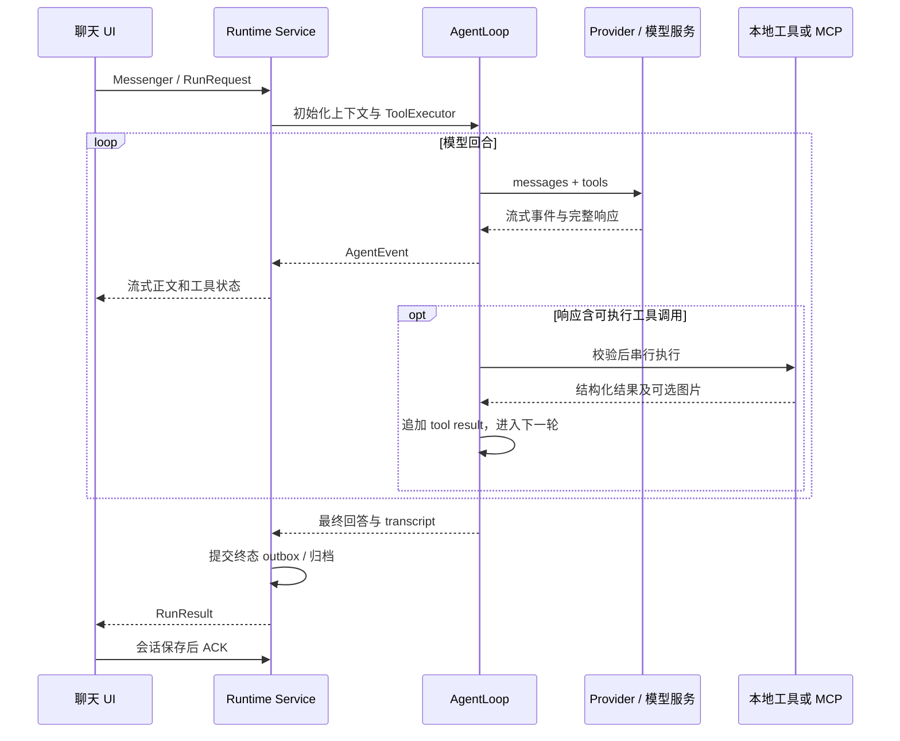
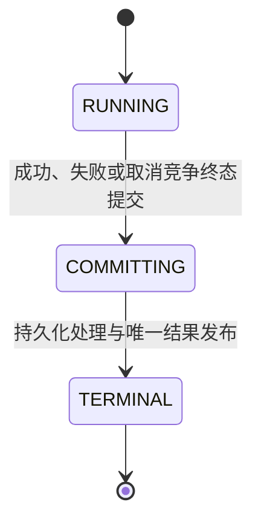

# Movo Agent 实现原理

| 项目 | 内容 |
|---|---|
| 调研对象 | Movo 仓库中产品名为 Eta 的 Android Agent |
| 目的与类型 | 理解现有实现原理；机制型调研 |
| 范围 | 普通聊天入口、Runtime、模型循环、工具分发、上下文与恢复 |
| 未展开 | 角色改写、各厂商 Hook 内部适配、全部 Provider 兼容细节、真机验收 |
| 代码快照 | c15de97bd30f6f5d920eb2ac945684acba691fec，2026-09-20 |

## 1. 结论先行

Agent 主链由项目自身的 Kotlin 代码实现：手机端维护上下文并请求模型，模型返回工具调用，手机执行工具、把结果送回模型，循环直至回答完成。

- 模型协议与循环分离；同一循环支持 Chat Completions、Responses 和 Anthropic Messages。
- GUI、系统 API、终端和远程 MCP 共用工具调用入口；Skill 正文按需作为上下文加载。
- 编排运行在 Android Runtime Service 的工作线程中，UI 通过 Messenger 接收事件与结果。
- 执行记录、可压缩模型上下文、待交付结果分开保存。恢复可重连活跃 run，或恢复中断轨迹，不自动重放设备操作。
- 本文结论来自源码；未运行模型请求、编译测试或真机操作，实际权限和设备兼容性未知。

## 2. 术语表

| 术语 | 本项目语义 |
|---|---|
| run | 一次请求的执行生命周期，包含若干模型回合 |
| turn | 一次模型响应及其完整工具批次 |
| steering | 执行过程中追加的用户指令，排队到回合边界消费 |
| transcript | 本次 run 追加的对话与工具记录 |
| checkpoint / outbox | 分别保存执行中状态和完成但尚待客户端确认的结果 |

## 3. 现状全景

普通聊天把用户输入、图片、历史、模型配置和会话标识传给 Runtime。Runtime 初始化本次工具与上下文，调用同一模型循环；系统助手入口通过 Runtime 协议接入，厂商 Hook 的入口适配未在本次展开。

| 模块 | 职责 | 边界 |
|---|---|---|
| UI | 请求提交、流式展示、持久会话 | Messenger 请求与事件 |
| Runtime | 生命周期、执行控制、检查点、结果交付 | Android Service 与工作线程 |
| Model | 提示词、循环、压缩、协议适配 | HTTP 模型服务 |
| Tools | 本地设备、文件、终端、浏览器及远程调用 | Android API、进程、MCP HTTP |

## 4. 技术链路



### 4.1 请求与准备

`AgentAppState` 创建 `RunRequest`，携带 `runId / prompt / config / images / history / handoff`。`AgentRuntimeClient.run()` 发送 `MSG_START_RUN` 并设置回复通道。

Service 的 `IncomingHandler → ingestRunRequest → startRun` 接纳请求；创建 `AgentRuntimeSession`、获取执行服务租约，在 `agent-runtime` 工作线程调用 `AgentRuntimeRunExecutor.execute()`。当前 `startRun` 会取消旧的活跃 session，然后启动新的 session。

Executor 加载兼容的 Skill 索引、长期记忆和本次 MCP 快照，创建本地执行器与 MCP 路由器。随后调用 `AgentModelClient.complete()`。

### 4.2 上下文与模型请求

`AgentPromptBuilder` 将配置系统提示词、Eta 身份和手机操作约束、按条件注入的工具规则、记忆与 Skill 索引、历史和当前输入组成消息。`AgentToolCatalog` 根据开关与设备能力生成 JSON Schema，再追加 MCP 等本次工具。

`ProviderClientFactory` 根据 `providerType` 和 `openAiEndpointMode` 选择三个协议实现。以 Chat Completions 为例，Provider 用 OkHttp 发 POST、读取 SSE，将文本和工具增量转为统一事件，最终返回 `ProviderResponse`。模型推理由配置的模型服务承担。

### 4.3 核心循环

`AgentLoop.run()` 的主干可简化为以下伪代码；省略错误分支和角色投影：

```text
while true:
    检查暂停/取消，消费一条追加指令
    根据当前能力生成工具列表，必要时压缩上下文
    response = 调用模型(messages, tools)
    追加 assistant message
    if response 有 tool calls:
        逐个校验参数、执行工具、追加 tool result
        追加可选图片观察
        continue
    if 还有追加指令:
        continue
    return 最终正文
```

只有明确的 `TOOL_USE` 终止状态允许执行调用。输出截断、未知终止状态或参数校验失败会生成错误工具结果。工具执行异常也转换为结构化 `TOOL_ERROR` 返回模型。循环不设固定回合上限，由模型结束、取消或错误退出。

### 4.4 模型指令如何变成手机动作

`RoutingToolExecutor` 检查工具名是否属于 MCP 快照；属于则交给远程执行器，否则进入 `AgentLocalTools.execute()`。本地执行器检查能力、开关和 GUI 前置条件，再按工具名分发。

具体例子：模型先调用 `observe_screen` 获取节点与 `observation_id`，按需附带截图，再调用 `tap_element({index, observation_id})`。本地执行器校验快照和节点，控制器调用 `AgentAccessibilityService.clickNode()`，最后执行 `AccessibilityNodeInfo.performAction(ACTION_CLICK)`；没有可点击目标时，可走节点中心的 `dispatchGesture` 手势分支。过期或无法确认的节点返回错误。

系统能力也有直接路径：`set_alarm` 构造闹钟 Intent，`set_volume` 调用 `AudioManager.setStreamVolume()`。终端工具进入 `RootShellTerminalController`，由进程 supervisor 启动真实 shell，返回输出、退出码和超时状态。

### 4.5 Skill、MCP 与结果回流

Skill 自动注入的是名称、描述、路径等索引；模型通过 `skills_read` 加载正文，通过 `skills_read_resource` 加载引用。Skill 本身不是自动运行的独立执行器。

MCP 则把远程 `inputSchema` 转为模型可见 function schema，并生成带命名空间的工具名；执行时解析回原服务器与工具名，通过 HTTP `tools/call` 请求，再转换成统一 `ToolResult`。

Provider 增量和工具状态转为 `AgentEvent`，由 session 发回 UI。Executor 同时保存事件、transcript 和上下文检查点。完成时通过 `session.complete()` 提交结果，由 Service 写 outbox 和归档。

## 5. 关键规则与语义

| 机制 | 源码行为 |
|---|---|
| 工具执行顺序 | 同一响应的工具按模型顺序串行执行 |
| 暂停 | 在检查点等待条件变量；恢复后继续 |
| 取消 | 关闭 steering、唤醒暂停等待、取消注册的 HTTP/工具资源 |
| 追加指令 | 队列逐条消费，不中断当前模型请求或工具批次 |
| 模型重试 | 可重试错误最多重试三次，延迟 2/4/8 秒；本地工具不在该重试范围内 |
| 自动压缩 | 配置正数上下文窗口时，估计占用达到 85% 触发；usage 用于校准估算 |
| 压缩提交 | 摘要在完整工具交换边界生成；先保存候选快照，再替换模型 messages |
| 历史与上下文 | transcript 追加记录，messages 可压缩，两者用途分离 |
| 权限 | 初始化按配置裁剪；执行时通过回调重新读取工具开关；设备实际值未知 |



恢复由 `AgentRunRecoveryCoordinator` 综合 checkpoint、outbox 和活跃 run 状态判断：完成结果应用到会话后 ACK；仍活跃的 run 重新订阅；确定失去执行实例的任务恢复为中断轨迹。服务查询失败时保留未决状态，不能据此认定任务已中断。

## 6. 面向后续方案的现状接口

- `AgentProviderClient` 是模型协议边界，返回统一响应与流式事件。
- `AgentModelClient.ToolExecutor` 是循环与执行器之间的边界。
- 工具声明在 catalog，能力判定与实际执行位于独立模块。
- `AgentRuntimeWire`、`AgentEvent`、`AgentRuntimeSession` 连接执行线程、IPC 与界面。
- `AgentContextSnapshot` 和 transcript 分离；恢复同时依赖 Runtime 活跃状态与数据库结果。

## 7. 冲突与未知项

没有把目录名 Movo 当作运行时产品名；当前源码仍使用 Eta。

未取得实际设备 Root、无障碍授权、ROM、模型与远程 MCP 配置。未对进程被杀、持久化失败、断连等场景做故障注入。角色改写、厂商 Hook 内部适配和全部协议兼容分支没有全面审计。

## 8. 自校验与验证状态

已回读请求提交、Messenger 入口、工作线程、模型循环、工具路由、节点点击、终态竞争与 UI 恢复的关键连接。本文验证为静态源码核对，未进行编译、单元测试或真机执行。

## 9. 关键文件索引

下列路径相对项目根目录。

| 章节 | 文件 | 关键符号或职责 |
|---|---|---|
| 4、5 | `app/src/main/kotlin/io/github/mangi/eta/ui/app/AgentAppState.kt` | RunRequest 提交、结果保存与恢复 |
| 4 | `app/src/main/kotlin/io/github/mangi/eta/agent/runtime/AgentRuntimeClient.kt` | Messenger 客户端 |
| 4、5 | `app/src/main/kotlin/io/github/mangi/eta/agent/runtime/AgentRuntimeService.kt` | startRun、executeRun、persistRunArtifacts |
| 4 | `app/src/main/kotlin/io/github/mangi/eta/agent/runtime/AgentRuntimeRunExecutor.kt` | 工具初始化、模型执行与检查点回调 |
| 4 | `app/src/main/kotlin/io/github/mangi/eta/agent/model/AgentModelClient.kt` | complete、ToolExecutor |
| 4 | `app/src/main/kotlin/io/github/mangi/eta/agent/model/AgentPromptBuilder.kt` | 系统消息与 Skill 索引 |
| 4、5 | `app/src/main/kotlin/io/github/mangi/eta/agent/model/AgentLoop.kt` | run、executeTool |
| 4 | `app/src/main/kotlin/io/github/mangi/eta/agent/model/ProviderClientFactory.kt` | 协议选择 |
| 4 | `app/src/main/kotlin/io/github/mangi/eta/agent/model/OpenAiChatCompletionsProvider.kt` | HTTP 与 SSE |
| 4 | `app/src/main/kotlin/io/github/mangi/eta/agent/model/AgentToolCatalog.kt` | 工具 schema 汇总 |
| 4 | `app/src/main/kotlin/io/github/mangi/eta/agent/tool/AgentLocalTools.kt` | 本地路由、tapElement、Skill 读取 |
| 4 | `app/src/main/kotlin/io/github/mangi/eta/agent/device/RootShellDeviceController.kt` | 观察与设备动作 |
| 4 | `app/src/main/kotlin/io/github/mangi/eta/agent/accessibility/AgentAccessibilityService.kt` | clickNode、performNodeAction、dispatchGesture |
| 4 | `app/src/main/kotlin/io/github/mangi/eta/agent/tool/AgentStructuredDeviceTools.kt` | 闹钟 Intent、AudioManager |
| 4 | `app/src/main/kotlin/io/github/mangi/eta/agent/terminal/RootShellTerminalController.kt` | shell 工具执行 |
| 4 | `app/src/main/kotlin/io/github/mangi/eta/agent/terminal/ShellProcessSupervisor.kt` | 真实进程启动与管理 |
| 4 | `app/src/main/kotlin/io/github/mangi/eta/agent/mcp/McpRunContext.kt` | schema 投影与 RoutingToolExecutor |
| 4 | `app/src/main/kotlin/io/github/mangi/eta/agent/mcp/McpHttpClient.kt` | tools/call |
| 5 | `app/src/main/kotlin/io/github/mangi/eta/agent/model/AgentModelRetry.kt` | 有限请求重试 |
| 5 | `app/src/main/kotlin/io/github/mangi/eta/agent/model/AgentContextBudget.kt` | 上下文估算与阈值 |
| 5 | `app/src/main/kotlin/io/github/mangi/eta/agent/model/AgentContextSession.kt` | 摘要候选的持久化提交 |
| 5 | `app/src/main/kotlin/io/github/mangi/eta/agent/model/AgentContextCompactor.kt` | 安全分组与模型摘要 |
| 5 | `app/src/main/kotlin/io/github/mangi/eta/agent/runtime/AgentRunController.kt` | pause、cancel、steer |
| 5 | `app/src/main/kotlin/io/github/mangi/eta/agent/runtime/AgentRuntimeSession.kt` | 唯一终态 |
| 5 | `app/src/main/kotlin/io/github/mangi/eta/agent/runtime/AgentRunCheckpointStore.kt` | 执行中检查点 |
| 5 | `app/src/main/kotlin/io/github/mangi/eta/agent/runtime/AgentRuntimeResultStore.kt` | 结果 outbox |
| 5 | `app/src/main/kotlin/io/github/mangi/eta/ui/app/AgentRunRecoveryCoordinator.kt` | completed / reattach / interrupted 判定 |

## 10. 关联文档与过程件

- 项目既有设计说明：[Agent Runtime](../../AGENT_RUNTIME.md)。本报告以源码为结论依据。
- [仓库画像](../../../tmp/tasks/2026-09-20-agent-implementation/repo-profile.md)
- [主链追踪](../../../tmp/tasks/2026-09-20-agent-implementation/trace-log.md)
- [未知项](../../../tmp/tasks/2026-09-20-agent-implementation/open-questions.md)
