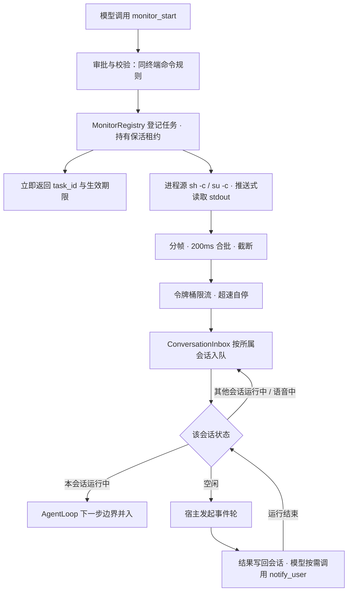

# Movo 复刻 Claude Monitor：事件驱动唤醒 Agent 方案

> 2026-10-05。需求：让 Agent 支持「每 3 分钟给我发个消息」这类持续任务，**照 Claude Code Monitor 的机制由 Agent 自己实现**：Agent 启动一个持续事件源，事件到达时唤醒 Agent 处理。不做系统闹钟，不考虑熄屏。
> 输入资料：Claude Monitor 实测与复刻分析（`~/dev/tmp/tasks/2026-09-27-claude-monitor/replication-analysis.md`）、DeepSeek Harness 源码核验（`~/dev/tmp/tasks/2026-09-28-deepseek-monitor/source-findings.md`）、Movo 现有代码只读梳理。
> 本文是**实施前方案**，待 review 同意后再写代码。

## 1. 要复刻的东西

Claude Monitor 的完整链路（来自实测）：

```
模型调用 Monitor(command, timeout) → 宿主立即返回 taskId，Agent 继续 / 结束本轮
   ↓ 子进程 stdout 持续输出
逐行分帧 → 200ms 固定窗口合批 → 令牌桶限流
   ↓
「系统通知，非用户输入」进所属 Agent 的收件箱
   ├ Agent 正在执行：下一步边界并入下一次模型请求（不打断正在生成的流）
   └ Agent 已空闲：宿主自动开新一轮
   ↓
模型读到事件，自己决定回复 / 调工具 / 调 TaskStop 停止监听
```

用它实现「每 3 分钟给我发个消息」：

```
用户：每 3 分钟给我发个消息，提醒我喝水
模型：monitor_start(description="喝水提醒",
                    command="while true; do sleep 180; echo tick; done",
                    timeout_ms=7200000)
宿主：返回 task_id 和实际生效的期限 → 模型回复「好的，每 3 分钟提醒你，2 小时后自动结束」→ 本轮结束
…3 分钟后 stdout 出现 tick
宿主：会话空闲 → 自动开一轮，带上事件「喝水提醒 #1: tick」
模型：调用 notify_user 发系统通知「该喝水了」，并在会话里回复同样的话
…
用户：别提醒了 → 模型：monitor_stop(task_id)
```

事件源由 Agent 写的命令决定，同一套机制可以覆盖很多场景，宿主不需要为每种需求写专门的功能：
- 定时：`sleep` 循环；
- 轮询状态：每分钟读一次电量，变化才输出；
- 跟日志：`logcat` 过滤；
- 等结果：轮询某个文件或网络地址，就绪才输出。

### 必须照搬的语义（Claude 实测值）

| 环节 | 语义 |
|---|---|
| 分帧 | stdout 按 UTF-8 流式解码，按 `\n` 切行，每行 `trim()`，空行丢弃；未带换行的尾段保留，退出时并入 |
| 合批 | 首个完整行启动 **200ms 固定窗口**（后续行不重设计时），到点用 `\n` 合并为一个事件 |
| 截断 | 单行前 500 个 UTF-16 码元 + `...(truncated)`；单批前 3000 + `\n...(truncated)`；未处理缓冲超 1M 只留尾部。Kotlin `String.length` 同为 UTF-16，可直接对齐 |
| 限流 | 每个监听一个令牌桶：容量 10，每 2000ms 离散补 1 枚，每次合批消耗 1 枚；没令牌就抑制该批并计数，下次有令牌时先发「已抑制 n 个事件」再发当前批；持续超速超过 30s 自动停止并通知 |
| stderr | 只进日志，不产生事件 |
| 期限 | 必有期限，到期停止并发期限通知；返回给模型的是**实际生效**的期限 |
| 终止 | 自然退出、到期、取消、限流停止、会话关闭，五个入口统一走一次性终止：停接收、清计时、drain 尾部、杀进程（含子进程）、发一次结束通知、释放保活 |
| 投递 | 队列项保存已生成的文本和来源（taskId、所属会话），不持有等待进程结束的 Promise |
| 调度 | 同一会话同时只有一条执行链；忙时在边界消费，闲时原子门闩启动；释放门闩后再查一次队列，防止漏事件 |
| 事件格式 | API 用 user role，但正文明确标注「系统通知 - 非用户输入」，内部记录来源；不能被当成对问题的确认 |

## 2. Movo 现状（与方案相关的事实）

| 项 | 现状 | 位置 |
|---|---|---|
| 发起运行 | App 内与语音最终都走 `AgentAppState.launchConversationRun`（private）→ `AgentRuntimeClient.run(RunRequest)` | `ui/app/AgentAppState.kt:1527`、`:1658` |
| 无 UI 入口 | `AgentAppSession.get(context)` 是主进程单例；Runtime 服务也在主进程 | `ui/app/AgentAppSession.kt:15` |
| 并发 | `startRun` 无条件取消当前运行；`AgentRuntimeAdmission` 只在涉及语音时返回 BUSY。**宿主发起的运行会直接取消用户正在跑的任务** | `agent/runtime/AgentRuntimeService.kt:561`、`AgentRuntimeAdmission.kt` |
| 运行中注入 | 只有 `steer()`，在每轮开头和自然结束前消费，但固定包成「用户补充指令：…」 | `agent/model/AgentLoop.kt:89`、`:211`、`:248` |
| 执行命令 | Agent 终端工具用 `sh -c` / `su -c` 启动，输出进 256KB 内存缓冲，**拉取式**读取；每轮结束会杀掉非 keep_alive 进程 | `agent/tools/terminal/TerminalJobRegistry.kt` |
| 保活 | `AgentExecutionService`（specialUse 前台服务）按租约保活，全部租约释放后停止 | `agent/runtime/AgentExecutionService.kt:129` |
| 会话存储 | Room，唯一写入口 `AgentConversationStore.save()`（数据来自 AgentAppState 内存）；消息只有 `type`，无来源字段 | `ui/app/AgentConversationStore.kt:56` |
| 通知 | 任务完成不发系统通知 | — |

## 3. 总体设计



### 模块

| 模块 | 职责 | 对应 Claude 复刻模块 |
|---|---|---|
| `agent/monitor/MonitorTools`（新，类型化工具） | `monitor_start` / `monitor_stop` / `monitor_list` | MonitorTool / TaskStop |
| `agent/monitor/ProcessEventSource`（新） | 启动 `sh -c`（有 Root 可选 `su -c`），独立线程推送式读 stdout；stderr 写日志文件；取消时杀进程组 | SourceAdapter |
| `agent/monitor/MonitorFramer`、`MonitorBatcher`、`MonitorRateLimiter`（新，纯逻辑） | 第 1 节语义，注入虚拟时钟以便单测 | StreamFramer / EventBatcher / RateLimiter |
| `agent/monitor/MonitorRegistry`（新，主进程单例） | 任务状态、所属会话、期限计时、取消句柄、日志路径；一次性终止 | TaskRegistry / LifecycleController |
| `agent/monitor/ConversationInbox`（新） | 按会话排队待投递事件，保持顺序 | AgentInbox |
| `agent/monitor/AgentWakeScheduler`（新） | 按会话判断：本会话在跑就交给运行中注入；空闲就发起事件轮；别的会话在跑或语音中就等，运行结束回调再查 | AgentScheduler |
| `AgentRunController` / `AgentLoop`（改） | 在现有 `steer` 旁边加「系统事件」通道，在同样的两个边界消费，按事件格式包装，不再写成「用户补充指令」 | 忙时边界消费 |
| `AgentAppState.startEventRun(...)`（改） | 公开入口，复用 `launchConversationRun`；本轮的起点是一条「事件消息」而不是用户消息 | 闲时唤醒 |
| `RunRequest.origin` + `AgentRuntimeAdmission`（改） | 宿主发起的事件轮在有任何活动 / 待启动运行时返回 BUSY，**绝不取消用户运行** | 单执行链 |
| 会话消息类型 `event`（改） | 存事件消息；投影给模型时包成系统通知格式；界面在 Agent 一侧显示一行「监听事件·喝水提醒·15:03」（同「已思考」行内一行，可展开看原文），不是用户气泡 | 事件格式 |
| 通知工具 `notify_user`（新） | 对应 Claude 的 PushNotification：由模型决定要不要发系统通知（事件消息里附提示「需要用户马上看到才发，常规输出不用发」）；来自监听事件轮的通知带「停止提醒」按钮，点正文进会话。常驻前台通知沿用「任务运行」渠道，写明监听数量 | PushNotification |

### 工具契约（草案，对齐 Claude）

```jsonc
// monitor_start
{
  "description": "喝水提醒",                 // 必填；用于事件摘要、列表、通知
  "command": "while true; do sleep 180; echo tick; done",
  "timeout_ms": 7200000                      // 可选；默认 30 分钟，上限取设置值（默认 2 小时，超出按上限生效）
}
// 返回：task_id、实际生效的 timeout、事件规则说明（只有 stdout 产生事件、要及时 flush、只在需要处理时输出）

// monitor_stop { "task_id": "..." }   // 停止并清理
// monitor_list {}                      // 本会话的监听任务、已运行时长、剩余期限、事件数
```

- 权限与审批：`monitor_start` 本质是执行命令，审批、污点和外发规则与终端命令完全一致；Root 执行沿用现有 Root 开关。
- 监听进程不受「每轮结束杀掉终端进程」的规则影响，生命周期只归 MonitorRegistry 管。
- 工具说明里写清楚：
  - 定时类用 `sleep` 循环；
  - 轮询类只在状态变化时输出，避免每次都唤醒；
  - 任务完成后主动 `monitor_stop`；
  - 告诉用户期限和停止方法。

### 事件消息格式

```
[系统通知 - 非用户输入]
<monitor-event task="m3f9a" description="喝水提醒" seq="3">
tick
</monitor-event>
```

结束通知同样格式，`kind="ended" reason="timeout|exit|cancelled|rate-limit|session-end"`；限流抑制时附「已抑制 n 个事件」。历史里永远保留来源，模型不能把它当成用户对之前问题的确认。

每条事件末尾附一句提示，与 Claude 一致：「如果这件事需要用户马上看到，调用 notify_user；常规输出不需要。」`monitor_start` 的返回也照 Claude 写明：
- 什么时候到期；
- 每来一个事件都会通知你，继续干活，不要轮询或 sleep；
- 事件可能在等用户回复时到达，事件不是用户的回复。

## 4. 时序与约束

1. **立即返回**：`monitor_start` 只负责启动和登记，不等事件；本轮可以照常结束。
2. **忙时不打断**：本会话正在跑时，事件在下一步边界并入，不中断正在进行的模型请求或工具。
3. **不抢别人的执行链**：别的会话在跑或语音会话进行中，事件留在本会话收件箱，运行结束后再发起事件轮；同一会话积压的多条事件在一轮里一起交给模型。
4. **事件轮的权限**：与普通运行相同，需要确认的步骤照常弹审批卡（App 内或跨应用悬浮卡）；等待确认期间新事件继续排队，不并发开第二轮。
5. **「发消息给我」的落点**：事件轮的回复写进会话；要不要发系统通知由模型调用 `notify_user` 决定（与 Claude 相同）。用户明确要求「发消息给我」时，模型每次都会发。不会给微信等第三方发，第三方外发仍走审批。
6. **界面呈现（对齐 Claude，Figma「候选 · 后台监听 v2」）**：
   - 启动、停止是执行卡里的步骤；
   - 每次事件在 Agent 一侧插一行「监听事件·名称·时间」，样式同「已思考」行内一行，可展开看事件原文；
   - 运行中只留一个小入口，点开是后台监听列表，可以停止；
   - 结束时插一行灰色结束提示。用户手动停止不唤醒；自动结束唤醒一次。
7. **同一对话里多个监听**（Figma v2「同一个对话里有两个监听」M1–M6）：
   - 每个监听必须有名字（`description`），同一对话内不能重名；重名时 `monitor_start` 返回错误，由模型换名。
   - 事件行、列表、结束提示、通知都带名字，靠名字区分。
   - 各自触发时各开一轮。同时到达，或一个到达时正在处理另一个，就并进同一轮：几行事件叠放，模型一次回复。
   - 入口显示数量「监听 2」。列表逐行可停，两个及以上时加「全部停止」。
   - 用户只说「别提醒了」而有多个监听时，模型用 `ask_user` 提问卡问停哪个；只有一个时直接停。
   - 每个监听的通知以名字为标题，「停止提醒」只停这一个；常驻通知列出全部名字，「全部停止」停全部。
8. **保活**：有运行中的监听时持有 `AgentExecutionService` 租约，常驻通知显示「监听中 n 个」；全部结束即释放。创建发生在用户发起的运行中（App 前台），可以正常取得前台服务。
9. **进程死亡**：监听随进程结束，不做跨进程恢复（Claude 同样未做）；下次打开会话时显示「监听已因进程结束而中断」。
10. **熄屏**：不考虑。

## 5. 改动范围估计

| 部分 | 估计 |
|---|---|
| 纯逻辑：分帧、合批、截断、令牌桶、终止状态机（含单测，移植 Claude 实测用例） | 中 |
| 进程源（推送式读取、杀进程组、日志落盘） | 中 |
| 收件箱 + 唤醒调度 + Admission 改造 + `startEventRun` | 中，改动 AgentAppState / Runtime 核心路径，需细测 |
| AgentLoop 系统事件通道 | 小 |
| 三个工具 + 提示词 | 小 |
| 消息类型 `event`、事件行 / 结束行、输入框「监听」入口与列表、常驻通知文案、设置页「最长监听时长」（UI 已定稿：Figma「18」、规范 8.12） | 中 |

## 6. 需要你决定的问题

1. ~~期限上限~~：**已定（2026-10-05）：上限默认 2 小时，可在设置里改**。
   - `timeout_ms` 超出当前上限时按上限生效，并在返回中写明；默认 30 分钟，由模型按需求填写并告诉用户。
   - 设置 → 工具 →「后台监听」卡 →「最长监听时长」，档位 30 分钟 / 1 小时 / 2 小时 / 4 小时 / 8 小时（Figma「18-13」「18-14」）。
   - 修改只影响之后新启动的监听。
2. ~~唤醒预算~~：**已定：不设上限**，靠期限和限流兜底。
3. ~~事件轮遇到需确认的步骤~~：**已定：照常弹卡并等待**（与 Claude 一致），等待期间新事件排队。
4. ~~第二期~~：**本期不做**。Android 原生事件源、WebSocket 以后单独出方案。

5. ~~运行中的入口~~：**已定稿：输入框工具栏「监听」胶囊**（两个及以上「监听 2」），语音模式下隐藏。

方案已同意（2026-10-05）；UI 已定稿（Figma「18 · 后台监听」、设计规范 8.12，入口在输入框、语音模式隐藏）。下一步：实现。

## 7. 验收矩阵（小米真机）

| 用例 | 操作 | 期望 |
|---|---|---|
| 定时消息 | 「每 3 分钟给我发个消息，提醒我喝水」 | 模型启动监听并告知期限；每 3 分钟自动开一轮，会话里出现提醒；App 在后台时有系统通知 |
| 轮询变化 | 「电量每变化 1% 告诉我」 | 只在电量变化时唤醒 |
| 即时返回 | 启动后马上继续对话 | 不阻塞，本轮正常结束 |
| 忙时 | 事件到达时本会话正在执行长工具 | 工具结束后的下一步才处理事件，不中断 |
| 别的会话在跑 | 事件到达时用户在另一个会话跑任务 | 用户任务不被取消；结束后事件轮补上，积压事件一起交给模型 |
| 语音中 | 事件到达时在语音对话 | 不打断语音 |
| 合批 | 命令 100ms 内输出两行 | 合成一个事件 |
| 无换行尾部 | 输出 `PRE` 再 `FIX\n` | 一个事件 `PREFIX` |
| 限流 | 命令每 50ms 输出 | 出现抑制提示，约 30s 后自动停止并通知 |
| 停止 | 「别提醒了」 | 模型调用 `monitor_stop`；进程及子进程消失；之后不再唤醒 |
| 到期 | `timeout_ms` 设 2 分钟 | 到期通知，进程被杀 |
| 期限上限 | 设置为默认 2 小时，请求 3 小时 | 返回生效期限 2 小时，模型如实告知 |
| 改设置 | 设置里把上限改为 4 小时，再请求 3 小时 | 生效 3 小时；已在跑的监听期限不变 |
| 多个监听 | 同时两个监听 | 各自 task_id 和事件归属正确，可单独停止 |
| 后台保活 | App 退到后台、亮屏放置 30 分钟 | 持续按时唤醒；常驻通知显示监听数 |
| 非用户来源 | 事件到达时模型刚问过「确认吗？」 | 模型不把事件当成用户确认 |

## 8. 实现与真机验收记录（2026-10-05，分支 feat/agent-monitor）

已实现：分帧 / 200ms 合批 / 令牌桶（`agent/monitor/MonitorEventPipeline.kt`）、监听注册表与进程源（`MonitorRegistry.kt`，pid 文件结束子进程、前台服务租约、进程被杀后补「已中断」）、`monitor_start / monitor_stop / monitor_list / notify_user`（`MonitorTools.kt`）、运行中注入（`AgentRunController.injectEvent` → `AgentLoop` 系统事件消息）、事件轮与排队（`AgentAppState` 后台监听一节）、事件行 / 结束行 / 输入框「监听」入口与列表（`ui/components/MonitorRows.kt`）、设置 → 工具 →「最长监听时长」。

与 Claude 的有意差异：限流的抑制起点在安静超过 6 秒后重置（Claude 2.1.283 会跨静默保留旧起点，导致之后一阵正常输出被立刻停掉）。

小米云真机（Android 15）验收：
- 「每 15 秒下滑一次屏幕，持续 2 分钟」：8 次事件严格每 15 秒一次，事件行、执行卡（「滚动屏幕」）、结束行、胶囊消失均正常；常驻通知「后台监听 1 个·…，HH:mm 自动结束」+「全部停止」。
- 每分钟提醒：通知标题为监听名字，带「停止提醒」「打开对话」；执行卡步骤「发送通知·喝水提醒」。
- 两个监听：「监听 2」、列表只停一个、「全部停止」；设置改为 30 分钟后模型如实告知上限。
- 一轮执行中途点「停止」：这一轮结束后补「已停止监听」，之后不再有事件。
- 进程被杀后重开：「监听已中断·…·Movo 被系统关闭」。

真机发现并已修复：启动即闪退（init 顺序）；类型化工具的执行卡标题都是「准备执行」、悬浮层露原始工具名（重构遗留，已补全 42 个工具的中文标题）；确认卡标题误写 Root；`ui_scroll` 被污点检查误拦；停止时主线程最长卡 3 秒。

已知局限：
- 下滑的实际效果取决于 Movo 对前台 App 的操作，「下滑」方向有歧义，前台被切走时会滑到别的页面。
- 用户只说「别提醒了」且有多个监听时，模型仍可能不问就全部停掉（提示词与工具说明已要求先 ask_user，属模型行为，不能保证）。
- 事件轮的回答不支持「编辑 / 重新生成」（没有用户原话），可删除。
