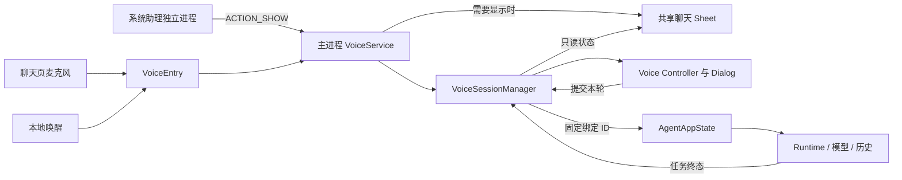
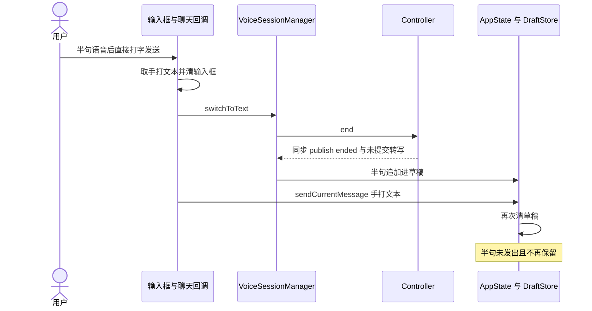

# 助手统一交互实现审查

> 本文是修复前快照；后续修复及本轮验证见[统一交互修复与回归](统一交互修复与回归.md)，保留原发现作为回归依据。

| 项目 | 内容 |
|---|---|
| 日期 / 代码 | 2026-09-23；`pr-2`，HEAD `d517a01` 加当前未提交重构 |
| 对象 / 目的 | 文字、语音、浮层的新实现；核对是否符合上一轮统一交互方案 |
| 类型 / 范围 | 功能审查；入口、会话身份、草稿、任务排队、退出、服务生命周期与现有测试 |
| 排除 | 产品修复、合并、出包、新真机或声学验收 |
| 预期基线 | [上一轮完整交互方案](../../../../voice-conversation/docs/solutions/assistant-interaction.md) |
| 实现方记录 | [本工作树的阶段 A/B 方案](../../solutions/assistant-interaction.md)；与上面的完整方案不是同一份文档 |
| 证据纪律 | 源码直接行为为事实；异步/平台后果明确给出触发条件；未以历史设备结果替代本轮验收 |

## 1. 结论先行

**方向部分符合，当前实现尚未达到预期，存在影响交付的功能缺陷。** 即使只按本工作树标记已实现的 A/B 范围，保稿、共享会话和切换也尚未闭环。

- 已取消旧助手浮层的独立消息/键盘 archive 路径，App 和 Sheet 复用聊天内容；语音字幕不再持续覆盖文字输入框。
- 已实现 App 内就地进入语音，并增加独立“停止播报”操作；最终正文过滤继续保留。
- 切历史后语音仍绑定旧会话；首次分配会话 ID 未迁移草稿；直接打字发送会再次清除刚保留的半句语音。
- 退出与 SDK 异步关闭之间仍能派发排队输入；准入拒绝会丢图片；系统助手入口还有服务超时和错误呈现路径。
- 47 项相关现有测试通过，但没有测试新 manager 与 UI/AppState 的这些整合链路。本轮没有真机验证。

| 阅读问题 | 位置 |
|---|---|
| 当前哪些地方符合方案 | 第 3 章 |
| 阻断问题与用户触发路径 | 第 7.1 节 F1–F9 |
| 为什么已有测试没挡住 | 第 8 章 |
| 对应源码 | 第 9 章 |

## 2. 术语

`conversationId` 是持久化对话身份；`voiceSessionId` 是声音连接身份；`runId` 是任务身份。`VoiceTurnCoordinator.pending` 与新增 `VoiceSessionManager.queuedTurn` 是两层独立等待状态，现有纯 Coordinator 测试只能覆盖前者。

## 3. 现状全景

| 完整方案要求 | 当前源码 | 判定 |
|---|---|---|
| App / Sheet / 语音共用对话 | 新语音提交走 AppState，两个界面复用聊天组件；切历史没有结束旧语音 | 部分符合，F2 |
| 原文字草稿保留 | 已有 ID 的稿与实时字幕分离；null→新 ID 未迁移；手动发送有清稿冲突 | 部分符合，F3/F4 |
| 自动收句、正文播报、续听 | 继续使用原 Controller / Coordinator / Dialog；只取成功终态正文 | 代码保留，声学未复测 |
| App 内语音原地开始 | 聊天页不再要求悬浮窗权限 | 符合；其他页面误判见 F7 |
| 收起、结束声音、取消任务分开 | Sheet finish 不直接取消任务；通知提供恢复/结束语音 | 部分符合；普通问答只有通知，尚无统一收起入口 |
| 独立关麦、结束语音 | 界面只有停止播报和切回文字；后者直接断开连接 | 未完整实现 |
| 文字/语音普通下一条使用同一规则 | 语音可排队；文字发送键在任务中变成停止键 | 不符合，F8 |
| 半句切文字只消费一次 | 有保留动作，但未形成单次消费边界 | 不符合，F4/F5/F9 |
| 附件保留与归属固定 | dispatch 先消费图片再准入；系统入口自动截图，完成时才取选中会话 | 不符合，F6；截图归属另见未知/差异 |
| 听写仅编辑草稿 | 旧听写控制器仍存在，生产入口未接 | 未实现 |
| 设置暂停与恢复 | 进入设置未与当前 voice 协调 | 未实现 |

## 4. 技术链路

主进程共享并不等于跨进程共享：系统 `VoiceInteractionSession` 位于 `:voice_session`，静态 Kotlin object 是进程内对象。`appVisible` 只表示有 Activity resumed，不表示当前聊天路由可见。

上图对应 F4，关键清稿顺序在同一主线程调用栈中成立，不依赖云端识别速度。

## 5. 关键规则与语义

| 规则 | 当前执行点与事实 |
|---|---|
| 语音绑定 | beginSession 获取一次当前 conversationId；后续 dispatch 使用私有保存值 |
| 排队观察 | snapshotFlow 观察当前选中 homeState.isStreaming，不是绑定会话或全局 Runtime 空闲状态 |
| 拒绝重试 | rejected 后按 600ms 定时重试，最多 3 次重试；保存的是文字 Turn，不含图片 |
| 关闭 | Controller 立即结束策略状态；Dialog 在 worker 上关闭引擎，最后 main.post onClosed |
| 草稿回收 | 每次 inactive 且 transcript 非空都 append，没有消费 ID 或状态边沿去重 |
| 自动截图 | 系统入口及通知恢复都会走 presentAssistant；截图完成后才获取当前会话 ID |
| 正文过滤 | `ok && resultKind == terminal` 才返回 result.content；没有新增供应商降级 |

## 6. 现有接口

`VoiceEntry` 汇总入口，`VoiceSessionManager` 提供 begin/end/switchToText/stopSpeaking 和状态流；`AgentAppState` 提供显式会话提交、保留语音稿、消费图片与附件加入。`ownsConversation` 已定义，但聊天底栏读取全局 voice state，未使用它过滤当前会话。

这些接口已经具备共享方向；本轮缺陷集中在身份变更、接纳前后和异步关闭边界，并非缺少另一个录音控件。

## 7. 冲突与未知项

### 7.1 代码审查发现

**F1 · P1 · 无障碍未开启时，系统助手文字入口存在前台服务超时路径。**

前提：没有正在运行的语音服务，用户从系统电源键/助手手势进入，`autoListen=false`，`AgentAccessibilityService.current()` 为 null。`VoiceEntry:28–31` 使用 startForegroundService 启动 ACTION_SHOW；`EtaAssistantVoiceService:165–169` 只打开界面后返回，既不 startForeground，也不 stopSelf。onCreate 只 attach，START_NOT_STICKY 也不结束服务。系统要求服务在数秒内转前台，否则抛 `ForegroundServiceDidNotStartInTimeException`。[Android 官方契约](https://developer.android.com/develop/background-work/services/fgs/troubleshooting#foregroundservicedidnotstartintimeexception) 这是源码与平台契约确认的崩溃路径，未在设备触发。

**F2 · P1 · 切历史/新建后，后续语音仍提交到旧会话。**

在 A 开语音，再选择 B 或新建；`AgentAppState:838–866` 只改选中状态，没有结束原 voice。manager 只在 beginSession 绑定 ID，`171–180` 的 dispatch 始终使用旧 ID；聊天底栏又显示全局语音状态。结果是用户眼前在 B，语音却继续进入 A；删除 A 后还会向不存在的会话提交。与完整方案切历史结束原声音、保留原稿的规则冲突。

**F3 · P1 · 新对话第一次开语音会使手打草稿失去当前归属。**

新建后未发消息，先打字再点语音。普通输入存在 DraftStore 的 null key；`voiceConversationId:985–989` 分配 ID 时只复制 homeState，没有迁移 TextFieldState。ChatScreen 随新 ID 读取另一份空稿。原稿滞留在 null key，当前对话无法继续编辑；下次新建还会清除它。已有会话草稿共享不能证明首轮路径通过。

**F4 · P1 · 半句语音后直接打字发送，半句被二次清稿删除。**

在无 streaming 任务时，语音存在未提交转写，用户直接在仍可编辑的输入框打字发送。InputBar `392–394` 保存手打文本并清稿；Body `949–952` 先 switchToText，触发同步 ended 将半句保存；随后 sendCurrentMessage(手打文本) 在 AppState `1104–1106` 再清相同草稿。最终发送的只有手打内容，半句也没有留下。第 4 章时序已闭合。

**F5 · P1 · 结束语音至 SDK 关闭之间，排队消息仍能自动执行。**

文字任务 T 在执行，语音 X 留在 manager.queuedTurn；用户结束语音。在 SDK onClosed 之前，T 完成或重试 timer 到期，snapshotFlow/timer 仍可 drain。`VoiceSessionManager:157–184` 没有 active/代次检查，而撤销观察与退稿直到 `260–267` 才发生。可达顺序为 `queue X → end → T terminal → dispatch X → SDK onClosed`。这违反未接纳语音退出后退草稿的规则；实际竞态频率未测。

**F6 · P1 · 语音提交被拒绝时，图片已被清除，重试只剩文字。**

A 占全局 Runtime，B 有图片并开启语音。manager `180` 先调用 consumePendingVoiceImages，AppState `1007` 清掉 pendingImages，之后 `1038–1040` 才执行全局准入并返回 rejected。queuedTurn 只存 id/text，重试与最终退稿都不包含原图。图片既没有进入已接受任务，也不在输入框。该场景未被新语音入口禁止。

**F7 · P1 · 设置/内置浏览器在前台时，唤醒不展示聊天控制。**

tracker 仅统计所有 Activity 的 resumed 数量。唤醒词在主进程经过 Entry `24–26` 原地开始；设置页并没有语音控件。系统助理在独立进程发 ACTION_SHOW 后，主进程 Service `215–216` 又因任意 Activity 在前台而跳过显示。表现为设置中唤醒开始声音却看不到字幕/切文字，系统助手入口也不会把聊天展示出来。

**F8 · P2 · 任务中语音可排下一条，文字发送仍变成停止任务。**

InputBar `386–398` 在 isStreaming 时把唯一发送按钮替换为 onStop；AppState `1061–1065` 同样拒绝该时刻的文字提交。用户可打字但不能排队；相同位置的点击会停止原任务。与完整方案普通下一条输入统一规则不符。

**F9 · P2 · 关闭期间晚到结果会把半句重复保存。**

语音任务 R 运行，另有未提交 S；结束时 manager.onState 已 append S。SDK onClosed 之前 R 的终态仍可通过 activeRunId 检查，controller.result 再 publish inactive，transcript 仍为 S；manager `242–245` 再 append 一次。缺少一次消费条件使草稿重复。纯 Coordinator 的“不再派发”测试不验证 Host 重复写稿。

### 7.2 其他差异和运行时未知

- `EtaAssistantVoiceService.dismiss` 被独立进程 VIS 调用时，仅操作该进程的 manager，没有向主进程发送结束命令；主进程声音不会被该调用结束。通知的 ACTION_END_VOICE 是另一条可用路径。这是当前函数声明与跨进程行为不符，不能据此推导所有收起动作都应结束声音。
- 系统入口自动截图并在完成时取当前选中会话，没有固定发起时的归属；普通聊天/恢复入口与完整方案的显式屏幕附件规则不同。
- 关麦、听写、设置暂停、统一收起状态入口尚未完整实现；切回文字没有主动请求输入框焦点/显示键盘。
- 真实停止尾音、双讲、正常音量可懂性、锁屏/后台启动、Back 与 IME 顺序、小屏/大字号未在本轮实测。
- 本工作树文档第 7 节说明切文字直接断连接，但 I3 仍要求不断线；说明未做独立胶囊，I6 又以胶囊为预期；这些验收描述与实现记录不一致。

## 8. 自校验与验证状态

- 实际执行 `:app:testDebugUnitTest`，限定 8 个相关测试类，**47 项通过，0 失败/错误/跳过**；Gradle BUILD SUCCESSFUL。编译依赖 `compileDebugKotlin` 为 UP-TO-DATE，未声称全量重新编译。
- 覆盖 Controller 策略、正文过滤、声学活动判定、Runtime 准入/协议、DraftStore 与 UI 枚举映射；没有新 manager / AppState / UI 切换链的集成测试。
- Robolectric 退出时出现临时字体目录清理告警；测试断言和 Gradle 结果通过，告警记录保留在日志。
- `git diff --check` 通过。本轮未修改产品代码，没有安装 APK、使用设备或释放设备。
- F1 的平台后果依据官方契约；F5/F9 的后果来自明确异步时序，尚无设备复现率。其他问题给出了直接赋值与调用顺序，不能把源码审查称为真机 FAIL。

## 9. 关键文件索引

路径相对仓库根，行号对应本轮源文件快照。

| 章节 | 文件 | 关键职责与位置 |
|---|---|---|
| 4 / F1 / F7 | `app/src/main/kotlin/io/github/mangi/eta/agent/voice/session/VoiceEntry.kt` [打开](../../../app/src/main/kotlin/io/github/mangi/eta/agent/voice/session/VoiceEntry.kt) | 23–32 系统入口及前台服务启动 |
| 4 / F1 / F7 | `app/src/main/kotlin/io/github/mangi/eta/agent/voice/EtaAssistantVoiceService.kt` [打开](../../../app/src/main/kotlin/io/github/mangi/eta/agent/voice/EtaAssistantVoiceService.kt) | 78–109 promote；164–211 截图与展示；215–216 前台短路；269–271 本地 dismiss |
| 4 / F1 | `app/src/main/kotlin/io/github/mangi/eta/agent/voice/EtaVoiceInteractionSession.kt` [打开](../../../app/src/main/kotlin/io/github/mangi/eta/agent/voice/EtaVoiceInteractionSession.kt) | 39–51 入口和关闭调用 |
| 4 / 7.2 | `app/src/main/AndroidManifest.xml` [打开](../../../app/src/main/AndroidManifest.xml) · `app/src/main/kotlin/io/github/mangi/eta/EtaApp.kt` [打开](../../../app/src/main/kotlin/io/github/mangi/eta/EtaApp.kt) | 独立进程声明 109–113；主进程初始化 50–59 |
| F2 / F5 / F6 / F9 | `app/src/main/kotlin/io/github/mangi/eta/agent/voice/session/VoiceSessionManager.kt` [打开](../../../app/src/main/kotlin/io/github/mangi/eta/agent/voice/session/VoiceSessionManager.kt) | 74–85 绑定；148–184 drain/dispatch；194–234 result；240–269 Host |
| F2 / F3 / F4 / F6 / F8 | `app/src/main/kotlin/io/github/mangi/eta/ui/app/AgentAppState.kt` [打开](../../../app/src/main/kotlin/io/github/mangi/eta/ui/app/AgentAppState.kt) | 838–866 切会话；978–1054 语音；1056–1106 文字提交 |
| F3 | `app/src/main/kotlin/io/github/mangi/eta/ui/screens/chat/AgentChatScreen.kt` [打开](../../../app/src/main/kotlin/io/github/mangi/eta/ui/screens/chat/AgentChatScreen.kt) · `app/src/main/kotlin/io/github/mangi/eta/ui/components/AgentConversationDraftStore.kt` [打开](../../../app/src/main/kotlin/io/github/mangi/eta/ui/components/AgentConversationDraftStore.kt) | composer 的会话 key 与按 key 创建草稿 |
| F2 / F4 | `app/src/main/kotlin/io/github/mangi/eta/ui/components/AgentChatBody.kt` [打开](../../../app/src/main/kotlin/io/github/mangi/eta/ui/components/AgentChatBody.kt) | 867 全局状态；949–952 切模式再发送 |
| F3 / F4 / F8 | `app/src/main/kotlin/io/github/mangi/eta/ui/components/AgentChatInputBar.kt` [打开](../../../app/src/main/kotlin/io/github/mangi/eta/ui/components/AgentChatInputBar.kt) | 142–165 本地稿；288–304 编辑；386–398 发送/停止 |
| F5 / F9 | `app/src/main/kotlin/io/github/mangi/eta/agent/voice/conversation/VoiceConversationController.kt` [打开](../../../app/src/main/kotlin/io/github/mangi/eta/agent/voice/conversation/VoiceConversationController.kt) · `app/src/main/kotlin/io/github/mangi/eta/agent/voice/conversation/VoiceTurnCoordinator.kt` [打开](../../../app/src/main/kotlin/io/github/mangi/eta/agent/voice/conversation/VoiceTurnCoordinator.kt) | Controller 107–117、146–149；Coordinator 141–144、177–189 |
| F5 / F9 | `app/src/main/kotlin/io/github/mangi/eta/agent/voice/conversation/DoubaoDialogEngine.kt` [打开](../../../app/src/main/kotlin/io/github/mangi/eta/agent/voice/conversation/DoubaoDialogEngine.kt) | 365–391 异步关闭与主线程回调 |
| F7 | `app/src/main/kotlin/io/github/mangi/eta/agent/voice/session/VoiceSurfaceTracker.kt` [打开](../../../app/src/main/kotlin/io/github/mangi/eta/agent/voice/session/VoiceSurfaceTracker.kt) · `app/src/main/kotlin/io/github/mangi/eta/ui/app/AgentAppRoot.kt` [打开](../../../app/src/main/kotlin/io/github/mangi/eta/ui/app/AgentAppRoot.kt) | resumed 计数；341–343 / 554–568 非聊天路由 |
| 3 / 7.2 | `app/src/main/kotlin/io/github/mangi/eta/ui/components/AgentVoiceStatusStrip.kt` [打开](../../../app/src/main/kotlin/io/github/mangi/eta/ui/components/AgentVoiceStatusStrip.kt) · `app/src/main/kotlin/io/github/mangi/eta/ui/AgentConversationSheetActivity.kt` [打开](../../../app/src/main/kotlin/io/github/mangi/eta/ui/AgentConversationSheetActivity.kt) | 操作、独立字幕和复用聊天窗口 |
| 3 / 5 | `app/src/main/kotlin/io/github/mangi/eta/agent/voice/conversation/VoiceReplyContent.kt` [打开](../../../app/src/main/kotlin/io/github/mangi/eta/agent/voice/conversation/VoiceReplyContent.kt) | 7–8 成功最终正文过滤 |

## 10. 关联文档与过程件

- [完整交互方案](../../../../voice-conversation/docs/solutions/assistant-interaction.md)与[本工作树实现记录](../../solutions/assistant-interaction.md)。
- [会话模块审查](../../../tmp/tasks/2026-09-23-assistant-implementation-review/session-audit.md)、[UI 与入口审查](../../../tmp/tasks/2026-09-23-assistant-implementation-review/ui-audit.md)。
- [源文件快照](../../../tmp/tasks/2026-09-23-assistant-implementation-review/source-snapshot.json)、[47 项测试结果](../../../tmp/tasks/2026-09-23-assistant-implementation-review/test-summary.json)、[执行日志](../../../tmp/tasks/2026-09-23-assistant-implementation-review/focused-tests.log)。
