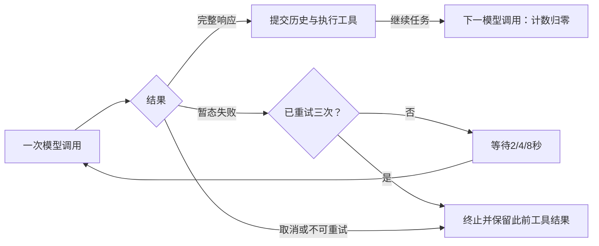

# Movo 长任务模型重试排查

| 项目 | 内容 |
| --- | --- |
| 调研对象 | 长任务进入后台后出现“模型请求暂时中断……（1/3）” |
| 调研目的 | 区分请求故障与后台生命周期，确认现有诊断能回答什么 |
| 类型 | 机制调研 |
| 范围内 | Runtime、模型重试、Responses SSE、上下文压缩、诊断字段 |
| 范围外 | 改造方案、其他 Provider 的完整协议、服务商内部实现 |
| 代码快照 | 2026-09-21 调研起点工作树；HEAD `c15de97bd30f6f5d920eb2ac945684acba691fec`。日志现状记录的是本轮诊断模块实施前的基线 |

## 1. 结论先行

当前 Agent 由 Runtime 服务执行，模型失败按**单次模型调用**重试；统一提示本身不说明根因。

- **事实：反复出现 1/3 可以属于不同模型回合。** 每次 `AgentModelRetry.complete()` 都重新计数，工具执行后的下一次模型调用也有独立预算。
- **事实：300 秒不是任务总时限。** 它是模型响应读取等待上限；连接、写入另有上限。主循环和客户端等待均没有累计任务时限。
- **事实：后台与退出 Activity 不同。** 普通 ON_STOP 没有取消任务；真正清除 ViewModel 后，请求协程中断会发送取消。前台服务存在不等于已经证明所有后台条件下都能持续联网。
- **事实：原 Release 缺少定位所需的时序。** 请求开始、响应头、首增量等 DEBUG 被裁剪；摘要子请求还吞掉运行事件，重试原因无法与完整请求过程关联。
- **未知：用户这次故障根因尚未确认。** 源码存在可区分的网络、服务端、协议与电源条件，当前没有这次故障的运行时证据，不能认定是超时或厂商后台限制。

## 2. 技术链路

用户已配置 Responses 模型，因此主链追到 `OpenAiResponsesProvider`。Chat Completions 和 Anthropic 共用 HTTP 客户端、重试器，本次未逐事件展开其解析分支。

```mermaid
sequenceDiagram
    participant UI as Activity / ViewModel
    participant RT as Runtime
    participant FGS as 前台执行服务
    participant Loop as Agent Loop
    participant P as Responses Provider
    participant API as 外部模型服务
    UI->>RT: MSG_START_RUN(runId, config, history)
    RT->>FGS: acquire run lease
    RT->>Loop: 工作线程执行
    loop 模型与完整工具批次
        Loop->>Loop: 检查上下文预算 / 条件压缩
        Loop->>P: complete(request)
        P->>API: POST + SSE
        API-->>P: 响应头 / 增量 / 终态或故障
        alt 可重试且未启动托管工具
            P-->>Loop: 分类错误
            Loop-->>UI: 重试事件
        else 完整响应
            P-->>Loop: assistant 结果
            Loop->>Loop: 提交历史并执行本地工具
        end
    end
    Loop-->>RT: 终态结果
    RT-->>UI: 结果与恢复记录
    RT->>FGS: release run lease
```

`AgentAppState` 通过 `runInterruptible` 调用 `AgentRuntimeClient.run()`。后者等待终态没有 timeout；Binder 死亡会唤醒并返回连接断开，绑定握手的 8 秒上限不是模型调用时限。

`AgentRuntimeService.startRun()` 持有 `AgentExecutionService` 的 `run:<runId>` lease。Manifest 中 UI 与这两个服务都处于默认应用进程；执行服务使用 `specialUse` 前台类型，任务结束后释放引用。`onUnbind()` 不取消，服务销毁或停止操作会取消任务。`START_NOT_STICKY` 不会在进程重启后自动重放旧任务。Root 入口的 `allowBoundFallback` 保留前台服务启动受限时的绑定运行路径。

`AgentLoop` 在模型完整响应后才提交 assistant 历史和执行本地工具，因此请求重试保留之前成功的工具结果，不重跑失败尝试尚未提交的本地工具。若已收到托管工具开始事件，重试被禁止。

## 3. 关键规则与语义

### 3.1 请求等待与反复 1/3

| 条件 | 当前行为 | 执行点 |
| --- | --- | --- |
| 连接 / 写入 / 读取等待 | 15 秒 / 30 秒 / 300 秒；没有显式 `callTimeout` | `AgentHttpClient` |
| 累计任务时长、工具轮数 | 没有本地总时限或最大轮数 | `AgentLoop.run`、`AgentRuntimeClient.run` |
| 可重试失败 | 追加最多 3 次请求，等待 2 / 4 / 8 秒 | `AgentModelRetry.complete` |
| 新模型调用 | 重试计数归零；重试本身也会递增展示 round | 同上 |
| 认证、额度、证书、格式错误 | 不按暂态请求失败重试 | `AgentModelFailure` |
| 取消、线程中断、事件回调失败 | 不重试 | `AgentModelRetry.complete` |

`MODEL_TIMEOUT` 合并了连接/写入/读取阶段的 `InterruptedIOException`，不能仅凭此码断定等待响应五分钟。读取超时关注新数据等待，连续有字节的响应可能持续更久。模型客户端关闭了底层连接自动重试，显式重试统一由 Agent 执行。



### 3.2 Responses 的 DONE 分支

Responses 每轮发送完整 `input`，固定 `stream=true`、`store=false`，移除 `previous_response_id`；代码没有跨轮服务端 response 会话的过期计时器。

`readStreamingResponse()` 只把 `response.completed`、`response.incomplete`、`response.failed` 识别为终态，收到后停止读取。字面 `[DONE]` 被忽略：**如果兼容接口仅返回 DONE 而不关闭连接且没有新数据，会继续等待读取超时；如果关闭连接，则因缺少合法终态报 `STREAM_INCOMPLETE`。** 这是已确认代码条件，尚未证明实际 Ark 请求出现过该响应。

### 3.3 长任务上下文

有效 `contextWindow` 的估算占用达到 85% 时触发预压缩；配置缺省时没有该自动阈值。usage 校准的是本轮输入估算，不是累计计费 token。明确的 `CONTEXT_OVERFLOW` 最多触发三次强制压缩恢复，它本身不走统一 2/4/8 秒提示。

`AgentContextCompactor.summarize()` 另发无工具的模型请求，并使用同一重试器，但 `onEvent` 和 `onProviderEvent` 都为空；原运行日志只知道外层压缩开始、结束或失败。模型上下文缩小后，完整 transcript、归档事件、恢复事件仍继续累积，当前调研没有其导致本次故障的内存证据。

### 3.4 后台与 finish

`AgentAppRoot` 的 ON_RESUME 和窗口焦点恢复会读取运行结果；ON_STOP 没有取消分支。`AgentAppViewModel` 使用 `viewModelScope`；scope 真正取消时，`runInterruptible` 的中断进入客户端取消分支。栈底 `popRoute()` 明确调用 `Activity.finish()`，所以“按 Home 切后台”与“结束 Activity”不能作为同一个复现动作。

Manifest 没有 `WAKE_LOCK` 权限，运行链路没有持有 WakeLock；电池优化豁免只在权限页面读取并引导到系统设置。现有实现没有把屏幕、idle、网络状态与每次失败同时记录，设备是否真的受到省电限制仍未知。

## 4. 日志盲区与真机观察边界

### 4.1 调研基线已确认的盲区

`AgentRunTiming` 已有准备、请求开始、响应头和首增量耗时，但全部走 DEBUG；R8 删除这些调用。原 Release 的重试 WARN 只保留 `round/attempt/delay/code`，没有 runId 或独立请求标识。最终异常只取一层 cause；重试耗尽再次包装 `AgentModelFailure` 后，底层 SocketTimeout/EOF 类型可能不可见。摘要子请求的事件缺失见 §3.3。

### 4.2 未知项与对应观察值

下表是确认因果所缺的运行时事实，不是已查明的故障结论。

| 待区分问题 | 真机观察值 | 原有可见性 |
| --- | --- | --- |
| 哪个任务、主调用还是摘要 | runId、请求标识、purpose、模型/协议、轮次与重试序号 | 对象中已有部分值，日志未完整关联 |
| 卡在连接、首包还是流中途 | 请求开始、响应头、首字节/首增量、最后字节和最后事件时间、失败阶段 | DEBUG 时序不完整，Release 被裁剪 |
| 服务端限流/网关错误 | HTTP status、受控错误 code/type、服务商 request ID、Retry-After | status/code 部分可见，响应头未保留 |
| Responses 缺终态 | 最后 SSE 事件类型、是否有合法终态、EOF/异常类型 | 解析器可判断，诊断中未保存过程 |
| 后台环境发生变化 | Home/finish 动作、前后台、FGS 状态、interactive、idle、电池优化、网络变化、进程是否重建 | 没有失败瞬间关联记录 |
| 上下文或资源压力 | 输入估算/usage、窗口、摘要开始与结果、工具耗时、内存变化 | usage/摘要事件部分存在，资源因果未确认 |

**推断，未证实：**模型请求共用连接池，底层自动恢复关闭；长工具间隔后失效的空闲连接是候选之一。输入变大可能改变服务端耗时，后台电源状态可能改变网络可用性，完整历史累积也可能增加内存压力。它们均缺少实际失败时刻证据，不能作为本次根因。

## 5. 自校验与验证状态

已回读主链、失败分类、Manifest、R8 规则、上下文与客户端取消分支，并对照现有重试测试所表达的契约。该调研没有运行单测、编译、模型 API 或真机复现；没有证明新日志模块已完成，也没有判定用户故障已修复。服务商内部超时、限流配置及原始失败请求仍在代码证据边界之外。

## 6. 关键文件索引

| 章节 | 文件 | 关键符号 / 职责 |
| --- | --- | --- |
| 2、3.4 | `app/src/main/AndroidManifest.xml` | 进程、权限、服务类型 |
| 2、3.4 | `app/src/main/kotlin/io/github/fartown/movo/ui/app/AgentAppState.kt` | preparationJob、runInterruptible |
| 3.4 | `app/src/main/kotlin/io/github/fartown/movo/ui/app/AgentAppViewModel.kt` | viewModelScope |
| 3.4 | `app/src/main/kotlin/io/github/fartown/movo/ui/app/AgentAppRoot.kt` | ON_RESUME、window focus、popRoute |
| 2、3.1 | `app/src/main/kotlin/io/github/fartown/movo/agent/runtime/AgentRuntimeClient.kt` | run、attachRun、取消与等待 |
| 2 | `app/src/main/kotlin/io/github/fartown/movo/agent/runtime/AgentRuntimeConnection.kt` | acquire、共享绑定与 idle unbind |
| 2、3.4 | `app/src/main/kotlin/io/github/fartown/movo/agent/runtime/AgentRuntimeService.kt` | startRun、onUnbind、onDestroy |
| 2、3.4 | `app/src/main/kotlin/io/github/fartown/movo/agent/runtime/AgentExecutionService.kt` | acquire、前台服务、停止 |
| 2 | `app/src/main/kotlin/io/github/fartown/movo/agent/runtime/ExecutionLeaseRegistry.kt` | 任务引用与服务归属 |
| 2、4 | `app/src/main/kotlin/io/github/fartown/movo/agent/runtime/AgentRuntimeRunExecutor.kt` | execute、acceptEvent、错误记录 |
| 2 | `app/src/main/kotlin/io/github/fartown/movo/agent/model/AgentModelClient.kt` | complete、构建并进入 loop |
| 2、3 | `app/src/main/kotlin/io/github/fartown/movo/agent/model/AgentLoop.kt` | 主循环、工具与上下文恢复 |
| 3.1 | `app/src/main/kotlin/io/github/fartown/movo/agent/model/AgentModelRetry.kt` | 每请求重试预算与终止条件 |
| 3.1 | `app/src/main/kotlin/io/github/fartown/movo/agent/model/AgentModelFailure.kt` | HTTP、流、连接错误分类 |
| 3.1、4 | `app/src/main/kotlin/io/github/fartown/movo/agent/model/AgentHttpClient.kt` | timeout、连接池与自动重试 |
| 3.2 | `app/src/main/kotlin/io/github/fartown/movo/agent/model/OpenAiResponsesProvider.kt` | complete、readStreamingResponse |
| 3.2 | `app/src/main/kotlin/io/github/fartown/movo/agent/model/ProviderSseReader.kt` | SSE 分帧与读取 |
| 3.2 | `app/src/main/kotlin/io/github/fartown/movo/agent/model/ResponsesRequestBuilder.kt` | store/input/previous_response_id |
| 3.3 | `app/src/main/kotlin/io/github/fartown/movo/agent/model/AgentContextSession.kt` | 压缩触发与失败处理 |
| 3.3 | `app/src/main/kotlin/io/github/fartown/movo/agent/model/AgentContextBudget.kt` | 85% 阈值与 usage 校准 |
| 3.3、4 | `app/src/main/kotlin/io/github/fartown/movo/agent/model/AgentContextCompactor.kt` | summarize 与空事件回调 |
| 4 | `app/src/main/kotlin/io/github/fartown/movo/agent/runtime/AgentRunTiming.kt` | 请求时间边界 |
| 4 | `app/src/main/kotlin/io/github/fartown/movo/agent/runtime/AgentEvent.kt` | 重试展示与受控日志字段 |
| 4 | `app/src/main/kotlin/io/github/fartown/movo/core/AgentLogger.kt` | 日志级别 API |
| 4 | `app/proguard-rules.pro` | Release DEBUG 删除规则 |
| 5 | `app/src/test/kotlin/io/github/fartown/movo/agent/model/AgentModelRetryTest.kt` | 预算、取消、托管工具、错误分类契约 |

## 7. 关联文档与过程件

- [本轮新增运行日志的使用方法与受控真机诊断示例](../../DIAGNOSTICS.md)；本调研保留实施前基线，后续验证不改变“原始根因尚未确认”的结论。
- [Agent Runtime 架构与行为](../../AGENT_RUNTIME.md)
- [设备支持与权限边界](../../ROOTLESS_SUPPORT.md)
- [仓库画像](../../../tmp/tasks/2026-09-21-memory-diagnostics/research/repo-profile.md)
- [逐跳追踪](../../../tmp/tasks/2026-09-21-memory-diagnostics/research/trace-log.md)
- [未知项与观察值](../../../tmp/tasks/2026-09-21-memory-diagnostics/research/open-questions.md)
