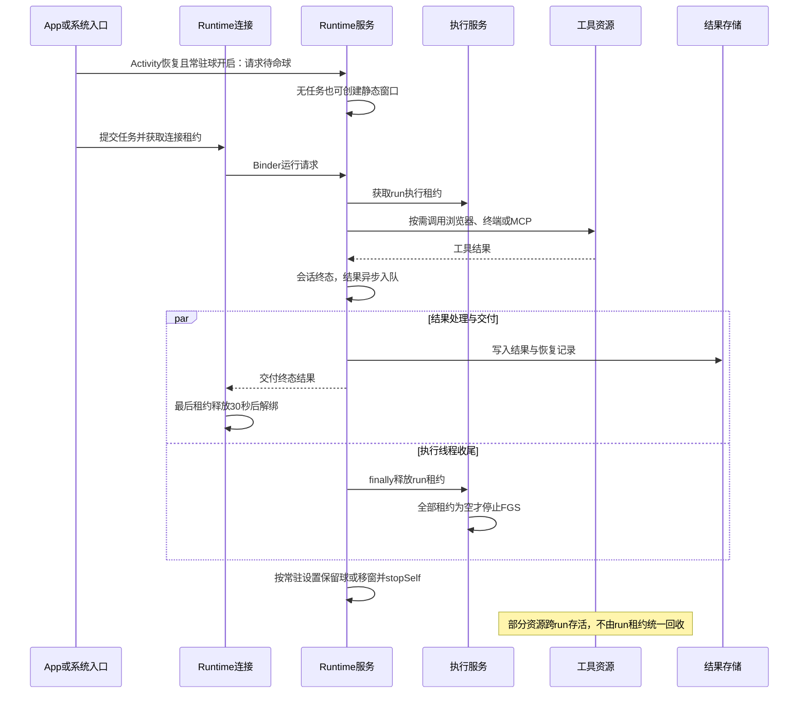

# Movo 后台空闲资源与功耗调研

| 项目 | 内容 |
| --- | --- |
| 日期 / 快照 | 2026-09-27；主审基线 `30daf0e3231b62d0fbb5dc1d7e247740f688dce8`；完成时已核对增量至 `30b8ddf23f8bddd55889049e7a016d28866f5be2` |
| 对象与目的 | 机制型调研：查清 Movo 无任务、退后台后仍存活和仍工作的资源，为降低功耗提供依据 |
| 范围内 | 执行服务、浮窗、语音、浏览器、终端、网络、界面刷新、系统事件与 Hook |
| 范围外 | 本轮不修改产品；不将旧云机估算值作为当前电流或省电百分比；优化设计另见配套方案 |
| 证据 | 当前源码与测试文件静态检查、Android 官方文档；未做当前版本的受控真机功耗测试 |

## 1. 结论先行

Movo 已有任务结束释放执行服务和息屏停止唤醒录音的机制，但“Agent 没有任务”并不保证浏览器、终端、语音和界面刷新都空闲。

1. **确定存在显式生命周期控制的缺口，但不是已确认耗电根因**：共享 WebView 用过后会保留，退页只 detach，未接入空闲暂停；浏览器预览和诊断页刷新没有明确的 Activity 后台门控。它们仅在对应界面/卡片仍处于组合中时运行，源码不能证明每台设备实际在后台持续运行多久或耗电多少。
2. **终端有独立后台语义**：普通用户身份的 shell / PTY 会话即使等待输入也持有前台执行租约；用户启动的 daemon、Kimi Web 能跨 Agent 任务存活。没有输出不代表没有工作。
3. **语音已有关键节能措施**：唤醒默认关闭、范围默认 `AppOpen`；开启后息屏会暂停引擎并释放录音。选择 `ScreenOn` 后，亮屏使用其他 App 时仍会收音和推理；屏灭暂停后唤醒服务本身仍可保留。
4. **没有发现通用“空闲心跳”**：MCP 按任务关闭；模型连接池短暂保留连接不等于持续发请求；执行服务租约清空后停止；默认常驻球是静态绘制，没有待命旋转动画。无障碍的昂贵滚动节点解析也已有观察窗口门控。
5. **最大未知是实际配置和功耗归因**：当前版本无受控放电、CPU 调度或唤醒锁采样。只有读取进程数量、服务数量、内存占用，无法排出真实耗电名次。

| 关心的问题 | 阅读位置 |
| --- | --- |
| 哪些东西无任务仍工作 | 第 2、4 章 |
| 服务和麦克风有没有释放 | 第 3 章 |
| 哪些说法不能当根因 | 第 5、6 章 |
| 如何修改和验证 | [Movo 后台空闲低功耗方案](../../solutions/background-power/movo-后台空闲低功耗方案.md) |

## 2. 现状全景

应用为 Kotlin / Compose 单模块 Android 工程，minSdk 34、targetSdk 36。UI、Runtime、执行服务等在主进程；系统语音相关独立进程通过 `AppProcessPolicy` 跳过完整主进程初始化。Xposed Hook 运行于目标系统进程，Linux 子进程与 WebView renderer 也有独立资源成本。

| 资源 | 默认或触发条件 | 无 Agent 任务时 | 证据判断 |
| --- | --- | --- | --- |
| Runtime 待命球 | `keepOrbAfterExit=true`，主 Activity 恢复时请求 | 保留服务、窗口和事件订阅；App 前台隐藏；待命绘制静态 | 已确认；不能据此量化耗电 |
| 执行 FGS | run、prepare、终端、登录等获取租约 | 仅所有租约清空才停止；空 user shell 也可保留租约 | 已确认 |
| 唤醒录音 | 默认关；开启后默认仅 App 可见 | `ScreenOn` 允许亮屏跨 App 监听；所有范围息屏暂停录音 | 已确认 |
| 活跃语音会话 | 用户或唤醒触发 | 无 Agent run 仍可能录音、播放、每秒检查；真正闲置 45 秒结束 | 已确认；区别于普通待机 |
| 共享 WebView | 用过浏览器工具或内置浏览器 | 留存页面；缺少自动 pause / destroy | 已确认缺口；网页实际活动待测 |
| shell / PTY | 用户创建 | 会话与进程保留；reader 阻塞等待；子命令可继续 | 已确认 |
| daemon / Kimi Web | 显式启动 | 有意跨 run 存活；重认领 user daemon 后 2 秒检查进程 | 已确认，属于独立作业 |
| MCP / 模型网络 | run 或设置页刷新 | MCP close；模型池最多 5 个空闲连接、30 秒保留 | 未见独立周期请求 |
| 页面刷新 | 相关 Composable 仍在组合中 | 缺少明确 STARTED / 可见性门控；系统实际调度待测 | 已确认代码边界 |
| 通知历史 | 用户授予通知访问 | 每条有效通知事务写入并清理旧记录；无周期清理线程 | 事件驱动 |
| 无障碍 | 用户开启 | 收事件和更新轻量信号；仅主动滚动观察窗口内解析 source | 已有昂贵操作门控 |
| 热词自愈 Hook | 默认关，用户显式开启 | 息屏后最多三次恢复 Google 软件热词 | 开销可能落在其他 UID |

## 3. 技术链路

### 3.1 任务执行与无任务待命

`AgentRuntimeConnection` 以 `BIND_AUTO_CREATE | BIND_IMPORTANT | BIND_INCLUDE_CAPABILITIES` 绑定。其 30 秒是一次性延迟解绑，不是周期轮询。`AgentRuntimeService` 同时可被 `startService` 启动，解绑本身不解除 started 状态；Runtime 和 ExecutionService 均为 `START_NOT_STICKY`。这种 started / bound 区别也与 [Android Service 生命周期](https://developer.android.com/develop/background-work/services)一致。

`AgentExecutionService.refreshNotification()` 在租约全空时调用 `stopForeground(REMOVE)` 和 `stopSelf()`。因此“没有 Agent 任务却有执行通知”还须检查终端、OAuth、安装准备等租约，不能直接判为 run 泄漏。

暂停会话仍有 `activeSession`。网络等待、用户补充、后台命令没有输出，也不自动结束任务。结果写入/交付期间与已经落盘但用户未查看，是不同状态。

### 3.2 语音监听与释放

`MovoWakeWordController` 根据开关和权限同步服务；`MovoWakeWordService` 收到屏幕/可见性变化后调用 `applyCapture()`。`MovoMicSessionCoordinator.mayCaptureWake()` 同时要求亮屏、监听范围允许和会话状态允许。

条件失效 → `SherpaWakeEngine.pause()` → 停止录音 → `listen()` 的 finally 释放 `AudioRecord` → 工作线程在条件变量等待。能量门仅在正在录音时减少模型推理，并不让麦克风停止。服务仍可处于 `START_STICKY` 前台状态并等待恢复条件。

历史语音功耗报告记录过录音关联的 `AudioIn` 唤醒锁以及息屏释放后的改善，但其包版本、云设备和测量条件不同，不能给本次当前版本赋予相同数值。

### 3.3 网页、终端与系统事件

`AgentBrowserSession.ensureWebView()` 懒建共享 WebView 并启用 JavaScript。页面退出 `detachFrom()` 只移出 View 层级；取消动作 `stopLoading()` 不销毁现有页面。销毁在用户 reset 链路，且该 reset 同时清 Cookie / WebStorage。未发现后台或 run 结束自动暂停接点。

`TerminalSessionHost` 是 App 级 Store。user 身份创建 shell / PTY 时获取 `TerminalSessionLease`，会话结束才释放；root 身份对应路径不取得这一 UI 租约。空 reader 是阻塞等待；执行命令的 50ms marker 检查是另一条仅命令期间的循环。`DetachedTaskSupervisor` 管理显式后台任务，其跨 run 存活是现有功能。

无障碍 `observeScrollEvent()` 先经过 `ScrollEventObservationGate.withMatchingObservation()`，异步线程再次校验观察有效后才取 source；观察在主动滚动动作开始、finally 结束。普通无任务滚动不会进入节点解析。通知历史则在每次有效通知回调执行一次事务及两类清理，不依赖 run。

## 4. 关键规则与频率

| 行为 | 频率 / 默认值 | 边界 |
| --- | --- | --- |
| Runtime 最后连接解绑 | 一次性 30 秒 | 与 started 服务停服不同 |
| 常驻球 | 默认开；待命 `animated=false` | 没有 Runtime 自身的息屏暂停接点；不能推导息屏仍绘制 |
| 输入卡 IME 跟踪 | 60ms | 仅可输入/有焦点时；待命球不启动它 |
| 浏览器预览截图 | 加载中 1.2s，稳定后 4s | Composition 销毁取消；后台可见性没有明确条件 |
| RunStallNotice | 1s | 调用方仅在 `isStreaming && !runPaused` 时插入；不能列为无任务空闲轮询 |
| 诊断列表 | 1s | 对应界面仍在组合中时；后台实际调度待测 |
| shell marker 等待 | 50ms | 命令结束、超时、关闭时结束；不是空 shell 心跳 |
| daemon 重新认领探测 | 2s | 已有 user 后台任务恢复后 |
| Kimi Web 启动探测 | 500ms，最多 30 次 | 只在等待启动 URL |
| ASR WebSocket ping | 15s | 语音会话连接期间；stop / final 关闭 |
| 唤醒音频分块 | 16kHz，100ms PCM | 正在监听时；息屏暂停 |
| 通知历史 | 事件触发，最多 1000 条 | 每条有效通知均执行写入与清理 |

本次源码未发现应用显式 `PowerManager.WakeLock`、传感器订阅或用于空闲保活的周期 WorkManager / AlarmManager 任务。权限声明不等于资源实际使用；系统和 SDK 也可能代持唤醒锁。前台服务与 CPU 唤醒锁是不同机制，见 [Android 保持设备唤醒说明](https://developer.android.com/develop/background-work/background-tasks/awake)。

## 5. 面向后续方案的现状接口

- `ExecutionLeaseRegistry` 已有所有者、准备与运行计数、停止回调和失败回退规则，现有任务资源归属集中于此；浏览器、独立唤醒及跨进程资源不全包含在此注册表。
- `VoiceSurfaceTracker` 已汇总 App / 语音表面可见性；`MovoMicSessionCoordinator` 已表达屏幕与监听范围条件。
- `AgentBrowserSession` 已有串行操作锁、operation epoch、用户接管标志、快照及明确关闭函数；现有 reset 具有清用户数据副作用，不能当作无副作用的资源挂起接口。
- `TerminalSessionLease`、Store close、`DetachedTaskSupervisor.stop` 已有显式资源关闭入口；没有输出并非这些入口的安全触发条件。
- `MemoryDiagnostics` / `DiagnosticsEnvironment` 已记录服务、屏幕和运行事件，但没有统一的空闲资源账本和当前版本低功耗验收数据。

## 6. 冲突与未知项

- `BrowserPagePreview` 注释称“不做后台轮询”，实际是依赖 Composition 销毁取消；Activity 退后台不等于组合销毁。实际是否继续截图以及节流程度尚未采样。
- 复核纠正：`RunStallNotice` 内部没有 run 条件，但调用方 `AgentChatBody` 已通过 `isStreaming && !runPaused` 限制插入。此前将它归为无任务轮询遗漏了调用方条件，现已排除；其后台显示生命周期问题只属于执行期间。
- 当前设备是否开启 `ScreenOn`、热词自愈、保活白名单，是否有 Linux 作业，未知。默认值不是用户设备配置。
- 9 月 23 日旧报告的麦克风方向有现代码支持，但“旧测试没有其他后台耗电”不覆盖当前所有可选能力。其 `battery unplug` 是统计模拟，不等于云机物理断电；云机息屏也未形成真实夜间休眠对照。
- 本机 ADB 列出三台网络设备；质疑复核阶段只读查询了型号、系统、供电、安装版本与 PID。三台均 Android 15、交流供电且满电；两台装有 Movo 3.0.9，无法仅凭版本号确认与当前源码相符。未确认专用测试归属或真实放电条件，没有改设备状态或进行受控功耗测量。
- Native/Linux、WebView renderer、system_server / Google 的功耗不能仅由 Movo UID 数据排除。权限、硬件低功耗热词和 OEM 调度需要目标机证据。

## 7. 自校验与验证状态

- 已完成三个独立模块审计，并抽读服务收尾、WebView、界面轮询、音频释放、通知事务、无障碍门控等主干代码。纠正了“所有滚动事件都会取 source”的初步判断。
- 用户质疑后追加调用方反证核查，纠正 `RunStallNotice` 的空闲归类；文档结构校验不能替代这类语义检查，更不能代替真机功耗测量。
- 已检索现有 `ExecutionLeaseRegistryTest`、`MovoMicSessionCoordinatorTest`、`WakeEnergyGateTest`、`ScrollEventObservationGateTest` 等测试；本次未执行 Gradle 或新增产品测试。
- 已实时核对 Android 官方 Service、Doze、WebView、Lifecycle、功耗分析文档；本轮仅新增调研和方案文档。
- Markdown 结构及文件索引校验通过（1 个 Mermaid 图；修正调用方后索引为 33 个源码文件），本地文档链接存在；记录见过程目录 `validation.txt`。运行时功耗、功能回归和节电比例均未验证。
- 审阅期间其他工作将 HEAD 推进到 `30b8ddf`；已检查三次 UI 绘制/动画提交，未改变本报告涉及的后台资源生命周期和浏览器预览循环。增量记录见 `concurrent-changes.md`。

## 8. 关键文件索引

路径相对仓库根目录；更详细行号与调用链见过程件。

| 章节 | 文件 | 关键符号 / 职责 |
| --- | --- | --- |
| 2、3 | `app/src/main/AndroidManifest.xml` | 进程、服务和权限 |
| 2 | `app/src/main/kotlin/io/github/fartown/movo/MovoApp.kt` | 主进程初始化 |
| 2 | `app/src/main/kotlin/io/github/fartown/movo/AppProcessPolicy.kt` | 初始化进程过滤 |
| 3、4 | `app/src/main/kotlin/io/github/fartown/movo/agent/runtime/AgentRuntimeService.kt` | 待命、执行与窗口生命周期 |
| 3、4 | `app/src/main/kotlin/io/github/fartown/movo/agent/runtime/AgentRuntimeConnection.kt` | Binder 租约及延迟解绑 |
| 3、5 | `app/src/main/kotlin/io/github/fartown/movo/agent/runtime/AgentExecutionService.kt` | 执行 FGS 收尾 |
| 3、5 | `app/src/main/kotlin/io/github/fartown/movo/agent/runtime/ExecutionLeaseRegistry.kt` | 执行租约所有权 |
| 2、4 | `app/src/main/kotlin/io/github/fartown/movo/agent/overlay/OrbPrefs.kt` | 常驻球默认值 |
| 2、4 | `app/src/main/kotlin/io/github/fartown/movo/agent/overlay/AgentOverlayContent.kt` | 待命静态球 |
| 3、4 | `app/src/main/kotlin/io/github/fartown/movo/agent/voice/MovoWakeWordService.kt` | 屏幕 / 可见性响应 |
| 3、5 | `app/src/main/kotlin/io/github/fartown/movo/agent/voice/MovoMicSessionCoordinator.kt` | 录音资格门控 |
| 3 | `app/src/main/kotlin/io/github/fartown/movo/agent/voice/wake/SherpaWakeEngine.kt` | AudioRecord 释放与线程等待 |
| 2 | `app/src/main/kotlin/io/github/fartown/movo/data/model/VoiceSettings.kt` | 唤醒默认配置 |
| 2、4 | `app/src/main/kotlin/io/github/fartown/movo/agent/voice/asr/DoubaoBidirectionalAsrEngine.kt` | ASR WebSocket 生命周期 |
| 3、5 | `app/src/main/kotlin/io/github/fartown/movo/agent/browser/AgentBrowserSession.kt` | 共享 WebView |
| 4、6 | `app/src/main/kotlin/io/github/fartown/movo/ui/components/ChatMessageItem.kt` | BrowserPagePreview |
| 4 | `app/src/main/kotlin/io/github/fartown/movo/ui/components/RunStallNotice.kt` | 无输出提示轮询 |
| 4、6、7 | `app/src/main/kotlin/io/github/fartown/movo/ui/components/AgentChatBody.kt` | RunStallNotice 仅流式且未暂停时插入 |
| 4 | `app/src/main/kotlin/io/github/fartown/movo/ui/screens/diagnostics/DiagnosticsData.kt` | 日志快照轮询 |
| 2、3 | `app/src/main/kotlin/io/github/fartown/movo/ui/app/AgentAppRoot.kt` | Activity 生命周期响应 |
| 3、5 | `app/src/main/kotlin/io/github/fartown/movo/ui/app/TerminalSessionHost.kt` | 常驻 Store / TerminalSessionLease |
| 3 | `app/src/main/kotlin/io/github/fartown/movo/ui/app/UserTerminalStore.kt` | shell 会话资源 |
| 3 | `app/src/main/kotlin/io/github/fartown/movo/ui/app/ConsoleStore.kt` | PTY 会话资源 |
| 3、4 | `app/src/main/kotlin/io/github/fartown/movo/agent/terminal/DetachedTaskSupervisor.kt` | 独立后台任务 |
| 4 | `app/src/main/kotlin/io/github/fartown/movo/agent/terminal/UserTerminalController.kt` | 阻塞读取与命令 marker |
| 4 | `app/src/main/kotlin/io/github/fartown/movo/ui/app/KimiWebSession.kt` | Kimi Web 启动 |
| 2 | `app/src/main/kotlin/io/github/fartown/movo/agent/mcp/McpRunContext.kt` | 按 run 关闭 MCP |
| 2、4 | `app/src/main/kotlin/io/github/fartown/movo/agent/model/AgentHttpClient.kt` | 共享 HTTP 连接池 |
| 3、5 | `app/src/main/kotlin/io/github/fartown/movo/agent/accessibility/AgentAccessibilityService.kt` | 事件轻量处理与滚动观察 |
| 3、7 | `app/src/main/kotlin/io/github/fartown/movo/agent/accessibility/ScrollEventObservationGate.kt` | source 解析前门控 |
| 3、4 | `app/src/main/kotlin/io/github/fartown/movo/data/repository/NotificationHistoryRepository.kt` | 通知事务与清理 |
| 2、6 | `app/src/main/kotlin/io/github/fartown/movo/hook/system/HotwordSelfHealHooks.kt` | Google 热词自愈 |
| 5 | `app/src/main/kotlin/io/github/fartown/movo/diagnostics/MemoryDiagnostics.kt` | 已有观测设施 |

## 9. 关联文档与过程件

- [后台空闲低功耗方案](../../solutions/background-power/movo-后台空闲低功耗方案.md)。
- [历史唤醒词功耗调研与验证](../voice-wake-power/唤醒功耗调研与验证.md)：历史证据，不是当前复测。
- 过程目录：`tmp/tasks/2026-09-27-background-power/`，含 `repo-profile.md`、`trace-log.md`、`open-questions.md`、三个模块审计、`adb-devices.txt` 和文档校验记录。
- [Android Doze 与 App Standby](https://developer.android.com/training/monitoring-device-state/doze-standby)、[WebView 生命周期 API](https://developer.android.com/reference/android/webkit/WebView)、[Lifecycle](https://developer.android.com/topic/libraries/architecture/lifecycle)。
- [Power Profiler](https://developer.android.com/studio/profile/power-profiler)、[Batterystats / Battery Historian 现状](https://developer.android.com/topic/performance/power/setup-battery-historian)。
