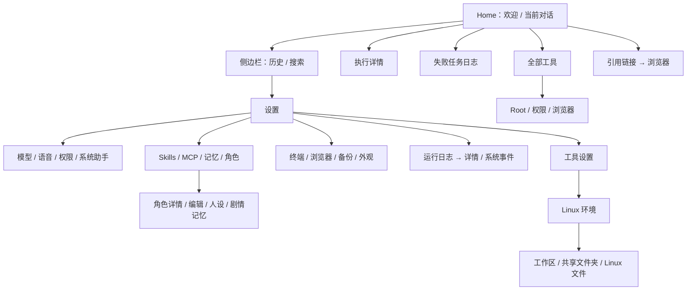

# Movo 交互实现与 Figma 设计覆盖审计

| 项目 | 审计基线 |
|---|---|
| 对象与目的 | 以当前可达 App 交互为基准，识别 Figma 缺少的页面、状态、业务规则和规范同步问题 |
| 时间 | 2026-09-26 |
| 代码 | 工作树 HEAD `79416aae1e27ae3b1fa076aa303d39d10cd8b939`；包含已有 `AgentToolsScreen.kt` 未提交修改 |
| Figma | [原文件](https://www.figma.com/design/RDCD9OcgkFDkD45kyxtIoM) 的「定稿 · 设计稿」与「设计规范 v1」，本次实时读取 |
| 文字规范 | 当前 `docs/DESIGN_SYSTEM.md`，共 950 行 |
| 范围 | 导航、对话、执行、语音、外部浮层、配置管理、扩展工具与全局交互规则 |
| 边界 | 源码可达性与设计资产覆盖审计；没有运行真机，不作像素一致性或运行成功结论；「废弃」与「探索 · 启动对话 V2」不作为定稿要求 |

## 1. 结论先行

**Figma 已较完整地覆盖对话与执行主流程，但尚未覆盖整个 App。主要缺口是设置入口之后的业务页面、复杂编辑和异步状态，以及代码新增行为的规范同步。**

1. `AppRoute` 有 33 个变体，其中 `Chat` 是旧导航栈兼容入口，实际立即回到 Home；其余 32 类导航目标中，7 类有专属主要画面，Tools 只有局部弹窗示例，24 类没有对应的独立定稿页面。此计数只衡量路由级画面覆盖，不代表整个产品的交互覆盖率。
2. 缺页集中在模型与登录、语音配置、权限、Skills/MCP、记忆与角色、浏览器、终端与文件、备份及外观。Figma 设置页中有它们的入口，入口行不能代表内部流程。
3. 模型/思考菜单、上下文用量、附件、排队、消息编辑等已经有部分文字规范，主要缺可核对的状态画板，不能笼统说完全没有规范。
4. 表单组件状态、业务异步流程、恢复与中断、跨页面返回优先级、不同窗口与长内容适配，没有形成覆盖当前实现的完整规范。
5. Figma 同一规范页已出现相互冲突的描述；同时，Markdown 近期新增规则尚未全部同步到 Figma。另有少量代码与已有规范不符，必须单独归类。

| 想确认的问题 | 位置 |
|---|---|
| 哪些已经有设计，不应重做 | 第 2 章 |
| 具体缺哪些页面和交互状态 | 第 3 章 |
| 少了哪些可复用规范 | 第 4 章 |
| 哪些是旧稿冲突或实现偏差 | 第 5 章 |
| 源码及 Figma 的定位入口 | 第 7、8 章 |

## 2. 现状全景

### 2.1 已覆盖的主要流程

| 流程 | Figma 当前已有内容 | 结论 |
|---|---|---|
| 首页与对话 | 01 首页、03 标注、04 回答完成、消息操作与推荐追问 | 有主画面 |
| 任务执行 | 05 执行中、06 跨 App、07 展开悬浮球、10 补充、13 外部语音、15 主按钮状态机、20/21 执行详情 | 主流程和重要状态已有 |
| 语音 | 08 听写、09 语音对话及状态板、11/12 执行中语音、14 多行 | 不缺整套语音交互；设置业务与异常组合另论 |
| 历史与侧边栏 | 16/17，包含搜索、无结果、空态、长按菜单 | 不属于缺页 |
| 设置与工具开关 | 18 设置完整长图、19 工具设置 | 只覆盖入口与工具开关页 |
| 诊断日志 | 22–27，包含失败、进行中、系统事件、导出和交互说明 | 主流程已有；少量空态/记录失效另论 |
| 分享接收 | 08a–08d，系统分享入口、链接预填、图片、部分内容失败 | 不属于缺少分享设计 |
| 对话框 | Confirm 普通/危险；Info 有动作/无动作；Choice 单选 | 基础形态已有，表单和业务状态覆盖另论 |
| 视觉与动效 | 色彩、间距、字体、圆角、阴影、按压、转场、减少动画、基础无障碍 | 基础规则已有，缺口主要在业务层、表单组件和一致性 |

### 2.2 当前入口与覆盖边界

以上边由当前路由注册及实际回调确认。Home 同时承载对话，不另计算一个独立 Chat 页面。

## 3. 缺少的页面与状态

P1 / P2 是按日常入口频率、配置必要性和出错后影响作出的审计判断，不表示代码功能失败。

### 3.1 缺少业务专页

| 优先级 | 区域及导航目标 | 当前代码已有的真实交互 | Figma 当前缺口 |
|---|---|---|---|
| P1 | 模型服务：ModelProviders、ModelProviderDetail、ModelProviderNew | Provider 搜索、新建、配置/模型分段、API Key 显隐、端点、Headers、连接测试、保存/重置/删除；模型拉取、搜索、多选、批删、编辑 | 三类路由及嵌套模型管理的完整画面；测试中/失败、首次加载、无模型、批量选择、表单校验与保存结果状态 |
| P1 | ChatGPT 登录（Provider 内部流程） | 未登录、打开浏览器、等待回跳、交换中、手工粘贴回跳、成功/失败、取消、登出 | 跨 App 登录流程、回跳失败与手工兜底画面；账户状态与业务按钮的对应关系 |
| P1 | VoiceSettings | 唤醒词编辑、监听范围/灵敏度；权限状态；语音服务凭据、鉴权方式、测试、清除、未保存返回 | 语音配置专页及编辑子页；测试成功/超时/拒绝/网络错误；监听暂停原因与恢复路径。现有 08/09 是使用语音，不是配置语音 |
| P1 | Permissions、SystemAssistant、SystemEnhance | 必要/按需权限、返回前台刷新；框架未连接/已连接；默认助理、电源键、厂商兼容；Root 请求与状态、Google 系统化确认和结果 | 独立权限健康页、系统助手页、增强页；系统授权回来后的拒绝/仍未开启/成功状态与功能可用性的映射 |
| P1 | Skills | ZIP 导入、内置/用户/已移除分组、启停、覆盖、重新安装、删除及失败说明 | 安装管理专页；无内容、读取/校验失败、同名覆盖、进行中、完成后的列表变化 |
| P1 | McpServers、McpServerDetail | 添加服务器、字段校验、连接、刷新工具、服务器/工具开关、风险确认、Token 编辑与删除 | 列表、添加、详情专页；连接/鉴权失败、空工具、刷新结果、启停结果及 Token 编辑状态 |
| P1 | Memory | 加载、编辑、字节限制、未保存、保存中、保存成功、清空、失败 | 记忆编辑页、长度边界、键盘与长文本、保存前后及离开时状态 |
| P1 | Characters、CharacterDetail、CharacterEditor、CharacterPersona、CharacterMemory | 导入 PNG/JSON、创建/搜索/空库；开始角色对话、开场白选择、编辑/复制/导出/删除；人设、剧情记忆、世界书条目 | 五类路由及世界书内嵌编辑的专页；格式兼容、跳过不支持条目、长字段、校验失败、导入冲突、候选回复与角色会话衔接 |
| P1 | Browser | 地址输入、WebView 用户接管、前进/后退/停载/刷新、外部打开、重置；空态、加载、错误、重试 | 浏览器整页；Agent 与用户接管提示、页面加载失败、重置确认、网页历史与 App 返回的关系 |
| P2 | Terminal、LinuxEnvironment | 用户终端/PTY 控制台切换、命令运行与 stdin/停止、会话/守护任务；发行版与后端、基础/可选包安装、进度与失败 | 终端和环境专页；未安装、准备中、运行中、安装失败/中断、长输出、键盘与会话切换 |
| P2 | Workspace、SharedFolders、LinuxFiles | 文件导入导出、目录权限、共享目录命名/路径校验/移除；目录加载、空、错误、文本/二进制/截断预览 | 文件管理专页、文件行/路径导航、只读预览、系统文件选择器往返及不可读来源状态 |
| P2 | DataBackup、AppearanceSettings | SAF 导入/导出、覆盖确认、忙态、成功/失败；界面比例输入/滑块、返回手势、预测返回、模糊能力与样式选择 | 备份与外观专页；无效备份/读取失败/取消/覆盖范围，比例越界与能力不支持状态 |
| P2 | Tools（全部工具目录，局部覆盖） | 当前设备/全部分段、能力投影、可用与受权限限制的工具、说明与跳权限/增强页 | 已有工具说明弹窗；目录整页、分段前后、能力不可用/需权限组合没有独立定稿。不能与 ToolSettings 的开关页混为一页 |

上表完整覆盖 24 个无专页路由和 1 个局部覆盖路由；ChatGPT 登录、模型编辑、世界书等嵌套界面另列，但不重复计入路由数。

### 3.2 主链已有文字规范，但缺少具体状态画板

| 交互 | 已有规则 | 未见定稿的具体状态 |
|---|---|---|
| 模型与思考菜单 | 按服务商分组、锚点、宽度范围、✓ 后延迟关闭；思考档位选择 | 分组展开、模型长名称、无可选模型/档位、切换失败及恢复 |
| 上下文用量与压缩 | 用量环、80% Amber、浮层与压缩主操作 | 无历史、模型无上限、不可压缩、压缩进行中/失败/完成后的变化 |
| 附件与路径 | 图片条、文件胶囊、删除热区、系统选择器；分享入口另有 32 MiB/8 张限制和跳过原因 | 路径输入及校验、混合附件、来源失效、读取中与失败组合 |
| 排队补充 | Markdown 已写附件或收尾阶段回退排队，条目可编辑/撤回 | 「下一条」条目、编辑恢复草稿、撤回、由排队转发送的画面；不能报为“未定义排队” |
| 消息修订 | 复制/重生成/更多、编辑、危险确认有文字依据 | 编辑后影响后续轮次、取消/提交、角色回复候选切换、重生成影响范围 |
| 恢复与中断 | Markdown 零散写了“已中断”的排序、浮层打开失败和重试；代码存在冷启动恢复流程 | 冷启动恢复过程的用户可见约定、重附活跃任务、回填终态、连接中断保留步骤、浮层打开失败；没有贯通的恢复状态板，不能据源码推定已存在“正在恢复”画面 |
| 日志边界 | 日志列表/进行中/失败/导出主稿完整 | 无任务、无系统事件、记录已经不存在；这些是补充状态，不是缺日志页 |

## 4. 缺少或不足的规范

| 规范层 | 已经规定了什么 | 当前仍缺的约束 |
|---|---|---|
| 表单组件及状态组合 | 字体/标签颜色、通用输入对话框、字段下错误、保存 ✓ 反馈 | Figma 库无独立 TextField；没有默认/聚焦/有值/只读/禁用/错误、密码显隐、辅助说明、必填与异步校验的完整组件及组合画板。代码仅在通用 Miuix 包装与各业务页组合这些状态 |
| 业务异步状态 | 通用要求进行中/完成/失败、失败提示与就地成功反馈 | 各页测试连接、导入、安装、刷新、保存时：哪些控件可点、能否取消/返回、重复提交如何处理、失败后保留什么。原则没有映射到当前业务流程 |
| 草稿与保存边界 | 有“放弃未保存修改”的确认规范，部分页实现了 | 每种表单的修改判定、返回/手势/点遮罩/跳系统授权时如何保留草稿、保存成功后关闭还是留页，没有统一业务矩阵；不能说完全没有未保存确认规范 |
| 导航与返回优先级 | 有导航转场、侧边栏关闭、预测返回与部分弹层规则 | 键盘、菜单、弹窗、预览、页面、网页历史及运行中的终端，谁先消费返回；取消返回后状态是否保留；外部授权/文件选择器返回目标 |
| 恢复与中断 | 有服务重连、结果交接、局部失败提示的实现备注 | 普通用户能看到什么、是否可再次发送、恢复多久算失败、重试范围、终态如何展示，没有统一流程与状态契约 |
| 尺寸与内容适配 | 412 宽稿、20/36 对齐、130% 字号不裁切、键盘跟随已有 | 窄屏/横屏/低高度/多窗下内容最大宽度、弹窗可用高度与滚动、长模型名/URL/路径/代码块/长输出的分配和溢出；没有逐场景示例 |
| 无障碍与输入方式 | 对比度、触控尺寸、contentDescription/stateDescription、减少动画已有 | 表单错误焦点、弹窗焦点进入与返回、读屏状态播报、动态流式内容、终端/WebView 控件语义与硬件键盘操作映射 |
| 当前工具状态 | 工具开关、风险确认及说明弹窗已有 | 当前设备可用/全部能力、缺权限/缺环境/后端不支持/不可用的状态语义，以及从说明跳设置再返回的状态变化 |
| 设计资产治理 | 规定新增稿同步索引、旧稿归档、规范与 Markdown 对齐 | 实际已不完全同步：新增分区未进入旧索引，同一规范页留存旧值；缺少能明确某行为“哪个稿是当前有效版本”的一致记录 |

主题不是本次既有实现超过 Figma 的缺口：Markdown 明确“当前只做浅色”，代码 `AgentAppTheme` 固定 `isDark=false`，Figma Color 也只有 Light mode。不能据此把暗色列为当前漏稿。

## 5. 已确认的冲突与分类

### 5.1 Figma 与文字规范的同步冲突

| 项目 | 证据 | 影响 |
|---|---|---|
| 语音听写两种底栏规则并存 | Figma `61:1250` 写“取消 ✕ · 音量条 + 计时 · 完成 ✓”；同页 `97:1618` 写“工具栏不变，有字即为发送”；Markdown 8.2 明确不需要取消/完成按钮 | 同一功能可以被还原为两套不同交互 |
| 主操作色旧描述未清理 | Figma `42:473` 写“主操作用黑”；同页 `42:500` 写“主操作已改用 action/primary”，现有按钮与 Markdown 用浅 Indigo 主操作色 | 旧说明会覆盖新 Token 语义 |
| 输入框内边距 | Figma `45:716` 写上 16；Markdown 8.2 单行尺寸明确上 12、总高 100 | 只读规范页会做出不同高度 |
| 热区口径不一致 | Figma `46:888` 写 ≥44、浮窗紧凑32；Markdown 第11章写 ≥48，第12章又写 ≥44（紧凑32） | 交付检查缺少唯一口径；属于规范冲突，不是简单缺无障碍规范 |
| 新规范未进入组件页 | 定稿已有 Info/Choice 示例，但规范页对话框区 `254:4246` 仍只描述 Confirm；组件库检索仅有 Confirm 与 Composer/Notice，没有独立 TextField | 页面示例、组件库与文字规范并非完整同步 |
| 索引落后 | 当前定稿页有 00–10 共 11 个分区；Markdown 第0章及 Figma封面仍以旧7分区为索引，新增图标/分享/Info/Choice未完整进入索引 | 从索引审核“全覆盖”会漏掉新稿或错误判缺 |

### 5.2 不应算作 Figma 缺失的实现偏差

以下仅用于防止归错类，没有扩大为本次修复任务：

- 语音模式空闲有字幕时“立即发送”已经被规范要求，当前按钮分支固定 `hasContent=false`；Markdown 的实现备注也记录了这一差距。它是实现与现有规则未对齐。
- Provider 配置、模型编辑和记忆编辑的未保存退出保护不一致；通用“放弃修改”确认规范已经存在。
- MCP 的部分异步写操作没有业务侧失败反馈，而通用失败规则已存在。
- 暂停态执行详情的状态投影是否错误，需要运行态验证；不能用静态分支直接宣布用户必然看到错误页面。
- 首页“为你留意”无数据源时隐藏是当前代码明确行为；原稿里的通知/日程样例不证明已有数据业务。

## 6. 自校验与验证状态

| 检查 | 结果 |
|---|---|
| 路由入口 | 读取 AppRoute 与 AgentAppRoot 注册、实际回调；排除旧 Chat 兼容入口 |
| 模块源码 | 分别追踪主对话/外部交互、设置业务、导航与扩展工具；证据保存在三个过程矩阵 |
| Figma | 实时读取两张有效页面的分区、画框、组件集、变量模式及规范文字；检索候选缺口关键词，并结合画框内容确认 |
| 视觉核对 | 下载并查看设置完整长图，确认入口行与子页面的区别 |
| 文字对照 | 读取 950 行规范的相关章节；将“已有文字缺画板”与“规则缺口”分开 |
| 独立复核 | 路由分类逐名对账 7 + 1 + 24 = 32；文档校验通过（1 个 Mermaid、32 个有效文件索引）；主对话矩阵复核后限定分享附件规则并明确恢复 UI 边界 |
| 真机与动态场景 | 未执行；权限/OAuth/安装/恢复等运行结果及视觉表现没有在本次复现 |
| 修改 | 仅新增本报告与审计过程件；未修改 App 代码、原 Figma 或他人的已有改动 |

缺页结论限定于本次指定的原 Figma 有效稿；不排除其他未指定文件中存在独立探索稿。未发现本 App 的 RemoteControl 路由，不把其他遥控器设计文件计入。

## 7. 关键文件索引

路径均相对仓库根；具体函数和行号详见三个过程矩阵。

| 关联章节 | 文件 | 关键符号/职责 |
|---|---|---|
| 2、3 | `app/src/main/kotlin/io/github/fartown/movo/ui/navigation/AppRoute.kt` | 33 种路由，Chat 兼容入口 |
| 2、3、4 | `app/src/main/kotlin/io/github/fartown/movo/ui/app/AgentAppRoot.kt` | entry 注册、实际入口、生命周期与返回 |
| 3.1 | `app/src/main/kotlin/io/github/fartown/movo/ui/screens/settings/SettingsScreen.kt` | 配置入口、语言与 Kimi Web 状态 |
| 3.1 | `app/src/main/kotlin/io/github/fartown/movo/ui/pages/providers/ModelProviderDetailScreen.kt`、`app/src/main/kotlin/io/github/fartown/movo/ui/pages/providers/ProviderModelsTab.kt`、`app/src/main/kotlin/io/github/fartown/movo/ui/pages/providers/ChatGptAccountSection.kt` | Provider、模型与登录流程 |
| 3.1 | `app/src/main/kotlin/io/github/fartown/movo/ui/screens/voice/VoiceSettingsScreen.kt` | 语音配置和编辑子页 |
| 3.1 | `app/src/main/kotlin/io/github/fartown/movo/ui/screens/permissions/PermissionHealthScreen.kt`、`app/src/main/kotlin/io/github/fartown/movo/ui/screens/settings/SystemAssistantScreen.kt` | 权限与系统助手 |
| 3.1 | `app/src/main/kotlin/io/github/fartown/movo/ui/screens/skills/AgentSkillsScreen.kt`、`app/src/main/kotlin/io/github/fartown/movo/ui/screens/mcp/McpServersScreen.kt`、`app/src/main/kotlin/io/github/fartown/movo/ui/screens/memory/AgentMemoryScreen.kt` | 扩展与记忆业务 |
| 3.1 | `app/src/main/kotlin/io/github/fartown/movo/ui/screens/characters/CharacterLibraryScreen.kt`、`app/src/main/kotlin/io/github/fartown/movo/ui/screens/characters/CharacterEditorScreen.kt`、`app/src/main/kotlin/io/github/fartown/movo/ui/screens/characters/CharacterWorldbookEditor.kt` | 角色库、编辑与世界书 |
| 3.1 | `app/src/main/kotlin/io/github/fartown/movo/ui/screens/browser/AgentBrowserScreen.kt` | WebView 导航与接管 |
| 3.1 | `app/src/main/kotlin/io/github/fartown/movo/ui/screens/terminal/UserTerminalScreen.kt`、`app/src/main/kotlin/io/github/fartown/movo/ui/screens/terminal/LinuxEnvironmentScreen.kt` | 终端和环境生命周期 |
| 3.1 | `app/src/main/kotlin/io/github/fartown/movo/ui/screens/terminal/WorkspaceScreen.kt`、`app/src/main/kotlin/io/github/fartown/movo/ui/screens/terminal/SharedFoldersScreen.kt`、`app/src/main/kotlin/io/github/fartown/movo/ui/screens/terminal/LinuxFilesScreen.kt` | 文件工具 |
| 3.1 | `app/src/main/kotlin/io/github/fartown/movo/ui/screens/backup/DataBackupScreen.kt`、`app/src/main/kotlin/io/github/fartown/movo/ui/AppearanceSettingsScreen.kt` | 备份及外观 |
| 3.2、5 | `app/src/main/kotlin/io/github/fartown/movo/ui/components/AgentChatInputBar.kt`、`app/src/main/kotlin/io/github/fartown/movo/ui/components/AgentChatModelControls.kt`、`app/src/main/kotlin/io/github/fartown/movo/ui/components/ChatMessageItem.kt` | 输入、模型、用量、修订与反馈 |
| 3.2、4 | `app/src/main/kotlin/io/github/fartown/movo/ui/app/AgentRunRecoveryCoordinator.kt`、`app/src/main/kotlin/io/github/fartown/movo/ui/AgentConversationSheetActivity.kt` | 恢复与结果交接 |
| 4 | `app/src/main/kotlin/io/github/fartown/movo/ui/components/movo/MovoTextField.kt`、`app/src/main/kotlin/io/github/fartown/movo/ui/components/movo/MovoFeedback.kt` | 表单基础与反馈 |
| 4 | `app/src/main/kotlin/io/github/fartown/movo/ui/app/AgentAppTheme.kt` | 当前浅色范围与 fontScale |
| 全文 | `docs/DESIGN_SYSTEM.md` | 当前文字规范、实现补充与冲突来源 |

## 8. 关联文档与过程件

- [Figma 定稿首页与对话](https://www.figma.com/design/RDCD9OcgkFDkD45kyxtIoM?node-id=252-5031)
- [Figma 设置与侧边栏](https://www.figma.com/design/RDCD9OcgkFDkD45kyxtIoM?node-id=252-5040)
- [Figma 组件规范](https://www.figma.com/design/RDCD9OcgkFDkD45kyxtIoM?node-id=45-649)
- [Figma 动效规范](https://www.figma.com/design/RDCD9OcgkFDkD45kyxtIoM?node-id=46-689)
- [主对话状态矩阵](../../../tmp/tasks/2026-09-26-figma-coverage-audit/chat.md)
- [设置业务与表单矩阵](../../../tmp/tasks/2026-09-26-figma-coverage-audit/settings.md)
- [导航与扩展工具矩阵](../../../tmp/tasks/2026-09-26-figma-coverage-audit/navigation-extended.md)
- 过程目录：`tmp/tasks/2026-09-26-figma-coverage-audit/`。含 Figma 分区/画框/组件/规范原始 JSON 与设置截图。
