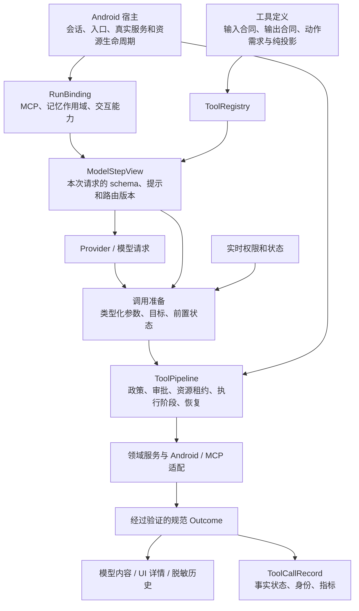

# Movo 工具重构深度评审

| 项目 | 内容 |
|---|---|
| 评审目标 | 判断 Claude 的工具重构能否形成职责清楚、容易扩展、模型易用且契约准确的工具架构，并指出距离这一目标的具体差距 |
| 当前设计 | 《工具定义清单》第二版、《工具重构实施方案》第二版；第一版《工具重构方案》仅使用仍有效、未被第二版覆盖的内容 |
| 输入快照 | 2026-10-03 11:32:05 +08:00；三份文档分别为 900、590、1162 行，SHA-256 保存在过程目录 |
| 代码范围 | Movo `fix/ui-review`，HEAD `a73b20306aed15471cc183cf5efbb5c0d4fa7e2a`，包含当前工作区未提交内容；另只读检查 `Movo-tools` 的未提交骨架 |
| 证据性质 | 源码事实、文档中的明确矛盾、可构造的契约反例，以及设计建议；没有把尚未实施的方案当作已发生的回归 |
| 执行边界 | 没有修改生产代码、原方案或重构 worktree；没有运行真实模型、MCP 服务或 Android 真机 |

正文用 **D** 指第二版定义清单、**I** 指第二版实施方案、**S** 指第一版中仍被引用的设计合同。行号以冻结快照为准，源文件链接集中在第 10 节。

## 1. 结论先行

**方向成立，但第二版还不适合作为“接口已冻结，可以按领域并行实现”的最终合同。它解决了工具组织和横切逻辑入口的问题，尚未完整解决能力视图、输入输出类型、调用状态、目标引用和资源所有权的问题。**

84 个本地工具收敛为 42 个内置工具、另加 `tool_search`，本身不能证明工具更合理；同样，注册表和切面链建立起来，也不能证明整个 Agent 架构已经合理。评价应落在下面五件事上：

1. 模型看到的工具、参数约束，与运行时执行的同一版本合同一致。
2. 工具能准确表达“读到了什么、执行到了哪一步、验证了什么”，并给出正确的恢复方式。
3. 合并工具保留来源和动作之间真实存在的差异，不让统一名字掩盖不同能力。
4. 观察、文件、会话、后台任务等资源有明确的身份、版本、归属和生命周期。
5. 新工具的成功率、模型选择准确率、上下文成本与打扰程度，有真实评测支撑。

当前最需要先补的是：**单一类型化合同、分层能力快照、执行阶段与恢复协议、资源租约、稳定引用**。其余大量细节应从这些合同派生，避免每个工具自行解释。

### 值得保留的部分

- `AgentTool + Registry + Pipeline` 收拢散落在 catalog、requirements、executor 的声明与执行逻辑，方向正确。
- 按领域组织；风险、敏感度、可用性独立建模；执行与展示分离。这比继续维护几份工具名集合更稳。
- GUI 派发送达与效果达成分开；统一错误码、恢复提示和 Anthropic `is_error`；调用开始时就确定保守的敏感度。
- `ui_scroll` 与 `ui_swipe` 保留不同方向语义；文本写入方式由运行时选择；验证码工具单列；文件搜索返回后续可读取的引用。
- 终端一次性命令、后台任务、交互会话分工；后台任务沿用现有所有权校验；记忆沿用原子文件写入。
- 先修协议再建立基线，契约、选路和真机三层验证，都是正确的实施基础。

## 2. 架构层：定稿前必须补齐的合同

### 2.1 “单一来源”目前主要统一了入口，还没有统一类型与后置条件

**事实。** S 第 6 节的 `AgentTool` 接收 `JsonObject`、返回通用 `ToolOutcome`；I 4.2 的 P2 只列入参校验，F1 是结果归一，未声明逐工具成功输出的 schema 或验证。已写骨架的 `AgentTool.parameters()`、`execute(ToolArgs)` 与 `ToolOutcome.data: JSONObject?` 也保持这种形态。

这意味着下列内容仍可能各写一份：模型 schema、工具内部取参、来源或动作之间的条件限制、返回 JSON 字段、UI 读取字段、文档和验证脚本。注册表并不会自动让这些内容一致。

例如 `clock_create(type=timer)` 与 `type=alarm` 的必填字段不同；`file_read` 返回五种内容形状；`personal_search` 的联系人没有与短信同义的事件时间。只有参数表和通用 JSON，无法阻止后端返回一个缺少 `effect_verified` 或分页标记的“成功”。

**修订方向。** 每个工具拥有可执行的输入合同、解码与默认值规则、规范结果类型或输出 schema、成功谓词和投影。可以采用 Kotlin sealed class/data class，也可以使用受验证的 schema；不必为所有工具建立复杂代码生成系统。关键是保留一种权威定义，模型 schema 与本地校验都是它的投影。

成功结果先按工具合同验证，再进入模型/UI/历史投影。结果 JSON 无法证明真实设备效果；效果验证仍由对应 backend 完成，不能由 F2 仅按工具名补 `effect_verified:true`。

### 2.2 目录全集、每次模型请求的展示集、执行时实时状态需要分开

**明确矛盾。** I 3.3（142–149 行）说目录在一次运行内固定；D `tool_search`（879–887 行）说加载后下一次请求可用。若严格冻结，加载无效；若直接改目录，原定义不成立。

**代码事实。** 当前 `AgentModelClient` 每轮读取 capabilities，`AgentLoop` 每轮重新构造 validator；MCP 则在 run 开始时冻结服务器与工具绑定。已有骨架又让 `ToolEnvironment` 同时用于目录投影和执行复核。

合理的三层边界是：

| 层 | 内容 | 变化时机 |
|---|---|---|
| Run 的能力绑定 | 工具实现、MCP 连接与 schema 版本、记忆作用域、入口交互能力 | 开始运行时绑定；替换与释放有明确规则 |
| 每次模型请求的工具视图 | 本轮展示工具、schema、领域提示、可加载全集的身份与版本 | 请求前冻结；`tool_search` 的加载在下一请求边界生效 |
| 调用时实时探测 | 用户开关、系统权限、前台目标、资源占用、取消状态 | 执行前检查，必要时在审批后再检查 |

同一个请求的 Provider、validator、router 必须使用同一工具视图。用户关闭开关后，即使工具还留在本轮目录，也必须由实时检查拒绝。反过来，新取得权限是否在本 run 生效，要明确选择；不能让一个可变 `Environment` 隐式改变模型合同。

加载状态持久化还需保存稳定 MCP 身份并重验 schema，不能仅恢复展示名。缓存是否保留是各 Provider 的协议问题；自建 `tool_search` 修改普通工具数组，不能直接获得 Anthropic 原生 deferred tool 的缓存性质。官方原生方案通过会话中的工具引用展开定义、保持前缀不变。[Claude 工具搜索文档](https://platform.claude.com/docs/en/agents-and-tools/tool-use/tool-search-tool)

### 2.3 风险、敏感度和资源需求，要依据解析后的调用计算

**事实。** I P1 要求调用阶段判定敏感度，P7 要求识别提交点；D `ui_input` 的敏感度取决于当前输入框，`terminal_session(send)` 的身份继承已打开会话。现有骨架的 `risk(args)`、`sensitivity(args)`、`concurrency(args)` 只有参数输入。

**契约反例。** `terminal_session(action=send, session_id=s1, input=...)` 没有 `identity`，无法仅凭本次参数判断它是不是 root 会话；省略 index 的 `ui_input` 是否写入密码框也必须查询焦点。`file_read(source=...)` 只有解析到实际来源后，才能判断权限与资源。

**修订方向。** 在准备阶段形成不可变的解析结果：类型化参数、目标引用、后端/会话身份、初始状态、资源需求、审批摘要。各策略读取这份解析结果；审批卡与实际执行也共享它。解析过程中产生的错误、参数非法时的敏感字段，要使用工具声明的保守脱敏规则，不能只在成功解码后生效。

不需要把所有策略都塞进工具对象。工具声明需求，宿主绑定服务，Pipeline 执行政策与生命周期，这三者应保持分工。

### 2.4 切面链还缺执行阶段、恢复和持久化时序

**事实。** S 5.2 把 `error` 定义为确定无效果或只读失败；D MCP 把服务器 `isError` 变为 `EXTERNAL_ERROR`。I 超时按“动作/只读”分类，运行取消时直接抛出。

但远端工具可以完成主动作后返回业务错误；网页已经导航但未加载完成；文件写入完成后，结果投影或落盘失败。这些情况都不能仅从异常类型推导“没有执行”。

应当在调用层区分：**尚未派发、已派发、工具已经返回、后置条件已验证、结果已记录**。另行声明重放是否安全、查询方法或幂等操作 ID。风险等级决定审批，不决定是否可重试；非零退出码说明命令结果，不等于工具未执行。

`ok/error/unknown` 可以保留，但必须来自阶段证据。错误码的默认 `retry=later` 只能是提示，动作是否可原样重试需要结合阶段和工具恢复合同。特别是 `INTERNAL_ERROR`、`NETWORK_ERROR`、MCP `isError`，不能一概提示再试一次。

切面异常也要定义：prepare 拒绝是否仍生成记录，execute 成功后 finish 崩溃如何保留结果，取消后如何形成 terminal record，哪一层允许改变 status、敏感度和图片。`finish` 可以随意替换 outcome 的接口，需要这些约束才能成为稳定扩展点。

### 2.5 资源模型要支持多个资源、实例键和跨 run 存活

**事实。** I 4.3 默认独占，仅只读且显式可并行；D 部分写工具仍标“并行”，存在术语冲突。骨架 `Concurrency.Exclusive` 只带一个枚举资源。

工具可能同时需要屏幕与剪贴板；不同终端会话应按 session ID 锁；文件路径需要解析为一致的实际文件身份；浏览器、MCP 服务器有各自实例。把所有终端都锁成一个 `TERMINAL` 会过度串行；只声明一个资源又不足以约束复合操作。

更关键的是 I 4.4 的看门狗：返回超时结果后原执行仍继续。当前 `RunExecutor.finally` 会关闭本次工具绑定（352–354 行），旧 run 的局部忙标记也不能约束新 run。

**修订方向。** 分开“可并行资格”和“资源访问集合”，按稳定顺序原子获取资源；设备级资源由宿主持有 lease，包含 owner/代际。run 结束时等待执行停稳、移交后台任务或保持隔离，之后才能销毁服务。晚到结果只能进入对应旧调用的归档，不得进入新 run 的模型上下文。

不要求多 Agent。即使永远只有一个 Agent run，只要超时线程或后台进程继续工作，仍然需要这一层资源所有权。

### 2.6 工具结果、调用记录和展示投影需要明确的数据所有权

**事实。** S 5.1 说 UI 读完整结构化 data；I 7 的 `ToolCallRecord` 主要保存参数摘要、状态和指标，`ToolFinished` 发“完整记录”。这里没有定义完整结果如何供 UI 查询，也没有说明原始结果随 checkpoint、事件重放的边界。

建议明确四种产物：短生命周期的规范 outcome、给本次模型的内容、可持久化的脱敏历史、给 UI 的结构化详情。调用记录保存关联身份、事实状态和指标，不能同时充当全部原始结果与展示内容。

每个投影都有版本、长度预算和字段裁剪规则；同一事实状态由调用记录提供。UI 的图标登记表只负责外观，不重新解析模型文本判断成功。旧会话无新 status，不能追认成新 A 类“效果已验证”；有旧结果与缺失结果也要区别处理。

## 3. 结果语义：保留 A/B 思路，但按动作和证据定义承诺

I 3.1 的分类比旧 `ok` 好。但“直达 API 就是 A、界面操作就是 B”不是可靠边界：Intent 也是异步请求，WebView 导航有状态变更，终端命令可以产生任何效果。

| 调用 | 可以验证的事实 | 当前定义需要修改的地方 |
|---|---|---|
| `app_open(package/name)` | 解析出的组件或目标包已到前台 | 保留 A，但声明窗口、等待和多匹配规则 |
| `app_open(uri)` | URI 解析目标、选择器状态、目标前台状态 | 不能用任意前台包证明 URI 被处理；按解析结果区分送达与验证 |
| `clock_create` | 新建或复用的准确闹钟/计时器，及其属性 | `next_trigger_at` 可能来自旧闹钟；同时间不同标签、较早提醒和重复调用需独立验证 |
| `audio_control(set_volume)` | 音量档位已读回 | 百分比映射到离散档位，返回实际值与容差 |
| `audio_control(play/pause/next)` | 已派发媒体键，或目标 session 状态已变化 | 当前 backend 只派发媒体键；取得目标 session 和状态证据前不能统一承诺 A |
| `device_toggle/setting_write/app_control` | 对明确 Android user、对象、动作的状态或回执 | 每个 action 给出可实现的成功谓词；force_stop 不等于持久“已停止状态” |
| `ui_input(submit=false)` | 可读框的文字符合请求 | 密码框回读不了，分开“送达”与“文字已验证” |
| `ui_input(submit=true)` | 输入与提交两步各自的执行状态 | 输入验证成功不证明消息已发送；部分执行要有结构化结果 |
| `terminal_run` | 已启动、转后台或进程结束，以及退出码 | 工具执行成功不证明 shell 业务目标成功；总表不应把它归为“只读” |
| `browser_open` | 导航请求状态、当前 URL、文档就绪状态 | nav/reload 有副作用；超时需要阶段与观察指引，不能默认原样重试 |
| `memory_write/file_write/skill_install` | 对应版本/内容提交完成 | 带操作 ID、提交版本或内容身份，以支持中断查询和冲突处理 |

这不要求所有动作都能通用验证。无法验证时把承诺准确缩小，模型随后查询。最终回复的“任务已完成”评测可以保留，但它不能替代工具层的后置条件。

## 4. 工具定义：最重要的逐领域修订

### 4.1 UI 合并正确，观察引用的简化存在退步

`ui_tap` 合并点击与长按、`ui_input` 合并写入路径是合理的。问题是 D 0.5 和 `ui_tap` 允许省略 observation ID，运行时默认最近观察（54–64、273–289 行）。

现有元素验证已经核对服务 token、窗口 ID、内容代际、节点身份和可见性。新方案如果只保留“窗口指纹”，会丢掉这一部分保护。列表在同一窗口重排，或者审批等待时更新内容，窗口没变不代表目标没变。

建议元素引用携带观察代际；可以编码进短 `ref`，让模型少填字段。坐标、区域和 swipe 也绑定对应空间版本，至少包含方向、尺寸、缩放与观察来源。不能拿当前方向重新解释旧截图坐标。新观察是否让旧引用全部失效、动作后的 `after.observation_id` 是否带完整节点映射，都要明确。

`ui_observe(nodes=false)` 且截图失败时，没有模型可用的观察内容。需要区分仅有前台元数据与有效树/图像，明确哪些动作还能用；不能笼统把“截图失败不算错误”覆盖全部情况。

### 4.2 `personal_search` 可保留统一入口，但要有来源合同

统一 `source` 枚举并没有自动统一查询语义。当前联系人按名称排序，没有与短信同义的事件时间；录音摘要的旧查询没有事件时间字段。D 却让所有来源共用 `since/until/cursor` 和 `time`。

建议为每个 source 声明：支持的过滤、默认排序、时间含义、返回字段、能力条件、分页稳定性。无事件时间的来源应拒绝时间过滤，或明确返回另一种已命名时间；不能填一个采集时间冒充记录时间。

通知把当前栏和最近 7 天历史合并、订单把通知与系统记忆合并，还需要跨来源去重和稳定排序。查询截断与没有更多匹配不能混为一谈。每个 source 的 `extra` 应有已知形状，避免把旧数据库列名换个壳继续透传。

这不是必须拆成十几个工具的结论。先把来源差异表示准确，再评测“单入口 + source”和“按来源独立工具”哪种更易用。

### 4.3 `file_read` 做统一入口可行，但不要静默忽略参数

D 27（558–599 行）允许 handle、附件 URI、路径都使用一个 string `source`，并说不适用的参数会被忽略。

建议内部先解析为有来源身份的 FileRef。模型入口可以继续用一个简洁字符串，但必须区分搜索句柄、用户附件和任意路径，明确权限、持久化与失效规则。句柄不是路径的简单编码；来源撤权和文件身份变化要在读取时检查。

`pages="1-3"` 用于图片、`cursor` 用于视频等错误组合应拒绝或明确 warning。静默忽略会让模型以为范围选择生效。模型输入能力、功能开关、媒体处理后端未就绪时，目录描述不能继续承诺原件投递或转写。

多媒体须补输入字节数、总页数/帧数、图像像素和请求总附件预算、转写时长与失败降级。PDF 原件直传、文字提取、页面渲染应是不同已声明路径。

**已核实的实现缺口。** Movo 最低支持 API 34；Android `PdfRenderer.Page.getTextContents()` 是 API 35 才加入。方案只写“PDF 用 PdfRenderer”，尚不能支撑所有受支持系统上的文字层提取；需要 API 条件和 API 34 的降级或替代路径。[Android PDF API 文档](https://developer.android.com/reference/android/graphics/pdf/PdfRenderer.Page#getTextContents())

### 4.4 cursor 是资源协议，不能只统一字段名

当前 Root 与非 Root 文本读取都按 byte offset 读取后解码，可能切断 UTF-8 字符。改成名为 cursor 的 string，不会自动解决编码、文件变化或源查询重排。

| 资源 | cursor 至少绑定什么 |
|---|---|
| 文本文件 | 文件身份/代际、编码、完整字符边界对应的字节位置 |
| 网页正文 | 文档代际、提取结果快照与位置 |
| 后台输出 | job 身份、stdout/stderr、日志代际与位置 |
| 个人数据 | 来源、过滤与排序、最后排序键和唯一 ID，或查询快照 |
| 记忆 | revision 与位置 |
| Skill 资源 | 技能版本、资源路径与位置 |

源变化后明确返回失效错误或固定读取旧快照。`tail` 与 `cursor` 是否互斥、未知 total、源端已丢失内容和可续读截断，也需区别处理。不能为 MCP 结果虚构服务器 cursor；本地 spill 必须声明可读方式和保留期限。

### 4.5 终端分工合理，但后台状态机不能只保留参数

D `terminal_run` 超时自动转 job，`keep_alive` 可跨 run；`terminal_job` 承诺 stdout/stderr 分别分页与自动完成通知。当前 async 与 daemon 的实现不同：async 随控制器关闭清理，daemon 有 pid + ownership token、持久日志和重启认领，但日志合流且读取窗口有限。

应先统一 JobHandle 的状态与所有者，再统一工具名字。`RUNNING → BACKGROUND → EXITED/STOPPED`，先登记可查询 job ID，再返回转后台结果。通用看门狗与 terminal 超时谁负责接管，需要唯一决定点。

完成通知由哪个宿主投递、Agent 忙时在哪个模型请求边界消费、空闲时是否启动新 run、会话已关闭时去哪里，目前没有定义。下一轮“自动收到”不能代替唤醒和投递协议。

`terminal_session(send)` 还需要区分“发送输入、读取增量输出”和“执行一条可确定结束的命令”，规定 EOF、信号、退出码是否可得。PTY 交互程序的输出不能冒充有明确退出码的进程结果。

### 4.6 浏览器引用需要与 UI 引用同等严谨

D `browser_read(elements)` 返回 ref，`browser_act` 优先使用 ref；但未规定 ref 的页面代际、失效条件和重试语义。SPA 同 URL 可以换内容，后退/前进会切换文档，同样的 CSS selector 可以命中不同目标。

应让 ref 绑定文档/页面快照；读取正文分页使用稳定提取快照；点击前验证同一目标。`browser_open` 的“只读”分类不准确：back/reload 改变当前浏览器状态，超时后不宜默认重放。

### 4.7 记忆与 Skill 安装不要弱化已有原子性

D `memory_write` 的 append 和 replace 不要求 revision，clear 才要求。现有存储在同一锁内检查 revision 并用 AtomicFile 写入。

可以使 append 更易调用，但仍应返回前后 revision、稳定 mutation ID 和有条件的撤销引用。唯一匹配 `old_text` 解决文本定位，不能代替并发版本控制：审批前后的同一片段可能已属于不同版本。replace/clear 应保留 CAS 或等效版本绑定。

角色记忆仍由宿主绑定具体仓库和角色 ID，模型不选择作用域。相同工具名改善模型使用，不应让日志、历史和迁移丢失实际 memory scope。

Skill inspect 已返回 commit，install 必须绑定该次检查的 commit/目录身份与审批 diff，避免分支在检查后移动；安装完成与“下一轮已加载”是两种状态。已有检查重放与下一轮生效机制应保留。

### 4.8 `ask_user` 不应强制所有问题都有选项

D `ask_user` 强制 2–6 个 options。例如需要收件邮箱、地址或自由描述时，模型被迫编造两项候选再加“其他”。建议 options 可选，区分选择与自由回答；选择问题有候选，自由问题直接输入。

回答带 request ID、结构化选择和自由文本；不识别的语音、超时转待处理卡、用户补充任务指令与回答的区分，按交互状态机处理。审批使用同一宿主通道，但具有独立语义。

`permission_request` 的 `tool/target/summary` 还不足以准确授权一个具体动作。若保留预授权，应绑定动作、目标身份和参数范围；尤其“给妈妈发消息”不能自动等价于本 run 内任意内容的所有发送。这里需要先定义授权合同，再定义展示文案。

### 4.9 MCP 需要保真的适配合同

输入 schema、输出 schema、content block 类型、远端错误、副作用不确定性与服务器身份，都需规范化。D 的“inputSchema 透传、描述超过 400 字截断、结果 content 为文本”的规则过于简单。

保留已有资源链接/资源块能力；无法支持的内容返回明确的省略原因；对方有 outputSchema 时校验结构化结果；`isError` 说明远端报告失败，不保证没有副作用。MCP 规范明确区分协议错误与工具执行错误，并定义多种内容块及输出 schema。[MCP Tools 规范](https://modelcontextprotocol.io/specification/2025-11-25/server/tools)

风险可由用户给服务器设置保守默认值，再按可信工具声明/本地覆盖细化。它是宿主决策，不能从一个服务器级标签推导所有工具的重试、并行和敏感度。

## 5. 模型协议与多模态：需要纳入目标合同

### 5.1 三家 Provider 不等于一种 JSON Schema

当前 Responses 构建器将工具 schema 原样复制并写 `strict:false`；Chat Completions 与 Anthropic 主要转换外壳。本地 validator 支持一些组合关键词，但未知 `type` 会放行，未写 `additionalProperties:false` 时允许额外字段。

重构应定义内部支持的 schema 方言与各 Provider 的投影规则，MCP schema 在加载时也检查；不能以本地能校验为由认定模型端一定接受。必填、可空、默认值、额外字段、互斥分支与未知枚举的语义都要一致。

OpenAI strict 模式要求对象封闭、properties 全部列为 required，可选字段用 null 表示。这说明“单一合同”需要经过协议投影，而不是把同一份 JSON 在三家之间透传。[OpenAI Function calling 文档](https://developers.openai.com/api/docs/guides/function-calling#strict-mode)

是否启用 strict 可按模型能力选择；本地验证始终保留。验证包括 schema 本身和真实模型端请求接受性，不能只检查参数实例。

### 5.2 图片、PDF 页、视频帧需要明确 call 归属

S 仍保留“本批工具图片放到之后一条独立观察消息”。当前 `AgentLoop.appendToolImages()` 将全部图片 flatMap，只附工具名集合，不附 call ID。新工具允许一次读取多页/多帧，问题会更明显。

每个附件应绑定 call ID、附件索引、来源、页码或帧时间、对应结果状态。Provider 允许时放在对应工具结果块；不允许时生成有明确映射的独立消息。瞬时截图与可持续分析的用户文档/视频应有不同保留规则，不能全部按“下一次思考后删除”处理。

这里需要一个多模态结果合同，不能继续用零散 `image_attached:true` 表达。

## 6. 需要评测才能决定的取舍

以下不是静态 review 能断言谁最优的设计：

| 取舍 | 比较的方案 | 需要的证据 |
|---|---|---|
| 暴露规模 | 42 内置常驻；高频常驻 + 低频加载；按入口/任务能力视图 | 全任务成功率、误选、额外发现轮次、总输入 token、缓存、时延 |
| 检索合并 | `personal_search(source)`；部分来源拆分 | 有效工具路径与参数正确率、来源混淆、返回理解准确率 |
| 通用读取 | 单 `file_read`；媒体/文本分开 | MIME 识别、范围参数错误、附件消费、部分成功处理 |
| 坐标空间 | 截图像素；0–1000 | 模型与方向/显示尺寸变化下的点击准确率 |
| 终端输出 | 结构化 JSON；状态头 + 纯文本正文 | 退出码理解、后续读取行为、token 成本 |
| 只读并行 | 关闭；有界并行 | 任务耗时、后端线程约束、观察/事件顺序、资源竞态 |

“描述最多 160 字”“一个工具 action 不超过 6 个”“42 个工具约 8k token”，可作为预算或初始候选，不是最优性证明。把用法移入系统提示后，要统计**schema + 领域提示 + 示例 + 检索结果 + 追加工具**的全部成本，而不只是目录字符数。

Anthropic 的工具设计实践强调清楚的任务边界、输入输出和真实任务评测，也明确允许同一任务的多种有效工具路径。因此离线评测不要用唯一工具名作为所有任务的真值。[Writing effective tools for agents](https://www.anthropic.com/engineering/writing-tools-for-agents)

## 7. 外部设计的可借鉴部分与适用边界

本次直接读取现有本地源码并核对 HEAD；以下是固定版本对照，不宣称它们代表上游最新状态。

| 参照 | 已核实机制 | 对 Movo 的价值 | 不应直接照搬 |
|---|---|---|---|
| Pi `898ab804` | 参数类型由 schema 推导；`AgentToolResult` 分 content/details；execute 接收 call ID、AbortSignal、更新回调；replay 声明 | 输入类型与执行对齐、模型/UI 数据分离、调用身份和恢复策略 | 默认工具数少不证明手机助手应只留 4 个工具；扩展的 UI renderer 不能直接成为 Android core 依赖 |
| Codex `0a2eb469` | StepContext 持有本次请求的 settings、环境、MCP binding、最终 ToolRouter | 模型广告与实际路由绑定在同一请求快照，区别会话、任务和请求作用域 | 不需搬整套环境系统或多 Agent；只吸收 Movo 需要的状态边界 |
| DeepSeek Harness `477b4f42` | 工具必须声明 canonical output schema/render；执行需响应取消并停稳；默认互斥，显式声明才能并行 | 逐工具输出验证、纯投影、取消与资源边界 | 不需要搬事件总线或代码执行模式；统一注册表也不等于整个产品都变成插件 |
| Aether `b59e3b52` | 宿主通过桥接提供手机能力，较多 action 型工具 | 证明宿主能力可以收拢到明确桥接层 | 大型 action 枚举、固定延时截图不构成合理设计的依据 |

最值得采用的共同点是：**合同、宿主绑定、请求视图和执行状态分开；再由运行时统一连接。** 工具数量和目录前缀属于更靠外的模型界面，不能反过来支配所有内部状态。

## 8. 目标架构的最小职责划分

下图是评审建议的责任图，不是当前已经实现的结构。

实现上不必对应十个新类或十个 Gradle 模块。必须对应的是明确的所有者和不变量：注册表不读取实时前台，模型协议不拥有工具资源，工具不自行写会话/改 UI，展示不重新推断执行状态，超时不能释放仍被使用的设备资源。

已有骨架 `ToolContext` 带 Android Context，`ToolServices` 暴露具体设备控制器。对于当前单 Android 产品，这不必立即升级为独立平台；但核心合同尽量用领域服务和取消接口表达，Android 对象放在装配与后端，避免下一次扩展再次修改一个共享服务中心。

I 明确不剥离角色、语音等产品模式。这个范围选择可以接受，但应准确表述成果：它会改善**工具子系统**，不会同时解决整个 Agent 的产品模式耦合。当前 `AgentModelClient.complete` 和 Loop 仍接收角色/语音等产品信息。至少本次新的 memory/interaction/tool 绑定要归宿主持有，给后续分层留下接缝。

## 9. 定稿与验收应如何收敛

### 9.1 先冻结七份合同，再按领域实现

| 合同 | 最低需要写清楚的内容 |
|---|---|
| 工具输入/输出 | 类型、互斥/条件参数、默认值、结果形状与成功谓词 |
| 能力视图 | run 绑定、每次请求目录、实时权限、tool_search 的生效边界 |
| 解析后的调用 | 目标身份、会话身份、初始状态、风险/敏感度与资源需求 |
| 执行与恢复 | 派发阶段、取消、超时、幂等/重放、晚到结果与持久化顺序 |
| 资源 | 实例键、多个资源、跨 run lease、释放和后台移交 |
| 引用与分页 | observation/ref/file/job/cursor 的版本、生命周期和失效 |
| 数据投影 | 模型、UI、记录、历史、多模态与旧版本的归属关系 |

已有骨架中默认并行、run 级污点等问题已被 I 17 列为待修，不把它们重复当作“作者遗漏”。但上述合同不能只靠修几个默认值完成。

### 9.2 补充跨层验收，不只测工具能跑

I 的三层评测应保留，并增加以下有明确状态断言的场景：

| 场景 | 必须证明的性质 |
|---|---|
| tool_search 加载后下一请求；恢复时 MCP schema 已变化 | Provider、validator 和 router 一致；加载失效有明确原因 |
| run 中撤权或恢复权限；旧 file handle 再读 | 实时权限生效，目录变化规则明确 |
| 同窗列表重排；旋转；审批时页面改变 | 旧观察/目标不会被重新解释成另一目标 |
| 超时原执行未返回，随后结束 run 并开始新 run | 资源仍有唯一所有者，旧结果不污染新运行 |
| terminal 超时转 job 与取消同一时刻；App 重启后查询 | 不重复启动，job 身份不丢，日志与通知有归属 |
| 已有同时间闹钟；URI chooser；无媒体会话/多会话 | 不把无关状态或派发送达报为效果达成 |
| UTF-8 页边界；文件/网页/记忆在续读中变化 | 无乱码、漏读、重复或静默切换快照 |
| 同批多工具附图；PDF 多页和视频多帧 | 每个附件与 call、页/帧、结果状态可对应 |
| mutation 已提交、结果未记录就中断 | 恢复可查询，append/install 不重复，replace 不覆盖新版 |
| 旧会话分别经三家 Provider 回放 | 每个 call 匹配正确结果；不追认旧效果验证 |
| ColorOS 来源与 API 34 媒体后端 | 标记真实支持矩阵；未验证环境不能报全量完成 |
| 语音回答、任务插话、20 秒转卡、取消与重连 | 回答有正确 request ID，等待状态不会错误唤醒新任务 |

评测统计还要明确分母：每个模型/每台设备/每个类别的任务与重复运行，基线使用的同一模型版本、配置、权限和初始状态。“每类最多差 1 个任务”在小样本类别里可以允许较大下降，应报告具体差值，不包装成不劣化证明。

离线选路应提供当前定义实际依赖的领域提示和环境信息，并允许多种正确路径；另保留纯目录测试用于专门诊断工具描述。成功判定应以任务结果为主，独立检查工具后置条件。自动回答审批/提问能测管线，但还需真实入口验证用户交互。

### 9.3 对这次重构的明确判断

**可以继续沿现有方向修订，不需要推翻重写；建议暂缓把核心接口视为最终冻结。**

优先补第 2 节的架构合同，再修第 3–5 节的工具定义，最后以第 6、9 节的评测决定暴露规模和合并粒度。42 个内置常驻可以作为第一组实验，而不应成为不可变的“最合理工具数”。

本次能确认的是方案中的结构性缺口和契约反例；不能确认新架构的真实成功率、目录 token、时延、厂商兼容与所有 A 类验证已达成。这些必须由实施后的测试和运行证据补齐。

## 10. 关键文件索引

| 证据 | 文件、符号及用途 |
|---|---|
| D | [Movo 工具定义清单](Movo%20工具定义清单.md)：0.2–0.6、总表、逐工具合同 |
| I | [Movo 工具重构实施方案](Movo%20工具重构实施方案.md)：3、4、7、9、12、13、17 节 |
| S | [Movo 工具重构方案](Movo%20工具重构方案.md)：版本说明、5–6 节；被第二版覆盖的旧规格不作为当前缺陷 |
| 模型/工具视图 | [AgentModelClient.kt](../../../app/src/main/kotlin/io/github/fartown/movo/agent/model/AgentModelClient.kt)：`complete`、`toolsFor`、每轮 capabilities；[AgentLoop.kt](../../../app/src/main/kotlin/io/github/fartown/movo/agent/model/AgentLoop.kt)：89–95 行目录、185–204 行结果记录、343–374 行图片合并 |
| Schema/Provider | [AgentToolCallValidator.kt](../../../app/src/main/kotlin/io/github/fartown/movo/agent/model/AgentToolCallValidator.kt)：实例校验、对象额外字段、277–288 行类型处理；[ResponsesRequestBuilder.kt](../../../app/src/main/kotlin/io/github/fartown/movo/agent/model/ResponsesRequestBuilder.kt)：111–123 行；[AgentProvider.kt](../../../app/src/main/kotlin/io/github/fartown/movo/agent/model/AgentProvider.kt)：ProviderCapabilities；[AnthropicMessagesProvider.kt](../../../app/src/main/kotlin/io/github/fartown/movo/agent/model/AnthropicMessagesProvider.kt)：历史与工具映射 |
| 宿主装配与释放 | [AgentRuntimeRunExecutor.kt](../../../app/src/main/kotlin/io/github/fartown/movo/agent/runtime/AgentRuntimeRunExecutor.kt)：131–135 行角色绑定、165–181 行实时开关、352–354 行关闭 |
| 本地分发/观察 | [AgentLocalTools.kt](../../../app/src/main/kotlin/io/github/fartown/movo/agent/tool/AgentLocalTools.kt)：元素与观察状态、561–579 行坐标转换、604–678 行 app/URI；[AgentToolCapabilities.kt](../../../app/src/main/kotlin/io/github/fartown/movo/agent/tool/AgentToolCapabilities.kt)：能力捕获 |
| 设备后端 | [RootShellDeviceController.kt](../../../app/src/main/kotlin/io/github/fartown/movo/agent/device/RootShellDeviceController.kt)：observe 与坐标空间；[AgentAccessibilityService.kt](../../../app/src/main/kotlin/io/github/fartown/movo/agent/accessibility/AgentAccessibilityService.kt)：1579–1623 行节点验证；[AgentStructuredDeviceTools.kt](../../../app/src/main/kotlin/io/github/fartown/movo/agent/tool/AgentStructuredDeviceTools.kt)：时钟、媒体键、音量、系统操作 |
| 数据来源 | [AgentPersonalDataTools.kt](../../../app/src/main/kotlin/io/github/fartown/movo/agent/tool/AgentPersonalDataTools.kt)：Provider 查询、来源字段；[AgentPrivateDatabaseTools.kt](../../../app/src/main/kotlin/io/github/fartown/movo/agent/tool/AgentPrivateDatabaseTools.kt)：ColorOS 时钟与 LIMIT 查询 |
| 文件/任务后端 | [RootShellTerminalController.kt](../../../app/src/main/kotlin/io/github/fartown/movo/agent/terminal/RootShellTerminalController.kt)：async 生命周期、774–803 行按字节读文件；[UserFileAccess.kt](../../../app/src/main/kotlin/io/github/fartown/movo/agent/terminal/UserFileAccess.kt)：23–36 行；[DetachedTaskSupervisor.kt](../../../app/src/main/kotlin/io/github/fartown/movo/agent/terminal/DetachedTaskSupervisor.kt)：pid/token、重启认领、日志 |
| 网页状态 | [AgentBrowserSession.kt](../../../app/src/main/kotlin/io/github/fartown/movo/agent/browser/AgentBrowserSession.kt)：431–468 行导航、515–548 行操作；[BrowserDomScripts.kt](../../../app/src/main/kotlin/io/github/fartown/movo/agent/browser/BrowserDomScripts.kt)：正文提取与 offset |
| MCP | [McpRunContext.kt](../../../app/src/main/kotlin/io/github/fartown/movo/agent/mcp/McpRunContext.kt)：snapshot、工具身份、109–127 行异常、155–250 行内容适配；[McpHttpClient.kt](../../../app/src/main/kotlin/io/github/fartown/movo/agent/mcp/McpHttpClient.kt)：动态工具 schema/annotations |
| 记忆/历史 | [AgentMemoryRepository.kt](../../../app/src/main/kotlin/io/github/fartown/movo/data/repository/AgentMemoryRepository.kt)：63–95 行 AtomicFile/锁/revision；[AgentConversationCodec.kt](../../../app/src/main/kotlin/io/github/fartown/movo/agent/model/AgentConversationCodec.kt)：190–230 行脱敏 |
| 系统版本 | [app/build.gradle.kts](../../../app/build.gradle.kts)：minSdk 34 |
| 重构骨架 | [AgentTool.kt](/Users/bytedance/dev/Movo-tools/app/src/main/kotlin/io/github/fartown/movo/agent/tools/core/AgentTool.kt)、[ToolOutcome.kt](/Users/bytedance/dev/Movo-tools/app/src/main/kotlin/io/github/fartown/movo/agent/tools/core/ToolOutcome.kt)、[ToolEnvironment.kt](/Users/bytedance/dev/Movo-tools/app/src/main/kotlin/io/github/fartown/movo/agent/tools/core/ToolEnvironment.kt)、[ToolPipeline.kt](/Users/bytedance/dev/Movo-tools/app/src/main/kotlin/io/github/fartown/movo/agent/tools/core/ToolPipeline.kt)：只读检查的未提交中间态 |
| Pi | [agent/types.ts](../../../reference/pi/packages/agent/src/types.ts)：420–468 行；[extensions/types.ts](../../../reference/pi/packages/coding-agent/src/core/extensions/types.ts)：455–504 行 |
| Codex | [StepContext](../../../reference/codex/codex-rs/core/src/session/step_context.rs)：请求能力与 ToolRouter；[tools/registry.rs](../../../reference/codex/codex-rs/core/src/tools/registry.rs)：工具执行与生命周期 |
| DeepSeek Harness | [core/tools/index.ts](../../../reference/deepseek-harness/packages/core/tools/src/index.ts)：212–299 行 canonical output、取消、并行 |

## 11. 关联文档与过程件

- [冻结输入与源码指纹](../../../tmp/tasks/2026-10-03-tool-redesign-review/input-manifest.json)
- [架构专项评审](../../../tmp/tasks/2026-10-03-tool-redesign-review/architecture-review.md)
- [移动端契约专项评审](../../../tmp/tasks/2026-10-03-tool-redesign-review/mobile-contract-review.md)
- [协议与执行专项评审](../../../tmp/tasks/2026-10-03-tool-redesign-review/protocol-contract-review.md)
- [仓库画像](../../../tmp/tasks/2026-10-03-tool-redesign-review/repo-profile.md)、[链路记录](../../../tmp/tasks/2026-10-03-tool-redesign-review/trace-log.md)、[验证边界](../../../tmp/tasks/2026-10-03-tool-redesign-review/open-questions.md)
- [既有 Agent 整体架构评估](../agent-design-review/Movo%20Agent%20整体架构评估.md)：本次重新核对了工具相关主链路，未以旧审计缺陷替代当前代码事实。
