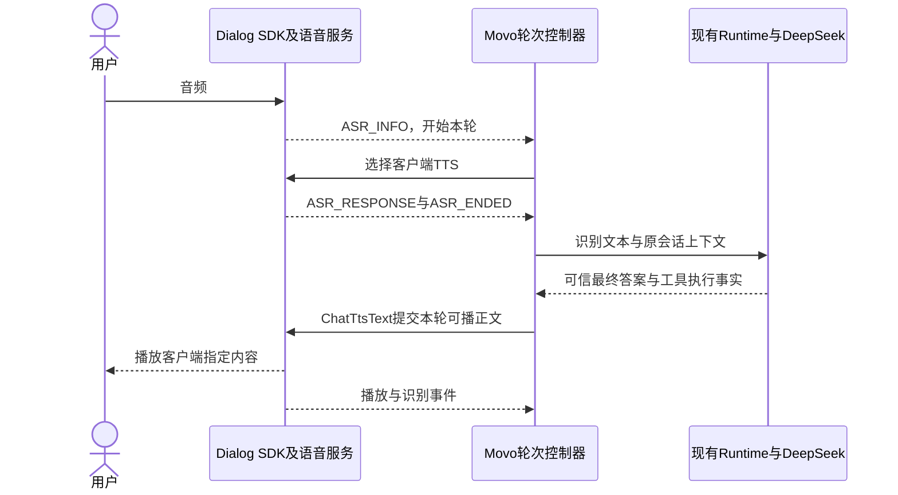

# 豆包 O2.0 Dialog SDK 与 DeepSeek 复用验证

更新：2026-09-22。用户指出“豆包语音 2.0 就支持”后重新核对官方旧版协议、当前 AAR、Demo 与账号权限，并运行独立真机探针。产品源码尚未集成。

当前核心结果：**真实 ASR 结束事件 → 已选 DeepSeek → Dialog 指定文本播报 → 手机扬声器 → 物理麦回采**已在高音量补测中成立，回采识别文本与 DeepSeek 最终正文完全相同。输入为合成 PCM，输出是真实声学路径；这不是完整 Movo 连续对话验收。

[完整 HTML 报告](../../../tmp/tasks/2026-09-22-doubao-sdk-reuse/report.html) / [同源 Markdown](../../../tmp/tasks/2026-09-22-doubao-sdk-reuse/report.md)。3 个能力用例、6 个真实轮次，最新 3 轮仅各自组件范围通过，首轮的 3 个 INCONCLUSIVE 保留。报告已通过数据、资源和 Markdown 一致性校验，12 个媒体完成解码；这些校验不扩张产品结论。

## 1. 选型纠正

**“端到端 SDK 一定不能保留 DeepSeek”这个判断过于笼统。官方 Dialog SDK 有客户端 TTS 委托模式，可以接收识别结果，再播报外部 DeepSeek 提供的答案。** 它不要求把豆包默认生成的回复作为用户最终听到的回答。

同时，委托模式控制的是播报来源，官方没有承诺禁止云端豆包模型推理或不计其用量。本轮 HOLD 真机实验已观察到默认模型回复、默认合成音频与 usage；只是它们没有被播放。保留 DeepSeek 决定答案，与完全不运行豆包默认推理，是两个不同的要求，不能将前者写成后者。

现有账号默认项目的端到端实时语音、ASR 2.0、TTS 2.0 均已开通。**不需要为了本次验证另开 SAMI 或 RTC。** 控制台权限已核对，HOLD 探针也已用现有 API Key 正常初始化并收到真实识别结果。[官方核对与控制台证据](../../../tmp/tasks/2026-09-22-doubao-sdk-reuse/official-browser-findings.md)

## 2. 官方支持的接法

初始化前设置 `dialog_work_mode=1`；收到 `ASR_INFO` 后选择 `USE_CLIENT_TRIGGER_TTS`；收到 `ASR_ENDED` 后，客户端可以调用自己的模型，再通过 `ChatTtsText` 发送答案。首包 `start=true,end=false`，末包 `start=false,end=true`。官方说明委托模式每轮未选择客户端或服务端播报时不会发声。[旧 Android SDK](https://docs.volcengine.com/docs/DoubaoVoice/End-to-endAndroidSDKinterfacedocumentation?lang=zh)

这里使用 `ChatTtsText`，而不是还要经过豆包总结的 `ChatRagText`。图中 Runtime 与控制器是目标产品接法；本轮探针直接调用同一 DeepSeek 服务，只验证组件链，未运行 Movo 工具循环。

| 固定项 | 本轮配置 |
| --- | --- |
| Android SDK | `speechengine_tob:0.0.15.0` |
| Dialog 协议 | 旧二进制 `/api/v3/realtime/dialogue` |
| O2.0 模型 | `dialog.extra.model=1.2.1.1` |
| 音色 | `zh_female_vv_jupiter_bigtts` |
| 输入 | 16 kHz、单声道、PCM16；流输入每 20 ms 一包 |
| 输出 | 24 kHz、单声道、`pcm_s16le`，避免误按默认 float32 解读 |
| 凭据 | 现有 Key，官方允许 `x-api-key`，不用另建服务或 Key |
| 诊断包 | `io.github.fartown.movo.dialogp0`，与正式 Movo 分开 |

当前全双工官网页面已更新为 3.0，使用不同 URI、纯 JSON 事件和 `session.model=1.2.6.1`。本轮固定 O2.0，不将新旧参数混用。[旧 API](https://docs.volcengine.com/docs/DoubaoVoice/End-to-endreal-timespeechlargemodelAPIaccessdocument?lang=zh)、[API Key](https://docs.volcengine.com/docs/DoubaoVoice/APIKeyUsage?lang=zh)、[当前全双工 API](https://docs.volcengine.com/docs/DoubaoVoice/endtoend-realtime-voice-full-duplex-version?lang=zh)

## 3. 可以减少的工作与仍需保留的控制

Dialog 同时提供识别轮次事件、内置录放和 AEC。如果这条组合通过实测，就可以减少独立 ASR 与 TTS 之间的音频调度工作，也有现成的句尾事件可供控制器使用；不必先申请另一套语音处理服务。

但 SDK 不理解 Movo 的工具任务归属。Movo 仍须管理提交去重、原有模型配置、执行中补话、取消任务与停止播报的区别、旧轮次答案丢弃、历史归档及错误恢复。服务端 `CHAT_RESPONSE` 不能作为 DeepSeek 答案写进 UI 或模型上下文；只接受 Movo Runtime 的可信结果。

迁移还有以下具体门槛：

1. **长任务与插话归属。** ASR 开始新一轮后，旧任务返回的文本不能被当成新一轮回复；SDK 委托选择和 Movo turn/run 必须一起验证。
2. **唤醒连说。** 本地 Sherpa 到 SDK 自有麦克风的切换可能丢掉唤醒后的字。若采用共享采集的 STREAM 输入，必须验证预缓冲、时间对齐与 AEC；不能只因为录音回调存在就假设它在 AEC 后或可独立运行。
3. **真实端点。** 官方句尾事件可减少实现，但句中停顿、短命令、补话仍要实测；一次样本正确不代表中文端点已验收。
4. **双讲与声音控制。** SDK 内置 AEC 不代表当前设备已经保留近端人声；需要独立近端声源，并验证误打断恢复、实际停声和回调隔离。
5. **默认生成、上下文与费用。** 本轮已观察默认生成及协议用量；旧 2.0 文档没有明确的仅 ASR/禁止默认生成开关。ChatTtsText 是否自动替换云端 assistant 历史也未获文档保证；服务虽有 ConversationRetrieve/Update/Truncate，但尚未运行验证。Movo 保留原上下文，若需要同步 Dialog 上下文必须先核验，不承诺只有独立 ASR/TTS 费用。
6. **生命周期与时延。** 后台、音频焦点、路由切换、锁屏与首声时延仍属于产品验收；外部 DeepSeek 的生成耗时不会因 SDK 集成而消失。

官方 Demo 带有 `aec.model`；本轮从 Demo 提取和官网独立下载的哈希一致，均为 `29387699ec9325d84dc971c74dd2c8d4cd001bb0a2d829423f1f660638f4b54a`。`processAudio` 仅在音频指纹 Demo 中出现，不能据函数名当成独立 AEC 接口。[官方 AEC 配置](https://docs.volcengine.com/docs/DoubaoVoice/endtoend-full-duplex-android-sdk-documentation?lang=zh)

## 4. 本轮执行记录

用例已冻结为 HOLD、DEEPSEEK、AEC-SMOKE，边界见[本轮 scope](../../../tmp/tasks/2026-09-22-doubao-sdk-reuse/scope.md)。不能将构建或官方文档当作通过。

### HOLD 第一轮

SDK 初始化为 0，现有 Key/资源可用；流式问题被正常识别，4.789 s 收到 ASR_ENDED。22 秒观察期间没有 PLAYER_START，播放回调文件 1,059,840 字节的全部 PCM16 样本为 0。

服务端仍返回了默认回答及 `tts_type=default` 音频，usage 显示 `output_audio_tokens=300`、`output_text_tokens=40`。这是本轮协议用量，不是已核对的实际扣费账单。事实证明选择播报来源没有禁止默认生成。

首版测试断言误将“非空 PLAYER_DATA 回调”等同“发生播报”，未考虑 SDK 持续输出静音帧。该轮保留为 INCONCLUSIVE，并标注测试判据错误；记录器的 manual 断言没有 ERROR 枚举。不能记作产品失败或偷偷改判 PASS。随后按预先修正的 v2 判据重测，允许全零静音帧：正常识别后没有 PLAYER_START，1,060,800 字节播放回调全零，**仅播放闸门 PASS**。v2 同样收到默认回复的 428 音频 / 51 文本输出 tokens。证据：[r1 原始分析](../../../tmp/tasks/2026-09-22-doubao-sdk-reuse/device/dialog-r2-environment/TC-DIALOG-HOLD-r1/evidence/output/dialog-analysis.json)、[v2 重测](../../../tmp/tasks/2026-09-22-doubao-sdk-reuse/device/dialog-r2-environment/TC-DIALOG-HOLD-r2/run.json)。

### DeepSeek 第一轮

真实识别文本“请用一句话解释什么是回声消除？”在 4.730 s 收到 ASR_ENDED，随即请求已选 DeepSeek；约 2.344 s 后获得答案并送 ChatTtsText。服务端先后返回默认合成与 `chat_tts_text`，播放器在外部答案提交前的回调全零，之后出现目标语音 PCM。

OS 状态显示 SDK 活跃播放路由为扬声器、MEDIA、非静音，音量 97/150；另一路 source 6 麦克风没有启用系统 AEC。SDK 的 AudioTrack 为 float，回调按实测每 20 ms / 960 bytes 对应 24 kHz PCM16，两者不应混为同一格式。

但物理麦 6.5–20.5 s 的回录送真实 ASR 得到空文本；与播放参考的一秒窗相关绝对值约 0.185，不能据此证明语音清晰可懂。**本轮 INCONCLUSIVE，不能把返回音频、扬声器路由或回调数当实际可懂播报通过。** 后续在明确记录音量变化的条件下补测；不能把高音量通过回填成原音量通过。证据：[组件事件](../../../tmp/tasks/2026-09-22-doubao-sdk-reuse/device/dialog-r2-environment/TC-DIALOG-DEEPSEEK-r1/evidence/output/dialog-analysis.json)、[物理回采 ASR](../../../tmp/tasks/2026-09-22-doubao-sdk-reuse/device/dialog-r2-environment/TC-DIALOG-DEEPSEEK-r1/evidence/output/physical-capture-asr.json)。

另一个集成差异：这次 Dialog 收到连续播放 PCM，却没有 3019/3020 的开始/结束回调。不能照搬独立 TTS 的这两个事件管理 Dialog 播放生命周期，也不能将探针的 `playback_started=false` 当成无声证明。服务端合成结束也不等于实际播完；播放完成与插话恢复仍需专门验证。

### DeepSeek 高音量补测

使用新探针 r3（APK SHA256 `d1bdd507f4096fd123382e80f3859b0ff2a2485ee1ad6fcf38face963fb5050d`），将音量明确设为 150/150，其余语音模型、音色、DeepSeek 及系统模式相同；先冻结 v2 用例再运行。DeepSeek `response.completed` 的最终正文与增量拼接一致，未覆盖 reasoning。

物理麦 7–20 s 回采送真实 ASR，返回：“消除就是用算法把麦克风里收到的扬声器回声去掉，让通话或语音交互更清晰。”与 DeepSeek 最终正文逐字相同。中段 OS 路由仍为扬声器 / MEDIA / 非静音，录音 source 6 没有活动音效。**该轮组件链 PASS**，不将原 65% 音量的 INCONCLUSIVE 改为通过。

本轮 ASR_ENDED 为 4.673 s，DeepSeek 请求到最终正文约 2.923 s；外部正文开始提交为 7.602 s。没有足够样本计算 P50/P95，也没有将 ASR_END 或 SDK 回调当成实际最早听见声音的硬件时间戳。默认回复与外部正文分别收到两组输出用量：299/44 与 194/28（音频/文本 tokens），再次证明没有关闭默认生成。

证据：[本轮分析](../../../tmp/tasks/2026-09-22-doubao-sdk-reuse/device/dialog-r3-environment/TC-DIALOG-DEEPSEEK-r2/evidence/output/dialog-analysis.json)、[真实回采识别与原始音频哈希](../../../tmp/tasks/2026-09-22-doubao-sdk-reuse/device/dialog-r3-environment/TC-DIALOG-DEEPSEEK-r2/evidence/output/physical-capture-asr.json)。

### AEC 配置第一轮

SDK 内置麦克风与 AEC 模型初始化成功，系统录音为 source 7，硬件 AEC/NS 启用；但首次探针在没有 ASR 轮次时主动发送 ChatTtsText，没有收到合成音频，播放器只有零值帧。因此此轮 INCONCLUSIVE。重测改用官方 Demo 的 SayHello 开场白时序；不把参数返回 0 记为成功发声，也不把近零回采记为双讲成功。

### AEC 配置补测

改用 SayHello 后正常收到 `chat_tts_text` 合成事件；播放回调 1,060,800 bytes，PCM16 RMS 834.9、峰值 10,561；SDK 录音回调 701,120 bytes，RMS 95.68、峰值 7,302。初始化正常，录放持续到本轮结束。**仅“内置 AEC 按官方配置后录放组件可同时运行”通过**。

本轮没有独立物理麦旁路，也没有独立近端人声，官方未说明录音回调位于 AEC 前后；上述数值不能证明 AEC 效果、软件/硬件各自贡献或双讲保真。[补测分析](../../../tmp/tasks/2026-09-22-doubao-sdk-reuse/device/dialog-r3-environment/TC-DIALOG-AEC-SMOKE-r2/evidence/output/dialog-analysis.json)

HOLD/DEEPSEEK 的输入是合成普通话 PCM，经 SDK 流式输入调用真实服务。DEEPSEEK 的输出使用实际扬声器并另行物理麦回采。AEC-SMOKE 使用 SDK 自有录音器，只检查模型配置及录放能运行；Dora 当前未提供已验证的独立近端音源，因此不据此判定双讲成功。

## 5. 对主方案的影响

撤回“端到端一律不能保留 DeepSeek”的排除结论。**优先沿 O2.0 Dialog 委托模式继续集成验证**：它已经能把真实识别结果交给 DeepSeek，并实际播出 DeepSeek 的正文；现有独立 ASR/TTS 保留为比较基线。主方案不再要求申请 SAMI 或 RTC，不建设两套自动降级链路。

产品实施前还须完成第 3 节的轮次归属、唤醒连说、播放完成/停止契约、正常音量、双讲与生命周期门槛。当前结果足以确定下一条验证路线，不能据此宣布产品完成或发布正式连续语音对话版本。

收尾已恢复原 Movo 的本地唤醒和音量，停止诊断进程与录屏；原 App、探针及配置保留，云真机未释放。[最终设备状态](../../../tmp/tasks/2026-09-22-doubao-sdk-reuse/device/device-final-state.json)
