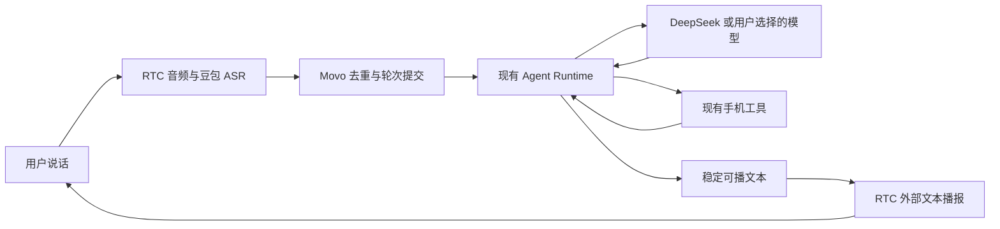
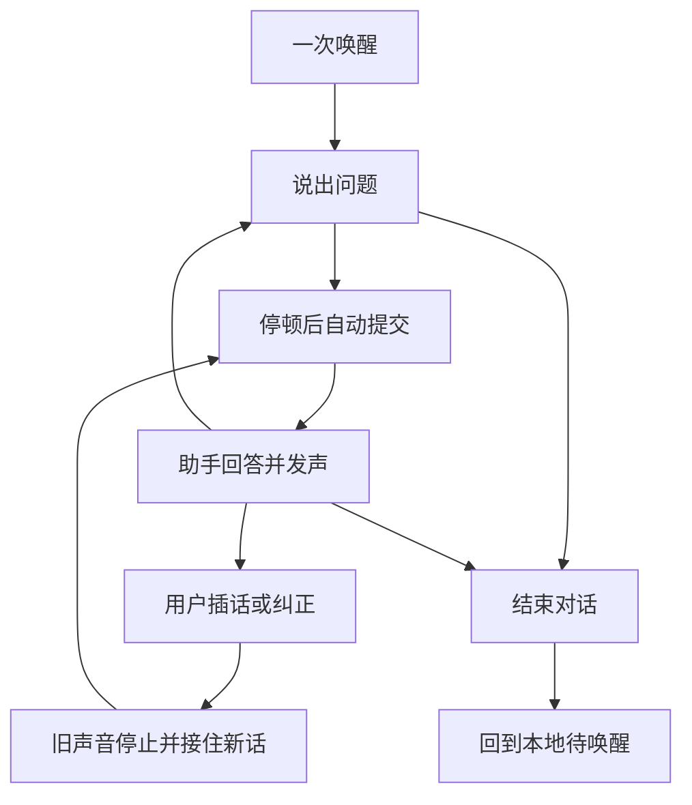

# 火山语音能力与复用选型

调研时间：2026-09-22。初稿为官方资料和代码研究；随后已执行独立 ASR/TTS 与 DeepSeek 真机能力探针，见 [P0 实测](P0能力验证.md)。本次补充 [O2.0 Dialog 委托模式复核](DialogSDK复用验证.md)，产品尚未集成。

## 1. 结论

**可以利用火山能力减少工作量，同时保留 DeepSeek 和现有 Movo Agent。端到端模型与独立语音能力必须分开选型。**

- 豆包实时语音模型 3.0（Seeduplex）固定使用自己的语音对话模型，不能把内部思考环节替换为 DeepSeek。把 Movo/DeepSeek 封装成它的工具，是增加一层豆包对话决策，不等于保留原来的主模型。
- 独立豆包 ASR 和 TTS 接口/SDK 不要求使用豆包聊天模型。Movo 仍可在两者之间使用 DeepSeek、现有工具循环和模型配置。
- **O2.0 Dialog SDK 还有客户端 TTS 委托模式**：可以保留 DeepSeek 生成答案，SDK 识别结束后接收外部文本并播报。此前漏查该模式；它控制播报来源，但未承诺关闭默认云模型推理及计量。
- RTC 实时对话式 AI 的模块化方案支持第三方 LLM，也有关闭自动 LLM、接收外部文本播报的接口。它可能进一步接管语音轮次和播报，但与本地 Agent 的组合仍需 PoC。

用户明确关注模型自由选择后，不采用直接播放豆包默认答案的架构。独立 ASR/TTS 已有组件实测，保留为比较基线；当前优先验证 **O2.0 Dialog 委托模式 + Movo/DeepSeek**，核对是否可进一步复用识别端点、内置录放和 AEC。现有端到端服务已经开通，不需要先申请 SAMI 或 RTC。最终只选一条供应商路线，不建设自动降级链路。

关联：[主方案](../../solutions/voice-conversation.md)、[当前代码链路](语音对话现状与链路调研.md)、[方案复审记录](方案复审记录.md)。下文是选型补充，尚不是供应商集成验收结果；实施范围以复审后的主稿和协议附录为准。

## 2. 接法的区别

| 接法 | 谁理解问题、决定工具和答案 | 能否继续以 DeepSeek 为主模型 | 工作量与代价 |
|---|---|---|---|
| Seeduplex 全双工 Android SDK | 豆包语音模型；可调用客户端工具 | 不能直接替换；工具转调不是同一语义 | 录播、AEC、语音模型链路集成度高，但改变 Movo 的对话决策和上下文边界 |
| O2.0 Dialog SDK 客户端 TTS 委托 | Movo 当前 Agent/DeepSeek 决定最终答案 | 可以传入外部正文并选择只播放该来源 | 有官方时序；需实测录放/端点/任务衔接，默认豆包推理及用量未被承诺关闭 |
| 独立豆包 ASR + Movo + 独立 TTS SDK | Movo 当前 Agent/所选模型 | 可以 | 迁移少；省合成协议和基础播放实现，仍需管理轮次、插话与声学效果 |
| RTC + CustomLLM | 配置的第三方模型/Agent | 可以，需满足服务接口契约 | RTC 编排 ASR/LLM/TTS；本地 Android Runtime 不能直接冒充公网服务，需要桥接 |
| RTC 关闭自动 LLM + 本地 Movo + 外部文本播报 | 本地 Movo | 设计上可以保留 | 有望省更多语音编排；关闭 LLM 后的字幕、判停、打断和 TTS 配置组合未联调 |

官方依据：[全双工 API](https://docs.volcengine.com/docs/DoubaoVoice/endtoend-realtime-voice-full-duplex-version?lang=zh)、[第三方 LLM 接入](https://docs.volcengine.com/docs/real_time_communication/Accessthird-partylargemodelsoragents?lang=zh)、[StartVoiceChat](https://docs.volcengine.com/docs/real_time_communication/StartAIconversationStartVoiceChat-1?lang=zh)。

## 3. 已确认的能力及边界

### 3.0 本轮补充：Dialog 委托模式

官方旧 Android 文档明确提供 `DIALOG_WORK_MODE_DELEGATE_CHAT_TTS_TEXT`、每轮 `USE_CLIENT_TRIGGER_TTS` 和 `ChatTtsText`。后者不要求文本由豆包生成。它与直接使用端到端默认回复，以及需要豆包总结的 `ChatRagText` 不同。用该接法保留 DeepSeek 有文档依据；不能将 SDK 一概排除。

当前 SDK 支持内置 AEC 并附模型。O2.0 的旧协议与官网新 3.0 全双工协议必须区分；参数、官方依据、控制台权限和探针结果统一见 [DialogSDK复用验证](DialogSDK复用验证.md)。独立回调是否位于 AEC 后、唤醒连说的麦交接与双讲仍未验证。

### 3.1 独立 ASR：服务端已经有分句信号

官方流式 ASR 文档说明：二遍识别可在分句稳定时返回 `definite=true`；`end_window_size` 根据静音强制判停，显式配置后不使用语义分句。**这是识别分句，不等于 WebSocket 整体结束，也不必然等于用户完整一轮意图。**

当前 `DoubaoSaucProtocol.defaultFullClientJson` 已发送 `enable_nonstream=true`、`show_utterances=true`、`end_window_size=800`。`DoubaoBidirectionalAsrEngine.handleServerBytes` 只是保存 definite 文本，只有 `frame.isLast` 才触发收尾。这为“说完仍停在听写”提供了明确的代码解释；本轮未据此声称所有现场问题都已复现。

应先扩展现有 ASR listener，传出分句、时间边界和稳定性，作为会话端点候选。对 full 累积结果按分句身份/时间去重，处理句末补话和短命令；不能每次看到 `definite=true` 就提交整个累积全文。默认 800ms 也不能直接当作自然对话验收标准。

这能缩小原先从头实现端点检测的范围，但用于快速插话的本地起声检测、无声等待上限和补话竞态仍需处理。普通 ASR 分句与 RTC 的 `AIVAD` 是不同能力，不能混用参数或效果承诺。[流式 ASR API](https://docs.volcengine.com/docs/DoubaoVoice/LargemodelstreamingautomaticspeechrecognitionAPI?lang=zh)

### 3.2 独立 TTS SDK：不绑定聊天模型

当前官方 Android 文档列出 `speechengine_tob:0.0.15.0`，提供文本增量输入、音频增量输出、合成会话管理、内置播放器、暂停/恢复以及播放回调。输入可以来自 DeepSeek，也可以来自现有任意模型。

因此先验证 SDK，避免直接自建整套 TTS WebSocket 和 PCM 播放器。Movo 仍负责只交付稳定可播正文、过滤思考/工具日志、丢弃旧轮次结果，以及区分合成结束与播放结束。暂停播放不是清空旧队列，取消合成也不能直接当成旧音已停止的证据。

独立 ASR 文档仅说明可借 `VOICE_COMMUNICATION` 使用系统 AEC，效果取决于硬件；不能把 Dialog 全双工 SDK 的内置 AEC 自动算到 ASR+TTS 组合上。[当前 TTS SDK](https://docs.volcengine.com/docs/DoubaoVoice/bidirectional-streaming-tts-android-sdk-interface-documentation?lang=zh)、[当前 ASR SDK](https://docs.volcengine.com/docs/DoubaoVoice/large-model-streaming-automatic-speech-recognition-android-sdk-interface-documentation?lang=zh)

### 3.3 RTC 模块化：可以使用自己的模型

`CustomLLM` 要求可访问的 HTTPS 接口和规定的 SSE 响应，接口响应超时为 10 秒。它支持第三方 Agent，不是只能选豆包；但“把 DeepSeek API URL 填进去”和“复用 Movo 本地 Agent、权限、工具循环”是两件事。前者不会自动得到后者。

RTC 提供静音判停、`AIVAD` 语义判断、自动触发和打断策略。这些可减少自行拼装轮次逻辑的工作；当前页面将 AIVAD 标注为限时免费公测。对于会执行外部动作的 Movo，不能把 ASR 中间结果的 `Prefill` 预请求直接当成可执行任务，需避免重复副作用。[第三方接入](https://docs.volcengine.com/docs/real_time_communication/Accessthird-partylargemodelsoragents?lang=zh)、[判停与触发](https://docs.volcengine.com/docs/real_time_communication/Judgmentstopanddialoguetrigger?lang=zh)、[打断 AI](https://docs.volcengine.com/docs/real_time_communication/InterruptAITerminateandstartanewconversation?lang=zh)

### 3.4 RTC 仅托管语音：有官方接口依据，组合待验证

`StartVoiceChat` 说明 `LLMConfig.AutoActive=false` 会禁用自动 LLM/TTS 链路，但仍可通过 `UpdateVoiceChat` 传入文本播报。另有 `ExternalTextToSpeech` 客户端控制通道，以及含 `userId/sequence/definite/paragraph/roundId` 的字幕回调。

据此可提出以下接法，**它是基于文档的组合推断，尚未运行验证**：

若验证成立，不需要把本地任务执行器改为公网 LLM 服务；仍要解决 RTC 房间、Token、Start/StopVoiceChat 及调用凭据的控制面集成，不是零配置 SDK 替换。

必须验证：关闭自动 LLM 后是否继续提供所需的 ASR 轮次信号和 AIVAD；TTS 音色及资源配置怎样生效；客户端外部播报是否与服务端控制一致；打断旧语音时能否及时废弃已排队片段。不能因为单个接口存在就宣称整条链路可用。

外部文本播报要求完整分句、有末尾标点且单次不超过 200 字符；高频碎片可能乱序。`CustomInfo.finish` 表示业务文本分发结束，不是设备实际播放完成。字幕 `paragraph` 也不是通用的播放完成标志。[StartVoiceChat](https://docs.volcengine.com/docs/real_time_communication/StartAIconversationStartVoiceChat-1?lang=zh)、[外部文本播报](https://docs.volcengine.com/docs/real_time_communication/PassincustomtextforAItobroadcast?lang=zh)、[字幕](https://docs.volcengine.com/docs/real_time_communication/Real-timesubtitlesconversationrecords?lang=zh)

### 3.5 端到端 SDK 为什么不作为此次默认选择

全双工 API 当前固定 `session.model=1.2.6.1`，支持客户端函数调用。对应 Android SDK 有录音、播放、AEC 模型和音频回调，确实可以大幅减少语音底层实现；但其主对话模型就是豆包。RTC 旧的 S2S 混合编排还只允许方舟 LLM，不能套用成“端到端任意换 DeepSeek”。

工具返回可以驱动豆包继续回答，不能保证所有回复逐字来自 Movo；工具执行取消也仍由 Movo 处理。SDK 静音保活存在计费，常驻本地唤醒不能等同于常驻云端会话。[全双工接入必读](https://docs.volcengine.com/docs/DoubaoVoice/access-mustread?lang=zh)、[全双工 Android SDK](https://docs.volcengine.com/docs/DoubaoVoice/endtoend-full-duplex-android-sdk-documentation?lang=zh)、[RTC S2S 模式限制](https://docs.volcengine.com/docs/real_time_communication/Accessend-to-endreal-timespeechlargemodel?lang=zh)

## 4. 对原方案工作量的实际影响

| 原计划工作 | 调研后的处理 |
|---|---|
| 从零实现轮次端点策略 | 先接现有 ASR 分句信号；保留本地 VAD、补话、幂等、超时；RTC 语义判停仅为后续可选研究 |
| 自写 TTS 网络协议、音频解码、基础播放器 | 优先复用官方 TTS SDK；验证停止与进度后再决定是否需要自有播放器 |
| 为 SDK 迁移重写已有 ASR | 暂无必要；现有协议已实现，先增量补齐分句事件 |
| 共享采集、唤醒首字不丢 | 仍需做；SDK 也必须服从单一麦 owner，不能新增抢麦 |
| 外放 AEC、耳机和路由 | 独立方案仍需实机验证；不声称自动继承全双工 SDK 的 AEC |
| 会话生命周期和状态 UI | 仍需做；现有浮窗隐藏不能终止会话 |
| Agent 取消、工具事实、历史一致性 | 沿用现有 Runtime 扩展，任何语音供应商都不能代办 |
| provider 全量 speech-commit 改造 | 首期仅播整个 run 正常结束的最终正文，包括工具执行完成后的结果；不播工具中间叙述，不新增跨 provider 的 speech 事件 |

具体复用落点：`EtaAsrEngine.kt` 扩分句事件；`DoubaoBidirectionalAsrEngine.kt` 透传；`DoubaoSaucProtocol.kt` 保留解析；现有 `EtaWakeWordService`/麦协调器承载会话；`AgentRuntimeClient` 保留模型与执行；TTS 新增一个 SDK 适配层。原主方案拟新增的网络合成器和基础播放器先不各自实现一套。

这是模块级减负判断，未形成可承诺的人日或百分比估算。最终正文才开始播报能省稳定流处理，但会增加首声等待；不能用它替代自然打断、连续收听和真实有声输出。

## 5. 验证顺序与决策门槛

1. 用现有 ASR 采集真实 `partial/definite/末包` 时间轴，覆盖短命令、句中停顿、补话、full 重复结果；确认哪些信号能可靠提交。
2. 验证官方 TTS SDK 能将同一份 DeepSeek 回复顺序播出；覆盖取消、暂停、播放器积压及迟到片段，不接入豆包聊天模型。
3. 首期补齐独立 SDK 与现有采集的 AEC、后台音频焦点、停止回调隔离和真实首声时延验证。RTC 仅托管语音如后续另行推进，再核对 §3.4 的组合条件、额外凭据/控制面工作、费用和兼容性，不占用本次必需实施链路。
4. 无论选哪条，真实外放下完成三轮免触屏对话、自然插话、工具执行中取消、浮窗隐藏后继续会话。测试保留包版本、音源、输入/输出声学证据与时序。

独立 SDK 是已经实测的比较基线，O2.0 Dialog 委托是本轮优先验证路线，RTC 保留为后续研究；它们不是运行时失败后自动切换的通道。最终只实施选定路线。SDK 如不满足外放、停止或时延硬需求，应携带 P0 证据重新评审，不增加系统识别或其他供应商的隐式切换。

RTC 的服务处理、模型、第三方调用等存在不同计费项，自带凭据不代表免 RTC 费用；估算应按实际 API 版本和用量进行，本轮未购买服务。[RTC 计费](https://docs.volcengine.com/docs/real_time_communication/AIaudiovideointeractivebilling?lang=zh)

## 6. 证据与本轮交付边界

- 官方正文已用浏览器读取并保存在 [调研目录](../../../tmp/tasks/2026-09-22-volcengine-voice-research/)，包括 API、当前 0.0.15.0 SDK、RTC 自动/手动控制、字幕和计费。
- 下载官方 `SpeechDemoAndroid.zip`，静态抽读 `BigAsrActivity`、`BiTtsActivity`、`DialogDuplexActivity`；仅说明存在对应参考实现，不表示 demo 已运行。
- 搜索最先命中的大写路径 `BidirectionalStreamingTTS-AndroidSDKInterfaceDocumentation` 属历史文档。选型以当前小写路径的 0.0.15.0 文档为准，避免混用 0.0.14.x 指南。
- 本轮只更新文档，没有改产品源码、开通服务、构建 APK 或操作云真机。AEC、端点准确率、DeepSeek 联调及 RTC 组合均未验收。

## 7. 变更记录

2026-09-22：用户要求评估火山现成方案，并追问是否绑定聊天模型。补充端到端/独立 SDK/RTC 的模型边界，撤回“默认采用端到端 SDK”的初步推荐；明确保留 DeepSeek 的优先路线、可减工作项和 PoC 门槛。

2026-09-22 深入复审：同步主方案的单一路线，移除首期必做 RTC PoC 和全 provider speech-commit 改造；增加 SDK 停止/回调隔离、声学和时延验证。未改变模型自由选择约束，未进行供应商集成验收。

2026-09-22 P0 实测补充：[独立探针验证](P0能力验证.md)已在 Android 15 上完成 DeepSeek 最终正文 → 官方 TTS SDK → 扬声器 → 物理麦回录，证实此组合不必使用豆包聊天模型。目标产品尚未集成；系统 AEC 的 ON/OFF 配对都近乎静音，近端保真未知；手机模型请求到明确语音位置估计约 3.72–4.05 s，尚不含端点和 ASR。SDK 可减去合成与基础播放工作，但不能据此省掉端点、声学、停止隔离和时延验证。
