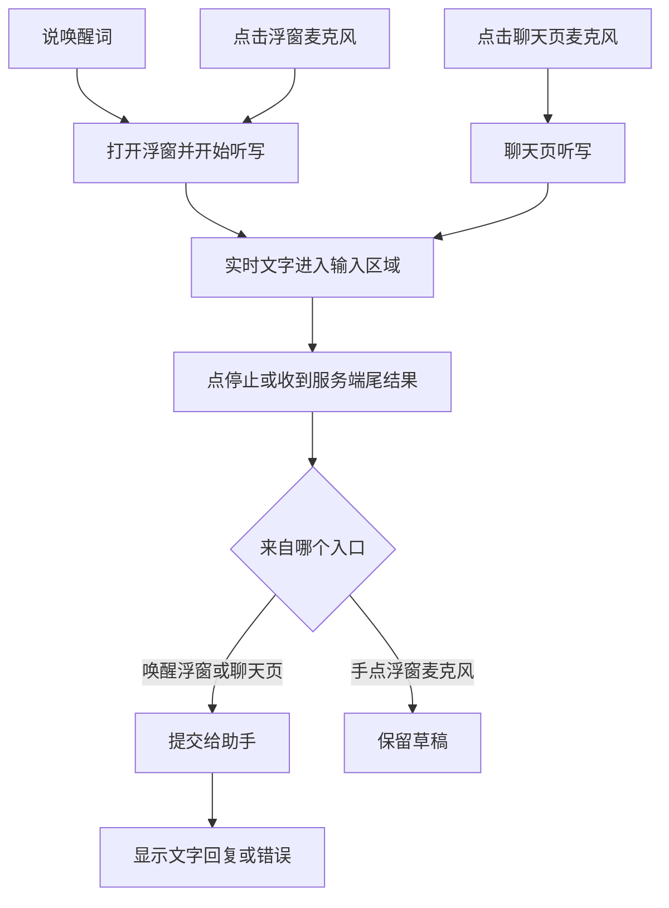
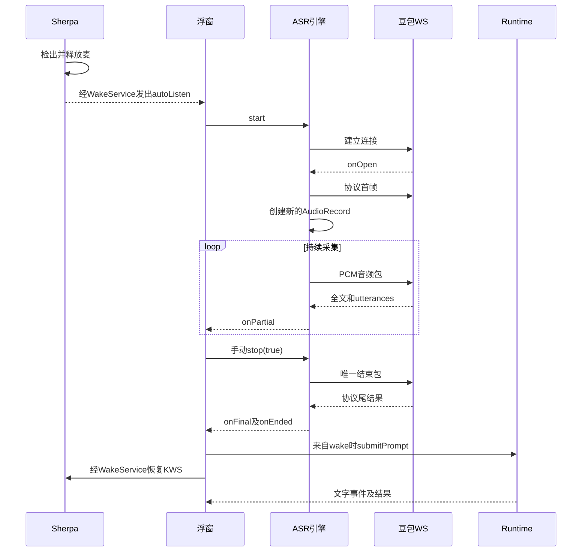

# 语音对话现状与链路调研

> 2026-09-22 复审补充：本文保留现有代码事实；当日后续官方资料核查及 Runtime 准入/断连的新发现见 [火山选型](火山语音能力与复用选型.md) 和 [方案复审记录](方案复审记录.md)。未来实施范围以 [主方案](../../solutions/voice-conversation.md) 为准；没有 speech commit 不代表首期必须新增该事件。

| 项目 | 内容 |
|---|---|
| 对象与目的 | Movo 自有语音入口；解释不能自然发送、没有播报和不能连续对话的代码原因 |
| 类型 | 功能链路调研 |
| 范围内 | 唤醒、采集、豆包 ASR、浮窗/聊天提交、Runtime 事件/取消/历史、音频与进程边界 |
| 范围外 | 厂商语音助手自身的音频实现、供应商算法内部、未进行的机型运行验证 |
| 代码快照 | `9b5b58dc476033511711cee2eaebe7c8c8c0458d`，2026-09-22，本轮未改产品源码 |

## 1. 结论先行

当前实现是本地唤醒和流式听写接到文字 Agent，尚未形成连续语音会话。

1. 客户端没有 VAD、无语音等待上限或自然轮次结束器；`stop(true)` 后的 5 秒是等待 ASR 尾结果，不是停顿自动发送。
2. 唤醒录音与 ASR 录音分开创建，中间有窗口准备和建连，未传递预录音频；存在漏掉紧接唤醒词的指令开头的结构性风险，实际时长未测。
3. 入口语义不一致：唤醒浮窗 final 自动提交，手点浮窗麦 final 留草稿，普通聊天麦 final 自动提交。
4. Movo 自有链路没有 TTS、播放反馈、续听或自然插话；小爱私有反射 TTS 属于另外的 hook 链路。
5. Runtime 有可复用取消和上下文机制，但正文可修订、包含工具回合；没有不可撤回的可播报句子或已播放记录。

| 问题 | 阅读位置 |
|---|---|
| 为什么一直停在语音输入 | §4.2、§5 |
| 为什么不能一直接着聊 | §4.3、§4.4 |
| 为什么不能直接给文字流接朗读 | §4.3、§6 |
| 哪些结论还没有实测 | §7、§8 |

## 2. 术语表

| 术语 | 含义 | 与易混项的区别 |
|---|---|---|
| `definite` | 当前解析器保留的分句标志 | 不等于客户端 `onFinal`；后续官方核查确认是稳定识别分句，详见火山调研 |
| `isLast` | 当前协议解析器由 flags/负序号得到的尾帧标志 | 不是根据文本标点或静音推导 |
| ASR segment | 一次识别连接对应的音频范围 | 现有代码没有独立用户 turn 模型 |
| Runtime run | 一次 Agent 执行，含多轮模型/工具交互 | 不等于持久会话或一次音频播放 |
| history / journal | 模型上下文与展示归档的不同数据用途 | 当前都不表示用户实际听到了哪里 |

## 3. 现状全景

### 3.1 用户入口

这是已确认的代表性操作路径。服务端自然何时主动返回尾结果未在本轮确定；图中的“服务端尾结果”不代表自然停顿自动发送已经验收。

### 3.2 系统与进程

| 模块 | 当前职责 | 边界 |
|---|---|---|
| WakeWordService / Sherpa | 本地采集与 KWS、设置监听、麦前台通知 | 主进程；服务实例持有 coordinator |
| OverlayService / 聊天 Compose | ASR 生命周期、草稿和提交 | 主进程；状态随各自 UI 生命周期变化 |
| Doubao ASR | 新建采集器、WS PCM 流、文字回调 | 供应商外部边界 |
| Runtime | 模型/工具循环、流事件、取消、快照和结果恢复 | 主进程中的服务，已有 Messenger 协议 |
| VIS / VoiceInteractionSession | 系统助理入口与转交 | 分别 `:voice` / `:voice_session`；不能共享主进程静态实例 |
| 厂商 hook | 注入外部助手进程，使用其能力 | 不在本次自有音频主链 |

## 4. 技术链路

### 4.1 唤醒到录音

`EtaWakeWordController` 根据开关和麦权限启动 `EtaWakeWordService`；`WakeEngineFactory` 固定选 Sherpa。Sherpa 检出词后先停止并释放自己的 `AudioRecord`，回调仅带 `phrase`，没有采样位置或 PCM。

`handleWakeDetected` 尝试系统会话再走浮窗，浮窗可能先等截图，再显示并调用 `startDictation(fromWake=true)`。`isListening=true` 设置早于 WS 成功和实际采集开始；当前没有 audio-ready 回调或可听就绪提示。

VIS 的 `activeService` 位于 `:voice`；主进程直接读取该静态字段不能访问另一进程实例。源码据此推断 wake 路径通常落到 overlay 分支，未用设备单独测量该分叉。

### 4.2 识别、结束与提交

`EtaAsrSessionFactory` 固定豆包，没有失败后切系统识别。`SaucAudioStream` 串行分配序号并发送首包/音频包/末包，结束操作幂等。

`handleServerBytes` 将非空全文发为 partial，把 definite 分句拼接后保存在私有变量；只有 `frame.isLast` 自动进入 `finishSession`。`stop(true)` 停采集、发末包并设置 5 秒等 final 超时。`finishSession` 优先使用 `latestText`，其次 `definiteText`，非空才触发 `onFinal`。

普通聊天 `startChatDictation.onFinal` 直接 `onSubmit(text)`；浮窗用 `fromWake` 判断是否提交。两者生成期间均拒绝开始新听写。

### 4.3 Runtime 回复、流式修订与取消

`submitPrompt` 创建 runId，携带 history、conversationKey 和可选截图进入 `AgentRuntimeClient.run`。事件按 TEXT / THINKING / TOOL_CALL 分型；UI projector 支持块尾替换正文，Responses provider 实际会发这种替换。

`AgentLoop` 一轮可能先产生 TEXT 再执行工具；只有该轮无工具、补充队列已处理、正文非空时才产生最终结果。空正文会失败。当前没有提前声明“这是不可撤回的最终回答句子”的协议。

取消沿 Client → Service → RunController → 网络/工具资源传播，已执行外部操作不会事务回滚。`AgentToolBatchRecovery` 对未完成工具补中断结果，保留“执行状态未知”的语义。

正常取消可以携带 `contextSnapshot/transcript`；但浮窗 `stopCurrentRun` 先清 activeRunId，结果回流被 guard 拒绝。对未来连续语音而言存在取消后上下文接续风险，这是代码推断，未做设备复现。普通聊天结果归并保留 active run 到终态，可作为对比基础。

### 4.4 归档、隐藏与会话终止

浮窗成功后写回 snapshot/history、显示 Completed，没有 TTS 或重新听写调用。前台工具需要操作屏幕时，窗口真实移除后 Runtime 继续；如果窗口因工具而隐藏，结果到达后会 `stopSelf`。`onDestroy` 又会停止听写、取消 run、销毁 scope。

history、journal、checkpoint、未确认结果 outbox 和长期 run archive 已有不同存储路径。当前均无播放游标。`AgentRuntimeHistoryReducer` 按 runId 幂等，因此播完后再次 apply 同一个 run 不能自然成为“播放记录更新”。

## 5. 关键规则与语义

| 参数/状态 | 当前值或行为 | 执行点 |
|---|---|---|
| 音频 | 两路都是 VOICE_RECOGNITION、16 kHz、mono、PCM16 | Sherpa / AsrPcmCapture |
| ASR 发包 | 约 200 ms 一包 | SaucAudioStream / Protocol |
| ASR 请求 | enable_nonstream=true、show_utterances=true、result_type=full、end_window_size=800 | defaultFullClientJson |
| final timeout | stop(true) 后 5 秒 | DoubaoBidirectionalAsrEngine |
| wake 冷却 | 2500 ms | EtaMicSessionCoordinator |
| wake 关闭 | 当前立即停采集并 stopSelf | EtaWakeWordService |
| 通话暂停 | coordinator 有方法，生产代码无调用方 | onCallInterrupted/onCallResumed |
| ASR 鉴权 | Api-Key 或 App-Key+Access-Key；实际值不在本文读取或记录 | VoiceSettings / SecretStore |
| UI phase | READY / PROCESSING / ERROR；listening 另存 | EtaVoicePanel / Overlay |
| SDK | minSdk 34、targetSdk 36；Sherpa 1.13.8 | app 构建配置 |

## 6. 面向后续方案的现状接口

| 接入点 | 已有能力 | 当前缺口/耦合 |
|---|---|---|
| Mic coordinator | wake/dictation 原子阶段与冷却 | 不持有录音设备，不是完整会话控制器 |
| PCM 采集器与 Sherpa | 权限、读取、停止解阻塞、KWS 解码 | 各自建麦，无共享输入或缓冲 |
| ASR Listener | partial/final/error/ended | 未暴露 ready、句时标、definite；无端点决策 |
| Runtime 事件与取消 | 分型事件、单 run 终态、资源取消 | 没有稳定 speech commit 或类型化取消 outcome |
| Runtime 上下文 | snapshot、工具恢复、history/journal | 没有播报进度；中断不能直接裁掉所有工具上下文 |
| Overlay/EntrySurfaceGuard | 前台工具避让、真实 detach、转入聊天 | 会话与浮窗服务绑定 |
| VoiceSettings / SecretStore | Flow、认证模式、加密存储、编辑和连通测试 | 目前仅 ASR 配置；静音 probe 不能证明 TTS 可用 |
| XiaoAiStreamRenderer | hook 内整段完成后反射朗读 | 依赖锁定版本私有类和外部 ClassLoader，无通用 PCM/播放反馈 |

## 7. 冲突与未知项

| 项目 | 核查结果与证据边界 |
|---|---|
| 旧方案“纯文字入口”描述 | 属历史基线；当前已有 ASR/KWS，实现摘要与源码应分开看 |
| 旧方案把 TTS/打断/多轮后置 | 与用户本次完整语音助手目标不同；不是已实现能力 |
| “final 后提交已测” | 既有声学测试主动点停止；不能证明自然端点或有声多轮 |
| end_window_size 的最新官方语义 | 初查详情页未成功；后续同日官方核查确认按静音强制分句，不证明整场自动终结，见火山调研 |
| 唤醒后采集空档 | 结构确认，时间和漏字率未知；需音频时间轴 |
| AEC/焦点/路由 | 项目 Kotlin 无显式实现；平台隐式处理及实机效果未知 |
| 取消后快照的运行表现 | 代码链路确认；长工具取消时限和插话竞态未测 |
| 系统 RecognitionService | 有系统适配旁路，非豆包失败降级；实际系统调用未测 |

## 8. 自校验与验证状态

已完成两条独立代码链路的逐跳核查，主流程抽读了 ASR 尾结果、coordinator、Runtime 事件、AgentLoop、上下文和配置结构。外部资料单独整理，未提升成项目运行事实。

本轮只做文档调研，未重新构建、未执行产品测试、未操作云真机。最终结构、索引路径和文档链接的校验记录位于过程目录 `validation.json`；这类校验不代表语音功能通过。

## 9. 关键文件索引

路径相对仓库根；行号为上述快照定位提示。

| 章节 | 文件 | 关键符号/职责 |
|---|---|---|
| 3、4、5 | `app/src/main/kotlin/io/github/mangi/eta/agent/voice/EtaWakeWordService.kt` | 39、46–193、270–317：实例协调器、前台服务、wake转交 |
| 4、5、6 | `app/src/main/kotlin/io/github/mangi/eta/agent/voice/EtaMicSessionCoordinator.kt` | 11–86：阶段、冷却、未接入电话方法 |
| 4、5、6 | `app/src/main/kotlin/io/github/mangi/eta/agent/voice/wake/SherpaWakeEngine.kt` | 153–204：独立采集与phrase回调 |
| 3、4、6 | `app/src/main/kotlin/io/github/mangi/eta/agent/voice/EtaAssistantOverlayService.kt` | 279–330、457–547、810–885：识别、提交、取消、隐藏 |
| 3、4 | `app/src/main/kotlin/io/github/mangi/eta/ui/components/AgentChatBody.kt` | 1172–1206：聊天final自动提交 |
| 4、6 | `app/src/main/kotlin/io/github/mangi/eta/agent/voice/asr/EtaAsrSessionFactory.kt` | 7–69：固定豆包与会话身份过滤 |
| 4、6 | `app/src/main/kotlin/io/github/mangi/eta/agent/voice/asr/EtaAsrEngine.kt` | 6–17：listener契约 |
| 4、5 | `app/src/main/kotlin/io/github/mangi/eta/agent/voice/asr/DoubaoBidirectionalAsrEngine.kt` | 44–234：WS、采集、停止、尾结果 |
| 4、5、6 | `app/src/main/kotlin/io/github/mangi/eta/agent/voice/asr/AsrPcmCapture.kt` | 23–101：独立AudioRecord |
| 4、5 | `app/src/main/kotlin/io/github/mangi/eta/agent/voice/asr/SaucAudioStream.kt` | 9–36：发送排序和唯一末包 |
| 4、5 | `app/src/main/kotlin/io/github/mangi/eta/agent/voice/asr/DoubaoSaucProtocol.kt` | 138–164、183、225–295：请求、句数据、尾帧 |
| 4、6 | `app/src/main/kotlin/io/github/mangi/eta/agent/runtime/AgentEvent.kt` | 86–133：正文/思考/工具和replacement |
| 4、6 | `app/src/main/kotlin/io/github/mangi/eta/agent/model/AgentLoop.kt` | 153–228、254–280：工具回合、最终正文、取消检查 |
| 4、6 | `app/src/main/kotlin/io/github/mangi/eta/agent/model/AgentModelClient.kt` | 195–207、283–295：取消快照与消息DTO |
| 4、6 | `app/src/main/kotlin/io/github/mangi/eta/agent/runtime/AgentRuntimeWire.kt` | 150–161、206–218、493–540：请求/结果序列化 |
| 4、6 | `app/src/main/kotlin/io/github/mangi/eta/agent/model/AgentContextSnapshot.kt` | 8–17：上下文快照 |
| 4、6 | `app/src/main/kotlin/io/github/mangi/eta/agent/runtime/AgentRuntimeSession.kt` | 134–174：唯一终态 |
| 4、6 | `app/src/main/kotlin/io/github/mangi/eta/ui/app/AgentRuntimeHistoryReducer.kt` | 15–47：history/journal及run幂等 |
| 4、6 | `app/src/main/kotlin/io/github/mangi/eta/agent/runtime/AgentRunCheckpointStore.kt` | 111–120：运行快照 |
| 5、6 | `app/src/main/kotlin/io/github/mangi/eta/data/model/VoiceSettings.kt` | ASR参数、认证与wake设置 |
| 6 | `app/src/main/kotlin/io/github/mangi/eta/hook/xiaoai/XiaoAiStreamRenderer.kt` | 162–180：私有TTS反射 |
| 3、5 | `app/src/main/AndroidManifest.xml` | 45–139：进程与FGS边界 |
| 7 | `docs/voice-input-wake-word.md` | 旧目标及分轮实现摘要 |

## 10. 关联文档与过程件

- [成熟语音对话机制调研](成熟语音对话机制调研.md)
- [Movo 连续语音对话方案](../../solutions/voice-conversation.md)
- [采集逐跳记录](../../../tmp/tasks/2026-09-22-voice-conversation-design/capture-research.md)
- [Runtime、取消与存储逐跳记录](../../../tmp/tasks/2026-09-22-voice-conversation-design/runtime-research.md)
- [仓库画像](../../../tmp/tasks/2026-09-22-voice-conversation-design/repo-profile.md)、[追踪汇总](../../../tmp/tasks/2026-09-22-voice-conversation-design/trace-log.md)、[未决项](../../../tmp/tasks/2026-09-22-voice-conversation-design/open-questions.md)
