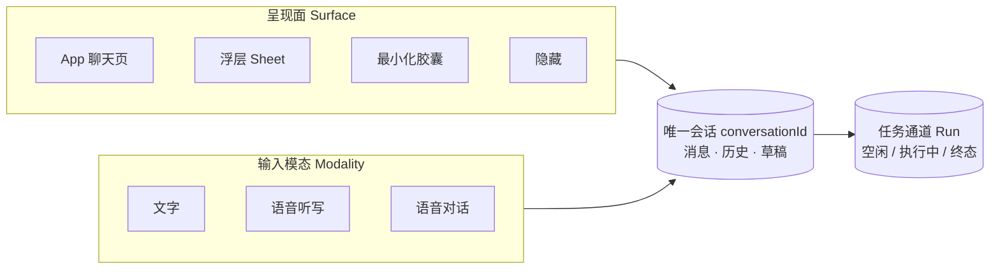
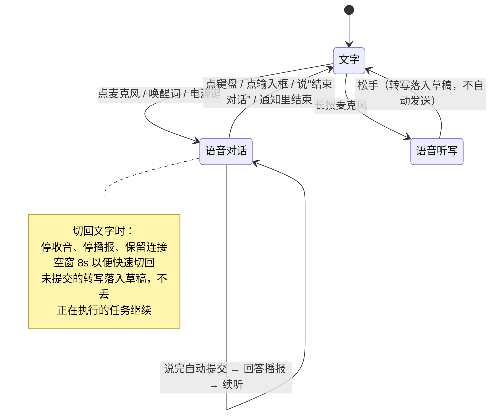

# Movo 助手交互统一方案（对话 / 浮窗 / 语音）

> 2026-09-23 后续修复：代码审查指出的 F1–F9 已进入修复与回归，当前行为以[统一交互修复与回归](../research/assistant-interaction/统一交互修复与回归.md)为准。以下阶段 A/B 的初次实现记录保留，不能替代本轮测试结果。

> 针对反馈"无论是对话、浮窗，还是语音，交互乱七八糟"。本文不推翻已经真机验证通过的连续语音对话能力（见[产品集成与验收记录](../research/voice-conversation/产品集成与验收记录.md)），只重构**入口、界面形态与模态切换**这一层。
>
> 竞品事实与出处见[助手交互形态竞品调研](../research/voice-conversation/助手交互形态竞品调研.md)。本文第 2 节的每条问题都给出代码位置，可逐条复核；第 3 节之后是设计，未实现的部分明确标注。
>
> 基线代码：`d517a01`（main）。**阶段 A 与阶段 B 已实现**，实现与本文设计的差异、原因和未做项见第 7 节「实现记录」。第 2 节的问题清单保留为改造前的现状证据，行号对应 `d517a01`。

## 0. 一句话结论

**"语音"不应该是一个入口、一个窗口、一条独立链路，而应该是当前会话上的一个输入模态开关。**

现在 Movo 把"语音"做成了一个独立的全屏悬浮窗 + 一条独立的会话链路，所以出现了三套对话渲染、两份会话历史、语音和文字互相锁死。收敛方式是把交互拆成四个**互相正交**的维度：

| 维度 | 取值 | 谁来拥有 |
|---|---|---|
| **会话** Conversation | 唯一一条，`conversationId` | `AgentAppState` |
| **呈现面** Surface | App 页 / 浮层 Sheet / 最小化胶囊 / 隐藏 | 窗口容器 |
| **输入模态** Modality | 文字 / 语音听写 / 语音对话 | 会话上的一个状态位 |
| **任务通道** Run | 空闲 / 执行中 / 终态 | `AgentRuntimeService` |

四个维度谁都不能替另一个做决定：换面不换会话，换模态不换会话、不杀任务，结束语音不结束任务，任务在跑也不阻止说话。

## 1. 现状的入口与界面清单

| 入口 | 触发 | 现在落到哪 | 代码 |
|---|---|---|---|
| 唤醒词（本地 Sherpa） | 说唤醒词 | 优先系统 VIS 会话，失败则直接起全屏悬浮窗，并自动开始语音 | `EtaWakeWordService.kt:186-191` |
| 电源键 / 系统助理 | 长按电源键 | `EtaVoiceInteractionSession.onShow` → 同一个全屏悬浮窗（不自动开始语音） | `EtaVoiceInteractionSession.kt:39-41` |
| `ACTION_ASSIST` | 系统助手手势 | `EtaVoiceAssistActivity` → 转 VIS 会话 → 同一悬浮窗 | `EtaVoiceInteractionService.kt:46-52`、`AndroidManifest.xml:80-92` |
| App 聊天页麦克风按钮 | 点击 | **另弹一个全屏悬浮窗**，并自动开始语音 | `AgentChatBody.kt:864-875, 966-974` |
| 语音前台通知 | 点击通知体 / "结束语音" | 重新显示悬浮窗 / 结束语音 | `EtaAssistantOverlayService.kt:341-348` |
| 悬浮窗内"打开对话" | 点击 | 交给 `MainActivity` 或结果 Sheet Activity | `EtaAssistantOverlayService.kt:1043-1060` |
| Runtime 结果 handoff | 任务完成 | `AgentConversationSheetActivity`（可拖拽高度的 Sheet） | `AgentConversationSheetActivity.kt` |

**三套对话渲染并存**：`AgentChatBody`（App 页）、`EtaVoicePanel`（悬浮窗内的迷你会话）、`AgentConversationSheet` + `AgentConversationContent`（Sheet Activity）。

## 2. 具体问题（逐条带证据）

### P1 同一个悬浮窗里，打字和说话进的是两条不同的会话

- 在悬浮窗里**打字**提交：走 `runtimeClient.run(...)`，`modelSessionId = conversationKey`，而 `conversationKey = "eta_assistant_${UUID.randomUUID()}"` 是每次起服务新建的临时会话，历史存在服务自己的 `conversationHistory` 字段里。
  `EtaAssistantOverlayService.kt:99, 541-560`
- 在同一个悬浮窗里**说话**提交：走 `appState.sendVoiceMessage(sharedConversationId, ...)`，而 `sharedConversationId = appState.voiceConversationId()` 是 App 当前选中的那条真实会话。
  `EtaAssistantOverlayService.kt:354, 518-522`

后果：先打一句再说一句，两句进入**不同的历史**，模型看不到彼此；打字那条还不会出现在 App 的会话列表里，除非手动点"打开对话"做 handoff。这是"乱"最根本的一条。

### P2 语音态下无法发文字，文字态下无法插话

- `submitInput()` 开头：`if (voice.active || preparingVoice) return` —— 语音一旦激活，输入框的发送按钮彻底失效。
  `EtaAssistantOverlayService.kt:485`
- `startVoiceConversation()`：查询到有活跃 run 就拒绝，提示"当前任务尚未结束，请完成后再开始语音对话"。
  `EtaAssistantOverlayService.kt:328-334`

后果：两个方向都锁死。竞品里"同一会话内语音↔文字自由互切"是基线能力（调研 C1/C2）。

### P3 实时字幕直接覆盖输入框草稿

`Host.onState` 里 `inputText = transcript` —— 输入框变量被语音转写复用。用户手打到一半点麦克风，草稿被字幕冲掉；语音结束时又通过 `retainVoiceDraft` 把转写追加回草稿，语义混乱。
`EtaAssistantOverlayService.kt:132`、`AgentAppState.kt:995-1002`

### P4 悬浮窗每次打开都是空的，看不到会话历史

`showEntry()` 每次都 `uiState = EtaVoiceUiState(...)` 重置消息列表。唤醒进来看到的是空面板，看不到刚才聊过什么；"打开对话"按钮还要满足 `activeRunId == null` 且列表里已有非空助手消息才出现。
`EtaAssistantOverlayService.kt:226, 389-392`

### P5 App 内点麦克风要弹悬浮窗，还要悬浮窗权限

在 App 自己的聊天页里点麦克风，不是就地进入语音态，而是检查 `Settings.canDrawOverlays`，没权限就 Toast + 跳系统设置，有权限就在 App 之上再盖一层全屏悬浮窗。
`AgentChatBody.kt:864-872`

同时 `isListening = false` 是写死的，App 页的麦克风按钮**永远不反映真实语音状态**，图标不会变成"停止"。
`AgentChatBody.kt:966`、`AgentChatInputBar.kt:316-335`

### P6 三套重叠的状态表示

同一时刻的语音/任务状态由三个东西共同描述：`EtaVoicePhase`（READY/PROCESSING/ERROR）、`EtaVoiceStatus`（sealed，InputRequest/Reasoning/RunningTool/Completed/Failed/Stopped）、以及 `voiceStatus: String`（控制器里手写的中文句子）。
`EtaVoicePanel.kt:108-129`、`VoiceConversationController.kt:31, 47-178`

后果：状态文案在控制器里硬编码并被比较（`if (status == "听到了，可以继续补充…")`，`VoiceConversationController.kt:87, 172`），文案一改行为就变。

### P7 关键操作只有语音命令，没有可见控件

"别念了 / 取消任务 / 结束对话"全靠字符串精确匹配，用户没法知道有这些词。
`VoiceTurnCoordinator.kt:95-117`

而面板上只有：麦克风开关、停止（=取消任务）、发送、关闭、打开对话。**没有"停止播报"按钮**，也没有把可用的语音命令显示出来。

### P8 GUI 工具执行时助手直接隐藏

`dismissForForegroundOperation` 把窗口移除，屏幕上不留任何痕迹。语音通道其实还活着，但用户看不到助手还在不在、任务到哪了。
`EtaAssistantOverlayService.kt:1139-1175`、`AgentRuntimeRunExecutor.kt:91`

## 3. 设计

### 3.1 四个正交维度



规则：

- **换面不换会话**。App 页、浮层、胶囊只是同一条会话的不同容器，切换时不新建、不清空、不重新拉起 Compose 树。
- **换模态不换会话、不动任务**。语音开关只影响"这一轮怎么输入、答案要不要出声"。
- **任务独立于语音**。结束语音不取消任务（已实现）；任务在跑也不禁止开语音（待改，见 P2）。
- **一个麦克风，一个所有者**。唤醒引擎与对话引擎互斥交接的现有约定保持不变。

### 3.2 模态状态机



三种模态的差别只有三条，其余完全一致：

| | 谁决定发送 | 答案是否出声 | 结束后 |
|---|---|---|---|
| 文字 | 用户点发送 | 否（默认） | 停在文字态 |
| 语音听写 | 用户点发送 | 否 | 回到文字态 |
| 语音对话 | 静音判停后自动提交一次 | 是 | 继续收听 |

### 3.3 面（Surface）的选择规则

| 场景 | 应该落到哪个面 | 与现状的差异 |
|---|---|---|
| 用户已经在 Movo App 里，点麦克风 | **就地在 App 聊天页进入语音模态**，不弹任何新窗口，不要悬浮窗权限 | 改（P5） |
| 唤醒词 / 电源键 / 助手手势，此时在别的 App | **浮层 Sheet（半屏）+ 语音对话模态** | 形态从"全屏悬浮窗"降为"半屏 Sheet"，可上拖全屏 |
| 唤醒词，此时正在 Movo App 前台 | **就地在 App 页进入语音模态**，不再盖浮层 | 改 |
| Agent 需要操作屏幕（GUI 工具） | **最小化为胶囊**（一个可点的小悬浮球/条 + 前台通知），语音通道不断 | 改（P8），当前是直接隐藏 |
| 任务完成 | 胶囊自动展开回浮层 Sheet；若用户已在 App 页则就地更新 | 复用现有 handoff |
| 用户下滑 / 点空白 | 浮层 → 胶囊（若语音仍激活或任务仍在跑）或 → 隐藏（都空闲） | 改：现在点空白直接 `onClose` 全关 |

浮层 Sheet 的内容统一使用 `AgentConversationContent`——也就是 App 聊天页用的同一套渲染。`EtaVoicePanel` 退化为"容器 + 语音控制条"，不再自己维护消息列表。三套渲染收敛成一套。

### 3.4 模态切换的完整行为矩阵

| 当前 | 用户动作 | 期望行为 |
|---|---|---|
| 文字（输入框有草稿） | 点麦克风 | 进语音对话；**草稿原样保留**，字幕显示在独立的字幕行，不写进输入框 |
| 文字 | 长按麦克风 | 进语音听写；松手后转写**追加**到草稿末尾，光标落在末尾，不自动发送 |
| 语音对话（我在听） | 点键盘图标或点输入框 | 静音收音、保持连接 8s、升起键盘；已有的未提交转写落入草稿 |
| 语音对话（正在播报） | 点键盘图标 | 立即停播报，其余同上 |
| 语音对话（正在播报） | 开口说话 | barge-in：让出声音、丢弃余下播报、接住新话（**已实现，保持**） |
| 语音对话 | 打字并发送 | 作为同一会话的一轮正常提交；本轮答案**默认不播报**（用户在用手），模态自动降为文字 |
| 语音对话 | 说"结束对话" / 点结束 / 通知里结束 | 关声音通道，**面不关闭**，回到文字态；任务继续（**已实现，保持**） |
| 任意模态 | 任务执行中再输入 | 排队为 pending，任务结束后接着处理（**已实现**）；不再拒绝开语音 |
| 任意模态 | 切换呈现面（App 页 ↔ 浮层 ↔ 胶囊） | 会话、草稿、语音状态、任务全部不变 |

### 3.5 播报与字幕策略（对齐 Siri 的三档正交设计）

拆成三个独立开关，放进语音设置页：

| 设置项 | 取值 | 默认 |
|---|---|---|
| 回答播报 | 始终播报 / **仅语音对话时播报** / 从不播报 | 仅语音对话时播报 |
| 显示回答字幕 | 开 / 关 | 开 |
| 显示我说的话 | 开 / 关 | 开 |

播报内容规则不变：**只播 LLM 最终正文**，不播思考、工具、执行日志、错误和取消状态（用户已确认的规则，已实现并有真机记录）。

### 3.6 状态模型收敛

用三个正交状态替换现在的 `EtaVoicePhase` + `EtaVoiceStatus` + `voiceStatus: String`：

```
VoiceChannel  = Off | Connecting | Listening | Hearing | Committing | Speaking | Error(reason)
TaskChannel   = Idle | Running(runId, tool?) | Terminal(ok, error?)
Modality      = Text | Dictation | Conversation
```

界面文案由 `(VoiceChannel, TaskChannel, Modality)` **派生**，集中在一个 `assistantStatusText()` 里，控制器不再持有中文字符串、更不再比较字符串来决定行为（消除 `VoiceConversationController.kt:87, 172` 那类依赖）。

### 3.7 关键操作要有可见控件

语音控制条在语音态下固定显示四个控件，语音命令作为**兜底**而不是唯一途径：

| 控件 | 作用 | 对应现有语音命令 |
|---|---|---|
| 键盘 | 切回文字 | "结束对话" |
| 停止播报 | 只停这次朗读，会话继续 | "别念了"（**当前面板上没有这个按钮**） |
| 结束语音 | 关声音通道，任务继续 | "结束对话" |
| 取消任务 | 取消当前 run（危险操作，二次确认） | "取消任务" |

字幕行下方常驻一行浅色提示，轮换展示可用命令，解决可发现性。

## 4. 改造清单

按"先解决乱，再解决形态，最后解决策略"排序。每项给出落点文件。

### 阶段 A — 消除两条会话链路与互斥锁（解决 P1/P2/P3）— ✅ 已实现

| # | 改动 | 落点 |
|---|---|---|
| A1 | 删除悬浮窗私有会话：移除 `conversationKey` / `conversationHistory`，文字提交也走 `appState.sendVoiceMessage` 的同一入口（重命名为 `sendAssistantMessage`，`voiceSessionId` 可空） | `EtaAssistantOverlayService.kt:99, 541-560` |
| A2 | 拆分草稿与字幕：新增 `transcript` 独立状态，`inputText` 只由用户编辑；面板加独立字幕行 | `EtaAssistantOverlayService.kt:132`、`EtaVoicePanel.kt` |
| A3 | 放开语音态发文字：`submitInput()` 去掉 `voice.active` 早退；语音态下手动发送即自动降模态为文字 | `EtaAssistantOverlayService.kt:485` |
| A4 | 放开任务中开语音：`startVoiceConversation()` 不再因活跃 run 拒绝，语音输入走既有 pending 队列 | `EtaAssistantOverlayService.kt:328-334` |
| A5 | 麦克风按钮接真实状态 | `AgentChatBody.kt:966` |

### 阶段 B — 面的收敛（解决 P4/P5/P8）— ✅ 已实现（B4 用既有浮球+通知替代，见 7.2）

| # | 改动 | 落点 |
|---|---|---|
| B1 | 浮层内容改用 `AgentConversationContent`，`EtaVoicePanel` 只保留容器与语音控制条 | `EtaVoicePanel.kt`、`AgentConversationContent.kt` |
| B2 | App 前台时不再弹悬浮窗，就地进入语音模态 | `AgentChatBody.kt:864-875`、`AgentAppState.kt` |
| B3 | 浮层形态从全屏 overlay 改为半屏可拖拽 Sheet，复用 `AgentResultSheetSizing` | `EtaAssistantOverlayService.kt:364-436`、`AgentResultSheetSizing.kt` |
| B4 | 新增最小化胶囊态，替代 GUI 操作时的纯隐藏 | `EtaAssistantOverlayService.kt:1139-1175`、新增胶囊窗口 |
| B5 | 唤醒时若 Movo 在前台，直接走 App 页模态切换，不起浮层 | `EtaWakeWordService.kt:186-191` |

### 阶段 C — 状态与策略（解决 P6/P7）— ⬜ 未做（C2 的可见控件已随控制条落地）

| # | 改动 | 落点 |
|---|---|---|
| C1 | 三状态模型 + 派生文案函数，去掉字符串比较 | `VoiceConversationController.kt`、`EtaVoicePanel.kt:108-129` |
| C2 | 语音控制条四控件 + 命令提示行 | `EtaVoicePanel.kt:806-930` |
| C3 | 播报/字幕三开关设置项 | `VoiceSettings.kt`、`VoiceSettingsRepository.kt`、`VoiceSettingsScreen.kt` |

## 7. 实现记录（2026-09-23）

用户选定「A + B 一起做，浮层统一用 Sheet Activity」。以下是实际落地情况，与第 3、4 节设计有差异的地方单独说明原因。

### 7.1 新增与删除

| 变更 | 文件 |
|---|---|
| 新增：进程内唯一语音会话，任何界面都只是观察者 | `agent/voice/session/VoiceSessionManager.kt` |
| 新增：语音通道状态与事件映射（正交于任务与呈现面） | `agent/voice/session/VoiceSessionUiState.kt` |
| 新增：所有语音入口的唯一收口 | `agent/voice/session/VoiceEntry.kt` |
| 新增：Movo 自己的界面是否在前台 | `agent/voice/session/VoiceSurfaceTracker.kt` |
| 新增：字幕 + 停止播报 + 切回文字的可见控件 | `ui/components/AgentVoiceStatusStrip.kt` |
| 重建：原 `EtaAssistantOverlayService`（1125 行）缩为只做麦克风前台服务和系统入口桥接 | `agent/voice/EtaAssistantVoiceService.kt`（约 260 行） |
| 删除：悬浮窗内那套独立的迷你会话渲染 | 原 `agent/voice/EtaVoicePanel.kt`（946 行） |
| 删除：助手私有会话向 App 的 handoff 链路 | `MainActivity`、`AgentAppRoot`、`AgentAppState.openAssistantConversation` |

### 7.2 与设计的差异

| 设计 | 实际实现 | 原因 |
|---|---|---|
| B4 新增最小化悬浮胶囊 | **没做**。改为复用既有的运行期无障碍浮球（`AgentRuntimeService.ensureOverlayVisible`）+ 语音前台通知实时反映状态 | `ScreenshotWindowPolicy.decide` 只排除本包的 `TYPE_ACCESSIBILITY_OVERLAY`；新增一个 `TYPE_APPLICATION_OVERLAY` 胶囊会被 GUI Agent 截进图里并挡住点击。既有浮球本来就是无障碍浮层，天然被排除 |
| 3.4 切回文字时「保持连接 8s」 | **改为直接关闭声音通道** | `DoubaoDialogEngine` 没有静音接口（只有作用于播放器的 pause/resume/discard）。伪造静音要改 SDK 适配层且本轮无法实测。代价是再切回语音需要重连；好处是打字期间不占麦克风 |
| 屏幕上下文仍是浮窗私有附件 | **改为共享会话上的普通待发送附件** | `AgentAppState.attachScreenContext` / `consumePendingVoiceImages`。用户可以在输入框上方像普通图片一样移除它，不再需要单独的选中/移除状态机；原 `EtaScreenContextStateReducer` 及其单测随面板一起删除 |
| C1 三状态模型 | **只做了语音这一维**（`VoiceChannel`）。控制器里的中文状态文案保留原样 | 那些文案和阈值已有真机验收记录，本轮不重写；`EtaVoicePhase` / `EtaVoiceStatus` 随面板删除，`voiceStatus: String` 变成 `VoiceSessionUiState.statusText` |
| C2 / C3 | **未做**。控制条已有「停止播报 / 切回文字」两个可见按钮和命令提示行；播报与字幕的三个设置项未做 | 用户选定范围是 A + B |

### 7.3 关键行为改动

- **一条会话**：浮层和 App 页都渲染 `AgentConversationContent`（即聊天页同一套组件），语音与文字写同一条 `conversationId`。悬浮窗私有的 `eta_assistant_<uuid>` 会话链路已不存在。
- **字幕不再占用输入框**：`VoiceSessionUiState.transcript` 走独立的状态条，输入框草稿完全由用户掌握。
- **任务在跑也能开语音**：`voiceConversationId()` 不再因 `isStreaming` 抛错，麦克风按钮不再 `enabled = !isStreaming`。语音轮次遇到 `rejected` 时留在 `VoiceSessionManager.queuedTurn`，等 `homeState.isStreaming` 变 false 后自动补发。
  拒绝的原因也可能是**另一条会话**在跑——那时本会话的 `isStreaming` 根本不会变化，光靠状态订阅唤不醒重试，而"拒绝就立刻重发"又会打转。所以补发是 600 ms 定时重试、最多 3 次；仍然失败就把这句话原样存回输入框草稿并在状态里说明，**任何路径都不会把用户说过的话丢掉**（语音通道关闭时同样先回收排队语音）。
- **语音态下可以打字发送**：发送即把模态降回文字（本轮不播报），不再被 `return` 掉。
- **App 前台不再弹悬浮窗**：`VoiceEntry` 按 `VoiceSurfaceTracker.appVisible` 决定就地进语音还是打开浮层；就地路径不需要 `SYSTEM_ALERT_WINDOW`。
- **唤醒路由**：`EtaWakeWordService` 统一走 `VoiceEntry.startFromSystemEntry`，Movo 在前台时不再盖浮层。

### 7.4 已验证与未验证

| 项目 | 状态 |
|---|---|
| `:app:compileDebugKotlin` / `:app:compileReleaseKotlin` / `:app:assembleDebug` | 通过 |
| 完整单测 | 1115 项，12 项失败 |
| 改动前后失败集合对照 | **完全相同**。基线 `d517a01` 跑同一批测试类同样失败这 12 项（图片编解码 6 项、Binder 图片传输 2 项、工具需求/目录排序 2 项、Breeno 内联图片 1 项、root shell 取消 1 项），全部是本机环境性失败，与本次改动无关 |
| 新增单测（7 项，全部通过） | `VoiceSessionUiStateTest` 5 项（事件→通道映射、未知事件不回退、active/speaking 派生）、`VoiceTurnCoordinatorTest` 2 项（停止播报只丢播报、不碰正在执行的任务） |
| **真机验收** | **未做**。第 5 节 I1–I9 全部待验证；已通过的连续对话用例也必须整轮回归 |

真机未验证意味着以下几项只有代码依据、没有设备证据：浮层从 overlay 改成 Activity 之后的锁屏显示（已加 `android:showWhenLocked`，与原 `FLAG_SHOW_WHEN_LOCKED` 对齐）、后台启动 Activity 是否被 ROM 拦截、输入法与半屏 Sheet 的高度协同、以及唤醒进入时截图与 Sheet 出现的先后顺序。

## 5. 验收用例

改完必须免触屏或单手完成，且每条都要真机留证。**下表目前全部未验证**——代码已就绪，设备回归还没做。

| 编号 | 用例 | 通过判据 |
|---|---|---|
| I1 | 浮层里先打字问一句，再点麦克风说一句 | 两句在**同一条会话**里，模型回答体现出前一句上下文；App 会话列表里能看到这两轮 |
| I2 | 输入框里手打半句草稿，点麦克风 | 草稿**完整保留**，字幕出现在独立行 |
| I3 | 语音对话进行中，点键盘打字发送 | 发送成功，本轮不播报，语音连接未断，再点麦克风可立刻回到语音态 |
| I4 | 任务执行中点麦克风 | 能开语音；说的话排队，任务完成后接着处理；不报"当前任务尚未结束" |
| I5 | 语音播报中点"停止播报" | 声音立刻停，会话继续，任务不受影响 |
| I6 | 语音对话中触发 GUI 工具 | 出现胶囊，语音仍可用，任务完成后胶囊展开回浮层 |
| I7 | App 前台时点麦克风 | 不弹悬浮窗、不要求悬浮窗权限、不跳系统设置 |
| I8 | 唤醒 → 浮层 → 上拖全屏 → 下拖回半屏 | 会话与语音状态全程不变，消息不重载 |
| I9 | 播报设置为"从不播报"后语音对话 | 自动提交与续听仍成立，只是不出声，字幕正常 |

现有已通过的连续对话用例（自动提交、补话合并、多轮、插话替换、口述结束、结束后不再提交、真实唤醒）必须全部回归，不得因本次重构回退。

## 6. 未决问题

1. ~~浮层用 Activity 还是 overlay~~ —— 已定：统一用 `AgentConversationSheetActivity`，已实现。遗留的是**锁屏与后台启动的真机行为**：`showWhenLocked` 与 `MODE_BACKGROUND_ACTIVITY_START_ALLOWED` 在各 ROM 上是否稳定，必须实测。
2. **再切回语音的重连时延**。切回文字会关闭 Dialog 连接，来回切的代价是一次重连。实测时延后再决定是否值得做「静音保持」。
3. **语音只跟随当前选中会话**。`AgentChatBottomBar` 直接观察进程级语音状态，没有按 `conversationId` 过滤。目前浮层和 App 页渲染的都是选中会话，所以成立；将来若出现并排两个会话，需要按 `VoiceSessionManager.ownsConversation(id)` 过滤。
4. **语音听写模态是否保留**。当前产品链路只有"语音对话"一种：`EtaDictationController`（`asr/EtaAsrSessionFactory.kt:20`）仍在仓库里，但主代码已不再引用它，只剩单元测试在用。长按麦克风做听写需要把它重新接回或基于 Dialog 链路重做，可延后到阶段 C 之后。
