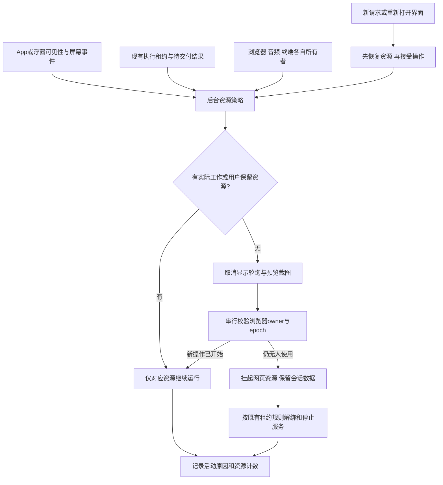
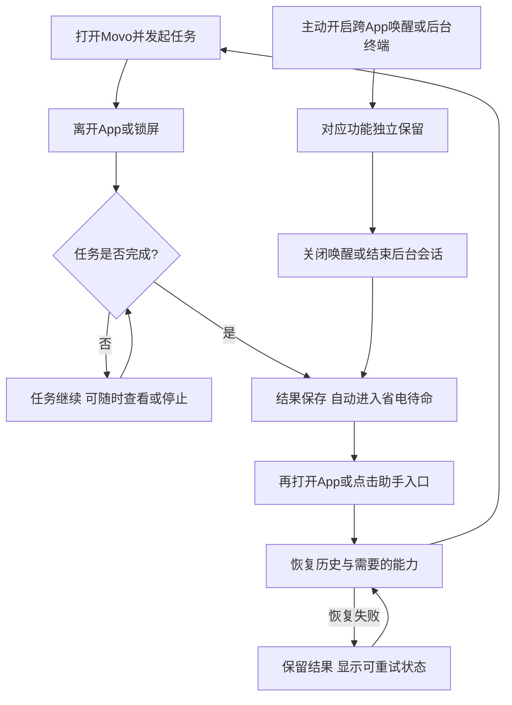

# Movo 后台空闲低功耗方案

> 2026-09-27；调研阶段基线为 `30daf0e3231b62d0fbb5dc1d7e247740f688dce8`，已核对同期增量至 `30b8ddf23f8bddd55889049e7a016d28866f5be2` 不影响本方案的后台资源结论。最新实施状态见下方更新；真实功耗验收未完成。

实施更新：随后已按用户要求落地第一批显示生命周期与浏览器挂起代码，详见 [实施记录](后台空闲优化实施记录.md)。下文保留完整候选方案，并不表示所有候选项都已实现；真实功耗验收仍未完成。

## 0. 摘要

目标是在没有实际工作的后台状态，让 Movo 停止主动计算、收音、绘图和请求，允许 Android 正常休眠；用户再次打开或调用助手时按需恢复。保留进程、历史结果、静态入口，不必然造成持续 CPU 消耗。

先建立**普通待机与使用过浏览器/终端后的对照基线**，再按实际活动确定改动顺序。候选改动包括后台界面刷新停止、共享 WebView 空闲暂停、资源所有权可观测；保留已实现的任务租约收尾和息屏停止唤醒录音。终端、语音监听与常驻球按各自功能语义处理，不能仅因 `activeSession == null` 就全部停止。

当前没有新版本真实放电数据，优先级是按代码确定性、影响范围和改动风险排列，不是已经测出的耗电名次。完整源码依据见 [资源与功耗调研](../../research/background-power/Movo%20后台空闲资源与功耗调研.md)。

## 1. 状态与结论

| 项目 | 结论 |
| --- | --- |
| 第一阶段 | 测普通待机与功能使用后残留，确认后台是否真的存在截图、CPU、音频或网络活动 |
| 第一批候选改动 | 对证实仍工作的纯显示轮询绑定生命周期；浏览器按所有者挂起；记录资源占用原因 |
| 第二批改动 | 对短期资源回收、浮窗息屏和通知清理做独立 A/B；核对 user 终端常驻租约 |
| 保留行为 | 后台正在执行的任务、语音会话、显式后台命令和用户终端会话继续工作 |
| 已完成 | 当前源码三路审计、Android 官方机制核对、现有测试覆盖检查、方案与验收矩阵 |
| 尚未验证 | 真机后台计时器是否继续调度、网页行为、夜间放电、省电幅度与恢复延迟 |

## 2. 需求调研

用户目标是“后台没有执行任务时尽量省电”。这里将无任务拆为三类：

| 状态 | 含义 | 功耗目标 |
| --- | --- | --- |
| 普通空闲 | 无 Agent / 准备 / 登录 / 安装工作，无语音会话，无用户保留作业 | 无持续音频、主动网络、周期截图和显示计时器；允许系统回收进程 |
| 入口待命 | 普通空闲，同时用户保留静态球或系统助手入口 | 入口事件驱动；不升级为执行 FGS、不启动计算心跳 |
| 功能待命 | 用户选择跨 App 唤醒，或保留终端、Kimi Web、daemon | 单独归因和展示；不承诺与普通空闲相同的开销 |

“后台”并不表示“无任务”：Movo 操作其他 App、等待模型网络响应、暂停中的任务都可能需要继续存活。已有持久化结果未读不算计算工作，尚在写入或发送结果才算短期工作。

需要后续设备验证的事项：当前手机实际开关、使用过哪些能力、是否有独立后台进程、恢复延迟和跨 App 唤醒可靠性。方案采用保守默认：不自动结束用户创建的终端/后台作业，不改变现有唤醒范围；先消除隐藏界面的无效工作。

## 3. 技术调研与复用选择

| 已检查的现有能力 | 约束 | 复用结论 |
| --- | --- | --- |
| `agent/runtime/ExecutionLeaseRegistry.kt`、`AgentExecutionService.kt` | 已处理所有权、租约释放和 FGS 失败；不是全部音频/浏览器/系统资源的总账 | 增量扩展诊断元数据；保留唯一执行租约来源，不另造执行计数器 |
| `agent/voice/session/VoiceSurfaceTracker.kt`、`MovoMicSessionCoordinator.kt` | 已有 App / 语音可见性、亮屏和监听范围条件 | 复用状态源与录音资格，不平行实现第二套语音判断 |
| `agent/browser/AgentBrowserSession.kt` | 有锁、epoch、接管、快照；reset 同时清用户数据 | 增加非清数据的 pause / resume 接点，复用操作互斥与快照 |
| `ui/app/TerminalSessionHost.kt`、`agent/terminal/DetachedTaskSupervisor.kt` | 会话可独立于 Agent run；退出页面不终止用户命令 | 复用真实进程/会话所有者；保留显式关闭接口 |
| `ui/app/AgentAppRoot.kt`、页面 `LaunchedEffect` / `produceState` | Composition 生命周期与 Activity 可见性不同 | 给显示侧协程加 STARTED / 可见性条件，业务写入与执行不跟随取消 |
| `diagnostics/MemoryDiagnostics.kt` | 已有结构化事件 | 增加按状态变化的资源记录，避免新增周期诊断心跳 |

表中 Kotlin 路径前缀为 `app/src/main/kotlin/io/github/fartown/movo/`。新增纯策略模块的理由是现有租约只覆盖执行 FGS、语音协调器只管理音频，缺少跨能力的后台挂起决策；新模块只读取原状态并做决策，不接管任务调度。

Android 官方机制约束：

- 普通空闲允许 Doze / App Standby；前台服务只用于用户期望持续进行的工作。[Doze 文档](https://developer.android.com/training/monitoring-device-state/doze-standby)
- started 服务需要主动 stop；解绑不替代 stop，反之有绑定时 stop 也不等于立即销毁。[Service 生命周期](https://developer.android.com/develop/background-work/services)
- WebView `onPause()` 不会暂停 JavaScript；`pauseTimers()` 会作用于进程内全部 WebView，不能误停正在工作的浏览器或登录页面。[WebView API](https://developer.android.com/reference/android/webkit/WebView)
- 使用 `repeatOnLifecycle` / `collectAsStateWithLifecycle` 管理可见界面工作；仅换 collector 不会自动停止由其他长期 scope 主动生产的任务。[Lifecycle 文档](https://developer.android.com/topic/libraries/architecture/lifecycle)
- 本应用 targetSdk 36，恢复麦克风 FGS 受后台启动和 while-in-use 权限规则约束；不能把“息屏停整个服务、亮屏必能重启”当成已经成立的方案。[FGS 启动限制](https://developer.android.com/develop/background-work/services/fgs/restrictions-bg-start)

不采用的方向：定时唤醒检查自己是否空闲、默认申请电池豁免、反复杀进程再拉起、将所有会话状态持久化后强关。它们增加唤醒或破坏现有任务连续性。当前也没有需要迁移到 WorkManager 的通用空闲循环；未来若出现真实批量维护任务，才使用充电/网络约束，周期任务最短 15 分钟，不能替代实时助手执行。[WorkManager 约束](https://developer.android.com/develop/background-work/background-tasks/persistent/getting-started/define-work)

## 4. 目标交互链路

### 4.1 系统交互



资源状态由原所有者报告，不通过高频扫描检查。释放与新请求竞争时，新的所有权优先；不得先清资源再发现新任务已启动。

### 4.2 用户动线



普通空闲无需新增操作；后台作业延续现有显式关闭语义。本轮第一批不新增设置页面或改变终端的退出行为。

## 5. 方案设计

### 5.1 原则、落点和边界

遵循仓库已有的 `ExecutionLeaseRegistry` 所有者清理、`finally` 释放、Voice 协调器状态门控、Browser epoch 失效保护。改动保留脏工作、使用项目现有 Kotlin / Compose 组织；本方案不增加服务端接口、权限或新 FGS。

以下是**拟改文件，不是本轮已经修改的源码**：

```text
app/src/main/kotlin/io/github/fartown/movo/
  agent/runtime/
    BackgroundIdlePolicy.kt          [新增] 纯策略，不保存任务真相
    BackgroundIdleCoordinator.kt     [新增] 事件聚合和串行资源挂起
    ExecutionLeaseRegistry.kt        [修改] 活跃原因与资源所有者诊断
    AgentRuntimeService.kt           [修改] 收尾触发策略、屏幕下的窗口工作控制
    AgentRuntimeConnection.kt        [复用] 已有延迟解绑，首批不调整30秒
    AgentExecutionService.kt         [复用] 已有租约清空停服
  agent/browser/AgentBrowserSession.kt [修改] 非清数据的挂起/恢复与owner校验
  agent/voice/MovoMicSessionCoordinator.kt [复用] 录音资格逻辑
  agent/voice/session/VoiceSurfaceTracker.kt [复用] 可见性源
  ui/app/AgentAppRoot.kt              [修改] 生命周期信号接入
  ui/app/TerminalSessionHost.kt       [复用] user会话租约，不自动关闭
  agent/terminal/DetachedTaskSupervisor.kt [复用] 后台作业所有权
  ui/components/ChatMessageItem.kt   [修改] 预览截图可见性门控
  ui/components/RunStallNotice.kt    [修改，执行期] 现已有流式条件，补可见性门控
  ui/screens/browser/AgentBrowserScreen.kt [修改] 浏览器宿主可见性与恢复接点
  ui/screens/diagnostics/DiagnosticsData.kt [修改] 可见时刷新
  diagnostics/MemoryDiagnostics.kt   [修改] 状态变化观测
  data/repository/NotificationHistoryRepository.kt [修改，第二批] 事件触发的清理节流
app/src/test/kotlin/io/github/fartown/movo/
  agent/runtime/BackgroundIdlePolicyTest.kt [新增] 状态组合与新任务抢占
  agent/runtime/ExecutionLeaseRegistryTest.kt [修改] 原租约收尾回归
```

| 模块 | 输入 / 依赖 | 输出与扩展 | 优先级 |
| --- | --- | --- | --- |
| 显示刷新 | 页面 STARTED、实际可见、相关 run 是否活跃 | 取消 / 重启现有协程，恢复时取一次新快照 | P0 |
| 空闲决策与观测 | 原租约、资源owner、可见性、屏幕、短期交付 | 允许挂起集合及阻碍原因，事件变化才计算 | P0 |
| 浏览器 | owner、加载与操作epoch、页面是否可见 | Main线程执行挂起 / 恢复，不清登录数据 | P1 |
| 浮窗与服务 | 静态入口需求、屏幕、运行/输入状态 | 停无效窗口工作；沿现有stop/解绑路径回收 | P1 |
| 通知历史 | 有效通知事件、距上次清理时间或新增量 | 降低重复清理；读取仍按保留期过滤 | P2 |

### 5.2 显示刷新：先确认后台调度，再限制可见性

- `RunStallNotice`：调用方已限定 `isStreaming && !runPaused`，不属于无任务功耗候选。若执行期间退后台仍在调度，补页面可见性条件；重新可见立即计算一次。不能把组件内部无条件循环当成调用方无条件创建。
- `BrowserPagePreview`：同时满足页面 STARTED、卡片实际可见、确有待展示变化才截图；后台截图次数目标为零。稳定页面保留最后一帧，重新可见补帧。固定节拍先保留作前台降级，后续再评估改为页面快照变化驱动。
- `DiagnosticsData`：仅诊断页可见时采样；关闭 UI collector 不得关闭任务日志写入。
- 对 IME 60ms 跟踪补息屏、折叠、失焦取消条件；它本来就不是普通待命心跳。

这些是现有组件内的显示状态，不新增全局页面状态；计时器恢复用真实时间差计算，避免后台累计 tick。

### 5.3 资源挂起：只在确认无人使用后执行

策略输入采用只读 `IdleSnapshot`：App/窗口可见性、屏幕状态、原执行租约原因、pending 请求与写入数、独立音频状态、浏览器owner、用户保留会话。策略输出为可挂起资源集合与 `blockedReasons`。所有状态由原管理器发布，禁止重复维护另一个 run 计数器。

新建 `BackgroundIdleCoordinator` 仅承担当前代码缺失的跨资源聚合：在状态变化时串行处理；第一次进入后台空闲后允许一个短防抖窗口（初值 5 秒，属于待测参数），新工作出现立即取消挂起。屏灭停止纯显示工作不等待防抖。没有 WorkManager 周期扫空闲，也没有定时自唤醒。

浏览器在挂起前持锁重读 owner / epoch，保护实际网页操作、登录、下载和媒体使用。必须区分“用户拥有这个会话”“窗口可见”和“正在进行操作”：当前 `userControlActive` 在 attach 后置真，Activity 退后台不一定 detach，不能把它单独当作永久忙碌条件。`AgentBrowserScreen` 报告宿主生命周期可见性，保留用户接管归属；页面不可见且无在途操作/受保护工作时才允许挂起，不能因此允许 Agent 抢走用户会话。

Agent 工具与用户浏览器两个入口均先完成 WebView / timers 恢复，再提交请求；若另一 WebView 已使 timers 恢复，重复恢复须幂等。首批只挂起，不自动 destroy；destroy 会丢失部分页面内状态，且当前 reset 会清用户数据，不能直接复用。

`onPause()` 与 `pauseTimers()` 分开处理：确认同进程所有 WebView 均无活跃owner时才能全局 pauseTimers，否则只做安全的单实例暂停。该 API 不能当作停止一切网页网络/媒体的保证，必须用 renderer、流量与媒体状态验证。未确认 owner 的页面保守保留，并把阻碍原因写入诊断。

### 5.4 服务、音频、终端与入口

- **执行服务**：沿用租约清空停止；增加来源、年龄与关闭原因记录。优先找“哪个owner未释放”，不直接 stop 掉全部任务。30 秒 Binder 延迟解绑先保留，只有测量证明有收益再缩短。
- **常驻球**：保留静态入口选择，不默认把用户常驻开关改为关闭。屏灭时禁用窗口相关的协程和可输入态；恢复只响应系统事件。第一批不要求销毁服务并后台重启，避免与系统限制冲突。
- **唤醒**：保留默认关 / AppOpen 和息屏释放 AudioRecord；对异常退出做回归。ScreenOn 视为用户选择的独立监听工作。要更省电可使用现有 AppOpen 范围；能量门不能替代关闭麦克风。暂停后整个 microphone FGS 是否停止属于第二阶段，先证明恢复路径可靠。
- **终端**：当前 user 空 shell 会持有执行 FGS，这是可衡量的产品取舍。首批不自动关闭；只记录会话来源并沿现有关闭入口释放。后续若做“空会话休眠”，必须有可靠的前台作业/子进程状态与明确的恢复或关闭语义，不能靠无输出超时、不能 suspend 用户命令。
- **daemon / Kimi Web**：认作独立任务；用户显式结束后释放。保护跨 App 进程恢复和 root 子进程，不能仅由主进程租约为空判为可终止。
- **通知清理**：先保持记录即时写入，仅将过期/条数清理合并到事件触发的批次，不能为清理新增周期唤醒。维持存储上限与读取保留期语义，测试通知突发和进程突然结束；当前无障碍 source 解析已有门控，不重复优化不存在的无任务遍历。

## 6. 监控、风险与测试

### 6.1 观测与验收目标

只在状态变化记录 `idle.enter/exit`、原因、执行租约数、browser owner、audio capturing、terminal / daemon 数和可见表面；在专用测试构建累积 ticker / screenshot 计数。没有“为验证省电每秒打日志”的常驻逻辑。

| 指标 | 普通后台空闲目标 | 说明 |
| --- | --- | --- |
| AudioRecord / 活跃语音连接 | 0 | 跨 App 唤醒和主动语音会话单独测试 |
| 浏览器预览、显示ticker | 稳定空闲窗口增量为 0 | 不以“页面没看到变化”代替计数 |
| 执行FGS / 租约 | 无真实owner时为 0 | 静态球与系统绑定服务单独记，不硬性要求进程消失 |
| 空闲主动网络 | 无 App 自发请求、ping、重连 | 连接池对象存在不等于网络活动 |
| CPU / 唤醒锁 | 接近同机基线，无应用引入的持续活动 | 不预先承诺绝对 mA 或节电百分比 |
| 恢复与数据 | 历史、Cookie、结果不丢；首个任务正常 | 冷启动耗时与任务成功率一起比较 |

### 6.2 对照实验

使用同一台可控真机、同版本系统和 WebView、相同电量温度与网络，安装同签名可比构建。测量窗口避免其他自动化操作；真实放电使用物理断开供电或可控电源，`dumpsys battery unplug` 只改变统计状态，不代表真的拔电。云机适合功能与线程验证，通常不适合直接证明整夜省电。

| 场景 | 操作与观察 |
| --- | --- |
| A 普通待机 | 冷启动后无任务，退后台亮屏10–15分钟，再息屏30–60分钟；同机基线对照 |
| B 任务收尾 | 简单问答与跨App任务分别成功、失败、取消、暂停；检查租约、结果落盘及资源恢复 |
| C 网页残留 | 打开带JS定时器/网络请求的固定测试页，离开后观察renderer、截图计数、网络；回来验证状态与Cookie |
| D 终端 | 空shell、长时间无输出命令、PTY、root/user daemon、Kimi Web逐项；确保省电不误杀工作 |
| E 语音 | 关闭 / AppOpen / ScreenOn分别测试；亮灭屏、来电、权限撤销、识别失败、播放结束后确认录音释放 |
| F 系统集成 | 常驻球开/关、通知突发、无障碍、Google热词自愈分别隔离；跨UID归因 |
| G 恢复竞争 | 进入挂起时立即发起新任务、连续切前后台、系统回收进程；owner不丢失、不重复执行 |

先短窗口找CPU/音频/网络证据；有差异再做至少三轮交错 A/B 和 6–8 小时真机夜间放电，报告原始值、波动和条件，而非一次电量百分比截图。Doze强制测试只证明功能兼容，不代替自然待机功耗。

工具选择：Perfetto / System Trace 与 `dumpsys batterystats`、`power`、`audio`、服务/进程状态联合分析。官方 Power Profiler 的 ODPM 数据是设备级，主要支持 Pixel 6 及后续机型；小米等设备先查能力，不假定能测应用独立功率。[Power Profiler](https://developer.android.com/studio/profile/power-profiler)

Battery Historian 已不再积极维护，因此优先 system tracing / Power Profiler；Batterystats仍可作为统计证据。[官方说明](https://developer.android.com/topic/performance/power/setup-battery-historian)

### 6.3 回归与风险

纯策略测试覆盖工作状态组合、重复释放、挂起过程中出现新owner；现有租约和语音门控测试保留。仪器/真机验证后台ticker归零、WebView pause/resume、录音释放与服务销毁。目标机另验系统助手、点击静态球、息屏后首次发起请求和厂商后台限制。

主要风险是误判闲置导致任务或网页中断、全局暂停误伤另一个 WebView、清理清掉登录数据、停止麦克风FGS后无法恢复，以及只看Movo UID遗漏Google/system_server/root任务。每批单独可回滚；只有计数与功能回归通过后再看功耗收益。

## 7. 附录与引用

- [当前源码调研与文件索引](../../research/background-power/Movo%20后台空闲资源与功耗调研.md)。
- [历史语音功耗报告](../../research/voice-wake-power/唤醒功耗调研与验证.md)：历史快照，未复用其功耗数字。
- 过程件：`tmp/tasks/2026-09-27-background-power/`；首轮列举三台网络设备，质疑复核时只读核对供电、系统、Movo版本与PID，三台均接交流电且满电。没有接管、改设置、装包或运行受控功耗测试；记录见 `confidence-check-devices.txt`。
- 上述候选修改尚未实现，不代表 App 已省电；测量数据与真实设备配置仍是下一阶段输入。

## 8. 变更记录

| 日期 | 原因 | 内容 | 影响 |
| --- | --- | --- | --- |
| 2026-09-27 | 用户要求研究无任务后台降功耗 | 完成当前实现审计、优化顺序、资源边界和验证设计 | 新增文档；产品源码不变 |
| 2026-09-27 | 用户质疑结论确定性，复核调用条件 | 排除 RunStallNotice 无任务轮询判断；将实测基线置于改动顺序之前 | 修正研究归类与实施前提；未修改产品 |
| 2026-09-27 | 用户要求具体代码改动 | 实现显示生命周期门控、共享浏览器使用权与空闲暂停 | 第一批源码与测试落地；详见实施记录 |
