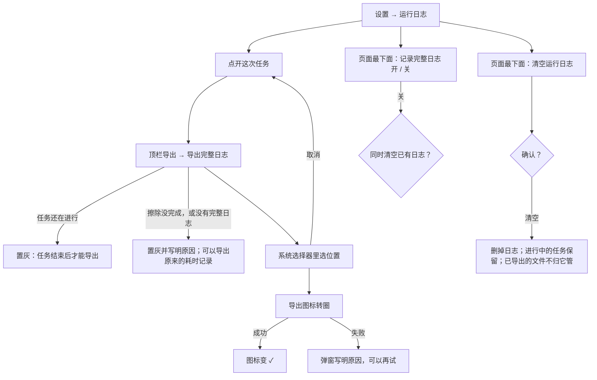
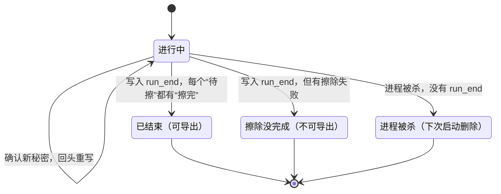

# Movo 运行日志补全实施方案

> 最后更新：2026-10-06（第 5 版：按第 4 版三路评审修改；需要拍板的 6 项按主流程倾向处理，用户 10-06 确认）
> **实施中变更（10-06）：用户决定日志不做任何遮挡和擦除，原样记录。** §5.4 整节取消，§0、§2.4、§5.3、§5.6、§6.2 中与遮挡、擦除有关的内容随之作废，详见 §8 最后一条。
> 依据：R57 运行日志；第 4 版评审报告（同目录 `.review-v4.md`）；main `c530ffb` 的代码（电视版已合入，分 `phone`、`tv` 两个 flavor）。
> 路径缩写：`K/` = `app/src/main/kotlin/io/github/fartown/movo/`，`P/` = `app/src/phone/kotlin/io/github/fartown/movo/`。代码位置只写类名和方法名，不写行号。

## 0. 摘要

**要做的事**：把运行日志补全。导出一次已经结束的任务，只看这一份日志，就能查清每一步模型收到了什么、想了什么、做了什么、为什么失败、为什么停。

**只记原始日志**，边界是两条规则（§2.2）：

1. 只记执行中本来就产生的东西。
2. 不为记日志新增任何读取。

日志里不写任何推导出来的结论。

**做法**：

1. **每次任务写一个原始日志**，按时间顺序一行记一件事：
   - 每次真正发出去的请求：在服务商生成最终请求字符串之后，原样遮挡、压缩存一份。
   - 每次尝试收到的输出：边收边按批落盘。
   - 工具：执行前记开始，返回后记结果。
   - 用户和系统做了什么。
2. ~~**遮挡分两级**~~（10-06 取消：日志原样记录，见 §8）：
   - 局部遮：只遮这一次调用自己的参数。
   - 全局擦：只收确认过的秘密，写入前先擦；运行中才确认的，回头把已写的部分重写一遍。
   - 原话、模型复述的内容、屏幕文字和截图原样保存，并照实告知。
3. **只能导出已经结束、且擦除完成的任务**：进行中的要先停止。进程被杀的任务没有完整日志可导出，只保留原来的耗时记录。
4. **运行日志页最下面一张卡**：放“记录完整日志”开关（默认开）和“清空运行日志”。删除对话时，一并删除它的日志。电视版一期不记完整日志。

**状态**：第 5 版，待 review。第 4 版评审的 26 条，每条的处理见 §8。

## 1. 状态与结论

| 项目 | 结论 |
| --- | --- |
| 当前状态 | 方案待 review，未写代码 |
| 目标 | 只看一份导出的日志，就能回答 §2.1 的 7 个问题 |
| 做法 | 每次任务一个按时间排序的原始日志；请求存完整的遮挡后版本并压缩；遮挡分局部和全局两级；只导出已结束的任务 |
| 不做 | 日志里写推导结论；为记日志额外读取；新的拦截规则；电视版记完整日志；修复聊天记录里的密码漏洞（拆到单独 PR） |
| 工作量 | 三步：P1 日志文件、记录点和遮挡；P2 请求快照；P3 导出、清空、开关和文档 |
| 开工前 | 工作区目前在另一个任务的分支上，有未提交的改动。开工时先确认在哪做，并按当时的 main 核对代码位置 |

## 2. 需求

### 2.1 目标

只看导出的这一份日志，回答下面 7 个问题（字段对照见 §5.1 末尾）：

1. 用户让它做什么；用的哪个模型、什么思考档位、哪档权限。
2. 每一步模型实际收到了什么：真正发出去的请求，包括它要过的截图。
3. 每一步它想了什么：思考内容原样记下，并标明服务商给的是哪种思考数据；本机开始和结束接收的时刻；token。
4. 每一步它做了什么：模型给了哪些工具调用和参数，实际执行了哪些。
5. 每一步的结果：工具原始的结果类型（已读、完成、已派发、后台运行、不确定、失败）、错误码、耗时。
6. 过程中用户和系统做了什么：停止、暂停、继续；确认卡和作答；中途补充的话；Movo 到前台或后台；断网；熄屏和亮屏。
7. 最后怎么结束的：完成；失败时的错误码；被停止时从哪里停的、停的时候正在收什么或执行什么。

### 2.2 记录边界（两条规则）

1. **可以记**：模型的输入和输出、工具的参数和结果、用户对 Movo 的操作、Movo 和系统已经产生的运行事件。
2. **不可以**：为记日志新增任何读取。包括截图、查询无障碍树或输入焦点、读取其他 App 或设备的状态（包括存储空间）、查应用包名、为日志单独加载配置。

**允许的变换只有四种**：

- 加序号和时间戳；
- 确定性的结构编码（JSON、图片按内容存）；
- 必要的遮挡；
- 无损压缩。

除此之外，日志里不写任何推导出来的结论，例如“哪些工具没结束”“是否完整”“停止来源是哪个”。这些由看日志的人或导出说明去算，不进日志本身。

### 2.3 不做

- 诊断、汇总、统计，以及日志里的任何推导和推断。性能数据只在测试里量。
- 为日志额外截屏，额外读取设备、存储或其他 App 的状态。
- 新的拦截规则：不禁止 Agent 用读文件或终端读日志目录，写进风险里。
- 个人数据最小化：查询结果原样记，靠告知。
- 进行中的任务导出：要导出，先停止。
- 进程被杀的任务的完整日志：这种任务没有可靠的擦除保证，下次启动直接删掉，只保留原来的耗时记录。
- 电视版的完整日志：电视版没有运行日志页，导出和清空都没有入口。
- 推荐追问请求：它不属于任何一次任务，不记。
- 不影响执行的界面操作，比如悬浮球展开、收起。
- 本机加密：日志存在 App 私有目录。这和对话记录不同（对话记录会遮敏感工具的数据、不存图片），这一点写进页脚和风险。
- 聊天记录里的密码明文漏洞：涉及三条路径，分别是被拒绝时、在确认卡上点停止时、同一批调用遇到进程被杀时。拆到单独的 PR 修，本方案只依赖其中的三态密码判断。

### 2.4 已确认（用户 10-06）

- 导出时带上对话、思考和模型收到的内容；配置的 Key、密码框输入、机密工具的结果除外。
- 不为日志额外截屏；模型自己要的截图原样记下。
- 不叫“复盘”，不做自动诊断，只记原始日志。
- 请求在服务商生成最终请求之后、发送之前记。
- 个人数据原样记，不加新的拦截，在页脚和导出时写明。
- 第 4 版评审后确认的 6 项：
  - 只能导出已结束的任务；
  - 运行日志页放一个用户能关的“记录完整日志”开关，同时作止损开关；
  - 终端命令复用执行卡现成的打码规则，只遮这一次调用自己的参数；
  - 请求每次存完整的遮挡后版本，压缩保存；
  - 删除对话时一并删除它的日志；
  - 聊天记录漏洞拆成单独的 PR。

### 2.5 默认做法（review 时可改）

- **“记录完整日志”默认开**：你要的就是出问题时能看到完整日志。关掉后不再记新任务，并询问要不要清空已有的。
- **保留**：最近 20 次任务（和现有运行日志一致），总共不超过 200MB，单次任务不超过 50MB，超出时怎么处理见 §5.5。不加时间上限。
- **全局擦除的长度下限**：确认过的密码和凭据 ≥ 6 个字符才进全局擦除。更短的（4–5 位验证码、短 PIN）只做局部遮，模型复述的部分原样保存，并在页脚写明。

## 3. 现状与复用

现有运行日志只记元数据：

- 单条最多 4KB，所有任务共用一个 2 万条的缓冲；
- 只保留最近 20 次任务；
- 没有清空入口；
- 导出走系统文件选择器（`ExportAction` 里的 `CreateDocument`）；
- 运行日志页只在手机版（`P/ui/screens/diagnostics/`）。

**复用**：

| 现有实现 | 怎么用 |
| --- | --- |
| `AgentEvent.ToolStarted` | 执行前就会发出，带标题（`argsPreview`）和时刻；工具开始的记录用它 |
| `AgentTraceFormatter.displayCommand` | 执行卡展示终端命令时，已经会把 `API_KEY=`、`--password`、`Authorization:` 这类内容打码；命令参数的局部遮直接复用这套规则 |
| `AgentModelRetry` 包给服务商的回调 | 压缩请求传进来的回调是空的，所以记录挂在重试器内部，压缩请求也能记到 |
| `AgentRunCheckpointRecorder` | 已经按“轮次 + 种类 + 序号”合并增量；按尝试缓存输出时复用它的合并逻辑 |
| `MemoryDiagnostics.withRun`、`boundRuns()` | `withRun` 写 `run.started` 时顺便建日志目录；`boundRuns()` 用界面任务号找到运行号 |
| `DiagnosticTraceBuilder.buildRun` 的思路 | 系统事件不属于哪次任务，按发生时刻挂进当时正在进行的任务 |
| `ExportAction`（系统文件选择器） | 先选位置，再写入 |
| `DiagnosticStore` 的单线程追加写法 | 新写入器照这个模式写；但它“改名失败就先删原文件”的做法不照搬（§5.5） |
| `ToolResult.errorCode` | 错误码直接用这个结构化字段，不再从展示用的文字里解析 |

**不复用**：`AgentConversationCodec.redactSensitiveToolData`。它只认内部的消息格式，而请求快照是各服务商的最终格式，要靠每个服务商一个小适配器。

## 4. 链路

### 4.1 系统交互图

```mermaid
sequenceDiagram
    participant Run as withRun / RunExecutor
    participant Retry as AgentModelRetry（含压缩）
    participant Prov as 3 个服务商（最终字符串之后）
    participant Loop as AgentLoop / ToolPipeline
    participant App as AppState / Service / 通知 / 确认卡
    participant Env as DiagnosticsEnvironment（已有）
    participant W as RunLog 写线程
    Run->>W: 建目录，写 run_start（原话、模型、档位）
    loop 每次尝试
        Retry->>W: attempt_start（轮次、尝试、权限档位取当轮已加载的值）
        Prov->>W: 请求字符串的引用（写线程流式解析：抽图、遮挡、压缩存盘）
        Retry->>W: attempt_delta（思考和正文按批写入）
        Retry->>W: attempt_end（全部工具调用和参数，按两级遮挡；成功、失败、取消各写一次）
    end
    Loop->>W: tool_start（执行前）和 tool_end（原始结果类型、三态密码判断）
    App->>W: 停止、暂停、继续、补充、确认卡和作答（带运行号）
    Env->>W: 前后台、断网、熄屏亮屏（写进所有进行中的任务，带原有字段）
    Note over W: 确认新秘密：先写“待擦”，再回头重写，最后写“擦完”
    Run->>W: run_end（状态、错误码、异常类名）
```

整个过程不调用任何截图、无障碍、焦点、前台、包名、存储空间或配置加载接口，只用执行中本来就产生的数据。

### 4.2 用户动线



### 4.3 一次任务的日志状态



## 5. 设计

### 5.1 日志文件与记录格式

**目录**：`filesDir/run-log/R57-20261006-145400/`，下面有三样：

- `log.jsonl`：主日志；
- `req/`：每次发送的请求，压缩保存；
- `img/`：图片，按内容哈希命名。

目录在 `MemoryDiagnostics.withRun` 写 `run.started` 时就建好，目录名也写进 `run.started`。另有一个 `run-log/index.json`，记“任务 → 对话”的对应关系，删除对话时用；它不进导出。

**公共字段**：

| 字段 | 类型 | 含义 |
| --- | --- | --- |
| `seq` | 整数，必填 | 本次任务内的连续编号，`gap` 行也占号 |
| `t` | 字符串，必填 | 记录类型 |
| `at` | 整数，必填 | 墙钟毫秒，在事件发生处取，不在写盘时取 |
| `el` | 整数，必填 | 距任务开始的单调毫秒，也在事件发生处取 |

格式版本 `v` 只在 `run_start` 里记一次。

**记录类型**（`?` 表示可以没有；没有的值不写，不写成空串）：

| `t` | 什么时候写 | 字段 |
| --- | --- | --- |
| `run_start` | `withRun` 开始时 | `v`、`run`、`operation`、`request`（用户原话，原样）、`images?`（附图文件名）、`model`、`provider`、`endpoint_host`、`effort`、`voice`、`monitor`、`app_version` |
| `attempt_start` | 每次尝试开始 | `attempt`（Q 编号）、`round`、`retry_of?`、`purpose`（chat / compaction / rewrite）、`permission_mode?`（取 `ToolPipeline` 这一轮已经加载的环境，不单独读；压缩请求没有这一项） |
| `request` | 每发送一次，服务商内部的重发也算一次 | `attempt`、`send`（第几次发送）、`body`（`req/` 下的文件名）、`bytes`、`images?`、`image_urls?`（远程 URL 原样记，Movo 从不下载）、`dropped?`（超过硬上限时写明只记了哪些） |
| `attempt_delta` | 收到的思考和正文，每满 16KB 或 2 秒写一批 | `attempt`、`thinking?`：[{`type` 服务商原始类型, `text`}]、`text?` |
| `attempt_end` | 尝试结束；成功、失败、取消各写一次 | `attempt`、`status`（ok / failed / cancelled）、`code?`、`exception?`（异常类名）、剩余的 `thinking?` 和 `text?`、`tool_calls`：[{`id`, `name`, `args`}]（模型给的全部原始调用，按 §5.4 遮）、`usage?`（输入、缓存、输出、思考 token）、`recv_start_el?`、`recv_end_el?`（本机开始和结束接收的时刻） |
| `tool_start` | 工具执行前 | `id`、`name`、`title`（`argsPreview`）、`args_exec?`（实际执行的参数，只在和模型给的不同时写，按 §5.4 遮） |
| `tool_end` | 工具返回后 | `id`、`outcome`（read / done / dispatched / backgrounded / unknown / failed，原样）、`code?`、`message?`、`hint?`、`password?`（yes / no / unknown）、`sensitivity`、`result`（交给模型的原文，按 §5.4 遮；SECRET 结果写固定标记）、`images?`、`dur_ms` |
| `user` | 用户操作 | `kind`（stop / pause / resume / approval_shown / approval_reply / question_shown / answer / supplement）、`source?`（只有 stop 有，取值见 §5.2）、`request_id?`、`reply?`（allow / deny / timeout / cancel）、`text?`（原样） |
| `event` | 任务中的其他事件 | `kind`（monitor / compaction / hosted_tool），加上服务商或系统原本给的字段；服务商没给的字段写 `"not_provided"` |
| `system` | 当时正在进行的全局事件 | `kind`（app.foreground / app.background / network.* / screen.off / screen.on / device_idle / power_save / execution_service.* / runtime.destroyed），加上原记录本来就带的字段 |
| `meta` | 现有运行日志里属于这次任务的记录 | 原样同步，去掉 `wire_run`、`conversation` 两个本机内部 ID |
| `scrub` | 回头擦除 | `phase`（pending / done / failed）、`upto_seq`；不记秘密本身 |
| `gap` | 丢了记录 | `from_seq`、`to_seq`、`reason`（queue_full / write_failed / size_cap） |
| `run_end` | 任务结束 | `status`（completed / failed / cancelled）、`code?`、`exception?` |

**7 个问题对应的字段**：

| 问题 | 看哪里 |
| --- | --- |
| 1 做什么、什么模型和档位、权限 | `run_start`；`attempt_start.permission_mode`；`req/` 里请求实际用的模型和参数 |
| 2 模型收到了什么 | 每条 `request` 指向的 `req/` 文件（完整的遮挡后请求体）和 `img/` |
| 3 想了什么、什么时候收的 | `attempt_delta` 和 `attempt_end` 里的 `thinking`（带原始类型）、`recv_start_el`、`recv_end_el`、`usage` |
| 4 做了什么 | `attempt_end.tool_calls`（模型给的全部调用）；`tool_start`（实际执行的） |
| 5 结果 | `tool_end`；有 `tool_start`、没有 `tool_end` 的，就是日志里没有结束记录 |
| 6 过程中发生了什么 | `user`、`system`、`meta` |
| 7 怎么结束的 | `run_end`；最后一条 `user stop`；最后一批 `attempt_delta` 和 `attempt_end`；没有结束记录的 `tool_start` |

### 5.2 在哪里记

| 记录 | 位置 | 说明 |
| --- | --- | --- |
| 建目录、`run_start` | `MemoryDiagnostics.withRun` 调用的钩子 | 是否记，看两个开关：`platform/Flavor` 新增的版本开关（手机版开、电视版关），以及用户在运行日志页的开关。不记就什么都不建 |
| `run_end` | `AgentRuntimeRunExecutor` 收尾处 | 只写执行器看到的状态、错误码、异常类名 |
| `attempt_start`、`attempt_delta`、`attempt_end` | `AgentModelRetry` 内部包给服务商的回调 | 压缩请求也经过这里。成功、不可重试的失败、取消、最后一次失败，每条路径恰好写一次 `attempt_end`。没有思考增量时，用 assistant 消息里的 `reasoning_content` 补上，`type` 记为 `reasoning_content` |
| `request` | 3 个服务商生成最终字符串之后：Responses 在 `ChatGptCodexRequest.applyBody` 之后，Chat Completions 和 Anthropic 在 `.toString()` 之后 | 只交出字符串的引用。没有任务上下文的请求（推荐追问等）不记 |
| 思考的原始类型 | 3 个服务商把类型抹平之前，经 `ProviderEvent.BlockDelta` 的新字段带出 | Chat Completions 同一片里同时有 `reasoning.text` 和 `reasoning.summary` 时，拆开记 |
| `tool_start`、`tool_end` | `AgentLoop.executeTool`：发 `ToolStarted` 时写开始，返回后写结束 | `ToolResult` 加两个字段：`outcome`（原始结果类型）和 `passwordJudgment`（resolve 得出的三态，拒绝路径也带上）。`ToolFinished` 带上 `errorCode` |
| 确认卡和提问 | `BrokeredUserInteraction`：发出时、收到回复时 | 记作答结果和回答文字 |
| 停止 | App 内：`AgentAppState` 的 5 处（停止按钮、语音命令、为用户消息让路、准备阶段补发的两处）各记一条。悬浮球：`AgentRuntimeService.requestStop`。通知栏：`AgentExecutionService.stopTasks`，分 `ACTION_STOP`、`ACTION_STOP_ALL`、前台服务启动失败、服务销毁四种。运行时自己停：服务销毁、被新任务顶替 | 准备阶段那次租约的停止回调改成带来源，是同进程内的小改动，不动跨进程消息。App 自己发来的取消，`sendingUid` 是本 App，不再重复记；其他进程发来的记 `external:<uid>`。还没绑定运行号时，按界面任务号暂存，绑定后补写 |
| 暂停、继续、补充 | `AgentRuntimeService`：悬浮球暂停、打字时自动暂停、App 里点继续；补充在 `steerRun`、`requestSupplement` | 用 `boundRuns()` 找运行号。暂停只有一个入口，不记来源 |
| `system` | `MemoryDiagnostics.record`：没有运行号的环境事件 | 写进当时所有进行中的任务，带上原记录本来的字段 |
| `meta` | `MemoryDiagnostics.record`：带运行号的记录 | 同步一份 |

**不读设备**：日志层不调用 `UiObservationRegistry`、无障碍服务、截图、`PackageManager`、`StatFs`、`ApprovalSettings.load` 或环境快照，只用上面这些现成的数据。

### 5.3 请求快照

**记什么**：服务商发送前的最终请求体，在写线程上处理后，压缩存成 `req/<Q 编号>-<第几次发送>.json.gz`。不做差量，不做跨记录引用，生产日志里也不写哈希。

**写线程怎么处理**：

1. 用 `android.util.JsonReader` 流式读。读到 data URL 图片，按内容哈希写进 `img/`，请求里换成文件名，同一张图只存一次。远程 URL 原样保留。
2. ~~每个服务商一个小适配器，按调用 id 套用局部遮~~（10-06 取消）。
3. ~~全局擦~~（10-06 取消）。
4. ~~`prompt_cache_key` 替换成 `[会话标识]`~~（10-06 取消，原样记）。
5. 压缩写盘。

**大请求**：附图最多 8 张、合计 32MB，编码成 data URL 后请求体可达约 43MB。处理办法：

- 请求体不进 8MB 的普通队列，走单独的引用通道。排队中的请求体合计不超过 64MB，超了这一份不记，补一行 `gap`。
- 单个请求体超过 48MB 时，只记图片文件名、字节数和非图片部分，`request.dropped` 写明。

**为什么不做差量**：

- 完整存加压缩最简单，也最接近“原始”：不需要还原逻辑，不会因为丢一行就断链，也不需要哈希。
- 估算一次 45 轮的任务：每次请求体 50–300KB，压缩后约 1–4MB，在单次 50MB 的上限内。P1 实测确认。

### 5.4 遮挡（10-06 取消）

> 用户 10-06 实施中决定：“密钥那个你先不管。不要为了这个做那么多表单过滤。”“我不在乎”。本节的局部遮、全局擦、回头重写、`scrub` 记录、机密结果标记都不做，日志原样记录。下面保留原文供查阅。

**原则**：执行卡上遮了什么，日志里就遮什么；只用执行时已经得出的判断；判断不了的，遮。遮挡分两级。

**局部遮**：只遮这一次调用自己的参数，作用于 `attempt_end.tool_calls`、`tool_start.args_exec`，以及之后请求里同一个调用 id 下的参数。

| 内容 | 怎么遮 | 判断从哪来 |
| --- | --- | --- |
| `ui_input` 的 `text` | 判断为“是”或“不知道”时写成 `••••`；判断为“不是”时原样 | `ToolResult.passwordJudgment`：resolve 原本就要判断，改为保留三态，拒绝路径也带上 |
| `browser_act` 往网页里输入的文字 | 一律遮 | 执行卡也只写字数 |
| `clipboard_write`（标了 sensitive）的 `text` | 遮 | 看参数 |
| 终端类工具（`terminal`、`run_command`、`terminal_run`、`monitor_start`）的命令 | 按 `displayCommand` 的打码规则，把匹配到的部分换成 `<已隐藏>` | 执行卡本来就在算，不新增推断 |

**全局擦**：只收确认过的秘密，在所有记录、所有请求文件里都擦掉。

| 来源 | 条件 |
| --- | --- |
| 判断为“是”的 `ui_input` 输入 | 长度 ≥ 6 |
| 声明过的凭据输出（Wi‑Fi 密码、短信验证码、敏感剪贴板） | 长度 ≥ 6。这几个工具用一个新的小接口声明哪个字段是凭据；读到敏感剪贴板时，结果升为 SECRET |
| 配置里的 API Key | 任何长度 |
| 配置里的请求头 | 值长度 ≥ 8 |
| 配置里的 extra body、custom body 的字符串值 | 长度 ≥ 8；model、reasoning、temperature、top_p、max_tokens、max_output_tokens、stream、store、include、tool_choice、parallel_tool_calls、service_tier、thinking 这些标准字段除外 |

SECRET 工具的结果一律写固定标记“[机密结果，已省略]”。

**怎么擦**：

- 擦除作用在解析后的字符串值上，不在整行原文上替换。
- 字符串值本身是 JSON 文本的（工具结果、调用参数、压缩请求的正文），先解析，再递归擦。
- 每个秘密同时匹配原文和它的 JSON 转义写法：一层、两层，含 Android org.json 风格的 `\/` 和 `\uXXXX`。
- 看起来像 JSON、但解析失败、又疑似含秘密的值，整个换成“[无法安全处理，已省略]”。

**运行中才确认的秘密**：

1. 值加进内存里的擦除表，之后写的行都会擦。
2. 写一行 `scrub pending`。
3. 写线程用“临时文件 + 改名”，把这次任务已经写下的 `log.jsonl` 和 `req/` 重写一遍。
4. 成功写 `scrub done`，失败写 `scrub failed`。

擦除表只在内存里，不落盘。

**为什么不需要同步等待**：只有“已结束、而且每个 pending 都有 done”的任务才能导出（§5.6）；进程被杀的任务下次启动就删掉。所以从秘密确认到改写完成的那几秒里，明文只在 App 私有目录里，不会被导出。

**照实告知、不作承诺的部分**：用户在对话里直接打出的密码、模型复述的内容（包括短于 6 位的验证码）、屏幕上显示的内容和截图，原样保存。

### 5.5 写入、上限与生命周期

**写线程**：一个单独的写线程。运行线程只把记录放进队列；请求体只交出引用。解析、遮挡、压缩、图片落盘都在写线程上做。

**上限**：

| 上限 | 数值 | 超了怎么办 |
| --- | --- | --- |
| 普通记录队列 | 8MB（按字节） | 丢弃，补一行 `gap` |
| 请求体引用队列 | 排队中合计 64MB；单个 48MB | 见 §5.3 |
| 字段 | 按字符算：工具结果 ≥ 24,000 字（以模型实际收到的长度为准）；思考 200,000 字；其他 64,000 字。上限作用在单个字符串值上 | 截断，写明原长度 |
| 单次任务 | 到 40MB 停存图片，到 50MB 停存内容 | 控制记录照写 |
| 总量 | 200MB | 每次任务开始前检查：先删最旧的已结束任务；删完还超，这一次只记元数据 |

**两条硬规则**：

- `run_start`、`run_end`、`scrub`、`gap` 这几种控制记录不受上限约束，不会被丢。
- 不查磁盘剩余空间。写盘出错（包括空间不足）时，这次任务停止记录内容，在现有的元数据日志里记一条，导出时据此判为不可导出。

**启动检查**：

- 删除没有 `run_end` 的任务目录（进程被杀的任务）；
- 删除残留的临时文件；
- 有 `scrub failed`，或有 `pending` 没有对应 `done` 的任务，标为“擦除没完成”，不可导出。

**安全重写**：

- 先写临时文件，再改名。
- 改名失败时，保留原文件、删掉临时文件，并写 `scrub failed`；绝不先删原文件。
- 重写期间写线程被占用，最多处理一个任务的大小（50MB）。P1 量实际耗时，如果常见情况超过 2 秒，再改成分块重写。

**清空**：

- 分别交给两个写线程执行：`events.log` 那个和新日志这个。
- 两边都保留进行中的任务，内存缓冲也按运行号保留。
- 正在导出的任务，等导出结束再删。

**删除对话**：按 `index.json` 找到对应的任务目录，一并删除。

### 5.6 导出、开关与清空

**导出**（任务详情页顶栏菜单）：

**菜单项**：

- 第一项“导出完整日志”，第二行小字写“含对话、思考、模型收到的屏幕内容和截图、个人数据查询结果”。
- 第二项“复制到剪贴板”，不变，只复制元数据。

**什么时候能导出**：只有“已结束、且擦除完成”的任务。

- 进行中的任务：置灰，写“任务结束后才能导出”。
- 擦除没完成、写盘出过错、没有完整日志（老任务、被杀的任务、开关关着时跑的任务）：置灰并写明原因，同时提供原来的元数据导出。

**流程**：

1. 先在系统选择器里选位置，默认文件名 `Movo-R57-20261006-1454.zip`。
2. 在 IO 线程上把 `log.jsonl`、`req/`、`img/` 直接压缩写过去。任务已经结束，不会再有写入和重写；导出期间，清空和淘汰都避开这个任务。
3. zip 里附一份说明 `README.txt`（用英文文件名：macOS 自带的 unzip 不认 zip 里的中文文件名）：导出时读取日志算出来的信息，包括有几行 `gap`、几处截断、缺了哪些图片、写盘有没有出过错、包含哪些内容。它是导出说明，不是日志本身。

**状态**：

- 由 Activity 作用域的 ViewModel 持有，只在页面真正关闭（`onCleared`）时取消，转屏不会打断。
- 四种状态：进行中（图标转圈，不能重复点）、成功（✓）、失败（弹窗写原因）、取消（什么也不发生）。
- 取消或失败时尝试删掉目标文件。文件提供方不支持删除时，失败弹窗里写明“目标位置可能留下了不完整的文件”。

**用 adb 拉取**：在选择器里选“下载”，就能用 `adb pull /sdcard/Download/…` 拉下来。

**运行日志页最下面那张卡**：

- **“记录完整日志”开关**：默认开，存在本地配置，不读远程配置。每次任务开始时读一次，用的是 `withRun` 那个时刻，不额外读取。关掉时弹窗问“同时清空已记录的日志？”。
- **“清空运行日志”**：点了先确认，具体做法见 §5.5。

**页脚文案**：

> 本机保存最近 20 次任务的完整日志：对话、思考、模型收到的全部内容（含系统提示词和长期记忆、截图、屏幕文字，以及通讯录、短信、文件、终端输出等查询结果，其中可能有他人的信息）。这和对话记录不同，对话记录不保存这些。输进密码框的内容、机密工具的结果、配置的 Key 会被遮住或擦掉；你在对话里直接打出的密码、模型复述的内容、屏幕上显示的验证码会原样保存。只有结束的任务能导出；删除对话会一并删除它的日志；已导出的文件不归“清空”管。

**设计稿**：菜单的两行项、置灰时的文案、开关和清空这两行，按设计规范先出 Figma 候选稿。

### 5.7 现有运行日志只补三个字段

- `run.started`：加日志目录名。
- `tool.finished`：加错误码和调用 id。错误码取自 `ToolFinished` 新带上的 `errorCode`。
- `model.usage`：加思考 token 和缓存 token。

### 5.8 改动清单

| 位置 | 改动 |
| --- | --- |
| `K/diagnostics/runlog/`（新增） | `RunLogStore`：写线程、两个队列、上限、启动检查、安全重写、清空、`index.json`。`RunLogRecorder`：组装记录、按尝试分批写增量。`RunLogScrubber`：两级遮挡、嵌套 JSON、转义写法。`RunLogRecords`：sealed class，字段见 §5.1。`RequestSnapshot` 和 3 个服务商适配器：流式解析、抽图、局部遮、压缩 |
| `K/diagnostics/` | `MemoryDiagnostics`：`withRun` 调用建目录的钩子、把系统事件写进进行中的任务、带运行号的记录同步一份。`DiagnosticStore`：按运行号保留的 `clear()`。`DiagnosticsEnvironment`：启动检查。`DiagnosticTrace`：显示 §5.7 的三个字段 |
| `K/platform/Flavor.kt`、两个 `FlavorModule` | 新增“是否支持完整日志”：手机版是，电视版否 |
| `K/agent/model/` | `AgentModelRetry`：包住服务商回调，记录尝试。`AgentLoop`：工具开始和结束。`AgentModelClient`：`ToolResult` 加 `outcome` 和 `passwordJudgment`。`ProviderEvent`：带思考的原始类型。`OpenAiResponsesProvider`（在 `applyBody` 之后）、`OpenAiChatCompletionsProvider`、`AnthropicMessagesProvider`：交出最终字符串，保留原始思考类型。`AgentContextCompactor` 不用改，靠重试器内部的包装 |
| `K/agent/runtime/` | `AgentRuntimeRunExecutor`：`run_end`。`AgentEvent`、`AgentEventJsonCodec`：`ToolFinished` 带 `errorCode`。`AgentRuntimeService`：悬浮球停止、暂停、继续、补充、外部取消。`AgentExecutionService`、`ExecutionLeaseRegistry`：停止回调带来源（同进程）。`AgentDiagnosticEvents`：§5.7 的字段 |
| `K/agent/tools/` | `ContractTool`、`ToolPipeline`、`CallResolution`、`UiInputTool`：透出三态判断和原始结果类型。`ToolContract`：按输出决定敏感度的钩子、凭据字段声明。`ClipboardTools`、`SmsCodeReadTool`、`WifiPasswordReadTool`：声明凭据字段。`BrokeredUserInteraction`：确认卡和提问的记录点 |
| `K/ui/app/AgentAppState.kt` | 5 处停止各记一条；准备阶段的停止先暂存；删除对话时一并删日志 |
| `P/ui/screens/diagnostics/` | `DiagnosticsData`：导出菜单、导出用的 ViewModel、`README.txt`。`DiagnosticsScreen`：开关、清空、页脚 |
| `K/config/Prefs.kt` | “记录完整日志”的本地键，默认开 |
| `app/src/main/res/xml/`、manifest | `dataExtractionRules`：`cloud-backup` 和 `device-transfer` 两段都排除 `files/run-log` |
| `docs/DIAGNOSTICS.md` | 新的记录边界、导出、开关、清空、风险；更正已经过时的描述 |

### 5.9 工作包

| 步骤 | 内容 | 出口标准 |
| --- | --- | --- |
| P1 日志文件、记录点、遮挡 | §5.1、§5.2（请求除外）、§5.4、§5.5、§5.7。遮挡和第一条记录一起上，从第一天起就不写明文 | 单测通过；门槛 1、3 通过；小米真机用 debug 包核对目录内容；实测体积、重写耗时、峰值内存，回填 §5.3 和 §5.5 |
| P2 请求快照 | §5.3 和 3 个服务商适配器 | 门槛 2 通过 |
| P3 导出、开关、清空、文档 | §5.6、`dataExtractionRules`、`docs/DIAGNOSTICS.md` | 真机 V1–V7 通过；界面按定稿实现 |

**上线**：先在你自己的手机上用一周。出现下面任何一种情况，就关掉开关、停止推广：

- 门槛 3 的语料在日志里出现明文；
- 出现说不清来源的 `gap`；
- 导出失败率超过 5%。

## 6. 风险与测试

### 6.1 风险

| 风险 | 处置 |
| --- | --- |
| 导出文件里有个人数据和他人的信息 | 只能导出已结束的任务，存到用户自己选的位置；菜单小字和页脚逐类写明；用户可以关掉记录 |
| 对话里直接打出的密码、模型复述的内容、屏幕上的验证码 | 不承诺能遮掉，页脚照实写；确认过的秘密写入前就擦，运行中才确认的回头重写 |
| Agent 用读文件或终端读日志目录，网页里的提示注入借此把内容带出去 | 按用户决定不加拦截，写进 `docs/DIAGNOSTICS.md`；用户可以关掉记录 |
| 存储和内存 | 两个队列都按字节设上限；单次任务和总量都有上限；P1 实测后回填 |
| 写盘拖慢任务 | 运行线程只做入队和交出引用；性能在测试里量，不写进生产日志 |
| 改动工具结果、重试器、服务商，引入回归 | 记录代码全部用 `runCatching` 包住；取消链路和跨进程消息不改；全量回归 |
| 回滚 | 老版本不认识日志目录，也不会读它；需要清理时，发一个带一次性清理的版本；平时先用开关止损 |

### 6.2 测试

**三道必过门槛**：

1. **零额外读取**：
   - 用固定脚本的假模型（预设好工具调用序列）配合会记录调用的假后端。
   - 新版本（开关开）和基线 `c530ffb` 跑同一个脚本，监听这些接口的调用：无障碍、截图、焦点、`UiObservationRegistry`、`DiagnosticsEnvironment` 的环境采集、`PackageManager`、`StatFs`、`ClipboardManager`、`ContentResolver`、定位、`ApprovalSettings.load`。
   - 两次的调用序列必须完全一致。
   - 代码评审加一条硬规则：记录侧不得调用 `UiObservationRegistry` 和无障碍服务的任何方法。
2. **和实际请求一致**：
   - 3 个服务商的真实构造器（含 ChatGPT 的 `applyBody`）各接一个假服务端，记下它收到的请求体，和日志里对应的 `req/` 文件逐字段比对，比对时去掉遮挡标记。
   - 覆盖这些情况：重试、压缩、角色投影、工具定义变化、带附图、custom body 覆盖、ChatGPT 401 后重发、超过 48MB 的请求体。
   - “内容一致”和“有没有缺失”分开判，截断和 `dropped` 不能算作一致。
3. ~~**敏感内容不落盘**~~（10-06 随遮挡一起取消）：
   - **语料**：判断为“是”和“不知道”的输入、网页登录、敏感剪贴板的读和写、Wi‑Fi 密码、短信验证码、配置的 Key、含 `/`、`"`、`\` 的密码、带 `--password` 的终端命令。
   - **扫描时刻**：每写一行后；每次 `scrub done` 后；在秘密确认后、`scrub done` 之前强杀进程并重启后（这时目录应该已经被删掉）；任务结束后；导出的 zip。
   - **扫描范围**：`log.jsonl`、`req/`、`img/` 的文件名、临时文件。
   - **反例**：不是秘密的文字在任务结束后必须还在，比如原话里的搜索词、屏幕上的日期、短验证码以外的数字。

**单测**：

- 写入：序号和 `gap`；控制记录不丢；图片先写，再写引用它的那一行。
- 上限和生命周期：上限和降级；两个队列；启动检查（删除被杀的任务、删除临时文件）；安全重写和改名失败。
- 模型请求：尝试的成功、失败、取消、最后一次失败、压缩；按批写增量。
- 工具调用：同一批里没执行到的调用；`args_exec`。
- 遮挡：三态判断；两级遮挡；嵌套 JSON 和转义写法；`prompt_cache_key`。
- 导出：只能导出已结束的任务；`README.txt`；清空和淘汰避开正在导出的任务；转屏不取消导出。
- 开关与清理：删除对话时删日志；开关关掉后不建目录。
- 版本：手机版、电视版的构建断言，电视版的 `Flavor` 返回“不支持”。

**真机**：小米测试机、release 包，证据放在 `.docs/run-log-verify/`。

- **V1**：跑一个和 R57 同类的多步任务，停在提交前；中途切回 Movo 一次；最后在工具执行中从悬浮球停止。
- **V2**：导出完整日志、`adb pull` 下来，只看日志逐条回答 §2.1 的 7 个问题，写出每条答案在日志里的出处。
- **V3**：观察过期、操作 Movo 自己被拒、密码框输入，各触发一次，核对遮挡是否正确。
- **V4**：手动审批档触发一次确认，等 10 秒后允许；再触发一次，在确认卡上点停止。
- **V5**：任务进行中时导出是置灰的，停止之后可以导出。
- **V6**：清空后，进行中的任务不受影响，已导出的文件还在；删除一个对话，它的日志也没了。
- **V7**：关掉开关后，不再产生日志目录；用小米换机迁移后，新机器上没有日志目录。

**回归**：执行卡、对话导出、运行恢复、上下文压缩、重试、每个停止入口、语音任务、后台监听任务、手动审批、推荐追问。

## 7. 附录

- 第 4 版评审报告：`docs/solutions/run-log/运行日志补全实施方案.review-v4.md`，三路原文在 `.docs/run-log-review/v4/`
- 第 3 版、第 2 版评审报告：同目录的 `review-v3.md`、`review-v2.md`
- 各版方案存档：`.docs/run-log-review/plan-v2-评审时版本.md`、`.docs/run-log-review/v4/plan-v4-评审时版本.md`
- R57 运行日志：`.docs/run-log/R57-运行日志-用户粘贴-截至第21轮.md`

## 8. 变更记录

| 时间 | 原因 | 内容 |
| --- | --- | --- |
| 2026-10-06 | R57 的运行日志查不出原因 | 初稿 |
| 2026-10-06 | 用户：“模型看不到的不该进日志”“额外截屏合规吗” | 删掉为记日志额外截图、额外监听前台 App |
| 2026-10-06 | 第 2 版评审；用户：“记录原始的日志，给了足够的信息就行了” | 第 3 版：收窄为只记原始日志 |
| 2026-10-06 | 第 3 版评审；用户确认三项分歧 | 第 4 版 |
| 2026-10-06 | 送评审前，main 前进到 `c530ffb` | 基线更新；电视版一期不开完整日志 |
| 2026-10-06 | 第 4 版评审结论“需重大修改”；用户确认 6 项按主流程倾向处理 | 第 5 版，26 条的处理见下表 |

**第 4 版评审 26 条的处理**：

| 条目 | 处理 |
| --- | --- |
| W1 擦除时进程被杀 | 被杀的任务下次启动整个删掉；擦除失败、改名失败都写 `scrub failed`，这类任务不可导出；清理残留的临时文件（§5.4、§5.5） |
| W2 导出读到旧版本 | 只导出已结束、擦除完成的任务，导出时文件已经不会再变；清空、淘汰都避开正在导出的任务（§5.6） |
| W3 请求哈希能反推秘密 | 生产日志不写哈希（§5.3） |
| W4 嵌套 JSON 转义 | 先解析再递归擦，同时匹配转义写法；无法安全处理的整段省略；门槛 3 在 Android 上跑（§5.4、§6.2） |
| W5 页脚承诺过头 | 改成机制做得到的说法（§5.6） |
| W6 终端命令里的令牌 | 复用 `displayCommand` 的打码规则做局部遮（§5.4） |
| W7 擦除表太宽 | 分成局部遮和全局擦两级；全局擦设长度下限；门槛 3 加反例（§5.4、§6.2） |
| W8 “只记原始”的边界 | 写明只允许四种变换；`run_end` 只记状态、错误码、异常类名；推导性的信息由看日志的人和导出说明去算（§2.2、§5.1） |
| W9 新增的读取 | 不查磁盘余量，写盘出错时再处理；权限档位取这一轮已经加载的环境（§5.1、§5.5） |
| W10 门槛 1 的方法 | 用固定脚本的假模型和基线对比；扩大监听范围；加一条代码评审规则（§6.2） |
| W11 请求快照 | 记录点放在最终字符串之后（Responses 在 `applyBody` 之后）；每次存完整的遮挡后请求，不省略、不引用、不做差量（§5.2、§5.3） |
| W12 大请求体 | 单独的引用通道、流式解析，单个和合计都设硬上限（§5.3） |
| W13 请求覆盖缺口 | 记录挂在重试器内部，压缩也覆盖到；每条结束路径恰好写一次；增量按批落盘；用 `reasoning_content` 兜底；推荐追问不记（§5.2、§2.3） |
| W14 没执行到的调用 | `attempt_end.tool_calls` 记模型给的全部原始调用；`args_exec` 只在实际执行的参数不同时写（§5.1） |
| W15 思考的原始类型 | 在服务商抹平之前保留，拼在一起的拆开记；时刻改为“本机开始和结束接收的时刻”（§5.1、§5.2） |
| W16 字段契约 | 公共字段写明类型；可缺的字段标 `?`；工具结果保留原始类型；时刻在事件发生处取；`system` 带上原记录的字段（§5.1） |
| W17 目录关联和停止记录 | 在 `withRun` 时建目录；5 处停止都记；准备阶段的停止先暂存；本 App 的取消不重复记；通知栏停止分四种（§5.2） |
| W18 完整性展示 | 日志里只记 `gap`、截断标记这类事实；导出时算出来写进 `说明.txt`；写盘出过错的任务不可导出（§5.5、§5.6） |
| W19 容量 | 写明估算的假设，P1 实测后回填；上限分软硬两级；重写占用写线程的时长在 P1 量（§5.3、§5.5、§5.9） |
| W20 测试门槛 | 补上强杀的时间点、临时文件、导出并发、反例；“一致”和“缺失”分开判（§6.2） |
| W21 导出控制器和开关 | 导出用 ViewModel，转屏不会取消；开关放在运行日志页（§5.6） |
| W22 发布闭环 | `dataExtractionRules` 写两段；手机版、电视版加构建断言；先自用一周，并设止损条件（§5.8、§5.9、§6.2） |
| W23 删除对话、导出小字、`prompt_cache_key` | 删除对话时一并删日志；导出小字写明个人数据；`prompt_cache_key` 替换掉；不加时间上限（§5.3、§5.5、§5.6） |
| W24 还能再砍 | 已砍：哈希、跨记录引用、差量、2MB 入队上限、磁盘阈值、`run_end` 里的推导字段、重复的首字时刻、暂停的来源；聊天记录的修复拆出去（§2.3） |
| W25 清单遗漏 | 补上 `platform/Flavor.kt`、`ToolResult` 的新字段、`ToolFinished.errorCode`、开关的配置和界面、推荐追问（§5.8） |
| W26 聊天记录修复的残余路径 | 随单独的 PR 一起处理（§2.3） |

**实施中的变更（2026-10-06）**：

| 项目 | 内容 |
| --- | --- |
| 原因 | 用户在编码中看到全局擦除的各种转义写法匹配：“密钥那个你先不管。不要为了这个做那么多表单过滤。”“我不在乎” |
| 取消 | §5.4 整节：局部遮（密码框输入、网页输入、敏感剪贴板、终端命令打码）、全局擦（Key、请求头/请求体、≥6 位凭据、转义写法、回头重写、`scrub` 记录）、机密结果标记；§5.3 的服务商遮挡适配器和 `prompt_cache_key` 替换；门槛 3；`tool_end.password`；凭据声明接口和“敏感剪贴板升为 SECRET” |
| 随之调整 | 导出条件改为“已结束、写盘没出过错”；导出小字和页脚改为照实说明“原样记录，没有遮挡” |
| 实现上的差别 | 请求体在写线程上按 JSON 字符串逐个扫描（自写的流式扫描，不用 `android.util.JsonReader`，JVM 单测也能跑）；只抽出 `data:` URL 形式的图片，Anthropic 请求体里的 base64 图片原样留在请求体中；`dataExtractionRules` 提前到 P1（P1 起就写日志）；`run_start` 记完整 `base_url`；`tool_end` 记 `status`、合同工具的原始结果类型 `outcome`、`sensitive`；`attempt_end` 失败时多记异常原文、服务商错误码和服务商返回的错误原文（HTTP 错误体前 16KB，应用本来就读了）；`run_end` 多记异常原文；图片和请求体走同一个 64MB 引用通道，排不下时这一行照写、写明没存 |
| 进度 | P1、P2、P3 全部完成：代码与单测（运行日志包内 33 项、界面 4 项，另有 7 项加在原有测试和新测试里；手机版全量 1,705 项、电视版 1,480 项通过）。门槛 1 用“开关开/关调用次数一致”和“记录侧不引用设备接口”两个单测覆盖；门槛 2 的 3 个服务商（含 ChatGPT 401 重发、重试、压缩）对照假服务端逐字比对通过。**真机（10-06，Dora REDMI K80 Pro，debug 包）**：正常完成、中途停止、进程被杀三种任务都按设计记录；被杀任务的目录重启后删除；停止任务的日志能回答 §2.1 的 7 个问题。界面（定稿 23）：进行中导出置灰、导出完整日志 zip 与 Markdown、「完整日志」卡、关开关（之后不再建目录、详情写「这次任务没有完整日志」）、清空、删除对话同删日志全部通过。悬浮球卡片「结束任务」：及时点（1 秒内）和先暂停再结束都能停下、记下 `source=overlay`；之前点不停是卡片 4 秒自动收起、测试点得太晚（见 `.docs/orb-stop-investigation/findings.md`） |
| 定稿后的小改（10-06） | 导出说明改名 `README.txt`（macOS 自带的 unzip 不认 zip 里的中文文件名，`说明.txt` 解出来是乱码）；「清空运行日志」保留任务之外的系统事件，和确认框写的一致；同一分支修悬浮球展开卡：手指按在卡片上不自动收回、抬起后重新计时（Agent 自己注入的手势落在卡片上不算，真机上见过 Agent 的滚动从卡片上起手），收起时长跟系统无障碍「操作时限」（默认仍 4 秒），不加点击拦截；用户选了“先收起再点”：Agent 要点按或滑动的起点被展开卡挡住时，卡片立即不接触摸并收起，约 0.25 秒后再按；用户又说“球也一起修了吧”：起点落在悬浮球上时，这一下悬浮球暂不接触摸（照常显示），按完恢复 |
