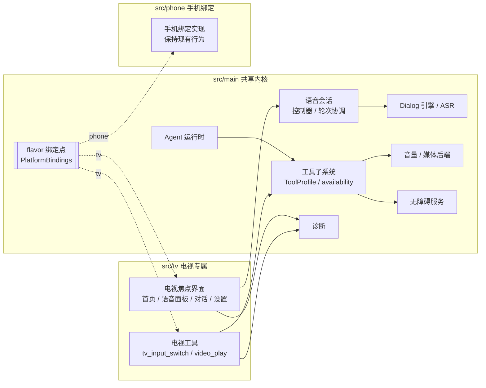
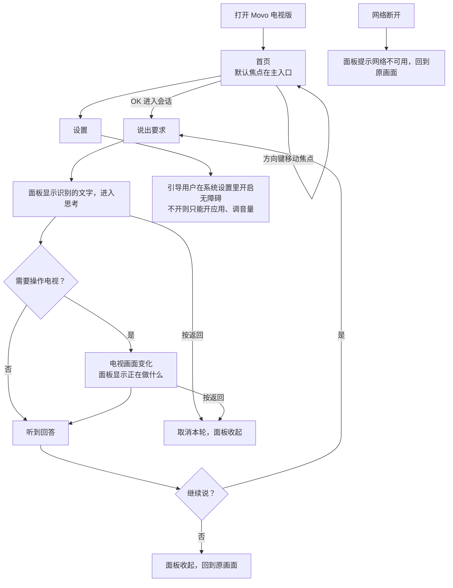

# Movo 电视端适配实施方案

> 最后更新：2026-10-05
> 依据：[调研文档](../../research/tv-voice-app/电视端语音App改造调研.md)、issue #11 的 Android 9 真机验证、main `d00a249` 的代码。
> 路径缩写：`K/` = `app/src/main/kotlin/io/github/fartown/movo/`，行号以 `d00a249` 为准。

## 0. 摘要

把现有的 Movo 适配到电视：用遥控器操作界面，语音沿用 Movo 现有的识别与对话链路，Agent 用正规接口控制电视（打开应用、调音量、媒体播放、切信号源、通过无障碍操作其他 App）。最低兼容 Android 9（API 28）。首台目标设备是 TCL 55F295C（Android 9、32 位、红外遥控器）。

**范围说明**：语音怎么唤起（唤醒词、按键触发）不在本方案内；本方案只保证“语音一旦开始，走通识别 → 对话 → 回答”。设备控制只用系统提供的正规能力：无障碍服务由用户在设置里手动开启。不涉及任何绕过系统权限的手段。

推荐路线：同一个 `:app` 模块加 `phone` / `tv` 两个 flavor。第一阶段不搬迁手机代码，电视版直接复用全部共享内核（Agent 运行时、工具子系统、语音会话），只在一个“flavor 绑定点”上切换界面入口、工具范围和平台能力。电视专属部分放进 `src/tv`，主要是焦点导航界面和电视工具。

读者重点：§2.5 的未决问题需要你拍板；§5.4 的工作包和每阶段出口标准。

## 1. 状态与结论

| 项目 | 结论 |
| --- | --- |
| 当前状态 | `draft`，待评审；未写任何产品代码 |
| 需求目标 | Android 9 电视上：遥控器操作 + 语音问答 + 正规接口控制电视 |
| 推荐方案 | `phone` / `tv` flavor；共享内核不搬迁；电视界面和电视工具放进 `src/tv`；分 P1–P4 交付 |
| 关键依据 | 调研文档：API 28 依赖不用降级、147 处 NewApi（50 处手机专属）；issue #11：豆包语音库在 armeabi-v7a 可加载、无障碍读节点和手势可行、tv-material 焦点列表性能数据 |
| 关键风险 | 无障碍在 API 28 发不了方向键（API 33 才有），电视 GUI Agent 以“点节点 + 焦点”为主；低端电视焦点列表帧耗时偏高；语音拾音在部分电视上要真机验证 |
| 文档入口 | 调研：`docs/research/tv-voice-app/电视端语音App改造调研.md`；真机验证：issue #11 |
| 飞书归档 | 未创建 |

## 2. 需求调研

### 2.1 需求目标

- 电视上用遥控器（方向键 + OK + 返回 + 主页）完成 Movo 的全部操作。
- 语音问答沿用 Movo 现有链路：识别用户说的话 → 交给 Agent → 语音回答。**怎么开始说话不在本方案内。**
- Agent 用正规接口控制电视：打开应用、在视频 App 里搜片播放、调音量、媒体播放控制、切信号源、返回主页；在用户开启无障碍后，操作其他 App 的界面。
- 兼容 Android 9（API 28）。手机版行为保持不变。

### 2.2 背景

- Android 9 下工具链和依赖基本不用动（调研文档 §4）：AndroidX 目前要求 minSdk 23，豆包语音库在 armeabi-v7a 可加载，不需要降级依赖或打包额外证书。唯一卡住的 miuix-blur（minSdk 33）只在手机界面用。
- 现有界面深度依赖触摸，全仓没有任何方向键或焦点处理（调研文档 §3），电视界面要重写成焦点导航。
- 首台设备是 TCL 55F295C，Android 9、32 位 ABI、红外遥控器。
- 无障碍服务在 API 28 能读界面节点、对节点执行点击/滚动、做手势、返回/主页/最近任务，但**不能注入方向键和 OK**（`GLOBAL_ACTION_DPAD_*` 到 API 33 才有，调研文档 §7）。所以电视上的 GUI Agent 以“读节点 + 点节点 + 移动焦点”为主，不是“点坐标”。

### 2.3 来源与输入

| 来源 | 内容 | 链接或路径 |
| --- | --- | --- |
| 调研文档 | 依赖、lint、能力分层、工程结构 | `docs/research/tv-voice-app/电视端语音App改造调研.md` |
| issue #11 | Android 9 真机结论：语音库加载、无障碍、焦点列表性能 | https://github.com/Fartown/Movo/issues/11 |
| 复用调研（本方案 §3.2） | 语音链路、工具子系统、工程结构的可复用点 | 以 `d00a249` 为准 |

### 2.4 范围

| 范围内 | 范围外 |
| --- | --- |
| TCL（Android 9）上的遥控器操作、语音问答、正规接口控制电视 | 语音怎么唤起（唤醒词、按键触发） |
| `phone` / `tv` flavor；手机版回归不变 | 其他品牌电视的逐款适配（留好扩展点，本期不实现） |
| 电视焦点界面（先出 Figma 稿评审） | HDMI-CEC、读取全部频道 EPG（第三方做不到） |
| 复用现有豆包识别与对话链路 | 自研唤醒、全双工插话打断 |
| 无障碍（用户手动开启）+ 打开应用 + 音量 + 媒体 + 切信号源 + 视频深链 | 任何绕过系统权限、提权注入按键的手段 |

### 2.5 未决问题

| # | 问题 | 推荐 | 状态 |
| --- | --- | --- | --- |
| Q1 | 电视版 applicationId 是否加 `.tv` 后缀？ | 加 `io.github.fartown.movo.tv`，与手机版可并存 | **已定：加 `.tv`**（2026-10-05） |
| Q2 | 语音在电视上用哪条链路？ | 对话用现有 Dialog 引擎；识别用现有豆包 ASR | open |
| Q3 | 电视上拾音来源？（普通 AudioRecord 在部分电视上录不到） | 列为 P2 真机验证项；本方案不绑定具体来源 | open |
| Q4 | 电视界面焦点组件：tv-material 组件，还是在 Compose foundation 上自写轻量焦点组件？ | 自写轻量组件（issue #11：默认 TV Button 焦点列表 P95 80.7ms，简单描边 47.8ms） | open |
| Q5 | 电视上的模型配置：首版用构建时注入的默认值，还是做扫码配置？ | 首版用构建默认值（`app/build.gradle.kts:67-80`）；扫码配置放 P4 | **已定：首版用默认值**（2026-10-05） |
| Q6 | GUI Agent 操作其他 App：只用无障碍（点节点、移动焦点）够不够？ | 够首版用；方向键注入等更强能力单独评估，不在本方案 | open |

### 2.6 已确认结论

- 最低版本 Android 9（API 28）。
- 工程结构走同一模块的 flavor，不拆模块（调研文档 §8：全仓 1203 处 `internal`）。
- 电视界面先出 Figma 稿评审再写代码。
- 电视版 applicationId 加 `.tv` 后缀（`io.github.fartown.movo.tv`），与手机版可并存。
- 首版电视端模型与语音凭据用构建时注入的默认值（`MOVO_DEFAULT_*`、`DOUBAO_VOICE_API_KEY`，见 `app/build.gradle.kts:67-80`），不做界面配置；扫码配置放 P4。

## 3. 技术调研

### 3.1 当前现状

| 能力 | 结论 | 本方案用法 |
| --- | --- | --- |
| 依赖 / 原生库 | API 28 不用降级；豆包语音库 armeabi-v7a 可加载 | 直接复用语音链路 |
| 界面 | 全仓无焦点导航，72 个界面文件依赖 miuix 触屏组件 | 电视界面新写（§5.6） |
| 无障碍 | API 28 能读节点、点节点、手势、返回/主页；不能注入方向键 | GUI Agent 以点节点 + 焦点为主 |
| 打开应用 | 现有只查 `CATEGORY_LAUNCHER` | 补 LEANBACK（§5.5） |
| 音量 / 媒体 | 现有后端无 root 可用 | 直接复用 |
| 焦点列表性能 | 简单描边焦点 P95 47.8ms，仍未达 60Hz | 轻量焦点组件 + 帧耗时预算（§5.6） |

### 3.2 已实现的相似代码与复用结论

| 需要的能力 | 已有实现（`d00a249`） | 复用结论 |
| --- | --- | --- |
| 语音对话（识别 + 回答播报） | `DoubaoDialogEngine`（`K/agent/voice/conversation/DoubaoDialogEngine.kt`）、`VoiceConversationController`、`VoiceSessionManager`（`createController` 可注入，`K/agent/voice/session/VoiceSessionManager.kt:55-56`） | **直接复用**；唤醒后打开的界面写死为手机 Sheet（`K/agent/voice/MovoAssistantVoiceService.kt:23,141`），电视版通过绑定点换入口 |
| 流式识别 | `DoubaoBidirectionalAsrEngine`（`K/agent/voice/asr/DoubaoBidirectionalAsrEngine.kt`） | **直接复用** |
| 唤醒引擎接口 | `WakeWordEngine`（`K/agent/voice/wake/WakeWordEngine.kt:7-21`），工厂写死 Sherpa（`K/agent/voice/wake/SherpaWakeEngine.kt:300-302`） | 唤起不在本方案范围；工厂改为按 flavor 选择即可，电视默认不启用 Sherpa |
| 工具定义与注册 | `ToolContract`（`K/agent/tools/core/ToolContract.kt:23-61`）→ `ContractTool` → Provider → `AgentToolSubsystem.buildProviders`（`K/agent/tools/AgentToolSubsystem.kt:63-86`）；`availability(env)` 控制是否暴露（`K/agent/tools/core/ToolRegistry.kt:25-31`） | **直接复用**；新增电视工具同样走 Contract + Provider |
| 打开应用 | `LauncherAppIndex` 只查 `CATEGORY_LAUNCHER`，用了 API 33 flags（`K/agent/tools/device/AndroidAppToolBackends.kt:18-20`）；`launchPackage` 只用 `getLaunchIntentForPackage`（`:87`） | **增量扩展**：补 LEANBACK + API 28 分支 |
| 音量 / 媒体 | `RealVolumeSetBackend`、`RealMediaControlBackend`（`K/agent/tools/clockmedia/ClockMediaBackends.kt:398-444`），无 root 可用 | **直接复用**；电视上隐藏 RING / CALL 流 |
| 无障碍操作 | `AgentAccessibilityService`（`K/agent/accessibility/AgentAccessibilityService.kt`），读节点、点节点、手势、全局动作 | **直接复用 + 加分支**：36 处高版本 API 加 `SDK_INT` 判断，无障碍截图（API 34）在电视上降级 |
| 按设备形态裁剪工具 | 没有设备形态字段；Terminal、Browser、Personal 三个 Provider 写死（`AgentToolSubsystem.kt:73-79`） | **增量扩展**：注入 `ToolProfile`，电视不装配这三类 |
| 会话与界面状态 | `K/ui/model/` 下 12 个 UiState；`K/ui/app/AgentAppSession` 等（只依赖 compose runtime） | **直接复用** |
| 诊断 | `MemoryDiagnostics.record(...)`（`K/diagnostics/MemoryDiagnostics.kt:184-197`） | **直接复用**：新增电视相关事件 |
| 测试替身 | `FakeUiBackend`（`app/src/test/.../tools/ui/UiToolsTest.kt:353-394`）、假语音会话（`VoiceSessionManager.kt:138-160`） | **直接复用** |

**需要新增（无可复用实现）**：电视焦点界面（现有 `ui/` 无焦点处理）、电视工具（切信号源、视频深链）。

### 3.3 候选技术思路

| 决策点 | 候选 | 选择 | 理由 |
| --- | --- | --- | --- |
| 工程结构 | A. 第一阶段就把手机代码搬进 `src/phone`；B. 先不搬，共享全部代码，只加 flavor 绑定点 | **B** | API 28 上 miuix 主库（24）、libxposed（26）都能编译，只有 miuix-blur（33）卡住，它只在手机 `ui/` 6 个文件里用。A 要先拆 `AgentAppState`（3373 行）和 `AgentRuntimeService`（2314 行）对 ui 的反向依赖，改动大、易冲突。电视包暂时带上用不到的手机代码，放 P5 瘦身 |
| 电视界面 | A. tv-material 组件；B. Compose foundation 上的轻量焦点组件；C. View/Leanback | **B，P4 用帧耗时验收兜底** | 实测 B 更快；Leanback 已 deprecated，偏海报墙，不适合对话 |
| 语音链路 | A. 复用现有 Dialog 引擎；B. 另写 | **A** | 已在用，armeabi-v7a 可加载 |
| GUI Agent 操作其他 App | A. 无障碍点节点 + 移动焦点；B. 更强的按键注入 | **A** | 无障碍是系统提供、用户授权的正规能力；B 涉及的提权手段不在本方案，单独评估 |

### 3.4 依赖与接口

| 依赖 | 接口 | 提供方 | 备注 |
| --- | --- | --- | --- |
| 语音云服务 | 豆包识别 / 实时对话 | 火山引擎 | 公开接口，现有链路已接入 |
| 打开应用 | `getLeanbackLaunchIntentForPackage`（API 21） | 系统 | 电视应用入口 |
| 音量 | `AudioManager.adjustStreamVolume` | 系统 | 部分盒子固定音量，实测 |
| 媒体 | `AudioManager.dispatchMediaKeyEvent` | 系统 | 目标 App 需处理媒体键 |
| 切信号源 | `TvContract.buildChannelUriForPassthroughInput`（API 21）+ `TvInputManager` | 系统 / 厂商 | 需厂商实现 TV Input Framework，真机验证（§3.5） |
| 视频深链 | 各视频 App 的 deeplink | 第三方 App | 逐个验证 |
| 无障碍 | `AccessibilityService`（用户在设置里开启） | 系统 | 读节点、点节点、手势、全局动作 |

### 3.5 调研遗留未知项的处置

| 未知项 | 处置 |
| --- | --- |
| 电视拾音来源（普通 AudioRecord 在部分电视上无效） | **P2 真机验证**；本方案不绑定具体来源，由绑定点注入 |
| 视频 App 深链在目标电视上是否可用 | **P3 逐个验证**，失败则走界面操作（无障碍 + 焦点） |
| TCL 切信号源是否有直达 Intent / 标准 TvInputManager 是否可用 | **P3 验证**，不可用则由用户/Agent 经界面选择 |
| 低端电视上 Compose 焦点性能 | **P4 帧耗时验收**，不达标退回 View |

## 4. 交互链路

### 4.1 系统交互图



读图重点：电视专属模块都是共享接口的实现，共享内核不反向依赖 `src/tv`；flavor 差异只经 `PlatformBindings` 一个点切换。

### 4.2 用户动线图



图覆盖范围：遥控器在首页导航、一轮语音问答、追问、取消、设置引导、断网。

验收关注点：每个状态都有可见反馈；返回键在任何阶段都能取消退出；进入每个页面都有默认焦点、不丢焦点。

## 5. 方案设计

### 5.1 设计原则

1. **复用优先**：电视专属能力都写成共享接口的实现（`ToolContract`、界面消费现有 `UiState`），不另起平行的语音会话、工具管线或运行时。
2. **共享内核不依赖 flavor**：`src/main` 不 import `src/tv` 或 `src/phone`，差异经 `PlatformBindings` 注入。
3. **手机版零行为变化**：phone 绑定返回现有实现，phone 变体单测和真机回归必须全过。
4. **只用正规能力**：控制电视只用系统提供、用户授权的接口（无障碍、launch intent、AudioManager、TvContract）。无障碍是否开启由用户决定，没开就降级。
5. **能力可降级、失败可见**：每个电视能力检测可用性，不可用时工具从目录隐藏、界面明确提示，不假装成功。
6. **界面先出 Figma 稿**：按 `docs/DESIGN_SYSTEM.md` 补电视章节，评审后再写界面代码。

### 5.2 仓库规范与现有逻辑

| 规范 | 来源 | 遵循方式 |
| --- | --- | --- |
| 界面以设计规范为唯一依据，新页面先出 Figma 稿 | `docs/DESIGN_SYSTEM.md`；协作约定 | 电视界面先 Figma 定稿；规范补“电视”章节 |
| 界面不能跳闪；性能优化不削弱动画 | 协作约定 | 焦点动效先定预算，P4 帧耗时验收 |
| 工具按 `ToolContract` 定义、Provider 注册、`availability` 控制暴露 | `K/agent/tools/core/ToolContract.kt:23-61`、`ToolRegistry.kt:25-31` | 电视工具同样走 Contract + Provider |
| 诊断字段不放异常消息、正文、URL | `K/diagnostics/MemoryDiagnostics.kt:182-183` | 新增事件只记阶段、错误类型、耗时 |
| 大改动先出方案，评审通过后写代码 | 协作约定 | 本文评审通过后按 §5.4 工作包逐个提交 |

### 5.3 仓库改动总览

```
app/
├─ build.gradle.kts                                  [修改] 加 device 维度 phone / tv flavor；tv：minSdk 28、applicationIdSuffix .tv、armeabi-v7a
├─ src/main/kotlin/io/github/fartown/movo/
│  ├─ MovoApp.kt                                     [修改] 按绑定点决定初始化内容
│  ├─ platform/PlatformBindings.kt                   [新增] flavor 绑定点：设备形态、工具范围、语音入口界面
│  ├─ agent/voice/MovoAssistantVoiceService.kt       [修改] 语音入口界面改由绑定点打开；API 28 分支
│  ├─ agent/voice/session/VoiceSessionManager.kt     [复用] 不改
│  ├─ agent/tools/AgentToolSubsystem.kt              [修改] 按 ToolProfile 装配 Provider
│  ├─ agent/tools/core/ToolEnvironment.kt            [修改] 增加 deviceForm 字段
│  ├─ agent/tools/device/AndroidAppToolBackends.kt   [修改] 同时查 LEANBACK；API 28 分支
│  ├─ agent/tools/clockmedia/VolumeSetTool.kt        [修改] 电视隐藏 RING / CALL
│  ├─ agent/accessibility/AgentAccessibilityService.kt [修改] 36 处 NewApi 加分支；截图降级
│  ├─ agent/runtime/*                                [修改] 16 处 NewApi 加分支；悬浮窗渲染由绑定点决定
│  └─ data/repository/LanguageSettingsRepository.kt  [修改] API 33 以下的语言设置
├─ src/phone/kotlin/.../platform/PhonePlatformBindings.kt [新增] 返回现有实现，手机行为不变
└─ src/tv/
   ├─ AndroidManifest.xml                            [新增] LEANBACK_LAUNCHER、banner、touchscreen required=false；移除手机入口
   ├─ res/                                           [新增] banner、电视文案
   └─ kotlin/io/github/fartown/movo/tv/
      ├─ TvPlatformBindings.kt                       [新增] 电视绑定实现
      ├─ tools/TvToolProvider.kt                     [新增] 电视工具注册
      ├─ tools/TvInputSwitchTool.kt                  [新增] tv_input_switch（TvContract / 厂商菜单）
      ├─ tools/VideoPlayTool.kt                      [新增] video_play（深链 + 界面兜底）
      └─ ui/                                         [新增] 电视焦点界面，见 §5.6
```

### 5.4 模块总览与工作包

| 模块 | 职责 | 落点 | 改动类型 | 复用基础 |
| --- | --- | --- | --- | --- |
| flavor 工程骨架 | 两个 flavor、兼容 API 28、电视清单 | `build.gradle.kts`、`src/tv/AndroidManifest.xml`、共享代码 NewApi 分支 | 修改 + 新增 | 现有构建配置 |
| flavor 绑定点 | 切换设备形态、工具范围、语音入口界面 | `platform/PlatformBindings.kt` + 两 flavor 实现 | 新增 | 现有写死实现 |
| 工具适配 | LEANBACK、音量、无障碍 API 分支、ToolProfile | `agent/tools/*`、`agent/accessibility/*` | 修改 | 工具子系统 |
| 电视工具 | 切信号源、视频播放 | `tv/tools/*` | 新增 | `ToolContract`、`app_open`、无障碍 |
| 电视界面 | 首页、语音面板、对话、设置 | `tv/ui/*` | 新增 | `ui/model/*` UiState、`AgentAppSession` |

工作包与出口标准：

| 阶段 | 工作包 | 出口标准 |
| --- | --- | --- |
| **P1 工程骨架** | ① flavor 骨架，两 flavor 先都 minSdk 34，改 CI 产物路径（`.github/workflows/android-release.yml:77-78,99,108`）和脚本；② 加 `PlatformBindings`，phone 实现保持现状；③ tv 改 minSdk 28：共享代码 97 处 NewApi 加分支，手机界面 50 处加 `@RequiresApi(34)` 并保证电视上不可达，miuix-blur 在 tv 清单 `overrideLibrary`；④ 加 `ToolProfile`，电视不装配 Terminal / Browser / Personal；⑤ 电视空白首页 | phone 变体：1485 个单测全过、CI 产物与原来一致、小米手机冒烟过；tv 变体：在 TCL 上安装启动、NewApi 为 0、工具目录无手机专属工具 |
| **P2 语音问答闭环** | ① 真机确认电视拾音来源（Q3），由绑定点注入；② 电视语音面板（最简）接现有 Dialog / ASR；③ 语音入口界面改由绑定点打开 | 在电视上发起一轮语音（怎么发起不限），能识别、回答，面板状态正确 |
| **P3 电视控制** | ① 工具适配：LEANBACK、音量隐藏 RING/CALL、无障碍 API 分支与截图降级；② `tv_input_switch`、`video_play`；③ 设置里引导开启无障碍；④ 无障碍未开时降级 | “打开银河奇异果”“音量调到 20”“在云视听极光里搜某剧并播放”“切到 HDMI 1”“返回桌面”全部通过；无障碍未开时自动降级并提示 |
| **P4 体验与稳定** | ① 按 Figma 定稿实现完整电视界面；② 帧耗时预算；③ 扫码配置模型（Q5）；④ 诊断面板 | 焦点移动 P95 达到评审预算；诊断能还原一轮语音/一次工具调用的阶段 |
| **P5 可选** | 手机专属代码搬进 `src/phone` 给电视包瘦身；接其他品牌厂商适配 | 视需要另出方案 |

### 5.5 工具适配

- **打开应用**（`AndroidAppToolBackends.kt`）：`:18` 的应用索引同时查 `CATEGORY_LEANBACK_LAUNCHER`，按包名合并；`:87` 拿不到普通 launch intent 时回退 `getLeanbackLaunchIntentForPackage`；`:20` 的 `ResolveInfoFlags.of`（API 33）加 API 28 分支。
- **音量 / 媒体**：`RealVolumeSetBackend`、`RealMediaControlBackend` 直接复用；`VolumeSetTool` 的 `VolumeStream` 在电视上隐藏 RING、CALL。
- **无障碍**（`AgentAccessibilityService.kt`）：36 处高版本 API 加 `SDK_INT` 判断；无障碍截图（`takeScreenshotOfWindow`，API 34）在 API 28 返回明确不可用，不复用旧截图。GUI Agent 在电视上以读节点、点节点、移动焦点为主。
- **工具范围**（`AgentToolSubsystem.buildProviders`）：注入 `ToolProfile`，电视不装配 `TerminalToolProvider`、`BrowserToolProvider`、`PersonalToolProvider`，对应领域的提示分节随之消失。

### 5.6 电视界面

- **落点**：`src/tv/.../ui/`，新写首页、语音面板、对话、设置。
- **复用**：消费现有 `K/ui/model/` 下的 UiState 和 `K/ui/app/AgentAppSession` 等状态类（只依赖 compose runtime），不复用手机的 miuix 视图。对话消息的 Markdown 渲染可复用。
- **焦点组件**：在 Compose foundation 上自写轻量焦点组件（Q4）。每个可操作元素有清晰焦点态；进入页面有默认焦点；焦点顺序可预期、不丢焦点；返回键连续按最终回主页。
- **设置**：引导用户在系统设置里开启无障碍（这是用户的主动授权）；未开启时界面说明哪些能力不可用。
- **先出 Figma 稿**：电视首页、语音面板、对话、设置、焦点态与动效，先在 Figma 定稿评审，再写代码。规范补“电视”章节（焦点态、安全区、字号、D-pad 导航）。

### 5.7 电视工具

- **`tv_input_switch`（切信号源）**：优先用 `TvInputManager.getTvInputList()` + `TvContract.buildChannelUriForPassthroughInput`；标准接口不可用时，由 Agent 经界面操作（打开信源菜单 + 焦点选择）完成。走 `ToolContract` + 新 `TvToolProvider`。
- **`video_play`（视频播放）**：维护一张视频 App 深链表（如云视听极光、酷喵等），按片名跳转搜索或播放；深链不可用时退回“打开 App + 无障碍搜索”。
- 两个工具的 `availability(env)` 按设备形态为电视，手机上不暴露。

## 6. 监控、风险与测试

### 6.1 埋点与监控

- 复用 `MemoryDiagnostics.record`。新增事件（只记阶段、错误类型、耗时，不记正文）：
  - `tv.voice.*`：一轮语音的开始、识别完成、回答播放完成、失败。
  - `tv.tool.*`：`tv_input_switch`、`video_play`、无障碍操作的成功/失败与原因。
  - `tv.a11y.*`：无障碍是否开启、截图是否可用。

### 6.2 风险评估

| 风险 | 影响 | 缓解 |
| --- | --- | --- |
| 无障碍发不了方向键（API 28） | GUI Agent 不能靠注入方向键遍历任意界面 | 以点节点 + 移动焦点为主；对节点质量差的 App 明确告知局限 |
| 低端电视焦点列表帧耗时高 | 卡顿 | 轻量焦点组件；P4 帧耗时预算；不达标退 View |
| 电视拾音在部分机型无效 | 语音识别失败 | P2 真机先验证拾音来源，由绑定点注入；失败时界面明确提示 |
| 视频深链 / 切信号源因机型而异 | 工具时好时坏 | 深链失败退界面操作；能力检测 + 降级 |
| 电视包暂带手机代码 | 包体偏大 | P5 瘦身 |

### 6.3 自测与回归

- **phone 回归**（每阶段必过）：1485 个单测；小米手机上语音、工具、悬浮窗冒烟。
- **tv 自测**：
  - 遥控器全程可达：方向键 + OK + 返回能完成首页导航、发起语音、进设置。
  - 焦点：每页有默认焦点、不丢焦点、返回键连续按回主页。
  - 工具：打开应用、音量、媒体、切信号源、视频播放、无障碍操作，各给预期与实测。
  - 降级：无障碍未开、深链不可用、网络断开时的界面提示。
- **回归清单**：工具目录断言（`app/src/test/.../tools/AgentToolSubsystemTest.kt` 等 13 处）随 `ToolProfile` 更新；CI 产物路径随 flavor 更新后与原手机包一致。

## 7. 附录与引用

- 调研：`docs/research/tv-voice-app/电视端语音App改造调研.md`、`docs/research/tv-voice-app/lint-newapi-minSdk28.txt`
- 真机验证：https://github.com/Fartown/Movo/issues/11
- 设计规范：`docs/DESIGN_SYSTEM.md`
- 运行时：`docs/AGENT_RUNTIME.md`

## 8. 变更记录

| 时间 | 变更原因 | 变更内容 | 影响范围 | 记录人 |
| --- | --- | --- | --- | --- |
| 2026-10-05 | 初稿 | 按“Movo 适配电视”范围成稿：flavor 结构、复用现有语音链路、正规接口控制电视、电视焦点界面；语音唤起方式与提权类设备控制不在本方案范围 | 全文 | zhangchao.zc |
