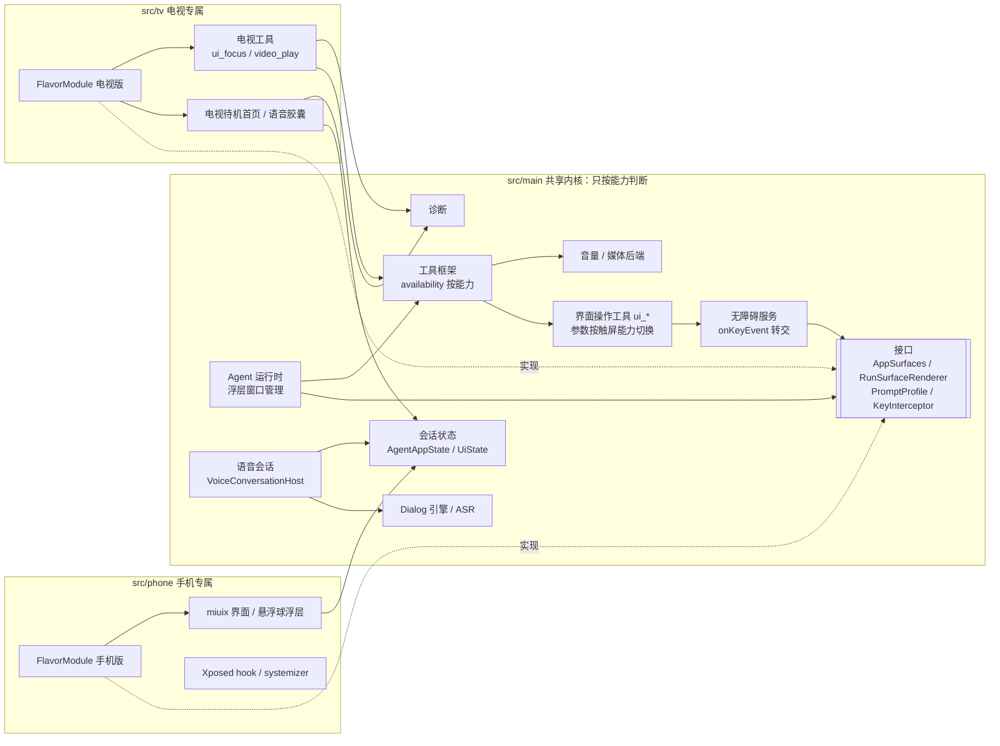
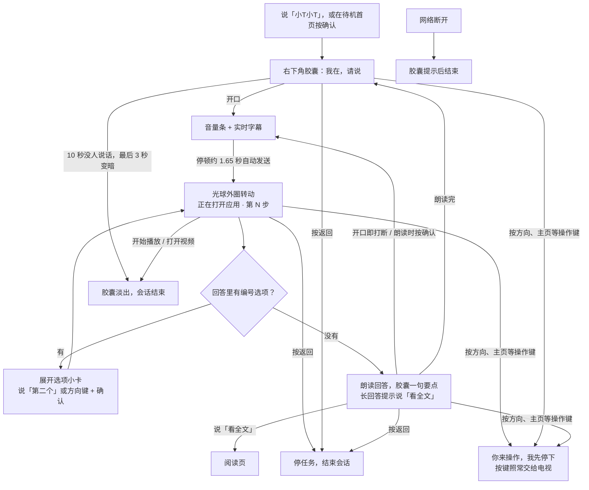

# Movo 电视端适配实施方案

> 最后更新：2026-10-06。下方「当前交付与验证」记录实际结果，其余分期和调研段落保留设计时的上下文；不能把历史待验证项当成当前状态。
> 依据：[调研文档](../../research/tv-voice-app/电视端语音App改造调研.md)、issue #11 的 Android 9 真机验证、main `d00a249` 的代码。
> 路径缩写：`K/` = `app/src/main/kotlin/io/github/fartown/movo/`，行号以 `d00a249` 为准。

## 0. 摘要

把现有的 Movo 适配到电视：用遥控器操作界面，语音沿用 Movo 现有的识别与对话链路，Agent 用正规接口控制电视（打开应用、调音量、媒体播放、视频深链、通过无障碍操作其他 App）。最低兼容 Android 9（API 28）。首台目标设备是 TCL 55F295C（Android 9、32 位、红外遥控器）。

**范围说明**：语音怎么唤起（唤醒词、按键触发）不在本方案内；本方案只保证“语音一旦开始，走通识别 → 对话 → 回答”。设备控制只用系统提供的正规能力：无障碍服务由用户在设置里手动开启。不涉及任何绕过系统权限的手段。

推荐路线：同一个 `:app` 模块加 `phone` / `tv` 两个 flavor。

- **相同的部分**（Agent 运行时、工具框架、语音会话、数据层、会话状态）留在 `src/main`，只按设备能力判断，不判断“是不是电视”。
- **不同的部分**各放 `src/phone`、`src/tv`，由每个 flavor 一个同名装配对象 `FlavorModule` 在编译期选定（§5.5）。
- **互不影响**：P1 先拆掉共享代码对手机界面的约 10 处直接引用，再把手机专属代码（界面、Xposed hook、手机清单组件）搬进 `src/phone`，最后才把电视降到 Android 9。清单和工具集都用白名单，任何一边新增的内容默认不进另一边。

读者重点：§5.4 的 P1 六个 PR 与出口标准；§5.5 区分规则；§5.7、§5.8 电视界面操作工具与语音胶囊窗口；「电视语音界面 v2」一节的交互规则；§2.5 剩余未决问题。

## 1. 状态与结论

| 项目 | 结论 |
| --- | --- |
| 当前状态 | P1 工程分离、TCL 采音适配、Android 9 系统助理截图、原生无障碍对话浮窗与常用电视工具已纳入 MR #12；正常使用链路已在 TCL 真机以文字、静音方式验收，见下节。语音优先的界面 v2（右下角胶囊、待机首页、连续对话规则）已实现并通过单测，**尚未真机验证**；`video_play` 待电视连上后逐个验证深链再做；切信号源不做 |
| 需求目标 | Android 9 电视上：语音优先、遥控器辅助 + 语音问答 + 正规接口控制电视 |
| 推荐方案 | `phone` / `tv` flavor；共享代码按能力判断，差异经 `FlavorModule` 装配；P1 先拆依赖、再搬手机代码、最后降 minSdk 28；分 P1–P4 交付 |
| 关键依据 | 调研文档：API 28 依赖不用降级、147 处 NewApi（50 处手机专属）；issue #11：豆包语音库在 armeabi-v7a 可加载、无障碍读节点和手势可行、tv-material 焦点列表性能数据；代码核对：`ui/` 之外 10 个文件直接引用手机界面，运行时绑定和自我识别写死包名（§3.1） |
| 关键风险 | API 28 使用节点点击与焦点导航，无法承诺操作所有自绘界面；该 TCL 固件缺少标准授权页，需要首次准备权限；视频画面可能为黑色，换集元数据可能滞后；OEM 采音与唤醒适配依赖固件内部接口 |
| 文档入口 | 调研：`docs/research/tv-voice-app/电视端语音App改造调研.md`；真机验证：issue #11 |
| 飞书归档 | 未创建 |

## 当前交付与验证（2026-10-06）

[MR #12](https://github.com/Fartown/Movo/pull/12) 包含 phone/tv 工程分离、TCL 适配、截图、浮窗和播放器控制。测试设备为 TCL 55F295C / ak30a5、Android 9 API 28、armeabi-v7a。完整操作记录见 [issue 正常使用报告](https://github.com/Fartown/Movo/issues/11#issuecomment-6007628653)。

- 浮窗直接复用会话，支持文字输入、发送、停止、收起和关闭；打开时不启动 Activity，保持底层播放器。截图前隐藏自身浮窗，避免误识别。
- 常用链路已经实测：找应用、打开奇异果、搜索《西游记》并播放、暂停/继续、快进/快退、上下集、静音、焦点/点击/滚动/输入、主页、截图、剪贴板与记忆/会话读取。18 个 TV 工具均有真机执行记录；root、终端等未纳入 TV 工具表。
- 连续回归 R51：暂停在 209150ms；快进 60 秒目标 269150ms，真实回调 268781ms；快退 30 秒目标 238781ms，真实回调 235600ms；两次跳转均保留暂停。发送后断开电脑 ADB 约 30 秒，暂停与快进在断开期间完成。日常控制和截图不依赖 ADB 或 root。
- 换集 2→3、3→2 用新截图确认；此播放器的 media_id 不及时刷新，所以工具返回未确认时不能仅凭 API 认定成功。广告 actions=0 时返回不支持。跳转报告真实落点与偏差；Gala 最大 10 秒容差属于 Movo 的判定阈值。
- 修复 TCL 后台服务启动 ANR、等待操作取消迟滞、纯浮窗状态不刷新和最终回答被追问条目遮掉。R54 点击真实停止按钮后结束运行且未执行后续 HOME；R57 通过搜狗键盘发送文字并在浮窗看到完整回复。
- 与主干权限模式统一：默认 YOLO；手动模式按用户规则处理。电视不再通过独立 SKIP 开关绕过规则，无法显示确认卡的动作明确返回未执行；手机审批、解锁及监控界面保留在 phone。

无障碍需开启并放行 TCL 自启动。这台 ROM 的标准录屏/媒体会话授权页面缺失，首次安装需一次性准备：

```sh
adb shell pm grant io.github.fartown.movo.tv android.permission.WRITE_SECURE_SETTINGS
adb shell cmd notification allow_listener io.github.fartown.movo.tv/io.github.fartown.movo.tv.TvMediaAccessService
```

随后在 Movo「屏幕读取权限」启用系统助理截图，在「播放控制权限」检查媒体会话授权。系统助理实际返回 1920×1080 截图；部分视频像素可能为黑色，应结合标题、控件和媒体状态判断。通知监听服务仅用于访问媒体会话，不读取或保存通知内容。

本轮验收使用文字且保持静音，没有重跑录音、播报、重启、深度待机或远场开机。此前人声录音、唤醒原型和 32 位 JNI 的结果属于 [P0 历史记录](../../research/tv-voice-app/P0真机验证-TCL-ak30a5.md)，不能扩展成最新产品包完整语音链路或全部机型通过。当前包的 TV 构建、Phone Kotlin 编译、TV lint 及修改涉及的已有等待工具用例已验证；具体合并后检查见 MR。


issue 提及文件的处理：

| 文件 | 处理及用途 |
| --- | --- |
| P0 报告、evidence-summary.json | 提交脱敏历史证据，明确日期、已淘汰路线和当前实现入口 |
| tools/tv-compose-probe、tools/tv-voice-probe | 保留独立性能与 32 位语音库实验源码，附构建及结果边界 |
| tools/tv-probe | 淘汰本机 ADB、自定义 shell 按键和一次性录音/唤醒原型；可用能力已迁入 app/src/tv |
| docs/solutions/tv-voice-app.md | 删除旧的 ADB 主路线草案，统一使用本文 |
| APK、dex、缓存、私有日志/数据库、原始录音和厂商文件 | 不进入仓库；重复构建产物删除，原始验证证据仅本地保留 |

## 电视语音界面 v2（2026-10-06）

设计稿：[Figma「Movo TV」· 候选 · 电视语音面板 v2](https://www.figma.com/design/SM7DgHqJC5E6cuA95JsnaO?node-id=21-1041)（v1 底部大面板已归档）。已实现并合入 `feat/tv-flavor`（MR #12）。电视相关开发统一在这一个分支上进行。

**原则**（用户原话）：「tv 实际默认就是语音交互模式」「优先语音，支持遥控」「能小尽量小，能透出信息即可」「跟手机一样的风格」。

| 场景 | 界面与规则 |
| --- | --- |
| 常态 | 右下角一枚胶囊（**2-a**）：光球 + 一行字，约 60 高；不压暗画面、不抢焦点、不可点，节目和遥控器照常 |
| 状态 | 与手机语音模式同一套符号：连接中、听（音量条 + 实时字幕）、在想 / 在做（光球外圈转动 + 「正在打开应用 · 第 N 步」）、回答（喇叭 + 一句要点）、等你说（「我在，请说」） |
| 长回答 | 胶囊只放第一句，后面提示「说『看全文』」；「看全文」等说法在本地直接打开阅读页，不交给模型 |
| 反问选项 | 回答里有 2–6 个编号选项时临时展开成小卡；说「第二个」，或方向键 + 确认 / 数字键选择；选完立即收回 |
| 连续对话 | 与手机同一套会话；回答完 **10 秒**没人说话收起（手机 45 秒）；最后 3 秒胶囊慢慢变暗（**1-a**），开口立即恢复；收起直接淡出，不出声 |
| 播放 / 打开 App | 开始播放媒体立即结束会话，不再追问（沿用 `DoubaoDialogEngine` 的媒体接管结束） |
| 遥控器 | 返回 = 停（取消任务、结束会话）；朗读时确认 = 打断；方向、主页、频道、媒体、数字等操作键 = 你来操作：停任务、结束会话，胶囊显示「你来操作，我先停下」2 秒后淡出，按键照常交给前台应用；音量、静音、语音键不影响会话；Movo 自己的页面在前台时不接管 |
| App 页面 | 2026-10-06 定稿（焦点 F-a 整行浅紫）：App 只做基本配置——首页 = 一句状态 + 一张清单（语音与唤醒 / 权限 / 模型 / 关于），配置二级页，「看全文」阅读页；不做对话页、对话记录、示例说法、文字输入。视觉逐项取手机设置页规范 × 1.5（`docs/DESIGN_SYSTEM.md` §14.1） |

为什么是 10 秒：官方给出秒数的追问窗口在 8–15 秒，多数 10 秒（Google Assistant 8 或 10 秒，两份帮助页不一；华为智慧屏小艺 10 秒；Gemini Live 15 秒）；会话期间节目被暂停（Fire TV 要求暂停或压到 30–40%），不宜干等手机的 45 秒；播放媒体后不进入追问是 Google、Alexa、华为的共同做法。来源：support.google.com/assistant/answer/9249169、support.google.com/googlehome/answer/7685981、consumer.huawei.com/cn/support/content/zh-cn00759948、developer.amazon.com/docs/fire-tv/managing-audio-focus.html、amazon.com/gp/help/customer/display.html?nodeId=202201630。

实现要点（共享代码只加默认值，手机行为不变）：

- `Flavor` 新增 `voiceIdleTimeoutMs`（默认 45 秒，电视 10 秒）、`voiceLocalCommands` / `onVoiceLocalCommand`（默认空）；`VoiceTurnCoordinator` 遇到本地口令发 `Local` 动作而不是提交任务；`VoiceConversationController.idleEndsAt` 给胶囊算变暗时机。
- 电视侧：`TvVoicePanel`（胶囊与选项卡）、`TvOrb`（按手机光球参数重画）、`TvBackHandler`（遥控器规则）、`TvHome` / `TvSettings` / `TvControls`（配置首页、二级页、阅读页，定稿见 §14.1）、`TvMainActivity` 支持直接打开阅读页。
- 没做的：「确认 = 说完」——实时对话由服务端断句，没有立即结束一句的接口；按确认在你说话时不交给节目，停顿约 1.65 秒后自动发送。

验证：`testPhoneDebugUnitTest`、`testTvDebugUnitTest`、`lintTvDebug -PlintNewApiOnly`（NewApi 0）、两个 flavor 的 debug 包构建。**真机未验证**：唤醒 → 识别 → 回答 → 10 秒变暗收起 → 插话打断 → 说「第二个」→「看全文」→ 拿遥控器让出，等 TCL 连上后由自动化测试按此顺序跑。

## 2. 需求调研

### 2.1 需求目标

- 语音优先：每个操作都能用说的完成；遥控器（方向键 + OK + 返回 + 主页）作为补充，也能完成全部操作。
- 语音问答沿用 Movo 现有链路：识别用户说的话 → 交给 Agent → 语音回答。**怎么开始说话不在本方案内。**
- Agent 用正规接口控制电视：打开应用、在视频 App 里搜片播放、调音量、媒体播放控制、返回主页；在用户开启无障碍后，操作其他 App 的界面。
- 兼容 Android 9（API 28）。手机版行为保持不变。

### 2.2 背景

- Android 9 下工具链和依赖基本不用动（调研文档 §4）：AndroidX 目前要求 minSdk 23，豆包语音库在 armeabi-v7a 可加载，不需要降级依赖或打包额外证书。唯一卡住的 miuix-blur（minSdk 33）只在手机界面用。
- 现有界面深度依赖触摸，全仓没有任何方向键或焦点处理（调研文档 §3），电视界面要重写成焦点导航。
- 首台设备是 TCL 55F295C，Android 9、32 位 ABI、红外遥控器。
- 无障碍服务在 API 28 能读界面节点、对节点执行点击/滚动、做手势、返回/主页/最近任务，但**不能注入方向键和 OK**（`GLOBAL_ACTION_DPAD_*` 到 API 33 才有，调研文档 §7）。所以电视上的 GUI Agent 以“读节点 + 点节点 + 移动焦点”为主，不是“点坐标”。

### 2.3 来源与输入

| 来源 | 内容 | 链接或路径 |
| --- | --- | --- |
| 调研文档 | 依赖、lint、能力分层、工程结构 | `docs/research/tv-voice-app/电视端语音App改造调研.md` |
| issue #11 | Android 9 真机结论：语音库加载、无障碍、焦点列表性能 | https://github.com/Fartown/Movo/issues/11 |
| 复用调研（本方案 §3.2） | 语音链路、工具子系统、工程结构的可复用点 | 以 `d00a249` 为准 |

### 2.4 范围

| 范围内 | 范围外 |
| --- | --- |
| TCL（Android 9）上的遥控器操作、语音问答、正规接口控制电视 | 语音怎么唤起（唤醒词、按键触发） |
| `phone` / `tv` flavor；手机版回归不变 | 其他品牌电视的逐款适配（留好扩展点，本期不实现） |
| 电视焦点界面（先出 Figma 稿评审） | HDMI-CEC、读取全部频道 EPG（第三方做不到） |
| 复用现有豆包识别与对话链路 | 自研唤醒、全双工插话打断 |
| 无障碍（用户手动开启）+ 打开应用 + 音量 + 媒体 + 视频深链 | 任何绕过系统权限、提权注入按键的手段；切信号源（2026-10-06 决定不做） |

### 2.5 未决问题

| # | 问题 | 推荐 | 状态 |
| --- | --- | --- | --- |
| Q1 | 电视版 applicationId 是否加 `.tv` 后缀？ | 加 `io.github.fartown.movo.tv`，与手机版可并存（前提是先去掉写死的包名，见 §5.4 P1 ①） | **已定：加 `.tv`**（2026-10-05） |
| Q2 | 语音在电视上用哪条链路？ | 对话用现有 Dialog 引擎；识别用现有豆包 ASR | open |
| Q3 | 电视上拾音来源？（普通 AudioRecord 在部分电视上录不到） | 列为 P2 真机验证项；本方案不绑定具体来源 | open |
| Q4 | 电视界面焦点组件：tv-material 组件，还是在 Compose foundation 上自写轻量焦点组件？ | 自写轻量组件（issue #11：默认 TV Button 焦点列表 P95 80.7ms，简单描边 47.8ms） | open |
| Q5 | 电视上的模型配置：首版用构建时注入的默认值，还是做扫码配置？ | 首版用构建默认值（`app/build.gradle.kts:67-80`）；扫码配置放 P4 | **已定：首版用默认值**（2026-10-05） |
| Q6 | GUI Agent 操作其他 App：只用无障碍（点节点、移动焦点）够不够？ | 够首版用；P2 真机探针验证（§3.5）；方向键注入等更强能力单独评估，不在本方案 | open |
| Q7 | 电视语音面板放在哪个窗口里？返回键怎么取消本轮？ | 复用运行时的浮层窗口；无障碍开时用无障碍浮层，靠按键过滤只在本轮进行中拦返回键；无障碍关时退回 Movo 自己的页面（§5.8） | **已定**（2026-10-05） |
| Q8 | 电视上的界面操作工具怎么设计？ | 按能力区分：无触屏时 `ui_tap` 只按节点点、隐藏 `ui_swipe` 和截图参数、`ui_key` 只留 back/home，新增 `ui_focus`（§5.7） | **已定**（2026-10-05） |
| Q9 | 电视的工具集和清单用黑名单还是白名单？ | 白名单（§5.5、§5.6） | **已定**（2026-10-05） |
| Q10 | 第一阶段搬不搬手机代码？ | 先拆依赖、再搬手机代码、最后降 minSdk 28（§3.3） | **已定**（2026-10-05），替代初稿的“第一阶段不搬” |
| Q11 | 电视上需要用户确认的动作怎么处理？ | 默认免审：需要确认的工具直接执行；不弹提问 / 审批卡，不提供 `ask_user`，缺信息时模型在回答里直接问（§5.5、§5.8） | **已定**（2026-10-05） |
| Q12 | 要不要做切信号源 `tv_input_switch`？ | 不做 | **已定：不做**（2026-10-06） |
| Q13 | 要不要做视频深链 `video_play`？ | 做：按片名直达视频 App 的搜索 / 详情页，深链不可用时退回打开 App + 界面操作（§5.10） | **已定：做**（2026-10-06），深链待真机逐个验证 |
| Q14 | 电视语音界面怎么交互？ | 语音优先的右下角胶囊（v2，见「电视语音界面 v2」） | **已选 1-a、2-a**（2026-10-06）；待真机验证后定稿 |

### 2.6 已确认结论

- 最低版本 Android 9（API 28）。
- 工程结构走同一模块的 flavor，不拆模块（调研文档 §8：全仓 1203 处 `internal`）。
- 电视界面先出 Figma 稿评审再写代码。
- 电视版 applicationId 加 `.tv` 后缀（`io.github.fartown.movo.tv`），与手机版可并存。
- 首版电视端模型与语音凭据用构建时注入的默认值（`MOVO_DEFAULT_*`、`DOUBAO_VOICE_API_KEY`，见 `app/build.gradle.kts:67-80`），不做界面配置；扫码配置放 P4。
- P1 顺序：先去掉写死的包名，再拆共享代码对手机界面的引用，再搬手机代码进 `src/phone`，最后降 minSdk 28。每个 PR 都验证手机零变化。
- 两边差异只在 `FlavorModule` 里体现；共享代码按设备能力判断，不引入设备形态字段。
- 清单与工具集用白名单。
- 电视语音面板复用运行时浮层窗口，返回键靠无障碍按键过滤；无障碍关时退回 Movo 自己的页面。
- 电视界面操作工具按触屏能力区分，新增 `ui_focus`；手机工具目录不变。
- 提示词里的设备描述经 `PromptProfile` 区分。
- 电视默认免审，不弹提问 / 审批卡：沿用主干默认的 YOLO 权限模式，电视不提供切换入口；`interactionCards = false`。手机保持原有权限模式与弹卡确认。
- 电视交互语音优先：叠在节目上的只有右下角胶囊；连续对话 10 秒收起，播放媒体或拿遥控器操作即结束（「电视语音界面 v2」）。
- 切信号源不做；视频深链做。

## 3. 技术调研

### 3.1 当前现状

| 能力 | 结论 | 本方案用法 |
| --- | --- | --- |
| 依赖 / 原生库 | API 28 不用降级；豆包语音库 armeabi-v7a 可加载 | 直接复用语音链路 |
| 界面 | 全仓无焦点导航，72 个界面文件依赖 miuix 触屏组件 | 电视界面新写（§5.9） |
| 无障碍 | API 28 能读节点、点节点、手势、返回/主页；不能注入方向键 | GUI Agent 以点节点 + 移焦点为主（§5.7） |
| 打开应用 | 现有只查 `CATEGORY_LAUNCHER` | 补 LEANBACK（§5.6） |
| 音量 / 媒体 | 现有后端无 root 可用 | 直接复用 |
| 焦点列表性能 | 简单描边焦点 P95 47.8ms，仍未达 60Hz | 轻量焦点组件 + 帧耗时预算（§5.9） |
| 包名 | 运行时绑定写死 `io.github.fartown.movo`（`K/agent/runtime/AgentRuntimeWire.kt:103,255`，小爱、小布的 hook 进程也经 `AgentRuntimeClient` 走这里）；自我识别写死（`K/agent/tools/device/AndroidAppToolBackends.kt:146`、`K/agent/tools/device/AppControlTool.kt:168`、`K/agent/runtime/EntrySurfaceGuard.kt:141`、`K/core/ModuleConfig.kt:8`）；无障碍保护的权限名和 provider authority 写死（`K/agent/accessibility/AccessibilityProtectionProtocol.kt:20,33`，清单同） | 加 `.tv` 后缀后，电视版绑不上自己的运行时；同一台设备装了手机版时，会绑到手机版（`exported="true"`、无权限，传参里带 API Key）；provider authority 冲突导致两个包不能并存。P1 ① 改掉 |
| 共享代码与手机界面 | `ui/` 之外 10 个文件直接引用手机界面：`MovoApp.kt`、`AgentRuntimeService.kt`（会话面板 Activity、浮层组件、MiuixTheme）、`AgentExecutionService.kt:101`、`AgentConversationHandoff.kt:47`、`MovoAssistantVoiceService.kt:141`、`VoiceSessionManager.kt:91`、`agent/overlay/AgentOverlayContent.kt`、`MovoWakeWordService.kt`、`MovoWakeTileService.kt`、`VoiceInstrumentationAccess.kt` | P1 ③ 经接口拆开（§5.5） |
| 提示词 | `K/agent/model/AgentPromptBuilder.kt:53,55,105,115` 写死“当前 Android 手机” | 经 `PromptProfile` 区分（§5.5） |
| 界面操作工具 | `ui_*` 按触屏设计：`ui_tap` 收坐标或区域、`ui_swipe`、`ui_observe` 可带截图；`ui_key` 只有 back、home、recents、notifications、quick_settings 等（`K/agent/tools/ui/UiScreen.kt:44-46`），没有移动焦点的工具 | 按能力区分 + 新增 `ui_focus`（§5.7） |

### 3.2 已实现的相似代码与复用结论

| 需要的能力 | 已有实现（`d00a249`） | 复用结论 |
| --- | --- | --- |
| 语音对话（识别 + 回答播报） | `DoubaoDialogEngine`（`K/agent/voice/conversation/DoubaoDialogEngine.kt`）、`VoiceConversationController`、`VoiceSessionManager`（`createController` 可注入，`K/agent/voice/session/VoiceSessionManager.kt:55-56`） | **直接复用**；唤醒后打开的界面写死为手机 Sheet（`K/agent/voice/MovoAssistantVoiceService.kt:23,141`），改经 `AppSurfaces` 打开 |
| 语音会话宿主 | `VoiceConversationHost` 接口已有（`VoiceSessionManager.kt:27`），默认值写死 `AgentAppSession.get()`（`:91`） | **小改**：默认值改由 `FlavorModule` 提供 |
| 流式识别 | `DoubaoBidirectionalAsrEngine`（`K/agent/voice/asr/DoubaoBidirectionalAsrEngine.kt`） | **直接复用** |
| 唤醒引擎接口 | `WakeWordEngine`（`K/agent/voice/wake/WakeWordEngine.kt:7-21`），工厂写死 Sherpa（`K/agent/voice/wake/SherpaWakeEngine.kt:300-302`） | 唤起不在本方案范围；唤醒词服务、快捷开关只在手机清单里声明，电视不初始化唤醒监听 |
| 工具定义与注册 | `ToolContract`（`K/agent/tools/core/ToolContract.kt:23-61`）→ `ContractTool` → Provider → `AgentToolSubsystem.buildProviders`（`K/agent/tools/AgentToolSubsystem.kt:63-86`）；`availability(env)` 控制是否暴露（`K/agent/tools/core/ToolRegistry.kt:25-31`） | **直接复用**；新增电视工具同样走 Contract + Provider |
| 打开应用 | `LauncherAppIndex` 只查 `CATEGORY_LAUNCHER`，用了 API 33 flags（`K/agent/tools/device/AndroidAppToolBackends.kt:18-20`）；`launchPackage` 只用 `getLaunchIntentForPackage`（`:87`） | **增量扩展**：补 LEANBACK + API 28 分支 |
| 音量 / 媒体 | `RealVolumeSetBackend`、`RealMediaControlBackend`（`K/agent/tools/clockmedia/ClockMediaBackends.kt:398-444`），无 root 可用 | **直接复用**；RING / CALL 按电话能力隐藏 |
| 无障碍操作 | `AgentAccessibilityService`（`K/agent/accessibility/AgentAccessibilityService.kt`），读节点、点节点、手势、全局动作 | **直接复用 + 加分支**：36 处高版本 API 加 `SDK_INT` 判断，无障碍截图（API 34）在电视上降级；新增 `onKeyEvent` 转交（§5.8） |
| 界面操作工具 | `ui_*`（`K/agent/tools/ui/`），`ui_tap` 的目标参数由 `flatTarget(allowCoordinates = …)` 控制 | **增量扩展**：参数和可用性按触屏能力切换；电视新增 `ui_focus`（§5.7） |
| 按设备裁剪工具 | Provider 列表写死（`AgentToolSubsystem.kt:73-86`）；已有用户开关 `ToolSwitches`（`K/agent/tools/core/ToolEnvironment.kt`） | **增量扩展**：Provider 列表改由 `FlavorModule` 提供，电视用白名单；同一工具两端的差异按能力写进 `availability`（§5.6） |
| 会话与界面状态 | `K/ui/model/` 下 12 个 UiState；`K/ui/app/AgentAppState`（3373 行）、`AgentAppSession`、`AgentConversationStore` 等状态类。`AgentAppState` 加上 `ui/model` 对手机界面只有 6 个 import（`ComposerNotice`、`ComposerNotices`、`AgentConversationDraftStore`、`isRunSupplement`、`MovoIcons`、`MovoIconData`） | **直接复用**：状态类留在 main；这 6 个 import 在 P1 ⑤ 挪到 main 或换成由界面映射的标识 |
| Markdown | 解析 `K/ui/markdown/StreamingGfmParser.kt` 不依赖 miuix；渲染在 `K/ui/components/ChatMessageItem.kt`（依赖 miuix） | 解析复用；电视自写渲染 |
| 诊断 | `MemoryDiagnostics.record(...)`（`K/diagnostics/MemoryDiagnostics.kt:184-197`） | **直接复用**：新增电视相关事件 |
| 测试替身 | `FakeUiBackend`（`app/src/test/.../tools/ui/UiToolsTest.kt:353-394`）、假语音会话（`VoiceSessionManager.kt:138-160`） | **直接复用** |

**需要新增（无可复用实现）**：装配对象与接口（§5.5）、电视焦点界面（现有 `ui/` 无焦点处理）、电视语音面板（§5.8）、电视工具（`ui_focus`、视频深链；切信号源已决定不做）。

### 3.3 候选技术思路

| 决策点 | 候选 | 选择 | 理由 |
| --- | --- | --- | --- |
| 工程结构 | A. 第一阶段就把手机代码一次性搬进 `src/phone`；B. 不搬，共享全部代码，只加绑定点；C. 先拆共享代码对手机界面的直接引用，再搬手机代码，最后降 minSdk 28 | **C** | B 会把手机界面编进 minSdk 28 的电视版：手机每用一个高版本 API，电视版就多一处兼容问题；共享服务直接跳转手机 Activity，“电视上不可达”编译器保证不了；清单是黑名单，手机新组件默认进电视；电视包还会带上 Xposed 模块声明。B 想省掉的“拆 `AgentAppState`、`AgentRuntimeService` 对界面的依赖”，实测 `AgentAppState` 只有 6 个 import，`AgentRuntimeService` 的浮层内容为了做电视语音面板本来就得拆。C 与 A 的区别是先拆依赖、每一步都能验证手机零变化，不做一次性大搬迁 |
| 区分两边差异 | A. `PlatformBindings` 单接口 + `ToolProfile` + `ToolEnvironment.deviceForm`；B. 每个 flavor 一个同名装配对象 + 若干窄接口，共享代码只按能力判断 | **B** | A 和已有的 `ToolSwitches`、`availability` 叠在一起有五套重叠手段，`deviceForm` 一旦进了 `ToolEnvironment` 就会被到处读，单接口也会越长越大。B 只在装配对象里判断一次，编译期选定，不用反射，各进程都能拿到 |
| 电视界面 | A. tv-material 组件；B. Compose foundation 上的轻量焦点组件；C. View/Leanback | **B，P4 用帧耗时验收兜底** | 实测 B 更快；Leanback 已 deprecated，偏海报墙，不适合对话 |
| 语音链路 | A. 复用现有 Dialog 引擎；B. 另写 | **A** | 已在用，armeabi-v7a 可加载 |
| GUI Agent 操作其他 App | A. 无障碍点节点 + 移动焦点；B. 更强的按键注入 | **A** | 无障碍是系统提供、用户授权的正规能力；B 涉及的提权手段不在本方案，单独评估 |
| 电视语音面板的窗口 | A. Movo 自己的 Activity；B. 复用运行时浮层窗口 | **B，无障碍关时退回 A** | Agent 打开其他 App 后 Activity 会被盖住，看不到“正在做什么”；运行时已有浮层窗口与类型选择（`K/agent/runtime/AgentRuntimeService.kt:1771`） |
| 本轮取消（返回键） | A. 浮层可聚焦，自己收返回键；B. 无障碍按键过滤 | **B** | 浮层可聚焦会抢走被操作 App 的遥控器按键；按键过滤从 API 18 就有，只在本轮进行中拦返回键 |

### 3.4 依赖与接口

| 依赖 | 接口 | 提供方 | 备注 |
| --- | --- | --- | --- |
| 语音云服务 | 豆包识别 / 实时对话 | 火山引擎 | 公开接口，现有链路已接入 |
| 打开应用 | `getLeanbackLaunchIntentForPackage`（API 21） | 系统 | 电视应用入口 |
| 音量 | `AudioManager.adjustStreamVolume` | 系统 | 部分盒子固定音量，实测 |
| 媒体 | `AudioManager.dispatchMediaKeyEvent` | 系统 | 目标 App 需处理媒体键 |
| 切信号源 | `TvContract.buildChannelUriForPassthroughInput`（API 21）+ `TvInputManager` | 系统 / 厂商 | 2026-10-06 决定不做（Q12） |
| 视频深链 | 各视频 App 的 deeplink | 第三方 App | 逐个验证 |
| 无障碍 | `AccessibilityService`（用户在设置里开启） | 系统 | 读节点、点节点、手势、全局动作 |
| 返回键取消 | `AccessibilityService.onKeyEvent` + `canRequestFilterKeyEvents` / `flagRequestFilterKeyEvents`（API 18） | 系统 | 只在电视的无障碍配置里开启 |
| 移动焦点 | `AccessibilityNodeInfo.focusSearch`（API 16）+ `ACTION_FOCUS`（API 14） | 系统 | 目标 App 的节点需可聚焦 |
| 能力判断 | `FEATURE_TOUCHSCREEN`、`Configuration.navigation`、`FEATURE_CAMERA_FLASH`、`FEATURE_TELEPHONY` | 系统 | 替代设备形态判断 |

### 3.5 调研遗留未知项的处置

| 未知项 | 处置 |
| --- | --- |
| 电视拾音来源（普通 AudioRecord 在部分电视上无效） | **P2 真机验证**；本方案不绑定具体来源，由 `FlavorModule` 注入 |
| 无障碍按键过滤能否收到 TCL 红外遥控器的返回键 | **P2 真机探针**；收不到则回到 Q7 重新决策（候选：面板在听写和思考阶段可聚焦） |
| 电视上悬浮窗权限能否授权 | **P2 真机确认**；只作加分项，方案不依赖 |
| 视频 App 里“点节点”“移焦点”是否生效 | **P2 真机探针**（银河奇异果、云视听极光）；不生效的 App 只走深链 |
| 视频 App 深链在目标电视上是否可用 | **P3 逐个验证**，失败则走界面操作（无障碍 + 焦点） |
| TCL 切信号源是否有直达 Intent / 标准 TvInputManager 是否可用 | 不再验证：切信号源不做（Q12） |
| 低端电视上 Compose 焦点性能 | **P4 帧耗时验收**，不达标退回 View |
| 共享代码的 NewApi 实际处数 | 调研时的 97 处里含唤醒、快捷开关、个人数据等手机专属部分；P1 ⑥ 在最新 main 上重跑 lint，以实际为准 |

## 4. 交互链路

### 4.1 系统交互图



读图重点：`src/main` 只通过 `FlavorModule` 这一个符号拿到两边的实现，其余依赖的都是 main 自己定义的接口；“是不是电视”只在两个 `FlavorModule` 里体现；`src/phone` 与 `src/tv` 互不引用。

### 4.2 用户动线图



图覆盖范围：唤起、一轮问答、追问、反问选项、插话打断、长回答、10 秒收起、播放后结束、返回取消、拿遥控器让出、断网。无障碍未开时没有胶囊，回到 Movo 自己的页面（§5.8）。

验收关注点：每个状态都有可见反馈；全部操作都能用说的完成，遥控器只是补充；节目上除胶囊外不出现别的东西。

## 5. 方案设计

### 5.1 设计原则

1. **复用优先**：电视专属能力都写成共享接口的实现（`ToolContract`、界面消费现有 `UiState`），不另起平行的语音会话、工具管线或运行时。
2. **共享代码只按能力判断**：`src/main` 不出现“是不是电视”的判断，按设备能力（触屏、方向键导航、截图、闪光灯、电话）决定行为；设备形态只在 `FlavorModule` 里体现一次。
3. **两边各管各的**：手机专属代码、清单组件、依赖放 `src/phone`，电视专属放 `src/tv`；清单与工具集都用白名单，任何一边新增的内容默认不进另一边。
4. **手机版零行为变化，用客观标准验证**：每个 PR 对比改动前后手机 release 包的合并清单和类列表，再跑 phone 单测和小米真机冒烟。
5. **只用正规能力**：控制电视只用系统提供、用户授权的接口（无障碍、launch intent、AudioManager、TvContract）。无障碍是否开启由用户决定，没开就降级。
6. **能力可降级、失败可见**：每个电视能力检测可用性，不可用时工具从目录隐藏、界面明确提示，不假装成功。
7. **界面先出 Figma 稿**：按 `docs/DESIGN_SYSTEM.md` 补电视章节，评审后再写界面代码。

### 5.2 仓库规范与现有逻辑

| 规范 | 来源 | 遵循方式 |
| --- | --- | --- |
| 界面以设计规范为唯一依据，新页面先出 Figma 稿 | `docs/DESIGN_SYSTEM.md`；协作约定 | 电视界面先 Figma 定稿；规范补“电视”章节 |
| 界面不能跳闪；性能优化不削弱动画 | 协作约定 | 焦点动效先定预算，P4 帧耗时验收 |
| 工具按 `ToolContract` 定义、Provider 注册、`availability` 控制暴露 | `K/agent/tools/core/ToolContract.kt:23-61`、`ToolRegistry.kt:25-31` | 电视工具同样走 Contract + Provider |
| 诊断字段不放异常消息、正文、URL | `K/diagnostics/MemoryDiagnostics.kt:182-183` | 新增事件只记阶段、错误类型、耗时 |
| 大改动先出方案，评审通过后写代码 | 协作约定 | 本文评审通过后按 §5.4 工作包逐个提交 |

### 5.3 仓库改动总览

标注：`P1✓` 已在分支 `feat/tv-flavor` 实现；`P2` / `P3` 为后续阶段。

```
app/
├─ build.gradle.kts                                   [修改 P1✓] device 维度 phone / tv；tv：minSdk 28、applicationIdSuffix .tv；miuix 与 libxposed.api 改 phone 专属；-PlintNewApiOnly 开关
├─ src/main/
│  ├─ AndroidManifest.xml                             [修改 P1✓] 只留共享组件：运行时服务、执行服务、语音会话服务、无障碍服务、健康检查 provider；authority、自定义权限改用 ${applicationId}
│  └─ kotlin/io/github/fartown/movo/
│     ├─ MovoApp.kt                                   [修改 P1✓] 共享初始化之后执行 FlavorModule.initializers
│     ├─ platform/                                    [新增 P1✓] Flavor、AppSurfaces、RunSurfaceRenderer、PromptProfile、KeyInterceptor
│     ├─ core/PackageManagerCompat.kt                 [新增 P1✓] PackageManager 带 Flags 重载的低版本兼容
│     ├─ 写死包名的各处（§3.1）                         [修改 P1✓] 改用 BuildConfig.APPLICATION_ID
│     ├─ agent/runtime/AgentRuntimeService.kt          [修改 P1✓] 浮层内容与会话面板改经 RunSurfaceRenderer / AppSurfaces；窗口管理留在这里
│     ├─ agent/runtime/AgentRuntimeRunExecutor.kt      [修改 P1✓] interactive 与交互通道按 FlavorModule.interactionCards
│     ├─ agent/runtime/AgentExecutionService.kt、AgentConversationHandoff.kt [修改 P1✓] 跳转主界面改经 AppSurfaces
│     ├─ agent/voice/MovoAssistantVoiceService.kt、MovoWakeWordService.kt [修改 P1✓] 打开界面改经 AppSurfaces；API 28 分支
│     ├─ agent/voice/session/VoiceSessionManager.kt    [修改 P1✓] VoiceConversationHost 默认值改由 FlavorModule 提供
│     ├─ agent/model/AgentPromptBuilder.kt             [修改 P1✓] 设备描述改由 PromptProfile 提供
│     ├─ agent/tools/AgentToolSubsystem.kt             [修改 P1✓] Provider 列表与审批方式由 FlavorModule 提供（meta 仍由这里追加）
│     ├─ agent/tools/core/ToolPipeline.kt、ApprovalMode.kt [修改 P1✓] 免审模式
│     ├─ agent/accessibility/AgentAccessibilityService.kt [修改 P1✓] NewApi 分支；截图在 Android 14 以下返回不可用；onKeyEvent 转交 KeyInterceptor
│     ├─ ui/model/、ui/app/ 状态与归约类、ui/components/ 纯状态（输入草稿、提示条、ANSI 文本）、ui/theme/ 不依赖 miuix 的部分 [保留] 留在 main
│     ├─ agent/tools/core/ToolEnvironment.kt           [修改 P3] 增加能力字段 touchscreen、dpadNavigation、screenshot
│     ├─ agent/tools/ui/*                              [修改 P3] 按能力切换 ui_tap 坐标参数、ui_swipe、截图参数、ui_key 枚举
│     ├─ agent/tools/device/AndroidAppToolBackends.kt  [修改 P1✓ API 28 分支 / P3 LEANBACK]
│     └─ agent/tools/device/DeviceToggleTool.kt、clockmedia/* [修改 P3] 按能力隐藏手电筒、RING / CALL、闹钟
├─ src/phone/
│  ├─ AndroidManifest.xml                             [新增 P1✓] 手机组件（从 main 移过来）：MainActivity、会话面板、分享入口、系统助手与识别服务、唤醒词、快捷开关、通知监听
│  ├─ resources/META-INF/xposed/、res/values/styles.xml [移动 P1✓]
│  └─ kotlin/io/github/fartown/movo/
│     ├─ flavor/                                      [新增 P1✓] FlavorModule 与 Phone* 实现：返回现有实现
│     ├─ hook/、systemizer/、ModuleMain.kt、core/Hook* [移动 P1✓] 包名不变
│     └─ ui/ 与 agent/overlay/ 下画界面的文件、StartupSplash、LanguageSettingsRepository、MovoWakeTileService [移动 P1✓] 包名不变
├─ src/tv/
│  ├─ AndroidManifest.xml                             [新增 P1✓] 电视首页 Activity（LAUNCHER + LEANBACK_LAUNCHER、banner）；touchscreen 等 required=false
│  ├─ res/                                            [新增 P1✓] banner、电视主题与文案
│  ├─ res/xml/agent_accessibility_service.xml         [新增 P2] 覆盖 main 同名文件：开启按键过滤
│  └─ kotlin/io/github/fartown/movo/
│     ├─ flavor/FlavorModule.kt                       [新增 P1✓] 电视装配对象（白名单工具、免审、不弹卡）
│     └─ tv/
│        ├─ TvMainActivity、TvAppSurfaces、TvRunSurfaceRenderer、TvPromptProfile [新增 P1✓ 占位，P2 换成语音面板]
│        ├─ tools/TvToolProvider.kt、UiFocusTool.kt、TvInputSwitchTool.kt、VideoPlayTool.kt [新增 P3]
│        └─ ui/                                       [新增 P2 / P4] 电视焦点界面，见 §5.9
├─ src/testPhone/                                     [新增 P1✓] 手机界面、hook、手机工具目录等测试（从 src/test 移过来）
└─ src/testTv/                                        [新增 P1✓] 电视白名单与免审测试
```

### 5.4 模块总览与工作包

| 模块 | 职责 | 落点 | 改动类型 | 复用基础 |
| --- | --- | --- | --- | --- |
| flavor 工程骨架 | 两个 flavor、清单白名单、依赖拆分、CI | `build.gradle.kts`、三份清单、`.github/workflows/` | 修改 + 新增 | 现有构建配置 |
| 装配对象与接口 | 拆共享代码对手机界面的引用；集中区分两边 | `platform/`、两份 `FlavorModule` | 新增 | 现有写死实现、已有的 `VoiceConversationHost` |
| 手机代码搬迁 | hook、手机界面搬进 `src/phone` | `src/phone/` | 移动 | — |
| 工具适配 | 能力字段、LEANBACK、API 分支、白名单 | `agent/tools/*`、`agent/accessibility/*` | 修改 | 工具子系统 |
| 电视工具 | `ui_focus`、视频播放（切信号源不做） | `tv/tools/*` | 新增 | `ToolContract`、`app_open`、无障碍 |
| 电视语音胶囊 | 右下角胶囊、选项小卡、遥控器规则 | `tv/TvVoicePanel.kt`、`tv/TvBackHandler.kt` | 新增 | 无障碍浮层、语音会话状态 |
| 电视界面 | 首页、对话、设置 | `tv/ui/*` | 新增 | `ui/model/*` UiState、会话状态类 |

**P1 工程骨架：拆成 6 个 PR，按顺序合入。** 搬目录之前先把在途分支合进 main；搬目录的 PR 只做移动、不改包名，保证手机包里的类名不变。

| PR | 内容 | 出口标准 |
| --- | --- | --- |
| ① 去掉写死的包名 | §3.1 列出的各处改用 `BuildConfig.APPLICATION_ID`（hook 进程里也是 Movo 自己的值，不能用 `context.packageName`）；清单里 provider authority、自定义权限改用 `${applicationId}`。hook 下的同类常量随 hook 搬进 `src/phone`，可以不改 | 不依赖 flavor，可先合；手机上各值与改动前相同；`testDebugUnitTest` 全过 |
| ② flavor 骨架 + 装配对象 | 加 device 维度，两边先都 minSdk 34；两份 `FlavorModule`，phone 返回现有实现，tv 先放空白首页。CI：产物路径（`.github/workflows/android-release.yml:77-78,99,108`）、脚本、单测任务名改为 `testPhoneDebugUnitTest`；发版工作流只打手机包，电视包单独任务，避免两个 flavor 都打让 CI 耗时和内存翻倍。ABI：`splits.abi` 是全局配置，不在 flavor 里设 `ndk.abiFilters`（AGP 会报冲突），电视只分发 armeabi-v7a 那个包 | 手机 release 包的合并清单、类列表与改动前一致（只多 `FlavorModule` 和接口）；CI 产物与原来一致 |
| ③ 拆依赖 | 按 §5.5 接口表，把 `ui/` 之外 10 处对手机界面的直接引用改成经接口；`MovoApp` 里的手机初始化挪进手机版 `initializers` | 同上；小米手机冒烟：语音、悬浮窗、通知点击跳转、唤醒词 |
| ④ 搬独立的手机代码 | `hook/`、`systemizer/`、`ModuleMain.kt`、只服务 hook 的 core 文件（`HookRegistrar`、`HookSupport`、`ModuleLogger`，以实际引用为准）、`META-INF/xposed` 搬进 `src/phone`；清单拆成白名单，手机组件写进 `src/phone/AndroidManifest.xml` | 同上；tv 的合并清单里没有手机组件和 Xposed 声明 |
| ⑤ 搬手机界面 | 先把 `AgentAppState` 对手机界面的 6 个 import 挪到 main 或换成由界面映射的标识；再把 `ui/` 下画界面的文件（`MainActivity`、会话面板、分享、screens、components、pages、navigation、layout、theme、preview，以及 `ui/app` 里的 `AgentAppRoot`、`AgentAppShell`、`AgentAppTheme`、`AgentConversationContent` 等）和 `agent/overlay` 下画界面的文件搬进 `src/phone`；miuix 系依赖改 `phoneImplementation`，不再需要 `overrideLibrary`；相关单测搬进 `src/testPhone` | 同上；tv 变体不依赖 miuix 也能编译 |
| ⑥ tv 降到 minSdk 28 | 在最新 main 上重跑 lint，共享代码的 NewApi 加分支；CI 加 `testTvDebugUnitTest`、`lintTvRelease`；tv 装配白名单工具 | P1 总出口（见下） |

P1 总出口：phone 变体 1485 个单测全过、合并清单与类列表对比通过、小米手机冒烟过；tv 变体在 TCL 上安装启动、`lintTvRelease` 无 NewApi、工具目录只有白名单内的工具。

P1 之后暂留在 main 的手机相关代码（电视上不执行）：
- 终端（含 proot、pty 原生库）：文件工具和文件引用（`K/agent/tools/file/FileToolBackends.kt`、`K/agent/device/AgentFileReferenceGateway.kt`）还依赖它；电视不装配、不初始化。
- Xposed 配置同步：`K/config/Prefs.kt`、`K/data/repository/RuntimeConfigRepository.kt` 经 `libxposed.service` 把配置同步到 hook 进程；电视上不会绑定到 Xposed 服务，不生效。
- 两者移出 main 放 P5。

#### P1 实施结果（2026-10-05，分支 `feat/tv-flavor`）

6 个 PR 的内容合在一个分支里一次完成（未拆 PR、未提交）。验证以 main `39efc1c` 的构建为基线：

| 检查 | 结果 |
| --- | --- |
| 手机 debug 包合并清单 | 与基线语义一致（权限、queries、application 属性、24 个组件逐项相同） |
| 手机 debug 包内容（dex 以外） | 与基线逐项相同（资源、原生库、`META-INF/xposed`、assets） |
| 手机编译产物类列表 | 无删减；新增 `platform/*`、`flavor/*`、`ApprovalMode`、`ToolProviderInputs`、`PackageManagerCompatKt` 等；3 个编译器生成的匿名类因提前返回 / 初始化挪位改了编号或位置 |
| `testPhoneDebugUnitTest` | 1478 个（基线 1477 + 新增免审用例 1 个），失败均在基线已有的失败名单内（基线 12 个；其中 2 个进程计时用例时过时不过） |
| `testTvDebugUnitTest` | 1251 个，失败 10 个，均为基线已有失败；新增电视白名单、免审 / 不提供 `ask_user` 用例通过 |
| 电视 NewApi | 初测 115 处 → 0（`lintTvDebug -PlintNewApiOnly` 无问题） |
| 电视包内容 | `minSdkVersion 28`、包名 `io.github.fartown.movo.tv`；不含 Xposed 声明、miuix、hook 类；清单只有共享组件 + 电视首页 |
| release 构建 | `assemblePhoneRelease`、`assembleTvRelease` 均通过（本地无签名，产出 unsigned 包） |
| 真机 | **未做**：小米手机冒烟、TCL 安装启动、Android 9 运行时验证 |

与本方案原写法的差异：

- **免审**（Q11，用户 2026-10-05 决定）：电视默认免审、不弹提问 / 审批卡，新增 `ApprovalMode` 与 `interactionCards`，见 §5.5。
- **留在 main 的界面相关代码**：不依赖 miuix、且共享代码要用的留在 main，包名不变——输入草稿 `AgentConversationDraftStore`、提示条 `ComposerNotice(s)`、`isRunSupplement`、`AnsiText`、`MovoIconData`、`MovoIcons`、`MovoMotion`、`MovoTokens`、`AgentOverlayState` 等；`PANEL_MORPH_OUT_MS` 挪到 `agent/overlay/AgentOverlayMotion.kt`。
- **额外搬进手机的**：`StartupSplash`、`res/values/styles.xml`（手机主题）、`LanguageSettingsRepository`（只有手机设置页用）、`AppHandoffRoute`、`InAppBrowserUriHandler`、`MovoWakeTileService`（快捷开关）。
- **NewApi 的处理**：`Bundle` / `Intent` 取 Parcelable 换 `BundleCompat` / `IntentCompat`；带类型的 `startForeground` 换 `ServiceCompat`；PackageManager 带 Flags 的重载换 `core/PackageManagerCompat.kt`；无障碍翻页 / 按方向滚动 / 输入法回车动作改用 `android.R.id.*` 常量（原写法在类加载时访问 Android 9 上不存在的静态字段，会让无障碍服务起不来）；节点 `uniqueId` 低版本为 null（原有逻辑已按空值处理）；无障碍截图在 Android 14 以下返回不可用；触感反馈在 Android 12 以下不振动；其余加 `SDK_INT` 分支。手机为 minSdk 34，始终走原分支。
- **CI**：`build-apks` 只打手机包，产物文件名保持原样；新增 `build-tv-apk` 任务（`assembleTvRelease` + `lintTvRelease -PlintNewApiOnly`，上传 32 位电视包）。仓库现有 lint 在基线上就有 24 个与本方案无关的错误，所以门禁只查 NewApi；单测仍不进 CI（基线有既有失败）。
- **测试拆分**：手机界面、hook、systemizer、手机工具目录等测试移到 `src/testPhone`；`AgentConversationHandoffTest`、`VoiceEntryRoutingTest` 改为断言 `FlavorModule.surfaces` 给出的页面，两边都跑。
- **电视首页、运行中浮层**为占位：首页只显示“电视版正在开发中”；悬浮球、展开卡、光晕不画，P2 换成语音面板。

| 阶段 | 工作包 | 出口标准 |
| --- | --- | --- |
| **P1 工程骨架** | 见上表 ①–⑥ | 见 P1 总出口 |
| **P2 语音问答闭环** | ① 真机确认电视拾音来源（Q3），由 `FlavorModule` 注入；② 电视语音面板：`RunSurfaceRenderer` 电视实现，窗口与返回键按 §5.8；③ 入口界面经 `AppSurfaces` 打开电视首页 / 面板；④ 真机探针：按键过滤收返回键、悬浮窗权限、视频 App 里点节点与移焦点（§3.5） | 在电视上发起一轮语音（怎么发起不限），能识别、回答，面板状态正确；本轮进行中按返回能取消；探针结论记入 issue #11 |
| **P3 电视控制** | ① 工具适配（§5.6）；② 电视界面操作工具（§5.7）；③ `video_play`（§5.10；切信号源不做）；④ 设置里引导开启无障碍；⑤ 无障碍未开时降级 | “打开银河奇异果”“音量调到 20”“在云视听极光里搜某剧并播放”“返回桌面”全部通过；无障碍未开时自动降级并提示；手机工具目录与改动前一致 |
| **P4 体验与稳定** | ① 按 Figma 定稿实现完整电视界面；② 帧耗时预算；③ 扫码配置模型（Q5）；④ 诊断面板 | 焦点移动 P95 达到评审预算；诊断能还原一轮语音/一次工具调用的阶段 |
| **P5 可选** | 终端、Xposed 配置同步移出 main；接其他品牌厂商适配 | 视需要另出方案 |

### 5.5 装配对象与区分规则

**三类内容，三种处理：**

| 类别 | 内容 | 放哪 | 怎么区分 |
| --- | --- | --- | --- |
| 完全共用 | Agent 循环和模型客户端、工具框架（Contract / Registry / Pipeline / 审批）、豆包识别与对话引擎、语音会话控制、Room / DataStore、诊断、会话状态与归约 | `src/main` | 不区分 |
| 逻辑相同、能力不同 | `app_open`（LEANBACK）、`volume_set`（RING / CALL）、`device_toggle`（手电筒）、`clock_create`、无障碍截图、`ui_*` 的参数 | `src/main` | 按设备能力判断（§5.6），不判断“是不是电视” |
| 各自一份 | 界面外壳、运行中浮层 / 语音面板、入口 Activity、提示词里的设备描述、工具增减、Application 初始化、清单组件与权限、依赖（miuix / Xposed）、minSdk | `src/phone`、`src/tv` | 编译期：flavor 源码集、各自清单、`phoneImplementation` / `tvImplementation` |

**三条规则：**

1. 只在 `FlavorModule` 里判断是不是电视。共享代码不引入设备形态字段，初稿里的 `PlatformBindings`、`ToolProfile`、`ToolEnvironment.deviceForm` 不再采用。
2. 共享代码按设备能力判断：触屏、方向键导航、截图、闪光灯、电话、能否拉起某个 Intent。
3. 能用资源覆盖就不写 if。例如电视要开按键过滤，就放一份 `src/tv/res/xml/agent_accessibility_service.xml` 覆盖 main 的同名文件，手机那份不动。

**装配对象**：两个 flavor 各放一份同包同名的 `FlavorModule`，编译时只会有一份，main 直接引用它。不用反射；它是静态对象，`:voice`、`:voice_session`、`:recognition` 等子进程也能拿到；`initializers` 仍只在主进程执行（`K/AppProcessPolicy.kt`）。

```kotlin
// src/phone/kotlin/io/github/fartown/movo/flavor/FlavorModule.kt
// src/tv/kotlin/io/github/fartown/movo/flavor/FlavorModule.kt
internal object FlavorModule {
    val surfaces: AppSurfaces
    val runSurface: RunSurfaceRenderer
    val prompt: PromptProfile
    val keyInterceptor: KeyInterceptor?
    fun voiceHost(context: Context): VoiceConversationHost
    fun toolProviders(services: ToolServices /* …与现有 buildProviders 入参一致 */): List<ToolProvider>
    val initializers: List<(Application) -> Unit>
}
```

**接口表（P1 ③ 按此拆依赖）：**

| 接口 | 替代的直接引用 | 手机实现 | 电视实现 |
| --- | --- | --- | --- |
| `AppSurfaces`：打开首页、打开会话、通知点击目标 | `AgentExecutionService.kt:101`、`AgentConversationHandoff.kt:47`、`MovoWakeWordService.kt`、`MovoWakeTileService.kt` → `MainActivity`；`MovoAssistantVoiceService.kt:141`、`AgentRuntimeService.kt:559,665,1870,1918,2238` → `AgentConversationSheetActivity` | 现有 Activity | 电视首页、语音面板 |
| `RunSurfaceRenderer`：运行中浮层的内容 | `AgentRuntimeService.kt` 里的浮层 Compose 内容（`AgentOverlayContent`、`AgentInteractionOverlayContent`、`MiuixTheme`，`:69,83-86`） | 现有悬浮球 + 卡片 | 电视语音面板（§5.8） |
| `VoiceConversationHost`（已有，`VoiceSessionManager.kt:27`） | `VoiceSessionManager.kt:91` 的默认值 `AgentAppSession.get()` | `AgentAppState` | 首版同样由 `AgentAppState` 提供；电视界面只经接口访问 |
| `PromptProfile`：设备描述与回答风格 | `AgentPromptBuilder.kt:53,55,105,115` | 现有文案 | 电视、遥控器与焦点操作、回答简短口语化适合朗读、不提触屏和通知栏 |
| `toolProviders(...)` | `AgentToolSubsystem.kt:73-86` 写死的列表 | 现有列表 | 白名单（§5.6） |
| `initializers` | `MovoApp.kt` 里的终端、Root、唤醒监听、预测性返回、ChatGPT 登录、Xposed 监听、Linux 环境、技能索引 | 现有全部 | 电视需要的子集 |
| `KeyInterceptor` | 新增 | 无 | 本轮进行中拦返回键（§5.8） |
| `approvalMode` | `ToolPipeline` 里需要确认时一律弹审批卡 | `ASK`：弹卡确认 | `SKIP`：免审，直接执行 |
| `interactionCards` | `AgentRuntimeRunExecutor` 写死 `interactive = true` 与交互通道 | `true` | `false`：不提供 `ask_user`，交互通道为 `UserInteraction.NONE`，不会出现提问 / 审批卡窗口 |

### 5.6 工具适配

- **能力字段**：`ToolEnvironment` 增加 `touchscreen`（`FEATURE_TOUCHSCREEN`）、`dpadNavigation`（`Configuration.navigation == NAVIGATION_DPAD`）、`screenshot`（API 34 且无障碍可用），由 `ToolEnvironmentAdapter` 每轮填入。
- **打开应用**（`AndroidAppToolBackends.kt`）：`:18` 的应用索引同时查 `CATEGORY_LEANBACK_LAUNCHER`，按包名合并；`:87` 拿不到普通 launch intent 时回退 `getLeanbackLaunchIntentForPackage`；`:20` 的 `ResolveInfoFlags.of`（API 33）加 API 28 分支。手机上几乎没有只带 LEANBACK 入口的应用，结果不变。
- **同一工具两端的差异，按能力写进 `availability` / schema**：
  - `device_toggle` 的手电筒看 `FEATURE_CAMERA_FLASH`；
  - `volume_set` 的 RING / CALL 看 `FEATURE_TELEPHONY`；
  - `clock_create` 看能否拉起 `AlarmClock.ACTION_SET_ALARM`。
  - 手机上这些能力都在，工具目录不变。
- **音量 / 媒体**：`RealVolumeSetBackend`、`RealMediaControlBackend` 直接复用。
- **无障碍**（`AgentAccessibilityService.kt`）：36 处高版本 API 加 `SDK_INT` 判断；无障碍截图（`takeScreenshotOfWindow`，API 34）在 API 28 返回明确不可用，不复用旧截图；`onKeyEvent` 转交 `FlavorModule.keyInterceptor`（§5.8）。
- **工具范围（白名单）**：电视首版只装 `DeviceToolProvider`、`ClockMediaToolProvider`、`UiToolProvider`、`MemoryToolProvider`、`ConversationToolProvider`、`TvToolProvider`，meta 仍由 `AgentToolSubsystem` 追加。`Personal`、`File`、`Terminal`、`Browser`、`Skill`、`Mcp` 不装，需要时再加。手机新增的 Provider 不会自动进电视；工具少了，语音场景下模型选工具也更准，提示词更短。

### 5.7 电视界面操作工具

按 `touchscreen` / `dpadNavigation` 区分。手机有触屏，工具目录完全不变：

| 工具 | 有触屏（手机） | 无触屏（电视） |
| --- | --- | --- |
| `ui_tap` | 不变 | 只能按节点编号点，不收坐标和区域（`flatTarget(allowCoordinates = env.touchscreen, allowArea = env.touchscreen)`） |
| `ui_swipe` | 不变 | 隐藏 |
| `ui_observe` | 不变 | 不提供 `screenshot` 参数（`screenshot` 能力为假） |
| `ui_key` | 不变 | 只保留 back、home |
| `ui_scroll` | 不变 | 保留（节点滚动动作） |
| `ui_focus`（新增） | 不提供 | 按节点编号或方向移动焦点 |

- **`ui_focus`**：参数为 `index`（需 `observation_id`）或 `direction`（up / down / left / right）。按编号时对节点执行 `ACTION_FOCUS`；按方向时从当前输入焦点节点 `focusSearch(direction)` 找下一个可聚焦节点，再执行 `ACTION_FOCUS`。返回新焦点所在节点，结果和其他 `ui_*` 一样“只代表已送达”，需再观察确认。`availability`：`dpadNavigation` 且无障碍可用。放在 `tv/tools/`，复用 main 的观察记录（`UiObservationRegistry`）和无障碍后端。
- **提示词**：`PromptProfile` 电视版说明“用遥控器和焦点操作，先观察再按节点点击或移动焦点”。
- **真机探针（P2）**：在银河奇异果、云视听极光里验证点节点和移焦点是否生效；不生效的 App 只走深链（§5.10）。

### 5.8 电视语音胶囊的窗口与遥控器

- **窗口**：复用 `AgentRuntimeService` 的浮层窗口管理（`:1771`），内容由 `RunSurfaceRenderer` 的电视实现提供。不另起一套窗口管理。
- **无障碍已开**：
  - 面板用 `TYPE_ACCESSIBILITY_OVERLAY`，不可聚焦，被操作的 App 照常收遥控器按键。
  - 按键：电视版无障碍配置开 `canRequestFilterKeyEvents` 和 `flagRequestFilterKeyEvents`；`AgentAccessibilityService.onKeyEvent` 转交 `FlavorModule.keyInterceptor`（`TvBackHandler`）。只在语音会话或任务进行中处理：返回 = 停；朗读时确认 = 打断；选项小卡出现时方向键、数字键、确认用于选择；其他操作键结束会话后**照常放行**给前台应用；音量、静音、语音键不处理。会话和任务都结束后一律放行。
  - Agent 自己执行的“返回”走全局动作，不是按键事件，不会被误拦。
- **无障碍未开**：
  - 不依赖悬浮窗权限。面板退回成 Movo 自己的页面（Activity，天然能收返回键）。
  - Agent 打开其他 App 后面板会被盖住，结果靠语音播报。
  - 面板和设置页提示“开启无障碍后，面板可以显示在任何画面上”。
  - 悬浮窗权限如果能拿到，只当加分项，用 `TYPE_APPLICATION_OVERLAY`。
- **手机不受影响**：按键过滤只在 `src/tv/res/xml/agent_accessibility_service.xml` 里开；手机配置不变，`onKeyEvent` 在手机上不会被调用，手机的 `keyInterceptor` 为空。
- **不弹提问 / 审批卡**：电视默认免审（Q11），运行时不发起交互请求，浮层里不会出现可获焦的全屏卡片窗口，遥控器按键不会被挡。
- **窗口形态（v2）**：右下角胶囊 `TvVoicePanel`，距右 64dp、距下 36dp，`FLAG_NOT_FOCUSABLE | FLAG_NOT_TOUCHABLE`；Movo 自己的页面在前台、对话浮窗展开或截图时隐藏。
- **待真机验证**：见 §3.5 与「电视语音界面 v2」的验证顺序。

### 5.9 电视界面

- **落点**：`src/tv/.../tv/`。已实现：配置首页与阅读页（`TvHome`）、二级页（`TvSettings`）、组件（`TvControls`：卡片、行、开关、按钮、光球）、语音胶囊与选项小卡（`TvVoicePanel`）。App 只做基本配置（2026-10-06 用户决定）。
- **复用**：消费 `K/ui/model/` 下的 UiState 和留在 main 的会话状态类，不复用手机的 miuix 视图。Markdown 解析（`StreamingGfmParser`）复用，渲染自写。
- **焦点组件**：在 Compose foundation 上自写轻量焦点组件（Q4）。每个可操作元素有清晰焦点态；进入页面有默认焦点（首页在光球上）；焦点顺序可预期、不丢焦点；返回键连续按最终回主页。
- **语音优先**：首页和提示先写说法，遥控器按键只作补充，不能成为唯一入口；节目上不常驻按键提示。
- **设置**：引导用户在系统设置里开启无障碍（这是用户的主动授权）；未开启时界面说明哪些能力不可用（不能操作其他 App 的界面、胶囊不能盖在其他 App 上）。
- **设计稿**：Figma「Movo TV」文件的候选 v2 页（见「电视语音界面 v2」）；真机验证后再写进第一页定稿与 `docs/DESIGN_SYSTEM.md` 电视章节。

### 5.10 电视工具

- **`video_play`（视频深链，要做）**：用户说「播放狂飙第二季」时，直接跳到视频 App 里这部剧的搜索结果或详情页，不用 Agent 一步步打开 App、找搜索框、输入片名。
  - 维护一张深链表：每个视频 App（银河奇异果、云视听极光等）的包名、搜索 / 详情深链格式、已验证的 App 版本。
  - 执行：App 已安装且深链在表里 → 发深链，等界面出现搜索结果后返回，由 Agent 观察界面后选集播放；深链不可用、跳转后界面不对 → 退回「`app_open` + 无障碍搜索」。
  - `availability`：表里至少一个 App 已安装才出现。
  - **前置**：深链格式必须先在 TCL 真机上逐个试出来（`adb shell am start -d …`、查各 App 的清单与 `queryIntentActivities`），只有验证过的写进表。电视未连接，这一步尚未开始。
- **切信号源（`tv_input_switch`）**：2026-10-06 决定不做（Q12）。
- 走 `ToolContract` + `TvMediaToolProvider`，只编进电视包。

## 6. 监控、风险与测试

### 6.1 埋点与监控

- 复用 `MemoryDiagnostics.record`。新增事件（只记阶段、错误类型、耗时，不记正文）：
  - `tv.voice.*`：一轮语音的开始、识别完成、回答播放完成、失败。
  - `tv.tool.*`：`ui_focus`、`video_play`、无障碍操作的成功/失败与原因。
  - `tv.capsule.*`、`tv.remote.*`：胶囊窗口是否可用、选项卡遥控选择、拿遥控器让出。
  - `tv.a11y.*`：无障碍是否开启、截图是否可用。
  - `tv.surface.*`：胶囊宿主类型（无障碍浮层 / 页面）、返回键拦截与取消次数。

### 6.2 风险评估

| 风险 | 影响 | 缓解 |
| --- | --- | --- |
| 无障碍发不了方向键（API 28） | GUI Agent 不能靠注入方向键遍历任意界面 | 以点节点 + `ui_focus` 移焦点为主；P2 真机探针；节点质量差的 App 走深链或明确告知局限 |
| 按键过滤收不到遥控器返回键 | 本轮无法用返回键取消 | P2 真机探针；收不到则回到 Q7 重新决策 |
| 低端电视焦点列表帧耗时高 | 卡顿 | 轻量焦点组件；P4 帧耗时预算；不达标退 View |
| 电视拾音在部分机型无效 | 语音识别失败 | P2 真机先验证拾音来源，由 `FlavorModule` 注入；失败时界面明确提示 |
| 视频深链因 App 版本而异 | 工具时好时坏 | 只收真机验证过的深链并记录版本；跳转后核对界面，不对就退界面操作 |
| 遥控器按键被误判为「你来操作」 | 说话中途会话被结束 | 只认方向、主页、频道、媒体、数字等操作键；音量、静音、语音键不算；真机按 TCL 遥控器逐键核对 |
| 拆依赖、搬目录时误改手机行为 | 手机回归 | 每个 PR 对比手机 release 包合并清单与类列表 + phone 单测 + 小米冒烟 |
| 搬目录与在途分支冲突 | 合并成本高 | 搬目录前先合在途分支；搬目录 PR 只做移动、不改包名 |
| 终端、Xposed 配置同步暂留 main | 电视包稍大；代码不执行 | P5 移出 |

### 6.3 自测与回归

- **phone 回归**（每个 PR 必过）：`testPhoneDebugUnitTest`（1485 个单测）；手机 release 包合并清单与类列表对比；小米手机上语音、工具、悬浮窗、通知点击跳转、唤醒词冒烟。
- **tv 自测**：
  - 遥控器全程可达：方向键 + OK + 返回能完成首页导航、发起语音、进设置。
  - 焦点：每页有默认焦点、不丢焦点、返回键连续按回主页。
  - 返回键取消：无障碍开（浮层）和关（页面）两种情况下，本轮进行中按返回都能取消。
  - 工具：打开应用、音量、媒体、视频播放、`ui_focus`、无障碍操作，各给预期与实测。
  - 语音胶囊：按「电视语音界面 v2」的验证顺序逐项过。
  - 降级：无障碍未开、深链不可用、网络断开时的界面提示。
- **回归清单**：
  - 工具目录断言（`app/src/test/.../tools/AgentToolSubsystemTest.kt` 等 13 处）拆到 `src/testPhone`（保持现有断言）和 `src/testTv`（白名单断言）。
  - CI 跑 `testPhoneDebugUnitTest`、`testTvDebugUnitTest`、`lintTvRelease`。
  - CI 产物路径随 flavor 更新后，手机包与原来一致。

## 7. 附录与引用

- 调研：`docs/research/tv-voice-app/电视端语音App改造调研.md`、`docs/research/tv-voice-app/lint-newapi-minSdk28.txt`
- 真机验证：https://github.com/Fartown/Movo/issues/11
- 设计规范：`docs/DESIGN_SYSTEM.md`
- 运行时：`docs/AGENT_RUNTIME.md`

## 8. 变更记录

| 时间 | 变更原因 | 变更内容 | 影响范围 | 记录人 |
| --- | --- | --- | --- | --- |
| 2026-10-05 | 初稿 | 按“Movo 适配电视”范围成稿：flavor 结构、复用现有语音链路、正规接口控制电视、电视焦点界面；语音唤起方式与提权类设备控制不在本方案范围 | 全文 | zhangchao.zc |
| 2026-10-05 | 架构评审 | 工程结构由“第一阶段不搬手机代码”改为“先拆依赖、再搬手机代码、最后降 minSdk 28”，P1 拆成 6 个 PR；`PlatformBindings` / `ToolProfile` / `deviceForm` 改为同名装配对象 `FlavorModule` + 窄接口，共享代码只按能力判断；补写死包名问题；新增电视界面操作工具（`ui_focus`）、语音面板窗口与返回键、提示词区分；清单与工具集改白名单；Q7–Q10 定稿 | §0–§6 | zhangchao.zc |
| 2026-10-05 | P1 实施 | 在分支 `feat/tv-flavor` 完成 P1：flavor、装配对象与接口、手机代码搬迁、清单白名单、电视 Android 9 兼容（NewApi 115 → 0）、CI 电视任务；电视默认免审、不弹提问 / 审批卡（Q11）；验证结果与差异见 §5.4「P1 实施结果」 | §1、§2.5、§2.6、§5.3–§5.5、§5.8 | zhangchao.zc |
| 2026-10-06 | 电视交互改为语音优先 | 新增「电视语音界面 v2」：右下角胶囊（2-a）、空闲最后 3 秒变暗（1-a）、连续对话 10 秒收起、播放即结束、遥控器规则、待机首页；已合入 `feat/tv-flavor`，单测通过、未真机验证。切信号源不做（Q12），视频深链做（Q13）；电视免审改为沿用主干 YOLO 默认 | 状态、§2、§4、§5.3、§5.4、§5.8–§5.10、§6 | zhangchao.zc |
| 2026-10-06 | 语音浮窗 v3 定稿 | 真机反馈「球在跳、分不清谁在说、长回答看不清」→ 照手机悬浮球 + 展开卡：球固定在右下角（距下 80 避开字幕区），卡片定宽 464、正文两行每行 16 字；你说话白卡、Movo 回答淡彩底（3-a + C-2）；长回答跟着朗读逐屏（1-a）；没开口时小胶囊（2-a）。调研见 `.docs/tv-capsule-research/research.md`；规范见 `docs/DESIGN_SYSTEM.md` §14.2 | 语音浮窗 | zhangchao.zc |
| 2026-10-06 | 视频深链实测 | `video_search`（原计划名 `video_play`，实测只能直达搜索结果页）：腾讯视频冷 / 热启动可用，爱奇艺需已在运行，优酷只填搜索框；哔哩哔哩、芒果 TV 无可用深链，走打开 App + 界面搜索 | §5.10 | zhangchao.zc |
| 2026-10-06 | 语音浮窗 v4 定稿 | 用户提出「光球和胶囊融合，球要显示内容自然演变成胶囊，到宽度了就轮播」：改到左下角；平时只有球，显示内容时球往右拉长成单行胶囊、满宽整屏轮播，不要大卡片；光球不加任何外圈。取代 v3（右下定宽卡片）。规范见 `docs/DESIGN_SYSTEM.md` §14.2 | 语音浮窗 | zhangchao.zc |
