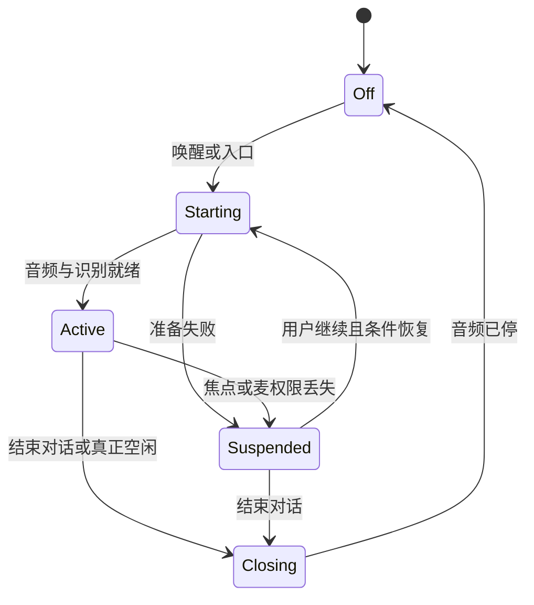
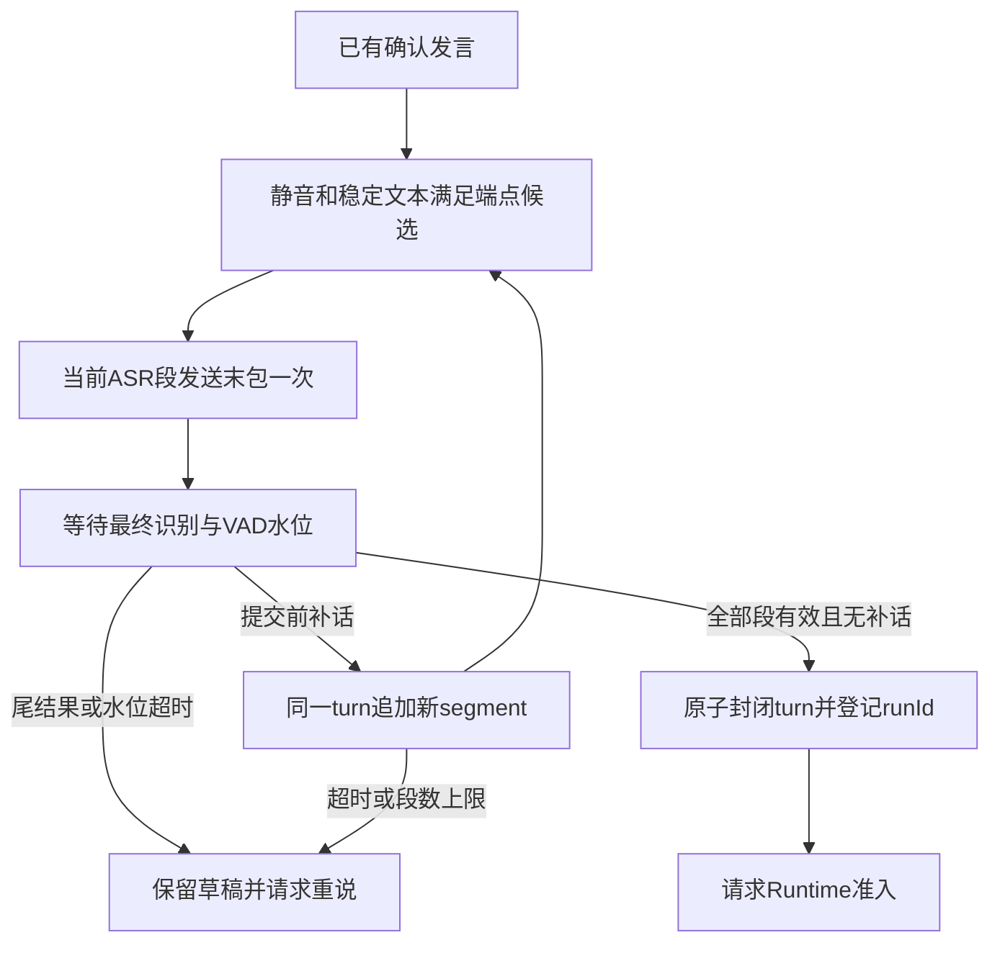
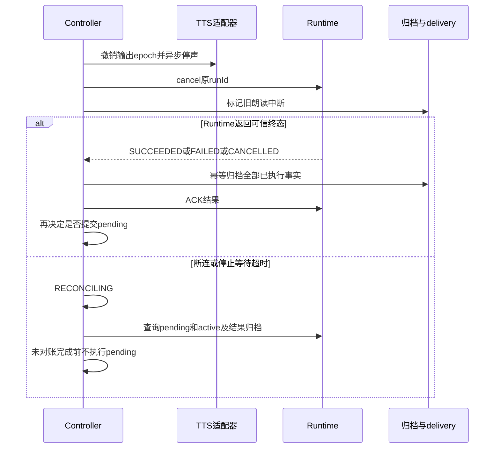

# 连续语音：状态、协议与恢复契约

> **实施更新（2026-09-22）**：产品已进入 Dialog SDK 委托模式集成和正式 App 真机回归。当前代码、与独立 ASR/TTS 基线的差异、首次失败及待验收门槛见[产品集成与验收记录](../research/voice-conversation/产品集成与验收记录.md)。下文保留原设计及目标契约，不将未验收的目标写成已完成。


版本：2026-09-22。本文保留 [主方案](voice-conversation.md) 的设计契约；当前采用 Dialog SDK 客户端委托播报，具体实现差异与未验收项以上方实施记录为准。只播报 LLM 最终稳定正文，无供应商自动降级。

## 1. 身份、所有权与不变量

| 身份 | 定义及用途 |
|---|---|
| conversationId / modelSessionId | 复用同一个持久聊天会话；每轮显式传 modelSessionId，不能让它退回 runId |
| voiceSessionId / sessionEpoch | 一次声音通道及其重建代次；恢复、系统暂停后重建都会更新epoch |
| turnId / segmentId | 用户发言与其ASR段；同一turn可因末包后补话有多个段 |
| runId | 每个提交turn预分配一次；查询、取消、恢复都使用原ID |
| outputEpoch / speechId / slotId | 声音权限代次、一次朗读尝试、SDK中的当前句槽；重听创建新speechId |
| messageId / sourceRange | 原归档消息及原正文UTF-16区间；规范化保留映射，不靠字符串相等匹配 |
| audioSample / timerToken | 单调采样序号及计时器代次，避免线程回调顺序决定发言归属 |

不变量：

1. 同一物理麦只由原音频服务持有；页面、wake、ASR、试听不能各占一个录音器。
2. 仅控制器actor可提交turn；仅Runtime服务可接受执行。`REQUEST_INGESTED`仅表示输入资源接收，不能冒充任务已经执行或结束。
3. 语音参与时，Runtime同时最多一个pending或active执行拥有者。服务端原子检查，包含文字、系统助手、结果卡等入口；页面锁不是准入锁。
4. 每个turn至多一次客户端dispatch；服务端按runId去重。它不承诺外部工具分布式exactly-once，结果未知时不能盲目再发。
5. 旧回调可补记执行事实，但不能恢复声音、变更新字幕或释放新会话资源。
6. 一次有效插话撤销旧声音权限，不自动取消执行。结束对话与取消任务是不同操作。
7. 终态结果归档与播放进度分开；ACK不等待TTS、用户听完或下一轮开始。
8. 音频自动播报只来自本会话实时许可的 LLM 最终正文；系统状态仅显示在界面，恢复/replay不会自动播放。

复用现有 `AGENT_UI_HANDOFF_SOURCE` 的 conversationId 及历史归档载荷，通过独立 `RunRequest.voice` 标记语音来源；不能另造不被解析的 handoff source。只设置 modelSessionId 而丢掉原 handoff，会使现有角色上下文、会话定位和归档链路不完整。

## 2. 正交状态与UI投影

| 状态域 | 枚举 | 所有者 |
|---|---|---|
| session | OFF / STARTING / ACTIVE / SYSTEM_SUSPENDED / CLOSING | 音频服务中的Controller |
| input | IDLE / SPEAKING / FINALIZING / MUTED / ERROR | Controller，音频层只报告事实 |
| execution | NONE / SUBMITTING / RUNNING / CANCEL_REQUESTED / RECONCILING / TERMINAL | Runtime权威，Controller镜像 |
| output | IDLE / PREPARING / PLAYING / PROVISIONAL_PAUSE / STOPPING / FAILED | TTS adapter报告、Controller授权 |
| pending input | EMPTY / HELD / NEEDS_CLARIFICATION | Controller，一个槽，归档前不当成已执行用户消息 |

执行和声音允许并行，例如RUNNING时可听插话；首期最终答案PLAYING时原run已经终态，系统状态提示只显示在界面。UI不能把这些压成唯一的“忙/闲”布尔值。



UI优先显示错误/暂停、取消或恢复待确认、用户起声、播报、执行、续听；任务状态保留独立一行。窗口销毁只取消订阅，不能顺手cancel run或释放麦。服务端结果卡与聊天页也通过同一会话标识接续，避免第二套上下文。

## 3. ASR段、端点及补话

### 3.1 采集与识别流

待唤醒只在本地消费PCM。进入语音会话后ASR按发言段管理：本地检测起声时连接并发送pre-roll与缓冲，已建立的段接收实时音频；没有发言时不上传无限静音。连接超过5秒或缓冲溢出报错并保留可见草稿，不能从中间悄悄开始执行。

初次准备中亦保留音频，不能因为尚未播放“我在听”就丢失用户连说的指令。保持采集与发送采样率标注一致，ASR为当前16kHz单声道PCM；录音路由重建更新epoch，禁止跨采样率拼接时间轴。

`result_type=full`每次替换本segment全文；`definite`透传识别分句及时间范围，不直接提交全文。服务端句时间映射到本地采样区间；禁止以文本相等去重，用户可以真的重复同一句话。

### 3.2 说完提交



- 普通端点初值见主稿。短控制词“停”“取消”不能被160ms普通起声门槛永久过滤；使用与当前状态相符的可靠识别结果，允许更短的真实发声，并纳入端点语料测试。噪声和回声不可仅凭字面partial触发工具取消。
- 当前段发末包后不能再往该段送音；补话创建新segment，仍归未commit的同一turn。每段5秒尾结果截止不随其他补话重置；最多8个segment、单turn最长90秒。任一必要段失败，本轮不自动执行残缺文本。
- 新段pre-roll可以重叠，但用于最终文本的有效音频区间不得重复。依赖ASR时间边界裁重；无法证明边界一致则提示重说，不按相同文字删词。
- commit之前读取采集水位cut，等待VAD分析覆盖cut且疑似起声窗口已经确认或排除。确认起声的回溯采样点在cut前则继续原turn；通过屏障后由actor原子commit，cut后起声归下一turn。
- 水位等待最多500ms；分析器停滞时不强行提交。段终止、turn提交各有独立幂等门闩；timer携带epoch、turnId和token。
- 已commit的输入不悄悄改写：迟到字幕仅作纠错提示或下一turn输入，不自动重复执行原指令。

### 3.3 无声与任务等待

空闲计时只能在 `session=ACTIVE`、input=IDLE、execution=NONE或已处理TERMINAL、output=IDLE、pending=EMPTY 且无待处理协议事件时开始。进入任一工作状态立即作废timer；重新空闲重新计时。无声8/15秒和ASR尾包5秒不是Runtime执行超时。

“等一下”暂停本次输入收尾至多15秒，有任务时任务继续；到期只结束输入等待，不取消任务。明确“停止任务”走取消流程。原Runtime已有用户手动pause时仍保持原语义，语音层不自动resume，也不引入基于VAD的任务pause原因仲裁。

## 4. 稳定正文与独立TTS适配

### 4.1 首期输出边界

正常成功的可信终态归档后，由Controller针对 `RunResult.content` 建立不可变朗读计划。若旧回答在插话时失去输出权限，即使稍后成功归档也不自动朗读。等待中的新话优先处理，旧答案保持文字可见。

`AssistantBlockDelta`继续服务文字UI；不新增跨provider的 `AssistantSpeechCommitted` 事件。不播报工具回合、reasoning或草稿。取消/失败说明只显示在界面、仅陈述已知状态；部分工具完成以归档事实为准。

朗读计划保留原messageId、原文范围、规范化后的文本与未朗读结构化区域。语音风格在公共提示构建阶段加入，适用普通和角色会话，不覆盖用户模型、推理强度或角色设定。用户未要求长答时偏好一至三句；不会另调模型重写答案制造低延迟。

### 4.2 SDK映射与必须验证的语义

| Movo动作 | 官方SDK依据 | 必须满足的本地契约 |
|---|---|---|
| 开始当前槽 | StartEngine/StartSession与发送文本 | adapter绑定slotId及engineGeneration，其他槽不能混入 |
| 结束输入 | FinishSession | 等合成SessionFinished，不能视作扬声器播完 |
| 疑似插话 | DIRECTIVE_PAUSE_PLAYER | 快速让声、保留原位置，成功返回仍须声学验证 |
| 误触恢复 | DIRECTIVE_RESUME_PLAYER | 只恢复当前未作废槽，不从句头重复 |
| 确认插话/退出 | 暂停后停止引擎；必要时取消合成 | 已缓存旧音也停止；不能仅发CancelSession就宣称静音 |
| 播放完成 | MESSAGE_TYPE_PLAYER_FINISH_PLAY_AUDIO | 只标记已关联当前槽的播放完成，排除暂停/停止后的迟到回调 |
| 销毁 | SYNC_STOP后destroyEngine | 专用工作线程，不能在SDK回调中同步stop/destroy |

官方文档明确同步停止会等回调结束，不能在回调线程调用；因此actor、UI及SDK回调都不能阻塞等待它。参见 [TTS SDK](https://docs.volcengine.com/docs/DoubaoVoice/bidirectional-streaming-tts-android-sdk-interface-documentation?lang=zh)，对应静态demo见本轮调研证据。

### 4.3 句槽、背压与代次

首期一个在途句槽，每槽文本上限160个Unicode码点（这是Movo自定内存/延迟约束，不是供应商限制），优先在自然句界分割，不能拆代理对。不预取下一句音频，不把整篇文章灌进SDK。完整文字可在原归档中保留，控制器只向前取下一槽。

当前槽需同时确认合成结束和播放完成后才能提交下一槽。每个槽须具有可验证的回调隔离：首期按独立engineGeneration绑定监听器，停止/销毁完成后才创建下一代；只有P0证明原生sessionId覆盖所有相关回调且停止屏障有效时，才允许在同一引擎中复用会话。不能把没有身份的迟到finish简单归给当前slot。

这会增加句间启动成本，纳入P0测量。若不能满足流畅度或回调隔离，回到适配器设计评审；不假装增加队列就能解决。内存通过句槽上限与实测约束，不再声称控制了SDK内部“3秒PCM缓冲”。

疑似噪声的暂停观察窗初值800ms：VAD未确认近端语音且无有效转写才恢复；确认用户发声后保持让声直至新话判定。误触恢复必须保持原位置。ASR错误或长时间不能确认时停止旧输出并标未知，不能在用户仍讲话时突然恢复。

停止请求发出即增长outputEpoch，禁止新文本推送。SDK停止屏障超过1秒进入输出错误，旧实例保持隔离，不同时启动另一个播放器；任务取消与事实持久化不能被SDK等待阻塞。用户需要明确恢复后才重新建立可发声实例。

### 4.4 交付记录精度

首期只承诺句槽级程序状态：QUEUED / STARTED / FINISHED / INTERRUPTED / NOT_PLAYED / UNKNOWN。没有可靠游标时不记精确播放帧或“听到第几个字”。中途停止的一整槽标INTERRUPTED；进程死亡时正在播放的槽标UNKNOWN。

SDK完成回调也不等于人确实听见：系统静音、焦点/路由和用户注意力会影响听感。模型说明使用“设备报告播放完成”，不作认知层面的保证；端到端验收另外记录真实输出声音。

TTS重试不重跑Agent。确定没开始播放的槽可以按显式重试恢复；中断或未知槽需说明“从这句重新读”，不可暗中声称原位置续播。重听新建speechId，保留旧记录。

## 5. 插话、取消和待处理输入

### 5.1 两阶段处理

起声先暂停当前声音并保留pre-roll；确认有效新话才撤销旧朗读余下部分。噪声误触恢复原声音。任务执行不由VAD暂停或取消。

| 当前情境与识别意图 | 执行处理 | 声音/输入处理 |
|---|---|---|
| 无active run，普通新问句 | 创建下一run | 停旧朗读，提交新话 |
| “别念了” | 不变 | 结束当前朗读，续听 |
| “嗯/好”等反馈 | 不创建新run | 根据语境继续听或恢复回答，不当新任务 |
| active run，“做到哪了” | 复用现有状态，不启第二run | 界面显示真实进度；不播报系统状态 |
| active run，明确取消/停止 | 针对拥有的run请求取消 | 输出权限立即撤销，显示“正在停止” |
| active run，明确替换任务 | 取消后等待可信终态 | 新话进入唯一pending槽，待事实归档后提交 |
| active run，普通新问题/补充 | 当前任务继续；首期不做same-run steering | 保留一个pending输入；旧任务完成后新run处理 |
| active run，含糊纠正或“等等” | 不自动取消 | NEEDS_CLARIFICATION，说明“任务仍在进行，要停止还是接着处理？” |
| 任务状态UNKNOWN | 查询、attach和对账 | 保留草稿，不自行制造新任务 |

局部意图识别采用当前状态下的明确短控制表达和可靠转写；其余进入通用输入，不引入第二个LLM替主模型做业务决策。不能仅按包含“取消”两个字触发，例如“不要取消”“取消按钮在哪里”不是取消指令。否定、引用和连续修正纳入测试。

pending槽最多保留一个有界turn，遵守90秒/8段限制。连续补充只有在同一未提交turn中合并；第二个独立输入必须明确替换或让用户合并，界面显示原句与新草稿，不静默覆盖。结束对话时pending转草稿且取消自动提交；后台任务结果不能在用户离开后触发隐藏的新任务。

### 5.2 取消及失败竞争



取消与成功竞争时，以服务端实际终态为准，不能强改CANCELLED。取消无法撤销已经发送的消息、点击或写操作；执行器/工具恢复沿用原机制。取消等待5秒可显示“仍在确认停止”，这不是把执行改成失败的截止时间。音频服务结束不影响Runtime继续保存事实。

## 6. Runtime协议增量

### 6.1 目标类型

仓库使用Kotlin序列化与Bundle/Messenger，没有Thrift或Protobuf。本段为 `agent/runtime/AgentRuntimeWire.kt` 拟新增类型，默认值须同时进入JSON及legacy Bundle编解码；不是已经存在的代码。

```kotlin
// [新增] RunRequest.voice: VoiceRunMetadata? = null
@Serializable
data class VoiceRunMetadata(
    val voiceSessionId: String,
    val sessionEpoch: Long,
    val turnId: Long,
    val replyStyle: String = "spoken_short",
    val deliveryNote: String = "", // 有界结构化记录的渲染文本，不含原始音频
)

// [新增] RunRequest.startPolicy 默认LEGACY_REPLACE；voice请求必须REQUIRE_IDLE。
@Serializable
enum class RunStartPolicy { LEGACY_REPLACE, REQUIRE_IDLE }

// [新增] RunResult.resultKind可空，缺失表示旧协议结果，不能猜测为新协议证据。
@Serializable
enum class RunResultKind { TERMINAL, REJECTED }

// [新增] RunResult.outcome可空；仅服务端确定TERMINAL时填写。
@Serializable
enum class RunOutcome { SUCCEEDED, FAILED, CANCELLED }

// [新增] RunResult.rejectReason可空，REJECTED表示该run未开始执行。
@Serializable
enum class RunRejectReason { BUSY, INVALID_REQUEST, UNSUPPORTED_PROTOCOL }

// [新增] Client本地类型，不将传输故障伪装为服务端终态。
sealed interface VoiceRunObservation {
    data class ServiceReply(val result: RunResult) : VoiceRunObservation
    data class TransportUnknown(val runId: String, val reasonCode: String) : VoiceRunObservation
}
```

复用现有消息：START=1、RESULT=3、CANCEL=4、ACK=5、DRAIN=6/7、INGESTED=8、QUERY_ACTIVE=9/10、ATTACH=11/12、READ_CONTEXT_RESULT=15。不新增首期PAUSE/RESUME/STEER消息或可播事件。新增Client `runObserved`入口复用连接实现，现有文字调用保留兼容包装；不能继续把断连时构造的 `ok=false` 当作服务端失败。

当前run()在等待线程中断时会发cancel；语音runObserved必须把本地等待撤销与远端任务取消拆开：结束声音会话、页面销毁或订阅取消只detach，任务取消只由明确的cancelRun发起。任务观察与归档转交服务层继续，不靠页面协程保活；本地中断仍按TransportUnknown恢复，不宣称任务失败。

QUERY_ACTIVE响应增量携带 `protocolVersion=2`、pendingRunId与activeRunId；旧服务缺version时，语音入口报版本不兼容，不开始可能替换任务的请求。该查询只做能力/状态探测，真正准入仍在START处理器原子完成。

### 6.2 原子准入及去重

服务端接收START时，先检查runId是否已在pending、active、checkpoint或可信终态中：重复请求复用查询/attach/既有结果，不执行第二次。相同ID不同输入指纹拒绝INVALID_REQUEST。

对涉及语音的竞争（incoming.voice非空，或现有pending/active来源为voice），在图像materialize及配置读取前原子预留名额。忙则返回REJECTED/BUSY；禁止执行当前代码中“先替换pending/取消active再处理新请求”的路径。原文字对文字的替换逻辑可以保留，但不得跨越语音占用。显式替换语音任务必须先取消并收到终态，再发新START。

准入逻辑必须下沉到所有启动路径共用的服务端入口；结果卡续跑等直接调用startRun的内部路径也受约束，不能只在Messenger handler加判断。仅收到旧任务终态消息仍可能短暂存在终态active对象，服务端按已持久化终态清理预留，而不是要求客户端赌一次UI线程调度。

预留记录必须在首次模型/工具执行前持久化，包含来源、runId、conversationId和输入指纹。准备失败是未执行的REJECTED或可证实的服务端终态，不能复用旧runId错误归属。所有失败与取消路径都释放对应预留，按ID核对，避免旧回调释放新任务。

同进程重发可以去重；进程死亡后的执行状态必须用既有checkpoint与工具恢复协议对账。若只知道不再active，却不能证明是否执行过，不把“查无active”解释为从未执行。保持UNKNOWN，显示可见的恢复状态与人工处理入口；不生成新ID自动重跑。

### 6.3 持久化及兼容

Voice元数据、startPolicy、resultKind、outcome和rejectReason贯穿Wire、Client/Service、RunExecutor/Session、checkpoint、ResultStore、ArchiveStore及Room手工映射。对旧结果保留 `ok/error` 展示，不按错误中文字符串识别取消；旧语音来源不明时不自动播放或重试。

RunResult通过 `contextSnapshotRef` 引用大结果时，语音入口与现有drain路径一样解引用完整正文和快照，再归档/ACK；不能把Binder截断正文直接朗读成完整回答。

## 7. 历史、交付说明及ACK

### 7.1 两套记录各自负责什么

既有生成历史、工具调用/结果、opaque字段和压缩快照保持完整。新增Room表：

- VoiceRun来源表：conversationId、voiceSessionId、turnId、runId、配置版本、dispatch状态与更新时间；dispatch之前落盘。
- VoiceDelivery表：speechId、slotId、runId、messageId、原文区间、状态、outputEpoch、原因、recordVersion；不存音频和伪造的PCM游标。

普通正文归档、messageId映射和初始delivery记录在本地提交后即可ACK Runtime。若delivery初始登记失败，禁止先播放后猜测恢复状态；显示存储错误，但不重新执行任务。播放进度后续独立update；落盘失败标为UNKNOWN并停止扩展播放计划，不把已持久归档的结果重新apply。

跨进程不假定Room全局事务：Runtime先有durable outbox，入口按run幂等归档后ACK。ACK丢失只导致再次交付和幂等归并，不导致重复声音。原有reducer/store抽出服务可调用的存储能力，不能依赖聊天页面存活才能保存结果。

DB当前version21，新增显式兼容迁移至22；实施若main已升级则接最新版本。随会话删除清理delivery和来源，避免孤儿记录。recordVersion单调推进，INTERRUPTED/UNKNOWN不能被迟到FINISHED覆盖。

### 7.2 提供给下一轮模型的说明

`VoiceDeliveryContext`只根据结构化记录生成有界说明，例：“上轮回答第二句中断，后续句未播；生成历史保留完整内容，不能假定用户听完。工具执行事实不受朗读影响。”用稳定messageId指向既有内容，不复制长答案，也不修改原transcript/contentJson/opaque引用。

说明最多覆盖最近8个语音回答、总计不超过600个Unicode码点；更早或缺失记录统一标交付未知。按需保留当前未交付回答优先，超限不能把它伪装已告知。无需为所有未播历史永久禁止上下文压缩。

`AgentModelClient.complete`增量传可空语音上下文到 `AgentPromptBuilder`；初次构建、systemCount计算和能力刷新重建三处使用同一值。新增独立system消息，普通/角色模式均生效且不替换角色设定；不拼进用户转写，不写回全局配置。该消息在原systemCount保护范围内，既有压缩保留，durableHistory按既有规则排除本次系统消息。

本轮执行期间首期没有same-run语音steering，不需要每个模型token重新读取delivery。下一run生成新说明；原历史、工具事实、角色改写优先级和provider编码保持不变。该方式提升模型对交付状态的理解，但不能宣称严格证明用户听到过哪些字，须通过V32行为测试。

### 7.3 崩溃与重建

重建读取来源、Runtime checkpoint/outbox、正文归档及delivery，先恢复文字与任务状态；未终态run使用原ID attach/query，已终态run幂等归档。播放中状态置UNKNOWN，关闭自动播放许可；用户明确“继续读/重听”才能新建朗读尝试。

会话结束后任务可以继续，结果只存文字。重新唤醒若还有原任务，先展示/说明当前状态而不启动第二run；旧pending草稿不自动执行。settings版本固定本次会话，恢复前若凭据已撤销或权限失效，先进入可见错误，不调用旧资源。

## 8. 实施验证索引

主稿目录树、工作包P0–P4和V01–V33是本文的覆盖索引。需要重点断言：

- 两个入口在pending阶段竞争，只有被准入者执行；BUSY和TransportUnknown不混为终态失败。
- 工具成功与取消同时到达，保存真实结果；查询只返回无active时不盲重跑。
- 启动SDK、停播屏障、下一槽开始以及迟到播放完成的排列均不能串音。
- 死亡发生在来源登记、dispatch、outbox、入口归档、ACK、开始播放各边界，结果不会重复执行或自动朗读。
- 模型设置刷新、roleplay、systemCount、压缩、历史读取和恢复都保留工具事实与语音交付说明的边界。

2026-09-22 已用独立探针执行部分 [P0 能力验证](../research/voice-conversation/P0能力验证.md)：SDK 实际出声、ASR 事件及手机 DeepSeek→TTS 组合成立。上述完整控制器、Runtime、跨代槽位与后台契约尚未实现验收；AEC 双讲、精确停声/恢复及整轮首声目标仍阻塞。合成结束早于播放结束约 11.31 s 的实测支持本附录分离两种完成状态；本轮播放器开始/结束回调载荷为空，不能据此取消 engineGeneration 隔离设计。
