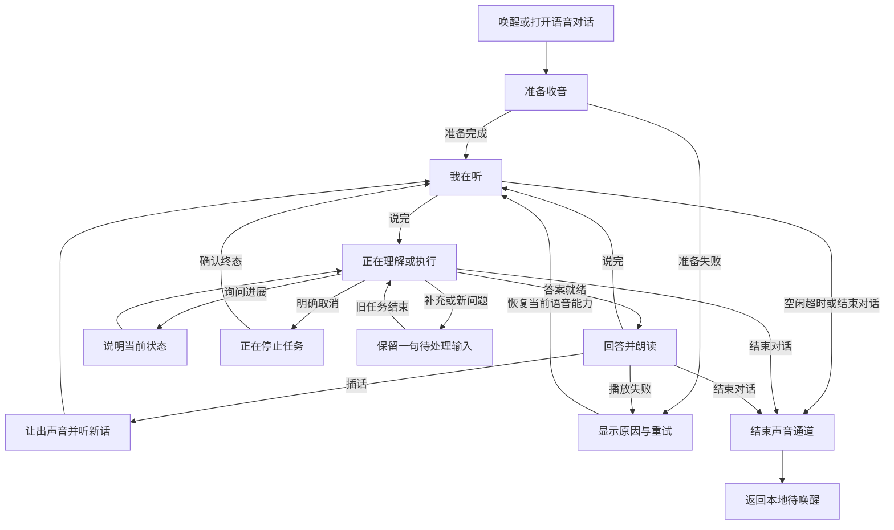
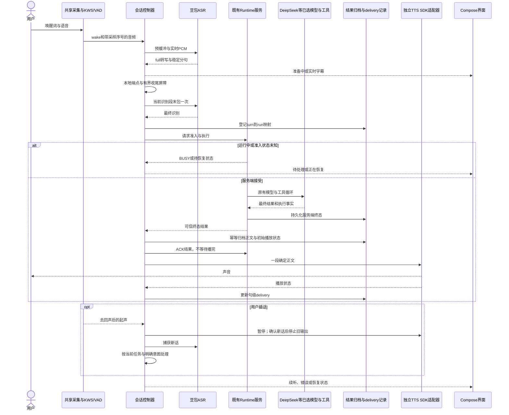

# Movo 连续语音对话方案

> 基于代码 `9b5b58dc476033511711cee2eaebe7c8c8c0458d`、2026-09-22 官方资料、第二轮设计复审、[P0 能力验证](../research/voice-conversation/P0能力验证.md)与 [Dialog 复用验证](../research/voice-conversation/DialogSDK复用验证.md)。独立 TTS 和 Dialog 委托模式均已有 DeepSeek 到实际扬声器的组件证据；Dialog 高音量回采识别与答案相同。产品尚未集成，连续对话、AEC 双讲、精确停声及首声目标尚未通过。
>
> 本文替代 [原听写方案](../voice-input-wake-word.md) 的交付范围。复审已统一正文、图、模块和协议，具体问题及修订依据见 [方案复审记录](../research/voice-conversation/方案复审记录.md)。

## 0. 摘要

交付目标是 **唤醒 → 倾听 → 判断说完 → 自动提交 → 有声回答 → 继续倾听**。用户插话时让出声音，结束对话后回到本地唤醒。必须免触屏完成至少三轮；手动停止识别、看到文字结果均不能代替语音对话验收。

当前已测基线为 **Sherpa 本地唤醒 + 现有豆包流式 ASR + Movo Agent / 用户选择的 DeepSeek 等模型 + 官方独立双向流式 TTS SDK**。新增优先验证 **豆包 O2.0 Dialog SDK 的客户端 TTS 委托模式**：由 SDK 提供识别/录放，Movo 仍决定任务与答案，将 DeepSeek 正文交回播报。此前将全部端到端 SDK 排除为“无法保留 DeepSeek”不准确，详见 [Dialog 复用验证](../research/voice-conversation/DialogSDK复用验证.md)。是否替换基线的采集和播放模块，以该验证及集成门槛为准；不做供应商自动降级。

首期只将正常完成的最终答案交给 TTS，保留自动发送、连续收听和打断；不播放可改写的模型增量。这样可以避免改造每个模型 provider，但开口要等待答案生成结束。是否达到自然交流的时延要求必须实测，不能把 SDK 流式合成误写成模型生成期间已经开口。RTC 仅托管语音列为后续可选研究，不是首期前置工作，也不是运行时备用通道。

## 1. 状态与结论

| 项目 | 复审后结论 |
|---|---|
| 当前代码 | 已有唤醒、豆包转写和文字 Agent；尚无完整自动端点、TTS、插话和续听闭环 |
| 模型约束 | 保留 DeepSeek 与原有模型/推理配置，不偷偷换模型或关闭思考来达成延迟指标 |
| 语音路线 | 独立 ASR/TTS 是已测基线；当前优先验证 O2.0 Dialog 委托模式，保留本地 Agent 与 DeepSeek，不建设两套自动切换链路 |
| 最危险的边界 | 插话不等于取消任务；断连不等于执行失败；新入口不应暗中替换正在执行的语音任务 |
| 已验证能力 | 独立 ASR/TTS 基线；O2.0 Dialog 委托播放闸门、识别结束→DeepSeek→指定播报的真实声学链，高音量回采内容一致；默认豆包输出仍生成 |
| 验证阻塞 | 精确停声/恢复及跨代回调隔离、外放近端保真与双讲、完整中文端点、整轮首声时延、后台生命周期 |
| 当前可开始 | 先验证 Dialog 识别结束→DeepSeek→客户端指定播报及内置录放；继续补近端阳性声源、双讲和集成时延，不能视为完整功能达标 |
| 文档入口 | [代码现状](../research/voice-conversation/语音对话现状与链路调研.md)、[成熟机制](../research/voice-conversation/成熟语音对话机制调研.md)、[火山选型](../research/voice-conversation/火山语音能力与复用选型.md)、[状态与协议](voice-conversation-state-and-contracts.md) |

## 2. 需求调研

### 2.1 背景与范围

用户反馈“停在语音输入”“不会自动发送”“没有声音”。目标是 Movo 自有语音助手，与微信输入无关。Agent 可以操作其他已支持的应用，但第三方输入框不是本功能的验收入口。

产品区分两种模式：**语音对话**自动发送、播报、续听；**语音听写**形成可编辑草稿，由用户发送。唤醒默认进入对话，聊天栏提供明确的对话入口，听写作为次级入口。支持普通话为主、中英混合、外放/耳机、前台工具执行和会话恢复；不扩展到多人会议或自研语音大模型。

### 2.2 用户行为与结果

| 输入或情境 | 预期行为 |
|---|---|
| “你好小莫，帮我看一下今天的安排”连着说 | 使用用户配置的唤醒词，保留后面的指令；示例词不覆盖现有配置 |
| 换气、想词、句中停顿 | 继续听；显示字幕，不立即抢话 |
| 说完后安静 | 自动提交一次，不要求说“发送” |
| “帮我设个提醒” | 结束本轮并由助手追问时间，任务信息不全不是继续无期限收音的理由 |
| 普通问答 | 简短口语回答、真实发声，回答后续听 |
| 回答时插话 | 先暂停声音、接住新话；确认有效新话后丢弃旧播报余下部分 |
| 执行任务时说“嗯” | 不新建任务，不取消旧任务 |
| 执行时说“多久能好” | 报现有运行状态；未知时间不编造，不创建第二个执行 run |
| “别念了” | 停这次播报；任务与对话继续 |
| “取消这个任务”或明确“不要做了，改成……” | 请求取消当前语音拥有的 run，等待可信终态；已完成操作不会被撤销 |
| 执行时说含糊的“等一下”“还有……” | 不猜测为取消；保留待处理语音并说明当前任务仍在进行，需要时询问是停止还是接着处理 |
| “结束对话” | 停云端收音与播报，结束声音通道；运行任务继续，完成后留文字结果。停止任务用单独命令 |
| 问答后说“那明天呢” | 沿用相同 conversationId / modelSessionId，无需再唤醒 |

含糊插话的澄清属于产品运行时行为，不是要求用户替工程调查或审批本方案。可确定的正常话语直接处理；不为每次插话加确认。

### 2.3 已确认约束与未决前提

确认：不降级、保留模型选择、共享单一麦克风、隐藏浮窗仍可对话、控制器不依赖 Compose 生命周期。本轮已有授权资源和音色完成真实播报；未决项为 SDK 精确停止/恢复与回调隔离、近端保真及双讲、完整中文端点、集成后时延。下面的交互阈值仍是初值或目标，实际测量单独见 P0 记录。

## 3. 技术调研与选择

### 3.1 成熟机制与供应商边界

成熟机制区分听写与对话，分别管理端点、插话和误打断恢复，详见 [成熟机制调研](../research/voice-conversation/成熟语音对话机制调研.md)。火山独立 ASR 的 `definite` 是识别分句，不能直接代表用户整轮说完；当前 `end_window_size=800` 也不是通用交互标准。[官方 ASR API](https://docs.volcengine.com/docs/DoubaoVoice/LargemodelstreamingautomaticspeechrecognitionAPI?lang=zh)

官方独立 TTS SDK 提供合成会话、暂停/恢复和播放回调。它不要求使用豆包聊天模型，但其接口存在不等于 Movo 已得到正确的打断、AEC 和播放进度。[当前 Android TTS SDK](https://docs.volcengine.com/docs/DoubaoVoice/bidirectional-streaming-tts-android-sdk-interface-documentation?lang=zh)

### 3.2 复用候选及结论

路径以下均相对 `app/src/main/kotlin/io/github/mangi/eta/`。

| 已检查代码 | 可复用内容 / 差异 | 结论 |
|---|---|---|
| `agent/voice/EtaWakeWordService.kt`、`EtaWakeWordController.kt` | 已有麦前台服务；wake 开关不等于会话生命周期 | 扩展原服务承载会话，不再建第二套音频服务 |
| `EtaMicSessionCoordinator.kt`、`asr/AsrPcmCapture.kt`、`wake/SherpaWakeEngine.kt` | 资源协调与 PCM 采集可复用；现有两处各自开麦，没有连续交接 | 抽共享采集，KWS/VAD/ASR 消费同一时间轴 |
| `asr/DoubaoSaucProtocol.kt`、`SaucAudioStream.kt`、`DoubaoBidirectionalAsrEngine.kt` | 已实现协议、末包和 full 结果；未公开稳定分句事件 | 增量透传，保留网络协议，不因接 TTS SDK 重写 ASR |
| `agent/runtime/AgentRuntimeClient.kt`、`AgentRuntimeService.kt`、`AgentRunController.kt` | 已有执行、取消、查询、attach、outbox；新 run 当前会替换旧 run，客户端会合成失败结果 | 补服务端准入、结果来源和类型；继续使用原执行器和取消入口 |
| `agent/model/AgentModelClient.kt`、`AgentPromptBuilder.kt` | 公共提示组装与最终正文可用；roleplay 会忽略普通 config.systemPrompt | 在公共组装入口增加有界语音上下文，不逐 provider 改稳定流协议 |
| `ui/app/AgentRunMessageProjector.kt`、`AgentRuntimeHistoryReducer.kt`、`AgentConversationStore.kt` | 已有正文、工具事实和按 run 去重 | 复用归档；补共用持久化入口，播放状态另外存 |
| `EtaVoicePanel.kt`、`AgentChatBody.kt`、`AgentChatInputBar.kt` | 已有面板与输入 UI，录音生命周期仍与页面混杂 | 展示会话 snapshot，移出独立录放状态 |
| `VoiceSettingsRepository.kt`、`DoubaoSpeechSecretStore.kt` | 已有配置 Flow 与加密凭据 | 增量扩 TTS 配置/测试状态，不复制密钥存储 |
| `hook/xiaoai/XiaoAiStreamRenderer.kt` | 厂商私有朗读，无跨品牌停止/进度契约 | 不移植；新增官方 TTS SDK 薄适配层 |

### 3.3 选型与明确取舍

| 方案 | 处理 |
|---|---|
| 当前 ASR + Movo + 独立 TTS SDK | 已测比较基线；省掉合成协议、解码和基础播放器实现 |
| O2.0 Dialog SDK 委托模式 + Movo/DeepSeek | 官方支持外部文本播报及每轮来源选择，列为当前优先复用验证；仍需核对默认推理/用量、麦交接与任务轮次 |
| 自建 HTTP TTS / AudioTrack | 从首期移出；SDK 若不满足硬需求，带 P0 证据另审，不能两套都默认实施 |
| RTC 仅托管语音 | 后续可选 PoC；字幕/判停/关闭 LLM/外部播报组合未验证，需控制面和费用评估 |
| 直接使用豆包默认回复，或仅将 DeepSeek 作为其工具 | 改变答案与工具决策主体，不采用；不等于排除上面的客户端 TTS 委托模式 |
| provider 提前提交可播文本、同 run 语音 steering | 后续优化；首期最终正文播放、独立任务串行，避免扩大协议和历史改造 |

本地 VAD 优先评估当前 Sherpa 1.13.8 的 Silero 接口，固定模型来源与 SHA。若中文端点未达标，继续改进判停能力；不能用无限等待或手动发送来凑通过。[固定版本 API](https://github.com/k2-fsa/sherpa-onnx/blob/v1.13.8/sherpa-onnx/kotlin-api/Vad.kt)

以下系统时序、模块划分和协议细节仍描述独立 ASR/TTS 基线。Dialog 候选的差异单列于复用验证，尚未将候选能力写成产品已实现行为。无论选择哪种语音传输，Runtime 准入、轮次去重、任务取消和结果归档契约继续成立。

## 4. 交互链路

### 4.1 用户动线



执行中结束声音通道，任务仍可继续，界面必须明确说明。明确取消走另一条路径。工具需要操作屏幕时收起入口窗口，不结束语音。

### 4.2 系统交互



当前 Runtime 服务和音频 owner 均位于应用主进程，系统 VIS / VoiceInteractionSession 则在各自独立进程；继续使用既有 Messenger/Intent 转交，不能跨进程读取静态实例。语音渲染回调不拥有任务执行权。

## 5. 方案设计

### 5.1 原则与仓库规范

沿用 Kotlin/Compose、Flow、Room、Messenger 和现有工具取消/恢复机制；按 [TECHNICAL.md](../TECHNICAL.md) 管理日志，不记录常规语音正文、原始音频或凭据。用户轮次、ASR 段、Runtime run 与播放尝试独立编号，由串行控制器处理事件。

新行为仅对语音参与的执行竞争启用：服务端做最终准入，不能只靠页面按钮禁用。现有文字入口之间的替换策略单独保留；新文字请求碰到语音 run 时必须走明确的停止/转交流程。语音取消只针对自己拥有的 run。

### 5.2 拟议改动目录

均为设计落点，尚未修改产品源码。`eta/` 为上述 Kotlin 根目录。

```text
app/build.gradle.kts / proguard-rules.pro                [修改] 固定TTS SDK及混淆规则
app/src/main/AndroidManifest.xml                        [修改] 原前台服务所需声明
app/src/main/assets/voice-vad/                           [新增] VAD模型与校验说明
eta/agent/voice/
  EtaWakeWordService.kt / EtaWakeWordController.kt      [修改] 原服务承载会话
  EtaMicSessionCoordinator.kt                          [修改] 单麦资源协调
  VoiceConversationController.kt / VoiceConversationState.kt [新增] 会话与轮次actor
  VoiceEndpointPolicy.kt                               [新增] 有界端点判定
  VoiceDeliveryContext.kt                              [新增] 播放记录生成有界上下文
  EtaAssistantOverlayService.kt / EtaVoicePanel.kt      [修改] 窗口展示与会话分离
  EtaVoiceInteractionSession.kt                        [修改] 系统入口转交统一owner
  audio/VoiceAudioCapture.kt / VoiceAudioSession.kt     [新增] 抽采集内核、焦点/路由/AEC
  audio/VoiceVad.kt                                    [新增] 适配Sherpa VAD
  asr/AsrPcmCapture.kt                                  [修改] 移出独立开麦逻辑
  asr/EtaAsrEngine.kt / EtaAsrSessionFactory.kt         [修改] PCM输入和分句事件
  asr/DoubaoBidirectionalAsrEngine.kt / DoubaoSaucProtocol.kt [修改] 时间边界和收尾
  asr/SaucAudioStream.kt                               [复用] 序号和末包幂等
  wake/SherpaWakeEngine.kt / WakeWordEngine.kt         [修改] 消费共享PCM
  tts/VolcTtsAdapter.kt / VoiceSpeechQueue.kt           [新增] SDK隔离、句级队列和停播
eta/agent/runtime/
  AgentRuntimeWire.kt / AgentRuntimeClient.kt          [修改] 可选语音元数据、可信结果类型
  AgentRuntimeService.kt / AgentRuntimeSession.kt      [修改] 原子准入、终态和恢复
  AgentRuntimeRunExecutor.kt                          [修改] 传递语音上下文和结果类型
  AgentRuntimeResultStore.kt / AgentRunArchiveStore.kt [修改] 新字段持久化映射
  AgentRunCheckpointStore.kt                          [修改] 保留来源与准入身份
  AgentRunController.kt / AgentRuntimeAttachDelivery.kt [复用] 原取消与结果交付
eta/agent/model/
  AgentModelClient.kt / AgentPromptBuilder.kt         [修改] 公共语音上下文参数
  AgentLoop.kt / AgentContextSession.kt / AgentContextCompactor.kt [复用] 原执行/压缩
  AgentProvider.kt / AgentConversationCodec.kt         [复用] 原provider契约和历史编码
eta/ui/app/
  AgentAppRoot.kt / AgentAppState.kt                   [修改] 绑定会话、入口转交
  AgentRuntimeHistoryReducer.kt / AgentConversationStore.kt [修改] 服务与页面共用归档入口
  AgentRunMessageProjector.kt                         [复用] 原文字展示
eta/ui/components/AgentChatBody.kt / AgentChatInputBar.kt [修改] 对话和听写入口
eta/ui/screens/voice/VoiceSettingsScreen.kt            [修改] 配置、试听和能力状态
eta/data/model/VoiceSettings.kt                       [修改] TTS资源与音色配置
eta/data/repository/
  VoiceSettingsRepository.kt / DoubaoSpeechSecretStore.kt [修改] 配置版本与凭据复用
  VoiceDeliveryStore.kt                               [新增] 来源与句级交付记录
eta/data/db/
  VoiceDeliveryEntities.kt / VoiceDeliveryDao.kt       [新增] delivery表
  EtaDatabase.kt / RuntimeRunEntities.kt / RuntimeRunDao.kt [修改] 兼容迁移与结果字段
app/src/main/res/values*/strings.xml                  [修改] 状态与错误文案
app/src/test/ / app/src/androidTest/                  [新增/修改] 本文验收用例
```

### 5.3 模块职责

| 模块及落点 | 输入 → 输出 | 复用、依赖和边界 |
|---|---|---|
| 原 FGS / coordinator / manifest | 入口、权限、设置 → 音频拥有权 | wake 或对话任一活跃均保活；系统入口 IPC 转交 |
| Controller / State / EndpointPolicy | 采样事件、ASR、用户动作、终态 → 状态/唯一提交 | 新增业务编排；串行处理，计时器携带代次 |
| audio / VAD / wake / asr | 单一 PCM 时间轴 → KWS/VAD/转写 | 抽现有采集、保留豆包协议；不由页面开麦 |
| TTS adapter / queue / Gradle | 确定短句 → 播放回调/句级状态 | 复用 SDK 播放器，无自建 HTTP/AudioTrack 实现；错误与停止必须透传 |
| Runtime 与存储映射 | 语音请求 → 准入/可信终态/可恢复事实 | 原执行器、取消、outbox；新增字段不得丢在手工映射中 |
| ModelClient / PromptBuilder / DeliveryContext | 有界语音配置和交付状态 → 本次系统消息 | 统一入口且支持 roleplay，保留工具事实和原始历史 |
| UI 与设置/资源 | snapshot → 画面；动作 → controller事件 | 页面不持有独立识别器/播放器，配置按会话版本固定 |
| history / delivery / Room | 终态和播放事件 → 独立幂等存储 | 正文归档与播完解耦；迁移21→22，合并后接实际最新版本 |
| tests | 时钟、故障注入、真实音频 → 可复核结论 | 逻辑测试与设备声学证据分开 |

细节见 [状态与协议](voice-conversation-state-and-contracts.md)，其中的字段和时序是本文的实施契约。

### 5.4 音频与生命周期

单一采集 owner 连续维护采样序号；KWS、VAD、ASR 不再各开 AudioRecord。维护 1.5 秒预缓冲，唤醒后保留指令首字；连接准备最多缓冲 5 秒，溢出明确提示重说，不静默丢头。wake 边界不可靠时保留音频，只在确认的开头剥离唤醒词，不在全文任意删同名词。

KWS只在本地待唤醒状态触发新会话；对话中停用唤醒事件派发，防止助手念到唤醒词或用户重复叫名字时重建会话。麦克风静音时停止物理采集与上传，KWS也不监听；恢复收音重新建立音频代次，任务与播放状态不因此重置。

AEC 使用实际 AudioRecord 会话及目标路由验证。Android `isAvailable()` 仅表示设备实现了 AEC，不能证明双讲效果。[Android AEC](https://developer.android.com/reference/android/media/audiofx/AcousticEchoCanceler)

本项目 targetSdk=36；焦点申请与后台麦服务必须按真实 Android 版本验收，尤其浮窗为工具让位之后。Android 15 及以上目标应用申请音频焦点受顶部应用/前台服务条件约束。[音频焦点](https://developer.android.com/media/optimize/audio-focus)

P0 以外放音量变化、耳机切换、用户和助手同时说话验证。独立 TTS SDK 不自动继承端到端 Dialog SDK 的 AEC。如果系统 AEC 不合格，软件 AEC 需要可对齐的实际播放参考，须另行评审；不能先承诺靠接一个库解决。

本轮小米 15 的 source 7 配对测试中，AEC OFF / ON 回录均近乎静音，未证明近端用户仍能被听见。无回声转写本身不能通过 AEC 门槛；必须补独立近端声源。source 6 已能真实回采 SDK 自播内容，不能将跨录音源差异归因于 AEC 开关。

### 5.5 端点与等待

`definite`、VAD 和稳定转写共同提供候选；首期不增加第二个聊天模型判断结束。以下均为可调初值：

| 计时 | 初值 | 启动及终止条件 |
|---|---|---|
| 起声确认 | 160ms，保留300ms pre-roll | 去回声后检测；疑似起声即可暂停声音，确认后建立发言 |
| 最早说完 | 900ms静音 | 必须有稳定转写，不能仅靠标点或任务信息完整 |
| 普通收尾 | 1500ms静音 | 稳定文本且无补话；犹豫词可延至2500–4000ms |
| 首次无声 / 回答后续听 | 8s / 15s | 仅在无执行/未知任务、无输入、无待播/暂停输出、无待处理文本时开始 |
| “等一下”保留输入 | 15s | 输入等待，不是执行取消定时器；有任务时到期仍不取消任务 |
| ASR段尾结果 | 5s | 发末包后绝对截止；失败不提交该轮残缺文本 |
| VAD提交屏障 | 500ms | 等分析水位覆盖采集cut；超时进入音频错误，不硬提交 |
| 连续发言 | 60s提示，90s上限 | 上限提示分段重说，保留草稿，不自动执行半句 |

长工具执行不启动会话空闲退出；无真实状态变化时最多一次“还在处理”，不循环念提示、不给虚构完成时间。端点补话、重复 full、末包收尾和各上限见附录。

### 5.6 答案与声音

仅正常成功、属于当前会话且仍获准发声的最终 `RunResult.content` 可生成答案播报计划。排除 reasoning、工具 JSON、历史 replay；失败/取消的说明使用明确的系统状态文案，不能冒充成功回答。

语音模式要求主模型默认短口语回答，通常一至三句；保留原始最终正文，分句与 Markdown 规范化不另用模型重写。用户要求长内容时允许更长答复，分句播放并随时可打断；不得无提示截断。代码、表格等结构化内容保留在界面，用明确的展示提示代替盲念标点，不声称已朗读全文。

首期 SDK 同时只接受一个有界短句播放槽，不预灌整段长答案。播放完成依赖当前槽的播放回调，合成完成不等于播放完成；迟到回调不能归属下一槽。暂停、停止、恢复及句级进度必须通过 P0，详细映射见附录。结果持久化后 ACK，不等待用户听完。

### 5.7 插话、任务与恢复

声音先让出，任务后按明确意图处理。确认新话只撤销旧声音的输出权；明确停止或替换任务才调用原 `cancelRun(runId)`，取消是协作式的，不能撤销已发生的操作。模糊输入不靠默认取消解决。

只保留一个待处理输入槽：可包含同一次连续补话，不能无界排队多个任务。用户再次说话时可以明确替换这句，否则说明已有一句等待、请合并或替换，不能静默丢弃。旧任务可信终态归档之后才处理该槽；新话到来时旧任务刚结束，也按同一规则处理，不能因回调顺序改变语义。

本地执行状态单一并不意味着服务端没有竞争。语音涉及的任何新 START 必须在 Runtime 原子检查 active 与 pending；同 runId 去重，其他 run 忙则拒绝或在入口留待处理。Binder 断连/本地超时属于 `UNKNOWN`，通过 attach、checkpoint、outbox 对账；不能认为失败就重跑。

保留完整生成历史和工具结果，独立记录声音已完整播放/被打断/未播放/未知。下一语音请求提供有界交付说明，提醒模型别假定用户听完；不裁剪 opaque provider 历史，也不承诺模型能严格知道人是否听见。

### 5.8 页面、设置与异常

会话状态放在服务层 StateFlow；`AgentAppRoot` 和 `EtaVoicePanel` 订阅相同 snapshot，`AgentChatBody` 保留原正文/附件渲染，`AgentChatInputBar` 只发送入口动作。设置页保留编辑草稿、校验、保存与测试分离。组件局部状态仅管理折叠、输入焦点等展示状态。

界面主状态按优先级展示：错误/系统暂停 → 停止或恢复任务 → 用户正在说话 → 回答播放 → 执行中 → 我在听。额外并列显示任务仍在进行，避免“我在听”被理解为任务已停止。必须覆盖准备中、无声空态、字幕、尾结果等待、忙、取消待确认、断连未知、播放失败、结束等状态。

“麦克风静音”停止采集、上传和识别，保留任务及播报；“停止朗读”只结束当前声音；“结束对话”结束声音通道；“停止任务”控制执行，不能合成一个含糊的暂停按钮。来电、焦点丢失、路由失效或系统麦关闭时暂停声音通道，任务事实仍归档；恢复后用户显式继续，不突然外放旧答案。

TTS 资源/音色独立于 ASR 保存。试听与真实会话使用同一 adapter，试听前占用同一音频互斥，不能边对话边抢播放器。会话中修改模型/音色/凭据只影响下次会话，当前显示“下次生效”；撤销授权或关闭能力立即停相关资源。失败后的重试只恢复对应层：识别重说、TTS 补读、任务查询，各自不暗中重跑 Agent。

## 6. 实施、监控与验收

### 6.1 工作包与准入

| 阶段 | 范围 | 退出条件 |
|---|---|---|
| P0 能力验证 | 现有ASR端点样本、独立TTS SDK停止/恢复/回调、AEC、target36/ABI/原生库兼容、DeepSeek时延 | 真实声学与时间轴证据；不合格项重新评审，不能仅凭官方接口表通过 |
| P1 会话和采集 | FGS、共享PCM、KWS/VAD、状态、UI入口 | 首字保留、单麦、隐藏浮窗不掉会话、系统暂停正确 |
| P2 轮次和任务 | ASR事件、端点、有界补话、Runtime准入/来源/恢复 | 自动只提交一次；跨入口和断连故障注入无误取消/盲重跑 |
| P3 播报和历史 | SDK适配、稳定正文、句级delivery、共用归档、语音上下文 | 真声音、可打断、迟到静默、重启无自动播报、ACK不等播放 |
| P4 设置与整体验收 | 页面、配置版本、迁移、声学回归 | 下列矩阵和已支持文字/听写/工具回归通过 |

P0 不创建 RTC 服务控制面，也不同时实现自有播放器；SDK 阻塞被证实后再决定增量投资。

2026-09-22 已执行部分 P0，详见 [证据与结论](../research/voice-conversation/P0能力验证.md)。组件可用不等于 P0 整体通过：两次手机模型请求到明确语音位置估计约 3.72–4.05 s，尚不含端点和 ASR；最终正文播报的性能预算必须重新验证。暂停恢复和同步停止已有运行证据，精确声学边界、跨代串音与后台尚未通过。

### 6.2 指标与证据

分别记录 `speech_end / endpoint_commit / asr_final / runtime_admitted / model_final / tts_first_audio / playback_start / playback_end / interruption / cancel_terminal`。日志只存关联ID、状态、计数、时长和错误类型；音频测试材料仅在受控测试产物中保存。

- 首声从用户真实说完到扬声器可听答案计算：端点等待 + ASR尾延迟 + 排队/模型完整生成 + TTS启动 + 设备播放。无工具短问答目标 P50≤2.5s、P95≤4s，**目前没有达标证据**；提示音和“处理中”不算答案首声。
- 分别报告所用 DeepSeek 型号、思考配置、网络和答案长度，不把不同配置混在一个分位数中。若最终正文路径不达目标，应带测量结果评审稳定流式正文等优化，不能仍宣称自然低延迟已经完成。
- 插话停声从近端起声到扬声器旧音停止，目标 P95≤300ms；SDK命令返回不等于停止声音。取消任务延迟另计，不混为打断速度。
- 中文轮次正确率目标≥95%，同时报告提前截断率、过晚提交率及重复提交数；测试集覆盖连续补话和长指令，不能只测短命令。
- 同一用户turn重复执行为0；十分钟助手单讲回声不得触发新run；双讲测试必须保留用户声音，不能用关麦伪造去回声通过。

### 6.3 验收矩阵

| 编号 | 场景及必须证明的结果 |
|---|---|
| V01–V03 | 唤醒连说首字完整；自然停顿自动提交；全程免触屏三轮且上下文一致 |
| V04–V06 | 想词/短命令/信息不全追问；末包前后补话不丢不重；full与definite重复不重复提交 |
| V07–V09 | 正文真实可听；reasoning/工具JSON不播；长答案分句、特殊文本不盲念 |
| V10–V12 | 真实插话立即让声；噪声误触恢复；“别念了”不取消任务 |
| V13–V15 | 明确取消等待终态；已完成操作不声称撤回；含糊插话和反馈词不误取消 |
| V16–V18 | Binder断连/取消回执丢失不盲重跑；重启/attach仅恢复文字；存储失败不重复执行 |
| V19–V21 | 长工具超过15秒不空闲退出；单待处理槽不覆盖用户话；文字/语音并发准入竞争不暗替换 |
| V22–V24 | 播放回调迟到不串句；合成结束不提前续听结束计时；停止朗读与任务完成竞争处理一致 |
| V25–V27 | 外放回声、双讲、耳机与路由；来电/焦点丢失/系统麦关闭；隐藏浮窗仍能对话 |
| V28–V30 | TTS/ASR权限与断网分别报错；设置下次生效和试听互斥；Room迁移、删除会话清理与旧版本兼容 |
| V31–V33 | DeepSeek真实延迟；播放状态作为有界上下文且不损坏工具/角色历史；文字聊天、听写、本地唤醒原功能回归 |

纯逻辑验证使用可控时钟、音频采样范围及故障注入。设备验收须记录 APK SHA/commit、型号/系统/路由/音量、输入音源、输出声音录证和关联时间轴；截图、注入转写、云真机麦按钮均不代替声学闭环。只有云端能控制而不能可靠注入/回采声音时标为声学未验证，并补可用的真实声学路径；不得报通过。云设备释放必须先得到用户确认。

## 7. 附录与引用

- [状态、协议和恢复细节](voice-conversation-state-and-contracts.md)
- [方案复审记录](../research/voice-conversation/方案复审记录.md)
- [火山复用选型与官方引用](../research/voice-conversation/火山语音能力与复用选型.md)
- [原始代码链路调研](../research/voice-conversation/语音对话现状与链路调研.md)
- [成熟语音机制调研](../research/voice-conversation/成熟语音对话机制调研.md)

## 8. 变更记录

2026-09-22 初稿：将听写交付改为完整连续语音对话，补共享采集、自动端点、TTS、打断和历史一致性设计。

2026-09-22 火山调研：明确独立语音能力与端到端模型不同；保留 DeepSeek；补官方 TTS SDK 和 RTC 候选。

2026-09-22 深入复审：统一首期 SDK 路线；撤回默认取消任务、全provider speech事件、历史裁剪和精确PCM游标等设计；补服务端准入、未知结果恢复、有界待处理输入、空闲计时门控与句级delivery。影响主稿、协议附录和火山选型；产品代码未改，未发布，无需通知外部系统。复审前文档留存在本轮 tmp 证据目录。
